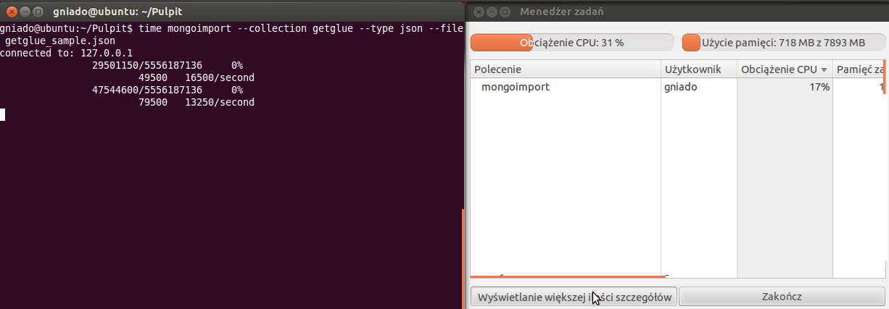

##Parametry komputera:
Procesor Intel Core i3-2350M @ 2x2.30GHz
8 GB pamięci RAM

##Zadanie 1a:

"ogarnięcie" pliku Train.csv:
```
$: cat Train.csv | tr -d '\n' | sed 's/\r/\r\n/g' > Train2.csv
```

po wykonaniu powyższego, zaimportowałem dane z pliku csv do bazy:
```
$: time mongoimport --collection Train --type csv --file Train2.csv --headerline
```

###Czasy wykonania:
```
real    8m46.221s
user    1m33.419s
sys     0m15.073s
```

##Zadanie 1b
```
>db.Train.count()
>6034195
```

##Zadanie 1c

###Zamiana stringa na tablicę tagów:
Sprawdzam typ pola Tags danego pola kolekcji (przez kolekcję przechodzimy forEachem). Jeśli jest to string - używam splita "co spację", jeśli nie - dodaję element do tabelki tagsArray, po czym zapisuję tagsArray jako tagi danego elementu.

```
var item = db.train.find();
item.forEach(function (record){
  if (record.Tags.constructor != Array){
    var tagsArray = [];
    if (record.Tags.constructor == String){
      tagsArray = record.Tags.split(" ");
    } else {
      tagsArray.push(record.Tags);
    }
    record.Tags = tagsArray;
  }
});
```

Całość jest zapisywana do innej bazy, a na koniec skryptu drukowany jest pojedynczy rekord:
```
printjson(db.zad1c.findOne());
```
co daje wynik:
```
{
  "_id" : ObjectId("527236d49bf8f201b1bd461e"),
  "Id" : 1,
  "Title" : "How to check if an uploaded file is an image without mime type?",
  "Body" : "<p>I'd like to check if an uploaded file is an image file (e.g png, jpg, jpeg, gif, bmp)
   or another file. The problem is that I'm using Uploadify to upload the files, which changes the 
   mime type and gives a 'text/octal' or something as the mime type, no matter which file type you 
   upload.</p>  <p>Is there a way to check if the uploaded file is an image apart from checking the 
   file extension using PHP?</p> ",
  "Tags" : [
    "php",
    "image-processing",
    "file-upload",
    "upload",
    "mime-types"
  ]
}
```


##Zadanie 1d

Po przygotowaniu pliku zgodnie z wytycznymi podanymi przy treści zadania, zaimportowałem dane do bazy:
```
>time mongoimport --collection text --type csv --file text8.txt --headerline
```
Zużycie zasobów zmierzone przez prosty menedżer zadań wykazało największą konsumpcję podczas uruchamiania zadania:


Po pewnym czasie wykorzystanie spadło:


By od około 60% do końca utrzymywać się w okolicach 10% CPU:


Zliczenie słów w bazie:

```
>db.text.count()
>17005206
```

Aggregacja:
```
coll.aggregate(
  { $group: {_id: "$word", count: {$sum: 1}} },
  { $sort: {count: -1} },
  { $limit: xx}
)
gdzie xx to odpowiednia liczba, w tym wypadku 1, 10, 100, 1000
```

Wyniki na konsoli:


##Zadanie 2

Przygotowanie pliku z jsonami (ograniczenie do 3 000 000 rekordów):

```
$: time head -n 3000000 getglue_sample.json | prepared.json

real	1m29.378s
user	0m2.752s
sys		0m10.844s
```


###MongoDB:

Import do bazy danych:

```
$: mongoimport --collection glue --type json --file prepared.json
```
Tak jak w zadaniu nr jeden, początkowe duże zapotrzebowanie na zasoby:


Zmalało z czasem:


Sprawdzenie czy ilość się zgadza:

```
>db.glue.count()
>3000000
```


Mam spore (bardzo) problemy ze swoim systemem, które postaram się wyeliminować jak najszybciej. Nie mogę zainstalować odpowiedniej wersji mongodb obsługującej metodę db.collection.aggregate(). Poprzednie zadania robiłem na uprzednio przygotowanych maszynach wirtualnych, przez co nie było z tym problemu. Zapotrzebowanie natomiast na dużo więcej miejsca skutecznie zredukowało możliwość pracy z VirtualBoxem. Agregacje dotyczyć będą ilości użytkowników, oraz wypisania kilku użytkowników z największą liczbą komentarzy (najbardziej aktywnych). 

Lista użytkowników:
```
coll.aggregate(
  { $group: {_id: "$userId" }
);
```

Lista 10 użytkowników z największą ilością komentarzy:
```
coll.aggregate(
  { $group: {_id: "$userId", count: {$sum: 1}} },
  { $sort: {count: -1} },
  { $limit: 10}
);
```
