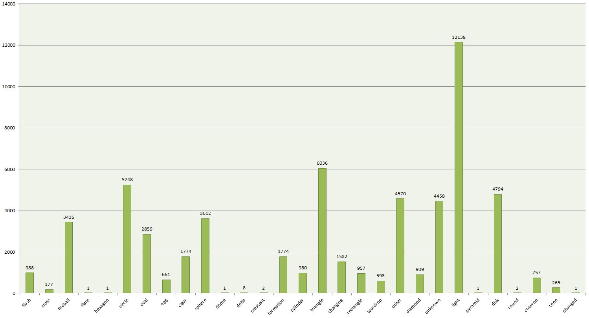
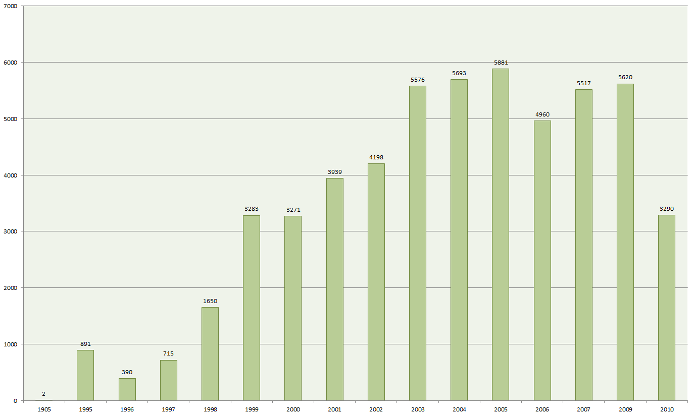

# UFO w USA #

###Bartłomiej Pietraszuk###


## Spis treści ##
1. [Dane](#dane)
2. [Transformacje danych](#transformacje)
3. [Zadanie 2](#zadanie-2)
 1. [Import](#import)
 1. [Agregacje](#agregacje)


# Dane #

Dane wykorzystane do zadania to informacje o przypadkach zauważenia UFO w USA pochodzące ze strony http://infochimps.com

infochimps_schema:
  title: Infochimps Simple Schema (ICSS)
  version: 0.1.1
  generated_at: Wed Oct 20 14:34:20 +0000 2010
  url: "http://infochimps.com/datasets/d60000-documented-ufo-sightings-with-text-descriptions-and-metad.yaml"
  description: >-
    This is an Infochimps Simple Schema (ICSS).

    It describes data on Infochimps.org and is meant to be both human
    and machine readable.

    An ICSS file is distributed with every download on Infochimps and
    is also available by request to the above URL.
    
    ICSS files bundled with downloads are generated at the time the
    download was created so they can become out of date as changes are
    made to the data.  If this ICSS came with data you downloaded then
    it is possible that it is already out of date.  You can get the
    most recent version at the URL above.

dataset:
  id:                  16154
  title:               60,000+ Documented UFO Sightings With Text Descriptions And Metadata
  subtitle:            ~
  main_link:           ~
  url:                 "http://infochimps.com/datasets/d60000-documented-ufo-sightings-with-text-descriptions-and-metad"
  created_at:          "Wed Oct 20 04:49:06 UTC 2010"
  updated_at:          "Wed Oct 20 04:50:01 UTC 2010"  
  tags:              [ alien,aliens,awesome,database,ET,extra-terrestrial,flying,ship,sighting,space,tsv,ufo,unidentified-flying-objec ]
  categories:        [ ~ ]
  created_by:
    id:                675  
    username:          Ganglion
    name:              Jacob Perkins
    institution:       ~
    main_link:         ~
    url:               "http://infochimps.com/users/Ganglion"
  description: >-
    h2. Description:
    
    A comprehensive listing of over 60,000 unidentified-flying-object (UFO) sightings in the United States (and some elsewhere). Fields of particular interest are the @shape@, which describes the shape of the UFO encountered as well as the @description@ which is free-form descriptive text about the event. Data available as both a tab-separated-values (.tsv) file and "Avro":http://avro.apache.org/docs/1.4.1/
    
    h2. Fields:
    
    |_.Short name|_.Type|_.Description|
    |sighted_at|Long| Date the event occurred (yyyymmdd) |
    |reported_at|Long| Date the event was reported |
    |location|String| City and State where event occurred |
    |shape|String|One word string description of the UFO shape|
    |duration|String|Event duration (raw text field)|
    |description|String|A long, ~20-30 line, raw text description|
    
    h2. Snippet:
    
    |19980710|19980721| Brick, NJ| sphere|5 minutes|On the evening of July 10, 1998, I was walking near my home ... |
    |19940815|19980625| Rancho Mirage, CA| rectangle|45 seconds|An extreemly close sighting of a ... |
    |19970527|19981207| Arlington, VA| disk|A few seconds|As I was on my way home, ... |
    |19980828|19980830| Mt. Vernon, OR| fireball|4-5 sec|Bright Blue (as that of an arc welder) light, that lit up ... |
    |19981106|19981108| Bend, OR| formation|15-20 seconds|5 objects in straight line following one another... |
  license:
      
  sources:
    
  packages: 
    
    - id:                17001
      number_of_records: ~
      basename:          icsdata-d60000-documented-ufo-sightings-with-text-descriptions-and-metad_20101020052908-avro.zip
      fmt:               avro
      pkg_fmt:           zip
      
  fields:

 Rekord - przykład
```
{"sighted_at": "19950826", "reported_at": "19950828", "location": " Williston, ND", "shape": "", "duration": "10 min.", "description": "Man, wife, and 2 adults witness peculiar, bright white light pacing their car on highway.  Two other lights appear, move around sky."}
```

Nazwy pól są jednoznaczne i nie wymagają opisu.


# Transformacje #

Dane mają dość czystą postać; nie wymagały transformacji.


# Zadanie 2 #

##Import##

Dane zostały zaimportowane do MongoDB następującym poleceniem:

```
time mongoimport --headerline --collection ufo --type json --file ufo.json
```

real  1m2.568s
user  0m5.529s
sys 0m0.564s


##Agregacje##

###Ilosc przypadkow zauwazenia UFO w danej lokalizacji w USA###

```
db.ufo.aggregate({ $group { _id: "$location", total: {$sum 1 }}})
```

**Wykres**




### Ilosc przypadkow zauwazenia UFO w USA z podzialem na konkretne lata ###

W poleceniu grupowania użyto również funkcji na danych - wyciąganie samego roku z daty.

```
db.ufo.aggregate(
{$project : {new_time : {$substr : ["$time_stamp",0, 4]}}},
{$group:{_id:"$new_time", "total": {$sum:1}}})
```

**Wykres**


