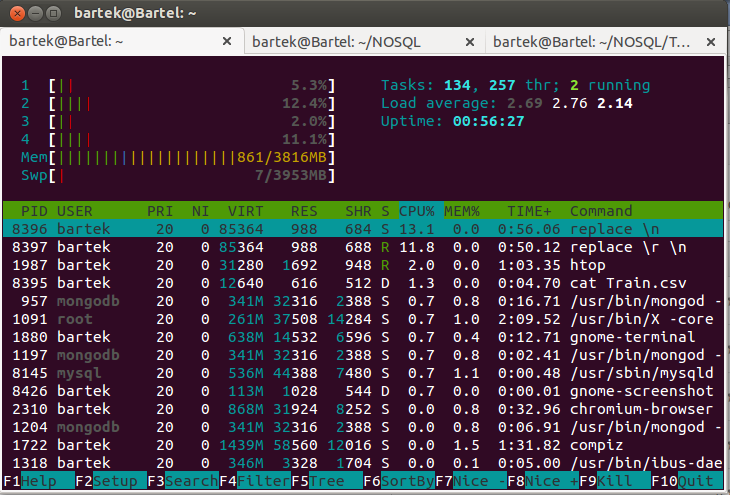
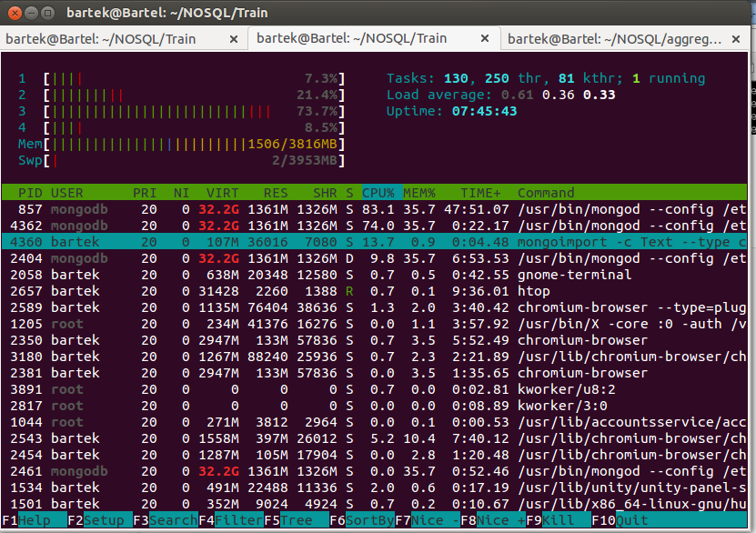
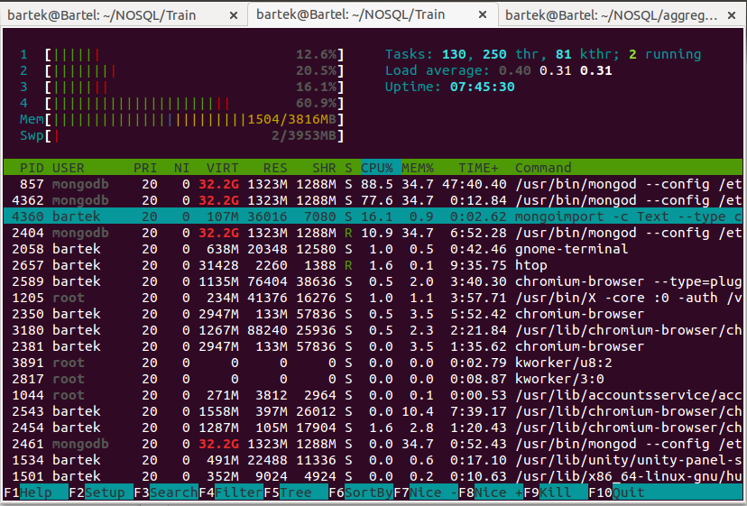

**** Bartek Winsławski

### Konfiguracja sprzętu i systemu
#### Sprzęt
Komputer wyposażony w 4 procesory:  
Intel Core i3 i3-350M  
4GB RAM


#### Zadanie 1a
Polega na zaimportowaniu, do systemów baz danych uruchomionych na swoim komputerze, danych z pliku Train.csv bazy MongoDB.
Wcześniej jednak należy przygotować plik Train.csv poleceniem:

```sh
cat Train.csv | replace "\n" " " | replace "\r" "\n" > Train2.csv
```
Czas trwania 5 min





Import:

```sh
mongoimport --type csv -c Train --file Train2.csv --headerline
```
Czas trwania 30m2.523s





#### Zadanie 1b
Liczba zaimportowanych rekordów

```sh
mongo
MongoDB shell version: 2.4.8
connecting to: test
> use Train
switched to db train
> db.Train.count()
6034195
```


#### Zadanie 1c
Zamiana stringa z tagami na tablice stringów

```javascript
trains = db.Train.find();

var tagsUnikalne = {};
var tagsIlosc = 0;

trains.forEach(function(train){
    var tagsArray = [];

    // zamieniamy string zawierający tagi na tablicę napisów z tagami
    if(typeof train.tags === "string") {
        tagsArray = train.tags.split(" ");
        db.Train.update({_id: train._id}, {$set: {tags: tagsArray}});
    } else if(typeof train.tags === "number") {
        // tag jest liczbą
        tagsArray.push(train.tags.toString());
        db.Train.update({_id: train._id}, {$set: {tags: tagsArray}});
    } else {
        // tag jest już tablicą
        tagsArray = train.tags;
    }

    // zliczamy wszystkie tagi
    tagsIlosc += tagsArray.length;

    // zliczamy wszystkie różne tagi
    tagsArray.forEach(function(tag) {
        if(typeof tagsUnikalne[tag] === "undefined")
            tagsUnikalne[tag] = 1;
    });
});

print("Wszystkie tagi: " + tagsIlosc);
print("Unikalne tagi: " + Object.keys(tagsUnikalne).length);
```

wynik skryptu:
```sh
$ time mongo zad1c.js
Wszystkie tagi: 17409994
Unikalne tagi: 42048

Czas to	m30.012s

```


#### Zadanie 1d
Statystyki z pliku text8

Importowanie pliku:

```sh

artek@Bartel:~/NOSQL/Train$ tr --delete '[:alnum:][:blank:]' < text8 > deleted.txt
bartek@Bartel:~/NOSQL/Train$ ls -l deleted.txt
-rw-r--r-- 1 bartek bartek 0 lis  6 08:05 deleted.txt
bartek@Bartel:~/NOSQL/Train$ rm deleted.txt
bartek@Bartel:~/NOSQL/Train$ wc text8
        0  17005207 100000000 text8
bartek@Bartel:~/NOSQL/Train$ tr --squeeze-repeats '[:blank:]' '\n' < text8 > text8.txt
bartek@Bartel:~/NOSQL/Train$ wc text8.txt
 17005207  17005207 100000000 text8.txt
```


Importowanie pliku:

```sh
$ time mongoimport -c Text --type csv --file text8.txt --fields slowa
Wed Nov  2 08:22:19.075 		Progress: 99899705/100000000	99%
Wed Nov  2 08:22:19.075 			16988400	33774/second
Wed Nov  2 08:22:19.369 check 9 17005207
Wed Nov  2 08:22:20.135 imported 17005207 objects

real	8m24.121s
user	1m1.802s
sys	0m12.165s

```



Zliczenie wszystkich słów oraz różnych słów:

```sh
bartek@Bartel:~/NOSQL/Train$ mongo
MongoDB shell version: 2.4.8
connecting to: test
> db.Text.count()
17005207
> db.Text.distinct("slowa").length
253854

```


Najczesciej wystepujace slowo
mongo --eval "var ilosc=1" zad1d.js
```
Najczęściej występujące słowo stanowi 6.24% całej kolekcji
```


10 Najczesciej wystepujace slow
mongo --eval "var ilosc=10" zad1d.js
```
10 najczęściej występujących słów stanowi 24.73% całej kolekcji
```


100 Najczesciej wystepujace slow
mongo --eval "var ilosc=100" zad1d.js
```
100 najczęściej występujących słów stanowi 47.04% całej kolekcji
```


1000 Najczesciej wystepujace slow
mongo --eval "var ilosc=1000" zad1d.js
```
1000 najczęściej występujących słów stanowi 67.23% całej kolekcji
```


Zadanie 1e

Znalazłem koordynaty 2147 placowek kurierskich 


Następnie importujemy cały zestaw danych do mongo:
```sh
time mongoimport --type csv -c Train --file Train2.csv --headerline

Czas
real	0m0.237s
user	0m0.048s
sys	0m0.021s

```

Tak wyglądają dane 
```sh
> db.geo.find( { miasto: "Lądek-Zdrój" } )
	{ "_id" : ObjectId("527a2a1152f46a52b710ce39"),
	 "PNI" : 249290,
	 "woj" : "DOLNOŚLĄSKIE",
	 "powiat" : "kłodzki",
	 "gmina" : "Lądek-Zdrój",
	 "nazwa" : "UP Lądek-Zdrój",
	 "miasto" : "Lądek-Zdrój",
	 "loc" : { 
		"type" : "Point", 
		"coordinates" : [  16.87675,  50.345333 ] 
		}
	 }
```


####1
Wypisanie wszystkich placówek w odległości max 20 km od Giżycka 
```js
> var origin = {type: "Point", coordinates: [21.768888,  54.039166]}

> db.geo.find({ loc: {$near: {$geometry: origin},$maxDistance: 20000} })
{ "_id" : ObjectId("527a2a1152f46a52b710d81e"), "PNI" : 239874, "woj" : "WARMIŃSKO-MAZURSKIE", "powiat" : "giżycki", "gmina" : "Giżycko", "nazwa" : "UP Giżycko 1", "miasto" : "Giżycko", "loc" : { "type" : "Point", "coordinates" : [  21.768888,  54.039166 ] } }

{ "_id" : ObjectId("527a2a1152f46a52b710d81f"), "PNI" : 744926, "woj" : "WARMIŃSKO-MAZURSKIE", "powiat" : "giżycki", "gmina" : "Giżycko", "nazwa" : "FUP Giżycko 1", "miasto" : "Giżycko", "loc" : { "type" : "Point", "coordinates" : [  21.786583,  54.04225 ] } }

{ "_id" : ObjectId("527a2a1152f46a52b710d871"), "PNI" : 275863, "woj" : "WARMIŃSKO-MAZURSKIE", "powiat" : "giżycki", "gmina" : "Wydminy", "nazwa" : "UP Wydminy", "miasto" : "Wydminy", "loc" : { "type" : "Point", "coordinates" : [  22.032338,  53.981961 ] } }

{ "_id" : ObjectId("527a2a1152f46a52b710d865"), "PNI" : 263627, "woj" : "WARMIŃSKO-MAZURSKIE", "powiat" : "giżycki", "gmina" : "Ryn", "nazwa" : "UP Ryn", "miasto" : "Ryn", "loc" : { "type" : "Point", "coordinates" : [  21.546833,  53.937527 ] } }

{ "_id" : ObjectId("527a2a1152f46a52b710d870"), "PNI" : 273636, "woj" : "WARMIŃSKO-MAZURSKIE", "powiat" : "węgorzewski", "gmina" : "Węgorzewo", "nazwa" : "UP Węgorzewo", "miasto" : "Węgorzewo", "loc" : { "type" : "Point", "coordinates" : [  21.741583,  54.210916 ] } }
> 
```

