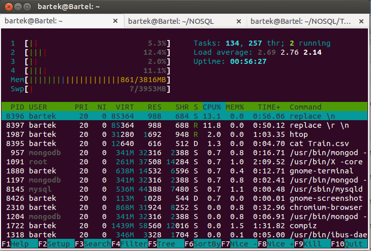
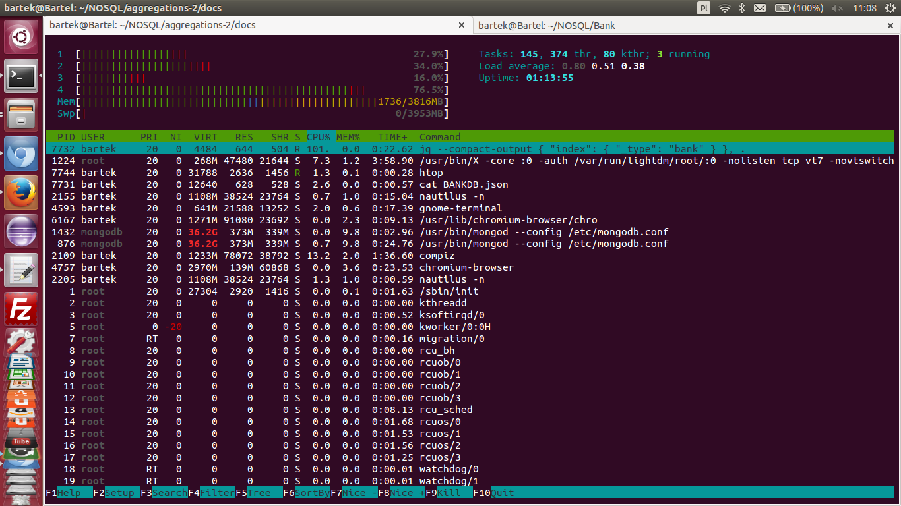

## Bartek Winsławski

### Konfiguracja sprzętu i systemu
#### Sprzęt
Komputer wyposażony w 4 procesory:  
Intel Core i3 i3-350M  
4GB RAM
#### Zadanie 1
 Wyszukać w sieci dane zawierające co najmniej 1_000_000 rekordów/jsonów.
W moim przypadku plik csv baza meritum bank 1008053 rekordów.
Bazę dostałem od Meritum bank do testowania innej aplikacji 


#### Zadanie 2
Polega na zaimportowaniu, do systemów baz danych uruchomionych na swoim komputerze.




Import:

```sh
time mongoimport --type csv -c BankMe --file BazaME.csv --headerline

```

```sh
Sat Dec 28 15:06:27.841 check 9 1008054

Sat Dec 28 15:06:27.904 imported 1008053 objects


real	0m40.446s
user	0m12.464s
sys	0m0.933s

```
```sh
MongoDB shell version: 2.4.8
connecting to: test
> db.BankMe.count()
1008053
```

Przykładowy rekord


```sh
{ "_id" : ObjectId("52c18cb1c993e7aeeaae4ed2"),
 "data_pisma; imie_nazwisko; nazwa_ulicy; kod_pocztowy; miejscowosc; sygnatura; data_wplywu_pisma; zadluzenie; nast_rata; ile_rat; imie_matki;
 ;" : "21-11-2013; Nikka Griffin; Krucza; 67-740; Tylewice; Z/282256; 26-01-2012; 300000.00; 30367.34; 245; Edie; ;" }
```


Zad 3c
Wymyśleć i opisać cztery agregacje – po dwie dla każdej z baz.

Mongodb

Znalazłem wszystkich dłużników którzy mają od 1 zł do 5000 zł długu
```sh
> db.MerBank.aggregate( [ { $match : { zadluzenie : { $gt :1 , $lte : 5000 } } }, { $group: { _id: null, count: { $sum: 1 } } } ] );
{ "result" : [ { "_id" : null, "count" : 250600 } ], "ok" : 1 }
```
Znalazłem wszystkich dłużników którzy mają od 5001 zł do 10000 zł długu
```sh
> db.MerBank.aggregate( [ { $match : { zadluzenie : { $gt :5001 , $lte : 10000 } } }, { $group: { _id: null, count: { $sum: 1 } } } ] );
{ "result" : [ { "_id" : null, "count" : 327400 } ], "ok" : 1 }
```
Znalazłem wszystkich dłużników którzy mają od 10001 zł do 25000 zł długu
```sh
> db.MerBank.aggregate( [ { $match : { zadluzenie : { $gt :10001 , $lte : 25000 } } }, { $group: { _id: null, count: { $sum: 1 } } } ] );
{ "result" : [ { "_id" : null, "count" : 260300 } ], "ok" : 1 }
```
Znalazłem wszystkich dłużników którzy mają od 25001 zł długu
```sh
> db.MerBank.aggregate( [ { $match : { zadluzenie : { $gt :25001 } } }, { $group: { _id: null, count: { $sum: 1 } } } ] );
{ "result" : [ { "_id" : null, "count" : 161600 } ], "ok" : 1 }
```


Obliczyłem ile pieniędzy łacznie pożyczył bank. 


```sh
db.MerBank.aggregate([ {     $group: {      _id: null,     total: {   $sum: "$zadluzenie" } } } ] )
```

```sh
{
	"result" : [
		{
			"_id" : null,
			"total" : 23572527588.99738
		}
	],
	"ok" : 1
}
```

Z tego wynika że średnio dłużnik jest winny 23572 zł 


## Elastic Search


#### Import danych

Posiadam baze w pliku .csv których nie czyta Elastic Search. W celu otrzymania ich w formacie json wykonano eksport z bazy mongodb.


```sh
mongoexport -d test -c MerBank -o BANKDB.json
connected to: 127.0.0.1
exported 1008053 records
```
```sh
 time jq --compact-output '{ "index" : { "_type" : "bank" } }, .' BANKDB.json > BANKDB_es.json

real	0m54.975s
user	0m50.716s
sys	0m1.087s
```



```sh
split -l 100000 BANKDB_es.json
```
```sh
Import
for i in x*; do curl -s -XPOST   localhost:9200/albums/_bulk --data-binary @$i; done
```
```sh
curl -XGET 'http://localhost:9200/banks/bank/_count'; echo
{"count":1008053,"_shards":{"total":5,"successful":5,"failed":0}}
```


### Agregacja nr. 1

Sprawdza ile ludzi płaci rate w danym przedziale (do 500 zł , od 501 do 1000 , oraz od 1001).

```sh
curl -X POST "http://localhost:9200/banks/_search?pretty=true" -d '{                                                                                                     
"query" : {
        "match_all" : {}
    },
    "facets" : {
        "range1" : {
            "range" : {
                "field" : "nast_rata",
                "ranges" : [
{ "to" : 500 },
{ "from" : 501, "to" : 1000 },
{ "from" : 1001 }
                ]
            }
        }
    }
}
'
```
####Wynik:

```sh
  "facets" : {
    "range1" : {
      "_type" : "range",
      "ranges" : [ {
        "to" : 500.0,
        "count" : 87500,
        "min" : 3.41,
        "max" : 499.81,
        "total_count" : 87500,
        "total" : 2.4734135000000246E7,
        "mean" : 282.6758285714314
      }, {
        "from" : 501.0,
        "to" : 1000.0,
        "count" : 93800,
        "min" : 502.55,
        "max" : 997.47,
        "total_count" : 93800,
        "total" : 6.958848700000107E7,
        "mean" : 741.8815245202672
      }, {
        "from" : 1001.0,
        "count" : 818400,
        "min" : 1002.62,
        "max" : 8239278.78,
        "total_count" : 818400,
        "total" : 1.4812094750999361E10,
        "mean" : 18098.84500366491
      } ]
    }
  }
}
```


### Agregacja nr. 2

Najczęstsza wysokość raty jaką płacą dłużnicy 

```sh
curl -X POST "http://localhost:9200/banks/_search?pretty=true" -d'
{
  "query" : {
    "match_all" : { }
  },
  "facets" : {
    "artist" : {
      "terms" : {
        "field" : "nast_rata",
        "size" : 1
      }
    }
  }
}'
```
##Wynik:
```sh
"facets" : {
    "artist" : {
      "_type" : "terms",
      "missing" : 8059,
      "total" : 1000000,
      "other" : 999810,
      "terms" : [ {
        "term" : 615.42,
        "count" : 190
      } ]
    }
  }
```
Aż 190 osób płaci ratę 615,42 zł

