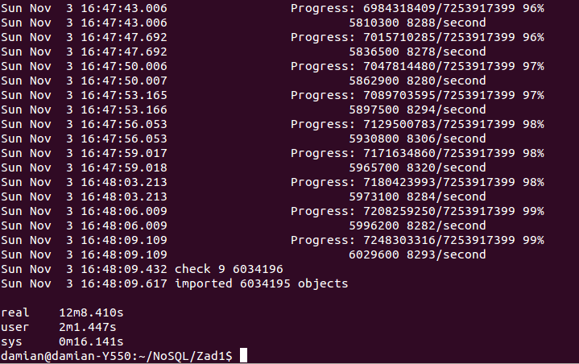
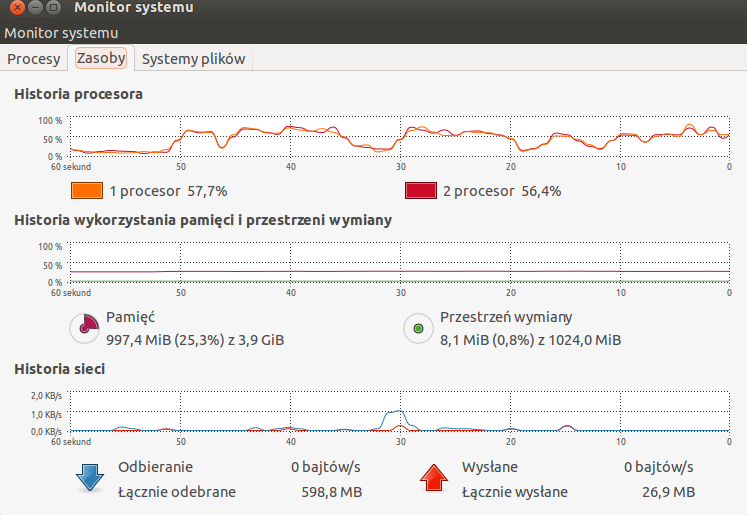

## Damian Brzeziński


## Zadanie 1

* a) 

##### Przygotowanie pliku Train.csv do importu poprzez usunięcie znaków nowej linii. Za pomocą skryptu 2unix.sh.
  

  ``` 
$time ./2unix.sh Train.csv NewTrain.csv
  
  real  20m23.720s 
  user  0m57.816s
  sys   1m55.956s
```

#### Proces importu do bazy Mongo:



```
  $ time mongoimport --db train --collection questions --headerline  --stopOnError --drop --type csv --file NewTrain.csv

  Sun Nov  3 16:48:09 imported 6034195 objects

  real  12m8.410s
  user  2m1.447s
  sys   0m16.141s
```  

* b) 

#### Zliczyć liczbę zaimportowanych rekordów

```
db.questions.count()
6034195
```
* c) 

####Zamienić string zawierający tagi na tablicę napisów z tagami następnie zliczyć wszystkie tagi i wszystkie różne tagi.
Wykorzystałem do tego skrypt napisany w Ruby dzięki sterownikowi Ruby Language Center. Skrót do skrypu: 

Zamiana na tablice:
```
real	65m44.771s
user	26m42.980s
sys	    5m38.396s
```
Wynik agregacji i czas:
```
All tags: 17409994
Different tags: 42048

real	5m19.629s
user	0m0.432s
sys	    0m0.128s
```
