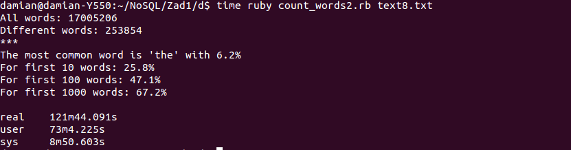
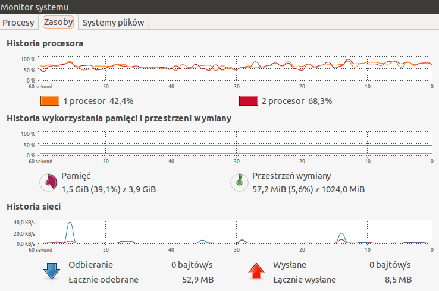
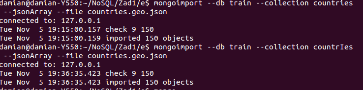
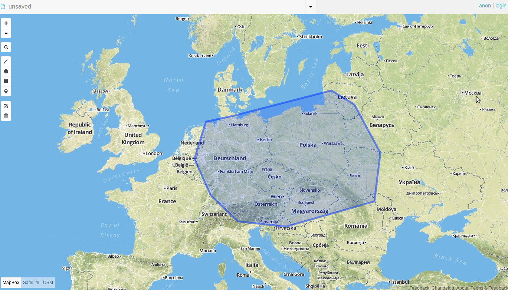
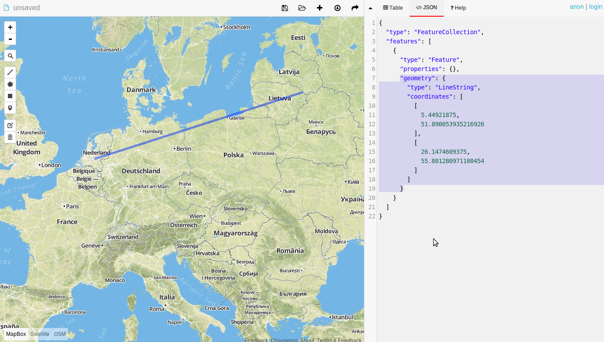

## Damian Brzeziński


## Zadanie 1

* a) 

##### Przygotowanie pliku Train.csv do importu poprzez usunięcie znaków nowej linii. Za pomocą skryptu 2unix.sh.
  

  ``` 
$time ./2unix.sh Train.csv NewTrain.csv
  
  real  20m23.720s 
  user  0m57.816s
  sys   1m55.956s
```

#### Proces importu:

```
  $ time mongoimport --db train --collection questions --headerline  --stopOnError --drop --type csv --file NewTrain.csv

  Sun Nov  3 16:48:09 imported 6034195 objects

  real  12m8.410s
  user  2m1.447s
  sys   0m16.141s
```  

* b) 

##### Zliczyć liczbę zaimportowanych rekordów

```
db.questions.count()
6034195
```

* c)

##### (Zamiana formatu danych.) Zamienić string zawierający tagi na tablicę napisów z tagami następnie zliczyć wszystkie tagi i wszystkie różne tagi.

Do rozwiązania tego zadania użyłem skryptu, kod: [s_to_a.rb](../../scripts/dbrzezinski/s_to_a.rb)

```
  $ time ruby s_to_a.rb
  ```
  
  Zamiana na tablice:
  ```
real	65m44.771s
user	26m42.980s
sys	    5m38.396s
```
Wynik agregacji i czas:
```
All tags: 17409994
Different tags: 42048

real	5m19.629s
user	0m0.432s
sys	    0m0.128s
```


* d)

####Zapisać wszystkie słowa w bazie MongoDB. Następnie zliczyć liczbę słów oraz liczbę różnych słów w tym pliku. Ile procent całego pliku stanowi:
Najczęściej występujące słowo w tym pliku, oraz 10, 100, 1000 najczęściej występujących słów w tym pliku.

Do rozwiązania tego zadania użyłem skryptu, kod: [count_words.rb](../../scripts/dbrzezinski/count_words.rb)


```
$ time ruby count_words2.rb text8.txt 
All words: 17005206
Different words: 253854
***
The most common word is 'the' with 6.2%
For first 10 words: 25.8%
For first 100 words: 47.1%
For first 1000 words: 67.2%

real	121m44.091s
user	73m4.225s
sys	    8m50.603s
```


* e)

####Wyszukać w sieci dane zawierające obiekty GeoJSON. Zapisać dane w bazie MongoDB.

Znalazłem w sieci i skorzystałem z 150 koordynatów Państw w Europie. -->  [Zobacz](https://github.com/johan/world.geo.json/blob/master/countries.geo.json)

Pobrałem tego [jsona](countries.geo.json), przeprowadziłem na nim modyfikacje: 

id -> sname

type -> Country

Usunąłem wszystkie Państwa z MultiPolygon.

Zaimportowałem jako listę jsonów do mojej bazy:

```
mongoimport --db train --collection countries --jsonArray --file countries.geo.json
mongoimport --db train --collection countrIes --jsonArray --file countries.geo.json
```
Do pobrania przykładowych danych geo korzystałem z http://geojson.io

Wykonałem przedtem:
```
db.countries.ensureIndex({"geometry" : "2dsphere"})
```
Do sprawdzenia kolekcji czy istnieje z indeksem czy bez użyłem metody .stats()

```
> db.countries.stats()
{
  "ns" : "train.countries",
  "count" : 150,
  "size" : 219600,
  "avgObjSize" : 1464,
  "storageSize" : 774144,
  "numExtents" : 3,
  "nindexes" : 2,
  "lastExtentSize" : 589824,
  "paddingFactor" : 1,
  "systemFlags" : 1,
  "userFlags" : 0,
  "totalIndexSize" : 531440,
  "indexSizes" : {
    "_id_" : 8176,
    "geometry_2dsphere" : 523264
  },
  "ok" : 1
}

> db.countrIes.stats()
{
  "ns" : "train.countrIes",
  "count" : 150,
  "size" : 219600,
  "avgObjSize" : 1464,
  "storageSize" : 774144,
  "numExtents" : 3,
  "nindexes" : 1,
  "lastExtentSize" : 589824,
  "paddingFactor" : 1,
  "systemFlags" : 1,
  "userFlags" : 0,
  "totalIndexSize" : 8176,
  "indexSizes" : {
    "_id_" : 8176
  },
  "ok" : 1
}
```

Na tej kolekcji zindeksowanej użyłem [skryptu](../../scripts/dbrzezinski/countries_queries.rb) countries_queries.rb.

I przygotowałem 6 Geospatial Queries zawierające obiekty(Point, LineString i Polygon). Z Polygon:


######Przykład 1.
Państwa które zawierają się w całości w powyżej zaznaczonym obszarze. Metoda:
```
def find_within(polygon)
  puts "* Within:\n"
  @coll.find({
    "geometry" => {
      "$geoWithin" => {
        "$geometry" => polygon
      }
    }
  }).to_a.each {|e| puts "#{e["properties"]["name"]}\n"}
  puts "***\n\n"
end
```
Wynik: 

```
*  Within:
Poland
Czech Republic
Slovakia
***
```

######Przykład 2.
Państwa o które obszar zaznaczony "zahacza". Metoda find_intersects:

```
def find_intersects(polygon)
  puts "* Intersects:\n"
  @coll.find({
    "geometry" => {
      "$geoIntersects" => { 
        "$geometry" => polygon 
      }
    }
  }).to_a.each {|e| puts "#{e["properties"]["name"]}\n"}
  puts "***\n\n"
end
```
Wynik:
```
* Intersects:
Belarus
Lithuania
Poland
Germany
Czech Republic
Austria
Slovakia
Ukraine
Moldova
Romania
Hungary
Croatia
Slovenia
Switzerland
Netherlands
Belgium
***
```
######Przykład 3 i 4.
Jako Point ustawiłem swój adres zamieszkania Gdańsk Słowackiego 25, i zamierzam sprawdzić jakie Państwa znajdują sie w promieniu 1000km, z Państwem w którym point się znajduje, oraz bez. Metoda find_near:

```
def find_near(point, with = false)
  data = @coll.find({
    "geometry" => {
      "$near" => {
        "$geometry" => point,
        "$maxDistance" => 1000000 # because value must be in meters
      }
    }
  })
  if with
    puts "* Countries near 1000 km from #{point["name"]} with country place belongs to\n"
  else
    data = data.skip(1) 
    puts "* Countries near 1000 km from #{point["name"]}\n"
  end
  data.to_a.each {|e| puts "#{e["properties"]["name"]}\n"}
  puts "***\n\n"
end
```
Wyniki:
```
* Countries near 1000 km from ul. Słowackiego 25
Lithuania
Latvia
Germany
Belarus
Czech Republic
Ukraine
Estonia
Slovakia
Austria
Hungary
Finland
Romania
Netherlands
Slovenia
Moldova
Croatia
Republic of Serbia
Belgium
Luxembourg
Switzerland
***
```
```
* Countries near 1000 km from ul. Słowackiego 25 with country place belongs to
Poland
Lithuania
Latvia
Germany
Belarus
Czech Republic
Ukraine
Estonia
Slovakia
Austria
Hungary
Finland
Romania
Netherlands
Slovenia
Moldova
Croatia
Republic of Serbia
Belgium
Luxembourg
Switzerland
***
```
######Przykład 5.
Point zostaje ten sam, i chcę sprawdzić w jakim Państwie się znajduje: 

```
def country_point_belongs_to(point)
  data = @coll.find({
    "geometry" => {
      "$near" => {
        "$geometry" => point
      }
    }
  }).to_a[0]
  puts "#{data["properties"]["name"]}\n"
end
```
Wynik:
```
***

Poland
```
######Przykład 6.
Oto LineString który zaznaczyłem:


Zadaniem było wypisać Państwa które przecina linia. Użyłem metody find_countries_on_line:
```
def find_countries_on_line(line)
  data = @coll.find({
    "geometry" => {
      "$geoIntersects" => { 
        "$geometry" => line
      }
    }
  }).to_a
  puts "*#{data.count} countries on line:\n"
  data.each {|e| puts "#{e["properties"]["name"]}\n"}
  puts "***\n\n"
end
```
Wynik:
```
*5 countries on line:
Latvia
Lithuania
Poland
Germany
Netherlands
***
```

####Zapytania jakie wykonałem do mojej bazy dla wyżej wymienionych przykładów:

```
find_within polygon_in_central_europe
find_intersects polygon_in_central_europe
find_near slowackiego25_gdansk, false
find_near slowackiego25_gdansk, true
country_point_belongs_to slowackiego25_gdansk
find_countries_on_line line_central_europe 
```
