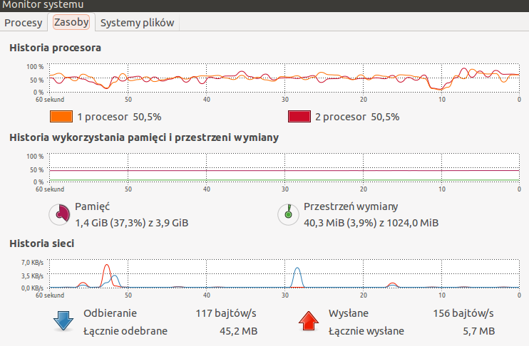

## Damian Brzeziński


## Zadanie 1

* a) 

##### Przygotowanie pliku Train.csv do importu poprzez usunięcie znaków nowej linii. Za pomocą skryptu 2unix.sh.
  

  ``` 
$time ./2unix.sh Train.csv NewTrain.csv
  
  real  20m23.720s 
  user  0m57.816s
  sys   1m55.956s
```

#### Proces importu:

```
  $ time mongoimport --db train --collection questions --headerline  --stopOnError --drop --type csv --file NewTrain.csv

  Sun Nov  3 16:48:09 imported 6034195 objects

  real  12m8.410s
  user  2m1.447s
  sys   0m16.141s
```  

* b) 

##### Zliczyć liczbę zaimportowanych rekordów

```
db.questions.count()
6034195
```

* c)

##### (Zamiana formatu danych.) Zamienić string zawierający tagi na tablicę napisów z tagami następnie zliczyć wszystkie tagi i wszystkie różne tagi.

Do rozwiązania tego zadania użyłem skryptu, kod: [s_to_a.rb](../../scripts/dbrzezinski/s_to_a.rb)

```
  $ time ruby s_to_a.rb
  ```
  
  Zamiana na tablice:
  ```
real	65m44.771s
user	26m42.980s
sys	    5m38.396s
```
Wynik agregacji i czas:
```
All tags: 17409994
Different tags: 42048

real	5m19.629s
user	0m0.432s
sys	    0m0.128s
```


* d)

####Zapisać wszystkie słowa w bazie MongoDB. Następnie zliczyć liczbę słów oraz liczbę różnych słów w tym pliku. Ile procent całego pliku stanowi:
Najczęściej występujące słowo w tym pliku, oraz 10, 100, 1000 najczęściej występujących słów w tym pliku.

Do rozwiązania tego zadania użyłem skryptu, kod: [count_words.rb](../../scripts/dbrzezinski/count_words.rb)


```
$ time ruby count_words2.rb text8.txt 
All words: 17005206
Different words: 253854
***
The most common word is 'the' with 6.2%
For first 10 words: 25.8%
For first 100 words: 47.1%
For first 1000 words: 67.2%

real	121m44.091s
user	73m4.225s
sys	    8m50.603s
```

