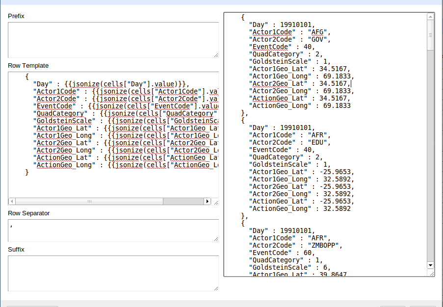
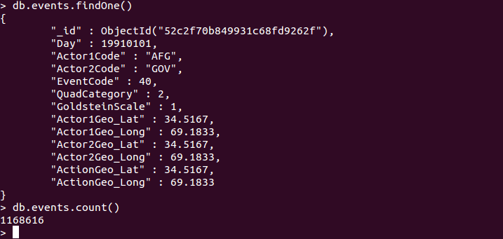

## Damian Brzeziński


## Zadanie 2

### GDELT - The Global Database of Events, Language, and Tone.
What is GDELT?

The Global Database of Events, Language, and Tone (GDELT) is an initiative to construct a catalog of human societal-scale behavior and beliefs across all countries of the world over the last two centuries down to the city level globally, to make all of this data freely available for open research, and to provide daily updates to create the first "realtime social sciences earth observatory." Nearly a quarter-billion georeferenced events capture global behavior in more than 300 categories covering 1979 to present with daily updates.

GDELT is designed to help support new theories and descriptive understandings of the behaviors and driving forces of global-scale social systems from the micro-level of the individual through the macro-level of the entire planet by offering realtime synthesis of global societal-scale behavior into a rich quantitative database allowing realtime monitoring and analytical exploration of those trends...

- See more at: http://gdelt.utdallas.edu/about.html#sthash.9j8Oyn6K.dpuf

--------------------------------------------------------------------------------------------------------------------------

### Przygotowanie danych do importu.

Powyżej opisana baza danych posiada dane z kilku lat i zatem miliony rekordów. Ja dla przykładu przygotowałem katalog z danymi z rocznika 1991 oraz 1993. 

Przykładowy rekord:

```
Day	Actor1Code	Actor2Code	EventCode	QuadCategory	GoldsteinScale	Actor1Geo_Lat	Actor1Geo_Long	Actor2Geo_Lat	Actor2Geo_Long	ActionGeo_Lat	ActionGeo_Long
19910101	AFG	GOV	040	2	1.0	34.5167	69.1833	34.5167	69.1833	34.5167	69.1833
```
Na pierwszy rzut oka wygląda dość niezrozumiale ale w tym rekordzie kryje się wiele istotnych informacji, są zakodowane za pomocą skrótów, które są wyjaśnione w podanych linkach:

Day nie trzeba tłumaczyć

- ActorCode (uczestnik) - http://gdelt.utdallas.edu/data/lookups/CAMEO.country.txt

- EventCode (wydarzenie) - http://gdelt.utdallas.edu/data/lookups/CAMEO.eventcodes.txt
- GoldsteinScale(skala pomocnicza do kodowania) - http://gdelt.utdallas.edu/data/lookups/CAMEO.goldsteinscale.txt

Oraz długości i szerokości geograficzne danych uczestników i miejsca wydarzenia.

######Google Refine
Dane są zapisane w plikach txt. Do importu musiałem przygotować pliki w formacie json w jednej linii za pomocą narzędzia
Google Refine. Dwa pliki zostały zimportowane do bazy, a nastepnie zliczone.



```
time mongoimport --db gdelt --collection events--type json --file reduced_data_1993.json
```

###Czas importu ok. 1min 20sek.
###Przykładowy rekord, oraz zliczenie kolekcji.


####AGREGACJE JUŻ WKRÓTCE!....
