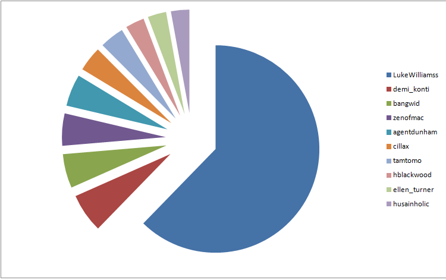
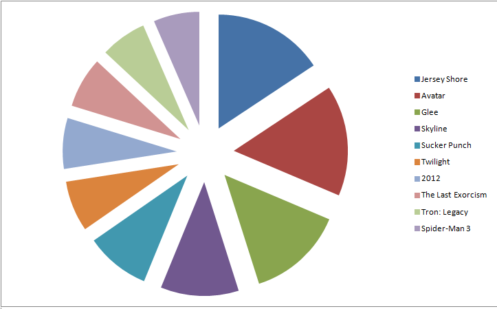
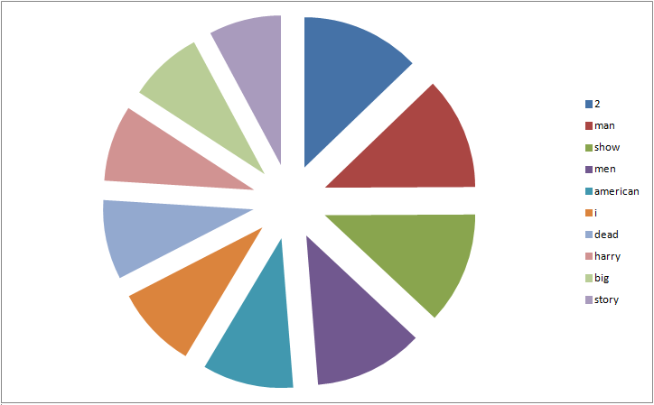
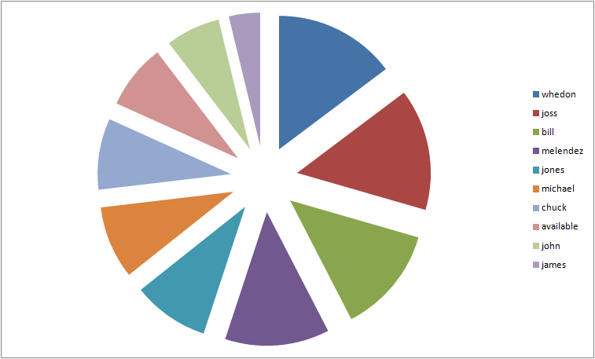

# *Grzegorz Melzer*

----

### Zadanie 2

----

Dane które użyłem są od [GetGlue](http://getglue.com/) na temat filmów i seriali.

### MongoDB

### Agregacja 1

----

*10 najbardziej aktywnych użytkowników*

Chcemy wyciagnąć użytkowników którzy mają najwięcej wpisów.

Agregacja w Mongo:

```js
db.getglue.aggregate({$group:{_id: "$userId", count:{$sum: 1}}},{$sort:{count: -1}},{$limit: 10});
```

Wynik agregacji:

```js
{
	"result" : [
		{
			"_id" : "LukeWilliamss",
			"count" : 696782
		},
		{
			"_id" : "demi_konti",
			"count" : 68137
		},
		{
			"_id" : "bangwid",
			"count" : 59261
		},
		{
			"_id" : "zenofmac",
			"count" : 56233
		},
		{
			"_id" : "agentdunham",
			"count" : 55740
		},
		{
			"_id" : "cillax",
			"count" : 43161
		},
		{
			"_id" : "tamtomo",
			"count" : 42378
		},
		{
			"_id" : "hblackwood",
			"count" : 32832
		},
		{
			"_id" : "ellen_turner",
			"count" : 32239
		},
		{
			"_id" : "husainholic",
			"count" : 32135
		}
	],
	"ok" : 1
}
```



### Agregacja 2

----

*10 najczęściej skomentowanych i niepolubianych wpisów jednocześnie*

Szukamy wpisów które zostały skomentowane oraz mają status Disliked.

Agregacja w Mongo:

```js
db.imdb.aggregate( { $match: { "action": "Disliked" }},{ $match: { "comment": {$ne: ""} } }, { $group: { _id: "$title", count: {$sum: 1} } }, { $sort: { count: -1 } }, { $limit: 10 } );
```

Wynik agregacji:

```js
{
	"result" : [
		{
			"_id" : "Jersey Shore",
			"count" : 24
		},
		{
			"_id" : "Avatar",
			"count" : 24
		},
		{
			"_id" : "Glee",
			"count" : 21
		},
		{
			"_id" : "Skyline",
			"count" : 17
		},
		{
			"_id" : "Sucker Punch",
			"count" : 14
		},
		{
			"_id" : "Twilight",
			"count" : 11
		},
		{
			"_id" : "2012",
			"count" : 11
		},
		{
			"_id" : "The Last Exorcism",
			"count" : 11
		},
		{
			"_id" : "Tron: Legacy",
			"count" : 10
		},
		{
			"_id" : "Spider-Man 3",
			"count" : 10
		}
	],
	"ok" : 1
}
```



### ElasticSearch

### Agregacja 3

----

*10 najbardziej lubianych tytułów*

Szukamy tytułów które mają status Liked

Zapytanie fasetowe:

```sh
curl -X POST "http://localhost:9200/getglue/_search?pretty=true" -d ' 
{
    "query" : {
        "query_string" : {
          "query" : "action:Liked"
      }
    },
    "facets" : {
        "liked" : {
            "terms" : {
                "field" : "title",
                "size" : 10
            }
        }
    }
} ' | ./jq . > facets-1.json
```

Wynik:

```js
{
  "facets": {
    "liked": {
      "terms": [
        {
          "count": 113492,
          "term": "2"
        },
        {
          "count": 107810,
          "term": "man"
        },
        {
          "count": 107045,
          "term": "show"
        },
        {
          "count": 104504,
          "term": "men"
        },
        {
          "count": 87185,
          "term": "american"
        },
        {
          "count": 78742,
          "term": "i"
        },
        {
          "count": 76036,
          "term": "dead"
        },
        {
          "count": 72803,
          "term": "harry"
        },
        {
          "count": 70944,
          "term": "big"
        },
        {
          "count": 69399,
          "term": "story"
        }
      ],
      "other": 16043538,
      "total": 16931498,
      "missing": 584,
      "_type": "terms"
    }
  },
  "hits": {
    "hits": [
      //..
    ],
    "max_score": 1.9481559,
    "total": 7662632
  },
  "_shards": {
    "failed": 0,
    "successful": 5,
    "total": 5
  },
  "timed_out": false,
  "took": 301
}
```
Pełen wynik [tutaj](/docs/gmelzer/fasets-1.json)



### Agregacja 4

----

*10 najczęściej wymienianych reżyserów programów telewizyjnych*

Szukamy reżyserów, którzy są najczęściej wymieniani przy programach telewizyjnych

Zapytanie fasetowe:

```sh
curl -X POST "http://localhost:9200/getglue/_search?pretty=true" -d '
{
    "query" : {
        "query_string" : {
          "query" : "modelName:tv_shows"
      }
    },
    "facets" : {
        "dir" : {
            "terms" : {
                "field" : "director",
                "size" : 10
            }
        }
    }
} ' | ./jq . > facets-2.json
```

Wynik:

```js
{
  "facets": {
    "dir": {
      "terms": [
        {
          "count": 1293,
          "term": "whedon"
        },
        {
          "count": 1293,
          "term": "joss"
        },
        {
          "count": 1137,
          "term": "bill"
        },
        {
          "count": 1108,
          "term": "melendez"
        },
        {
          "count": 812,
          "term": "jones"
        },
        {
          "count": 774,
          "term": "michael"
        },
        {
          "count": 757,
          "term": "chuck"
        },
        {
          "count": 691,
          "term": "available"
        },
        {
          "count": 578,
          "term": "john"
        },
        {
          "count": 332,
          "term": "james"
        }
      ],
      "other": 38342,
      "total": 47117,
      "missing": 12184787,
      "_type": "terms"
    }
  },
  "hits": {
    "hits": [
      //..
    ],
    "max_score": 1.48223,
    "total": 12208046
  },  
  "_shards": {
    "failed": 0,
    "successful": 5,
    "total": 5
  },
  "timed_out": false,
  "took": 307
}
```
Pełen wynik [tutaj](/docs/gmelzer/fasets-2.json)

