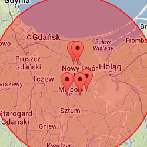
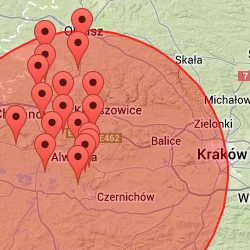
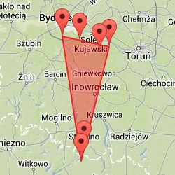
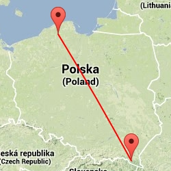

# *Jakub Bełcik*

* [Dane techniczne](#dane-techniczne)
* [Zadanie 1a](#zadanie-1a)
* [Zadanie 1b](#zadanie-1b)
* [Zadanie 1c](#zadanie-1c)
* [Zadanie 1d](#zadanie-1d)
* [Zadanie 1e](#zadanie-1e)

---

## Dane Techniczne

Procesor:
	AMD Phenom II x4 955 3.2GHz

RAM:
	Kingston HyperX 2x2GB 1333MHz DDR3

Dysk Twardy:
	Samsung Spin Point F1 320GB SATA II, NCQ, 16MB

System operacyjny:
	Windows 7 Professional x64

Środowisko:
	Cygwin 1.7.25 x64

Baza Danych:
	MongoDB 2.4.7 x64

---

## Zadanie 1a

```
Zadanie 1a polega na zaimportowaniu, do systemów baz danych uruchomionych na swoim komputerze, danych
z pliku Train.csv bazy:

	* MongoDB
	* PostgreSQL – opcjonalnie dla znających fanów SQL
```

Aby plik Train.csv został poprawnie zaimportowany do bazy danych, trzeba usunąć znaki nowej linii. Zrobi to za nas [skrypt](../../scripts/wbzyl/2unix.sh) dostępny w repozytorium prowadzącego.

```sh
$ time ./2unix.sh Train.csv trainProper.csv

real    11m30.359s
user    2m47.605s
sys     1m43.721s

$ time mongoimport -d dataBase -c train --type csv --file trainProper.csv --headerline
connected to: 127.0.0.1
check 9 6034196
imported 6034195 objects

real    15m50.589s
user    0m0.000s
sys     0m0.031s
```

Średnio ~6348 import'ów na sekundę

---

## Zadanie 1b

```
Zliczyć liczbę zaimportowanych rekordów (Odpowiedź: imported 6_034_195 objects).
```

```js
> db.train.count()
6034195
```

---

## Zadanie 1c

```
(Zamiana formatu danych.) Zamienić string zawierający tagi na tablicę napisów z tagami następnie zliczyć
wszystkie tagi i wszystkie różne tagi. Napisać program, który to zrobi korzystając z jednego ze sterowników.
```

Przykładowy rekord:

```js
> db.train.findOne()
{
        "_id" : 9692,
        "title" : "SQL Server 2005 question about procedure cache",
        "body" : "<p>Server: SQL Server 2005 SP2 64 bit, 32 gigs of memory. 2 instances of SQL server running. Main instance I'm using has 20 gigs visible.</p>  <p>We have a situation where it appears every so often our entire procedure cache is cleared which in turn is forcing stored procedure (sp) recompiles. Once the sp is in the cache everything runs fast for a little while. After a couple hours, it's cleared from the cache and has to be recompiled causing things to run slow briefly.</p>  <p>I'm watching the cache using:</p>  <pre><code>SELECT cp.objtype AS PlanType, OBJECT_NAME(st.objectid,st.dbid) AS ObjectName, cp.refcounts AS ReferenceCounts, cp.usecounts AS UseCounts, st.TEXT AS SQLBatch, qp.query_plan AS QueryPlan FROM sys.dm_exec_cached_plans AS cp CROSS APPLY sys.dm_exec_query_plan(cp.plan_handle) AS qp CROSS APPLY sys.dm_exec_sql_text(cp.plan_handle) AS st GO </code></pre>  <p>DBCC FREEPROCCACHE is never called.</p>  <p>If I run DBCC MEMORYSTATUS I can see the TotalPages of the procedure cache as being around 500k pages. This comes out to be 3.9 Gigs allocated to the cache. Referencing: <a href=\"http://msdn.microsoft.com/en-us/library/ee343986.aspx\" rel=\"nofollow\">Plan Caching in SQL Server 2008</a> (The section on caching includes 2005 SP 2). It indicates the pressure limit should be 4.6 gigs. (75% of visible target memory from 0-4GB + 10% of visible target memory from 4Gb-64GB + 5% of visible target memory > 64GB... 3gigs + 1.6 gigs = 4.6 gigs)</p>  <p>This seems to indicate that we shouldn't be under cache pressure for another 700 megs. If the statistics were changing then the stored procedure should still be in the cache and recompiled when it's next run and it checks the statistics. If this was the case I would expect the cache to stay at almost constant size.</p>  <p>Any ideas what might be causing the procedure cache to empty or what else I should keep an eye on to try to find the cause?</p> ",
        "tags" : "sql-server sql-server-2005 cache stored-procedures",
        "rnd" : 0.5000135693699121
}
```

Do tego zadania wykorzystałem własny [skrypt](../../scripts/jbelcik/1c.js), który rozbija 'spacjami' pole tags typu String na tablice String'ów.

```sh
$ time mongo 1c.js
6032934 records updated

real    13m3.721s
user    0m0.000s
sys     0m0.015s
```

Średnio ~7698 update'ów na sekundę

Przykładowy poprawiony rekord:

```js
> db.train.findOne()
{
        "_id" : 9692,
        "body" : "<p>Server: SQL Server 2005 SP2 64 bit, 32 gigs of memory. 2 instances of SQL server running. Main instance I'm using has 20 gigs visible.</p>  <p>We have a situation where it appears every so often our entire procedure cache is cleared which in turn is forcing stored procedure (sp) recompiles. Once the sp is in the cache everything runs fast for a little while. After a couple hours, it's cleared from the cache and has to be recompiled causing things to run slow briefly.</p>  <p>I'm watching the cache using:</p>  <pre><code>SELECT cp.objtype AS PlanType, OBJECT_NAME(st.objectid,st.dbid) AS ObjectName, cp.refcounts AS ReferenceCounts, cp.usecounts AS UseCounts, st.TEXT AS SQLBatch, qp.query_plan AS QueryPlan FROM sys.dm_exec_cached_plans AS cp CROSS APPLY sys.dm_exec_query_plan(cp.plan_handle) AS qp CROSS APPLY sys.dm_exec_sql_text(cp.plan_handle) AS st GO </code></pre>  <p>DBCC FREEPROCCACHE is never called.</p>  <p>If I run DBCC MEMORYSTATUS I can see the TotalPages of the procedure cache as being around 500k pages. This comes out to be 3.9 Gigs allocated to the cache. Referencing: <a href=\"http://msdn.microsoft.com/en-us/library/ee343986.aspx\" rel=\"nofollow\">Plan Caching in SQL Server 2008</a> (The section on caching includes 2005 SP 2). It indicates the pressure limit should be 4.6 gigs. (75% of visible target memory from 0-4GB + 10% of visible target memory from 4Gb-64GB + 5% of visible target memory > 64GB... 3gigs + 1.6 gigs = 4.6 gigs)</p>  <p>This seems to indicate that we shouldn't be under cache pressure for another 700 megs. If the statistics were changing then the stored procedure should still be in the cache and recompiled when it's next run and it checks the statistics. If this was the case I would expect the cache to stay at almost constant size.</p>  <p>Any ideas what might be causing the procedure cache to empty or what else I should keep an eye on to try to find the cause?</p> ",
        "rnd" : 0.5000135693699121,
        "tags" : [
                "sql-server",
                "sql-server-2005",
                "cache",
                "stored-procedures"
        ],
        "title" : "SQL Server 2005 question about procedure cache"
}
```

---

## Zadanie 1d

```
Ściągnąć plik text8.zip, zapisać wszystkie słowa w bazie MongoDB. Następnie zliczyć liczbę słów oraz
liczbę różnych słów w tym pliku. Ile procent całego pliku stanowi:

	* najczęściej występujące słowo w tym pliku
	* 10, 100, 1000 najczęściej występujących słów w tym pliku
```

Sprawdzamy, czy plik text8 zawiera wyłącznie znaki alfanumeryczne i białe oraz znaki puste zastępujemy znakiem nowej linii.

```sh
$ tr --delete '[:alnum:][:blank:]' < text8 > deleted.txt

$ ls -l deleted.txt
-rw-r--r-- 1 froggman None 0 11-04 19:55 deleted.txt

$ rm deleted.txt

$ wc text8
        0  17005207 100000000 text8

$ tr --squeeze-repeats '[:blank:]' '\n' < text8 > text8.txt

$ wc text8.txt
 17005207  17005207 100000000 text8.txt
 
$ time mongoimport -d text8 -c text8 -f word --type csv --file text8.txt
connected to: 127.0.0.1
check 9 17005208
imported 17005207 objects

real    6m8.782s
user    0m0.000s
sys     0m0.015s
```

Ilość wystąpień wszystkich słów:

```js
> db.text8.count()
17005207
```

Ilość wystąpień różnych słów:

```js
> db.text8.distinct("word").length
253854
```

Najpopularniejsze słowo, jego ilość wystąpień oraz udział procentowy w całym pliku:

```js
> db.text8.aggregate([
> 	{$group: {_id: "$word", count: {$sum: 1}}},
> 	{$sort: {count: -1}},
> 	{$limit: 1}
> ])
{ "result" : [ { "_id" : "the", "count" : 1061396 } ], "ok" : 1 }

> 1061396 / 17005207 * 100
6.241594118789616
```

Ilość wystąpień 10 najpopularniejszych słów oraz udział procentowy w całym pliku:

```js
> db.text8.aggregate([
> 	{$group: {_id: "$word", count: {$sum: 1}}},
> 	{$sort: {count: -1}},
> 	{$limit: 10},
> 	{$group: {_id: null, count: {$sum: "$count"}}}
> ])
{ "result" : [ { "_id" : null, "count" : 4205965 } ], "ok" : 1 }

> 4205965 / 17005207 * 100
24.733394894869555
```

Ilość wystąpień 100 najpopularniejszych słów oraz udział procentowy w całym pliku:

```js
> db.text8.aggregate([
> 	{$group: {_id: "$word", count: {$sum: 1}}},
> 	{$sort: {count: -1}},
> 	{$limit: 100},
> 	{$group: {_id: null, count: {$sum: "$count"}}},
> ])
{ "result" : [ { "_id" : null, "count" : 7998978 } ], "ok" : 1 }

> 7998978 / 17005207 * 100
47.03840417820259
```

Ilość wystąpień 1000 najpopularniejszych słów oraz udział procentowy w całym pliku:

```js
> db.text8.aggregate([
> 	{$group: {_id: "$word", count: {$sum: 1}}},
> 	{$sort: {count: -1}},
> 	{$limit: 1000},
> 	{$group: {_id: null, count: {$sum: "$count"}}}
> ])
{ "result" : [ { "_id" : null, "count" : 11433354 } ], "ok" : 1 }

> 11433354 / 17005207 * 100
67.23443001899359
```

---

## Zadanie 1e

```
Wyszukać w sieci dane zawierające obiekty GeoJSON. Zapisać dane w bazie MongoDB. Dla zapisanych
danych przygotować 6–9 różnych Geospatial Queries (co najmniej po jednym dla obiektów Point,
LineString i Polygon). W przykładach należy użyć każdego z tych operatorów: $geoWithin, $geoIntersect,
$near.
```

Poniższe zadanie zostało wykonane opierając się o [dane współrzędnych geograficznych miejscowości w Polsce](http://astrowiki.eu/index.php?title=Wsp%C3%B3%C5%82rz%C4%99dne_geograficzne_miejscowo%C5%9Bci_w_Polsce), które znalazłem w internecie i wstępnie obrobiłem na plik typu [csv](../../data/jbelcik/miasta.csv).

[Po odwzorowaniu punktów na mapie, można zauważyć, że nie jest to dość dokładna baza współrzędnych]

```sh
$ time mongoimport -d miasta -c miasta --type csv --file miasta.csv --headerline
connected to: 127.0.0.1
check 9 2319
imported 2318 objects

real    0m0.130s
user    0m0.000s
sys     0m0.015s
```

Przykładowy rekord:

```js
> db.miasta.findOne()
{ "_id" : 1, "miasto" : "Adamów", "szerokosc" : 22.15, "dlugosc" : 51.45 }
```

Do tego zadania wykorzystałem własny [skrypt](../../scripts/jbelcik/1e.js), który znajduje każdy rekord nieodpowiadający formatowi, usuwa go i zastępuje poprawnym.

```sh
$ time mongo 1e.js
2318 records changed

real    0m0.210s
user    0m0.000s
sys     0m0.015s
```

Przykładowy poprawiony rekord:

```js
> db.miasta.findOne()
{
        "_id" : 1,
        "miasto" : "Adamów",
        "loc" : {
                "type" : "Point",
                "coordinates" : [
                        22.15,
                        51.45
                ]
        }
}
```

Dodajemy geo-indeks do kolekcji:

```js
> db.miasta.ensureIndex({"loc" : "2dsphere"})
```

#### Zapytanie 1

5 najbliższych miast w promieniu 50km od Nowego Dworu Gdańskiego.

```js
> var punkt = {
> 	"type": "Point", 
>	"coordinates": [19.06, 54.13] 
> }
> db.miasta.find({ loc: {$near: {$geometry: punkt}, $maxDistance: 50000} }).skip(1).limit(5).toArray()
[
        {
                "_id" : 1823,
                "miasto" : "Stegna",
                "loc" : {
                        "type" : "Point",
                        "coordinates" : [
                                19.06,
                                54.2
                        ]
                }
        },
        {
                "_id" : 1914,
                "miasto" : "Sztutowo",
                "loc" : {
                        "type" : "Point",
                        "coordinates" : [
                                19.1,
                                54.2
                        ]
                }
        },
        {
                "_id" : 1806,
                "miasto" : "Stare Pole",
                "loc" : {
                        "type" : "Point",
                        "coordinates" : [
                                19.12,
                                54.03
                        ]
                }
        },
        {
                "_id" : 1267,
                "miasto" : "Nowy Staw",
                "loc" : {
                        "type" : "Point",
                        "coordinates" : [
                                19,
                                54.03
                        ]
                }
        },
        {
                "_id" : 529,
                "miasto" : "Gronowo Elbląskie",
                "loc" : {
                        "type" : "Point",
                        "coordinates" : [
                                19.18,
                                54.05
                        ]
                }
        }
]
```



#### Zapytanie 2

Wszystkie miasta w promieniu 0.25° od Krakowa włącznie.

```js
> db.miasta.find({loc: {$geoWithin: {$center: [[19.57, 50.03], 0.25]}}}).toArray()
[
        {
                "_id" : 199,
                "miasto" : "Charsznica",
                "loc" : {
                        "type" : "Point",
                        "coordinates" : [
                                19.56,
                                50.25
                        ]
                }
        },
        {
                "_id" : 472,
                "miasto" : "Gołcza",
                "loc" : {
                        "type" : "Point",
                        "coordinates" : [
                                19.55,
                                50.21
                        ]
                }
        },
        ...
        {
                "_id" : 2212,
                "miasto" : "Zabierzów",
                "loc" : {
                        "type" : "Point",
                        "coordinates" : [
                                19.48,
                                50.07
                        ]
                }
        },
        {
                "_id" : 2274,
                "miasto" : "Zielonki",
                "loc" : {
                        "type" : "Point",
                        "coordinates" : [
                                19.55,
                                50.07
                        ]
                }
        }
]

> db.miasta.find({loc: {$geoWithin: {$center: [[19.57, 50.03], 0.25]}}}).count()
18
```



#### Zapytanie 3

Wszystkie miasta pomiędzy Warszawą, Łodzią, a Płockiem.

```js
> var obszar = {
>	"type": "Polygon",
>	"coordinates": [[
>		[18.00, 53.07],
>		[18.37, 53.02],
>		[18.15, 52.48],
>		[18.00, 53.07]
>	]]
> }
 db.miasta.find({loc: {$geoWithin: {$geometry: obszar}}}).toArray()
[
        {
                "_id" : 184,
                "miasto" : "Bydgoszcz",
                "loc" : {
                        "type" : "Point",
                        "coordinates" : [
                                18,
                                53.07
                        ]
                }
        },
        {
                "_id" : 1986,
                "miasto" : "Toruń",
                "loc" : {
                        "type" : "Point",
                        "coordinates" : [
                                18.37,
                                53.02
                        ]
                }
        },
        {
                "_id" : 1770,
                "miasto" : "Solec Kujawski",
                "loc" : {
                        "type" : "Point",
                        "coordinates" : [
                                18.14,
                                53.05
                        ]
                }
        },
        {
                "_id" : 2109,
                "miasto" : "Wielka Nieszawka",
                "loc" : {
                        "type" : "Point",
                        "coordinates" : [
                                18.29,
                                53
                        ]
                }
        },
        {
                "_id" : 1605,
                "miasto" : "Rojewo",
                "loc" : {
                        "type" : "Point",
                        "coordinates" : [
                                18.17,
                                52.54
                        ]
                }
        },
        {
                "_id" : 567,
                "miasto" : "Inowrocław",
                "loc" : {
                        "type" : "Point",
                        "coordinates" : [
                                18.15,
                                52.48
                        ]
                }
        }
]

> db.miasta.find({loc: {$geoWithin: {$geometry: obszar}}}).count()
6
```



#### Zapytanie 4

Wszystkie miasta leżącę na linii Lębork - Sanok.

```js
> var linia = {
>	"type": "LineString",
>	"coordinates": [[17.45, 54.33], [22.13, 49.33]]
> }
> db.miasta.find({loc: {$geoIntersects: {$geometry: linia}}}).toArray()
[
        {
                "_id" : 930,
                "miasto" : "Lębork",
                "loc" : {
                        "type" : "Point",
                        "coordinates" : [
                                17.45,
                                54.33
                        ]
                }
        },
        {
                "_id" : 1238,
                "miasto" : "Nowa Wieś Lęborska",
                "loc" : {
                        "type" : "Point",
                        "coordinates" : [
                                17.45,
                                54.33
                        ]
                }
        },
        {
                "_id" : 1674,
                "miasto" : "Sanok",
                "loc" : {
                        "type" : "Point",
                        "coordinates" : [
                                22.13,
                                49.33
                        ]
                }
        }
]

> db.miasta.find({loc: {$geoIntersects: {$geometry: linia}}}).count()
3
```

