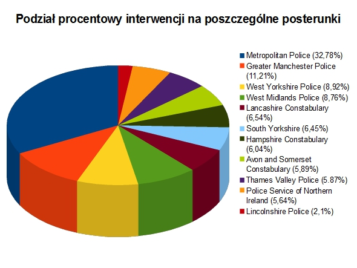
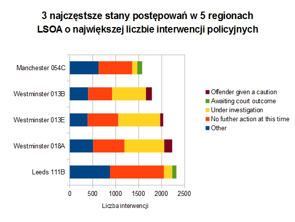
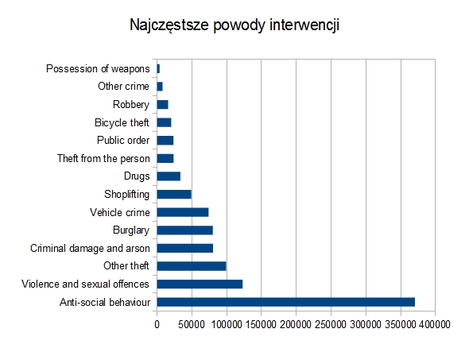
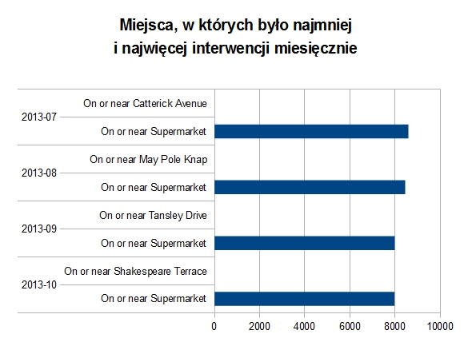
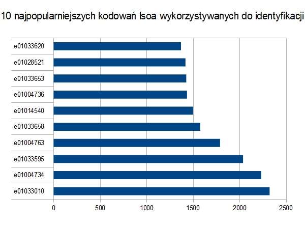

# *Zadanie 2*

plik z danymi został pobrany ze strony data.police.uk i zawiera dane dotyczące interwencji policyjnych w wybranych posterunkach na przestrzeni 2013-07 - 2013-10

#MongoDB

```sh
$ time mongoimport -d dataBase -c streetLevelCrime --type csv --file data.police.uk-cps-2013.07=2013.10-street.csv --headerline
connected to: 127.0.0.1
check 9 1004953
imported 1004952 objects

real    0m56.013s
user    0m0.000s
sys     0m0.031s
```

Średnio ~17941 objektów na sekundę

Przykładowy rekord:

```js
> db.streetLevelCrime.findOne()
{
        "_id" : ObjectId("52c1b350ed50916ae256fcd6"),
        "crime_id" : "",
        "month" : "2013-07",
        "reported_by" : "Avon and Somerset Constabulary",
        "falls_within" : "Avon and Somerset Constabulary",
        "longitude" : -2.515072,
        "latitude" : 51.419357,
        "location" : "On or near Stockwood Hill",
        "lsoa_code" : "E01014399",
        "lsoa_name" : "Bath and North East Somerset 001A",
        "crime_type" : "Anti-social behaviour",
        "last_outcome_category" : "",
        "context" : ""
}
```

#Agregacja 1

Podział procentowy interwencji poszczególnych posterunków:

```js
> db.streetLevelCrime.aggregate(
> 	{ $group: {
> 		_id: "$reported_by",
> 		total: { $sum: 1 }
> 	} },
> 	{ $sort: { total: -1 } }
> )
{
        "result" : [
                {
                        "_id" : "Metropolitan Police",
                        "total" : 329467
                },
                {
                        "_id" : "Greater Manchester Police",
                        "total" : 112624
                },
                {
                        "_id" : "West Yorkshire Police",
                        "total" : 89648
                },
                {
                        "_id" : "West Midlands Police",
                        "total" : 87999
                },
                {
                        "_id" : "Lancashire Constabulary",
                        "total" : 65732
                },
                {
                        "_id" : "South Yorkshire",
                        "total" : 62809
                },
                {
                        "_id" : "Hampshire Constabulary",
                        "total" : 60652
                },
                {
                        "_id" : "Avon and Somerset Constabulary",
                        "total" : 59222
                },
                {
                        "_id" : "Thames Valley Police",
                        "total" : 58964
                },
                {
                        "_id" : "Police Service of Northern Ireland",
                        "total" : 56712
                },
                {
                        "_id" : "Lincolnshire Police",
                        "total" : 21123
                }
        ],
        "ok" : 1
}
```



#Agregacja 2

3 najbardziej popularne stany postępowań w 5 regionach LSOA o największej liczbie interwencji:

```js
> db.streetLevelCrime.aggregate(
>	{ $match: { lsoa_name: { $ne: "" } } },
>	{ $group: {
>		_id: "$lsoa_name",
>		total: { $sum: 1 },
>	} },
>	{ $sort: { total: -1 } },
>	{ $limit: 5 }
> )
{
        "result" : [
                {
                        "_id" : "Leeds 111B",
                        "total" : 2321
                },
                {
                        "_id" : "Westminster 018A",
                        "total" : 2231
                },
                {
                        "_id" : "Westminster 013E",
                        "total" : 2035
                },
                {
                        "_id" : "Westminster 013B",
                        "total" : 1788
                },
                {
                        "_id" : "Manchester 054C",
                        "total" : 1575
                }
        ],
        "ok" : 1
}

> db.streetLevelCrime.aggregate(
>	{ $match : { lsoa_name : "Leeds 111B", last_outcome_category: { $ne: "" } } },
>	{ $group: {
>		_id: "$last_outcome_category",
>		total: { $sum: 1 },
>	} },
>	{ $sort: { total: -1 } },
>	{ $limit: 3 }
> )
{
        "result" : [
                {
                        "_id" : "No further action at this time",
                        "total" : 1175
                },
                {
                        "_id" : "Under investigation",
                        "total" : 179
                },
                {
                        "_id" : "Awaiting court outcome",
                        "total" : 91
                }
        ],
        "ok" : 1
}

> db.streetLevelCrime.aggregate(
>	{ $match : { lsoa_name : "Westminster 018A", last_outcome_category: { $ne: "" } } },
>	{ $group: {
>		_id: "$last_outcome_category",
>		total: { $sum: 1 },
>	} },
>	{ $sort: { total: -1 } },
>	{ $limit: 3 }
> )
{
        "result" : [
                {
                        "_id" : "Under investigation",
                        "total" : 866
                },
                {
                        "_id" : "No further action at this time",
                        "total" : 684
                },
                {
                        "_id" : "Offender given a caution",
                        "total" : 174
                }
        ],
        "ok" : 1
}

> db.streetLevelCrime.aggregate(
>	{ $match : { lsoa_name : "Westminster 013E", last_outcome_category: { $ne: "" } } },
>	{ $group: {
>		_id: "$last_outcome_category",
>		total: { $sum: 1 },
>	} },
>	{ $sort: { total: -1 } },
>	{ $limit: 3 }
> )
{
        "result" : [
                {
                        "_id" : "Under investigation",
                        "total" : 913
                },
                {
                        "_id" : "No further action at this time",
                        "total" : 668
                },
                {
                        "_id" : "Offender given a caution",
                        "total" : 66
                }
        ],
        "ok" : 1
}

> db.streetLevelCrime.aggregate(
>	{ $match : { lsoa_name : "Westminster 013B", last_outcome_category: { $ne: "" } } },
>	{ $group: {
>		_id: "$last_outcome_category",
>		total: { $sum: 1 },
>	} },
>	{ $sort: { total: -1 } },
>	{ $limit: 3 }
> )
{
        "result" : [
                {
                        "_id" : "Under investigation",
                        "total" : 737
                },
                {
                        "_id" : "No further action at this time",
                        "total" : 522
                },
                {
                        "_id" : "Offender given a caution",
                        "total" : 128
                }
        ],
        "ok" : 1
}

> db.streetLevelCrime.aggregate(
>	{ $match : { lsoa_name : "Manchester 054C", last_outcome_category: { $ne: "" } } },
>	{ $group: {
>		_id: "$last_outcome_category",
>		total: { $sum: 1 },
>	} },
>	{ $sort: { total: -1 } },
>	{ $limit: 3 }
> )
{
        "result" : [
                {
                        "_id" : "No further action at this time",
                        "total" : 735
                },
                {
                        "_id" : "Under investigation",
                        "total" : 108
                },
                {
                        "_id" : "Awaiting court outcome",
                        "total" : 105
                }
        ],
        "ok" : 1
}
```



#Elasticsearch

Exportujemy baze do pliki .json, potem przerabiamy ten plik tak aby wpasować go do standardów Elasticsearch. Nastepnie dzielimy plik na mniejsze paczki, gdyż Elasticsearch nie poradzi sobie z taka duża ilościa danych. Na końcu importujemy dane i sprawdzamy czy operacja przebiegła pomyślnie.

```sh
$ time mongoexport -d dataBase -c streetLevelCrime -o slc.json
connected to: 127.0.0.1
exported 1004952 records

real    0m32.530s
user    0m0.000s
sys     0m0.015s

$ time jq --compact-output '{ "index" : { "_type" : "intervention" } }, .' slc.json > properESslc.json

real    0m59.200s
user    0m0.015s
sys     0m0.015s

$ time split -l 100000 properESslc.json

real    0m0.670s
user    0m0.046s
sys     0m0.623s

$ time for i in x*; do curl -s -XPOST   localhost:9200/interventions/_bulk --data-binary @$i; done

real    1m30.226s
user    0m1.705s
sys     0m3.579s

$ curl -XGET 'http://localhost:9200/interventions/intervention/_count'; echo
{"count":1004952,"_shards":{"total":5,"successful":5,"failed":0}}
```

Przykladowy rekord:

```js
{		"index" :
				{
						"_type" : "intervention"
				}
}
{
		"context" : "",
		"last_outcome_category" : "",
		"crime_type" : "Anti-social behaviour",
		"lsoa_name" : "Bath and North East Somerset 001A",
		"lsoa_code" : "E01014399",
		"_id" : ObjectId("52c1b350ed50916ae256fcd6"),
		"crime_id" : "",
		"month":"2013-07",
		"reported_by" : "Avon and Somerset Constabulary",
		"falls_within" : "Avon and Somerset Constabulary",
		"longitude" : -2.515072,
		"latitude" : 51.419357,
		"location" : "On or near Stockwood Hill"
}
```

#Agregacja 3

Najczęstsze powody zatrzymań:

```js
{
   "query" : {
       "match_all" : {  }
   },
   "facets" : {
       "crime_type" : {
           "terms" : {
               "field" : "crime_type"
           }
       }
   }
}
```



#Agregacja 4

Miejsce o największej i najmniejszej liczbie interwencji w skali miesięcznej:

MongoDB:

```js
> db.streetLevelCrime.aggregate(
>	{ $group: {
>		_id: { month: "$month", location: "$location"},
>		total: { $sum: 1 }
>	} },
> 	{ $sort: { total: -1 } },
>	{ $group: {
>		_id: "$_id.month",
>		safe: { $first: "$_id.location" },
>		safeCount: { $first: "$total" },
>		notsafe: { $last: "$_id.location" },
>		notSafeCount: { $last: "$total" },
>	} }
> )
{
        "result" : [
                {
                        "_id" : "2013-10",
                        "safe" : "On or near Supermarket",
                        "safeCount" : 7974,
                        "notsafe" : "On or near Shakespeare Terrace",
                        "notSafeCount" : 1
                },
                {
                        "_id" : "2013-09",
                        "safe" : "On or near Supermarket",
                        "safeCount" : 7982,
                        "notsafe" : "On or near Tansley Drive",
                        "notSafeCount" : 1
                },
                {
                        "_id" : "2013-08",
                        "safe" : "On or near Supermarket",
                        "safeCount" : 8451,
                        "notsafe" : "On or near May Pole Knap",
                        "notSafeCount" : 1
                },
                {
                        "_id" : "2013-07",
                        "safe" : "On or near Supermarket",
                        "safeCount" : 8592,
                        "notsafe" : "On or near Catterick Avenue",
                        "notSafeCount" : 1
                }
        ],
        "ok" : 1
}
```



Elasticsearch:

```js
a
```

