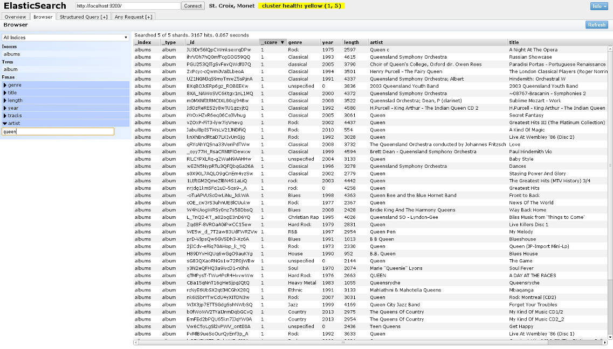
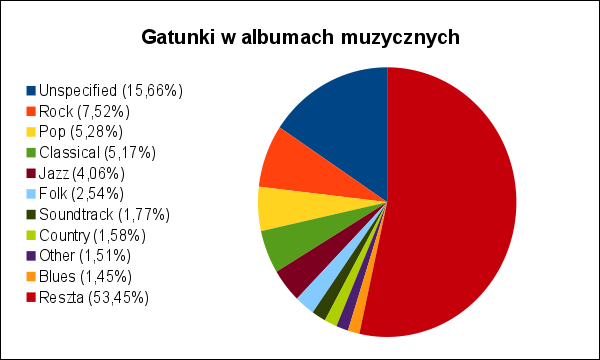
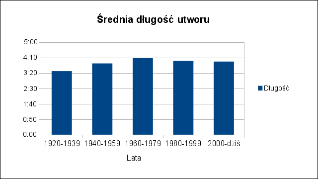

### *Albumy muzyczne*

----

## Spis treści
* [Przeróbka bazy danych i import](#przeróbka)
  * [Mongodb](#mongodb)
  * [ElasticSearch](#elasticSearch)
* [Statystyki (Mongodb)](#statystyki)
* [Agregacje](#agregacje)
  * [Mongodb](#mongodb2)
  * [ElastichSearch](#elasticSearch2)

# Przeróbka bazy danych i import
## Mongodb
Bazę danych albumów muzycznych ściągnąłem z [freedb](http://ftp.freedb.org/pub/freedb/). (plik freedb-complete-20131101.tar.bz2). W środku znajduje się kilkanaście GB. Są to ponad 3 miliony małych plików, [przykład](../data/jdermont/0009e012).

Za pomocą [skryptu](../scripts/jdermont/albumy_muzyczne/) przerobiłem te pliki na jeden json (można znaleźć u mnie na sigmie freedb_json.7z w public_html). Operacja trochę trwała i nie mogłem jej za bardzo przyspieszyć, bo to było dużo małych plików... Skrypt odrzucił ok. 3000 plików ze względu na wadliwe kodowanie.

Import jsona:
```sh
mongoimport --db baza --collection freedb freedb.json
```
```
Tue Dec  3 15:18:51.542 check 9 3346273
Tue Dec  3 15:18:52.082 imported 3346273 objects
```

Przykładowy wpis:
```json
{
  "_id" : ObjectId("529e0d851b9fd595e0953c06"),
  "title" : "Island of Sanity",
  "artist" : "Various Artists",
  "tracks" : [
    "David Linton - Lumbago",
    "Mofungo - Slimeball Necktie",
    "Christian Marclay - 1930",
    "Fish & Roses - Checkered Past",
    "Details at Eleven - Music for Secretaries",
    "Skeleton Crew - The Sparrow Song",
    "Mark Derby - Banging Khruscev's Shoe",
    "Charles K. Noyes - Mouse and Ermine",
    "Locu Solus - Wrap Backwards and the Usual Snowflakes - Beda Fo",
    "mm",
    "David Fulton - Border Patrol",
    "David Garland - the Golden Years",
    "Bumb - Spies in Space - Beer in my hand",
    "Chris Vine - Alignment",
    "Carbon - Cormorant",
    "Bosho - Boy Yaca",
    "The Scene is Now - Lullaby Stomp - Cool Pool",
    "HMD - Runner",
    "Robert Previte - Requiem For Vincent"
  ],
  "length" : 3778,
  "year" : 1991,
  "genre" : "Experimental"
}
```

## ElasticSearch
Przygotowanie przeplatanego jsona:
```sh
jq --compact-output '{ "index" : { "_type" : "album" } }, .' freedb.json > freedb_es.json
```
Próba zaimportowania, zakończona fiaskiem. Program się wykrzaczył, prawdopodobnie za mało RAMu.
```sh
curl -s -XPOST localhost:9200/albums/_bulk --data-binary @freedb_es.json; echo
```
Podzielenie pliku na 100000 linii czyli 50000 wpisów na każdy plik:
```sh
split -l 100000 freedb_es.json
```
I import, zakończony sukcesem:
```sh
for i in x*; do curl -s -XPOST   localhost:9200/albums/_bulk --data-binary @$i; done
```
Sprawdzenie ile wpisów zostało zaimportowanych:
```sh
curl -XGET 'http://localhost:9200/albums/album/_count'; echo
```
```json
{"count":3346273,"_shards":{"total":5,"successful":5,"failed":0}}
```

Sprawdzenie w przeglądarce, czy wszystko OK (zainstalowany plugin ElasticSearch-Head):



# Statystyki (Mongodb)

Statystyki bazy:
```js
> db.freedb.stats()
```
```json
{
  "ns" : "baza.freedb",
  "count" : 3346273,
  "size" : 2030927296,
  "avgObjSize" : 606.9221775987793,
  "storageSize" : 3259531264,
  "numExtents" : 20,
  "nindexes" : 1,
  "lastExtentSize" : 851263488,
  "paddingFactor" : 1,
  "systemFlags" : 1,
  "userFlags" : 0,
  "totalIndexSize" : 108585456,
  "indexSizes" : {
    "_id_" : 108585456
  },
  "ok" : 1
}
```

Ilość albumów w kolekcji:
```js
> db.freedb.count()
3346273
```

Wszystkie utwory we wszystkich albumach:
```js
> db.freedb.aggregate({$project:{"tracks":1}},{$unwind: "$tracks"},{$group:{"_id":"result",count:{$sum:1}}})
```
```json
{
  "result" : [
    {
      "_id" : "result",
      "count" : 46253976
    }
  ],
  "ok" : 1
}
```

Łączna długość utworów (w sekundach):
```js
> db.freedb.aggregate({$group:{_id:"result",length:{$sum: "$length"}}})
```
```json
{
  "result" : [
    {
      "_id" : "result",
      "length" : NumberLong("10914094143")
    }
  ],
  "ok" : 1
}
```
10914094143 sekund czyli nieco ponad 346 lat. Z powyższych danych wynika, że utwór trwa średnio 3:56.

# Agregacje

## Mongodb

Ilość albumów o określonych gatunkach:
```js
db.freedb.aggregate({$group:{_id:"$genre",total:{$sum: 1}}},{$sort:{total:-1}},{$limit:10})
```

Procentowy udział gatunków muzycznych:




Średnia długość utworów w poszczególnych latach:
```js
function average(begin,end) {
  tracks_number = 0;
  tracks_length = 0;
  db.freedb.find({"year":{$gte:begin,$lt:end}}).forEach( function(Doc) { tracks_number += Doc.tracks.length; tracks_length += Doc.length })
  return tracks_length / tracks_number;
}
```
```js
> average(1920,1940)
> average(1940,1960)
> average(1960,1980)
> average(1980,2000)
> average(2000,2014)
```

Średnia długość utworów:




## ElasticSearch

To be continued.
