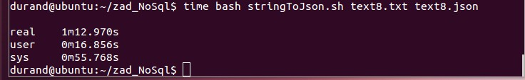
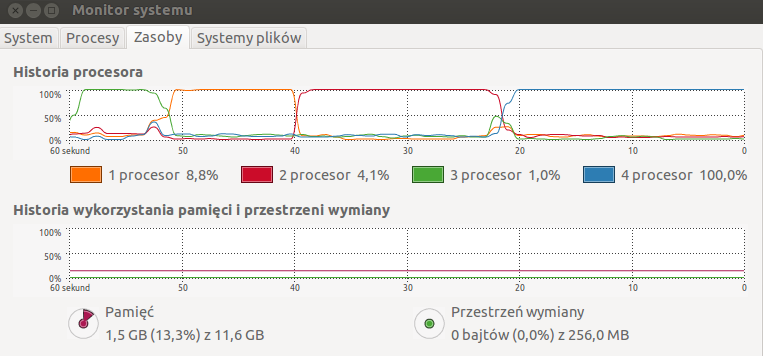
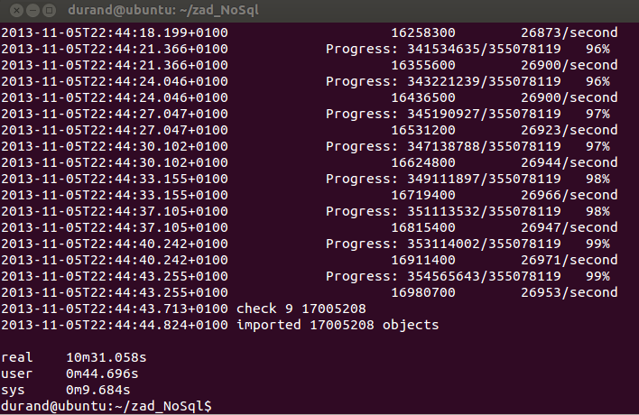

## Zadanie 1

* zadanie 1a

wstępne "oczyszczenie" pliku wykonałem korzystając ze skryptu [2unix.sh] (/scripts/wbzyl/2unix.sh)

```sh
$ time bash 2unix.sh Train.csv train.csv

real 	45m041.787s
user 	2m5.984s
sys 	8m53.080s
```
import pliku do bazy
```sh
$ time mongoimport --type csv --collection train --file train.csv --headerline

real 	195m027.482s
user 	1m40.952s
sys 	0m11.820s
```
zaimportowało 6034195 obiektów

* zadanie 1b

polecenie wprowadzone w konsoli mongoDB

```sh
db.train.count()
```
wynik - 6034195 obiektów

* zadanie 1c

do przerobienia pola "tags" ze stringu na tablicę użyłem skryptu

```sh
db.train.find( { "tags" : { $type : 2 } } ).snapshot().forEach(
 function (x) {
  if (!Array.isArray(x.tags)){
    x.tags = x.tags.split(' ');
    db.train.save(x);
}});
```

* zadanie 1d

Plik do postaci text8 został przygotowany wg instrukcji zawartej [tutaj](http://wbzyl.inf.ug.edu.pl/nosql/zadania). Następnie został on sformatowany do postaci typu json za pomocą bashowego [skryptu](../../scripts/jgalka/stringToJson.sh) poleceniem

```sh
$ time bash stringToJ
son.sh text8.txt text8.json
```





Jak widać system "ładnie" radził sobie z naprzemiennym obciążaniem każdego procesora osobno.

Pozostało teraz zaimportować plik do kolekcji

```sh
$ time mongoimport --db text --collection text8 --type json --file text8.json
```



Zliczanie wszystkich znajdujących się w bazie słów

```sh
db.text8.(count)

wynik - 17005208
```

Zliczanie wszystkich unikatowych słów

```sh
db.text8.distinct("word").length

wynik - 253855
```

Jedno najczęściej występujące słowo

```sh
db.text8.aggregate(
    {$group:{ _id:"$word", count:{$sum:1}}}, 
    {$sort: {count: -1}}, 
    {$limit:1})

wynik - "the" - 1061396
```

Dziesięć najczęściej występujących słów

```sh
 db.text8.aggregate(
     {$group:{ _id:"$word", count:{$sum:1}}}, 
     {$sort: {count: -1}}, 
     {$limit:10})
```

* zadanie 1e
