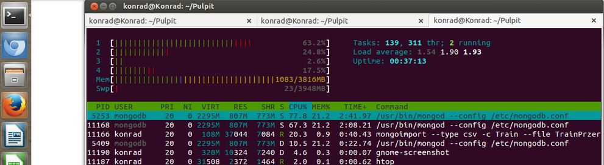

# *Konrad Mieszała*

Procesor na jakim pracuje :
model name      : Intel(R) Core(TM) i3 CPU       M 350  @ 2.27GHz
###Zadanie 1a)
Pozbycie się białych znaków:
```sh
time cat Train.csv | replace "\n" " " | replace "\r" "\n" > TrainPrzerobiony.csv
```
Czas:
```
real    7m40.809s
user    3m17.495s
sys     0m57.287s
```
Import:
```sh
mongoimport --type csv -c Train --file TrainPrzerobiony.csv --headerline
```
```
real    62m22.013s
user    5m20.328s
sys     1m12.556s
```

###Zadanie 1b)
Zliczenie zaimportowanych rekordów.
```sh
> db.Train.count()
6034195
```
###Zadanie 1c)
Zamienić string zawierający tagi na tablicę napisów z tagami następnie zliczyć wszystkie tagi i wszystkie różne tagi. Napisać program, który to zrobi korzystając z jednego ze sterowników.
```js
baza = db.Train.find();

var tagsUnique = {};
var tagsNumber = 0;

baza.forEach(function(train){
    var tagsArray = [];
    if(typeof train.tags === "string") {
        tagsArray = train.tags.split(" ");
        db.Train.update({_id: train._id}, {$set: {tags: tagsArray}});
    } else if(typeof train.tags === "number") {
        tagsArray.push(train.tags.toString());
        db.Train.update({_id: train._id}, {$set: {tags: tagsArray}});
    } else {
        tagsArray = train.tags;
    }
    tagsNumber += tagsArray.length;
    tagsArray.forEach(function(tag) {
        if(typeof tagsUnique[tag] === "undefined")
            tagsUnique[tag] = 1;
    });
});
print("Wszystkie: " + tagsNumber);
print("Unikalne: " + Object.keys(tagsUnique).length);
```
```
Wszystkie: 17409994
Unikalne: 42048
```
Czas
```
real    36m17.261s
user    3m10.320s
sys     0m20.591s
```
