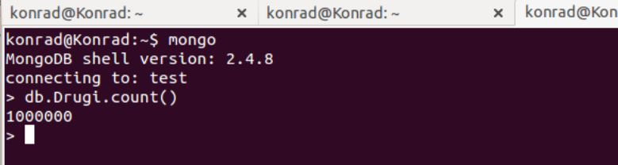
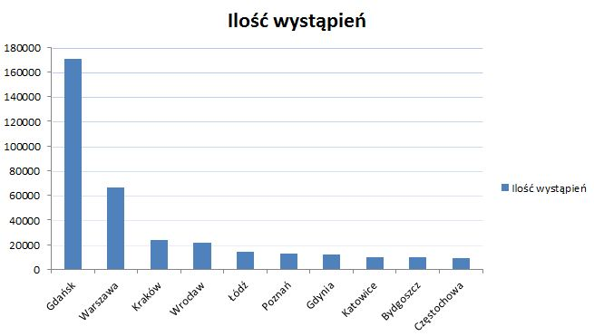
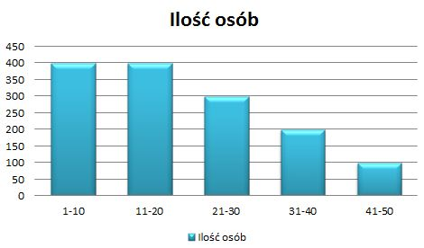
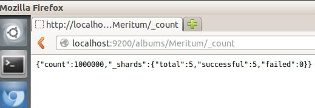

# *Konrad Mieszała*

Do rozwiązania problemu użyłem pliku xls z wymyślonymi danymi, który otrzymałem od Meritum Banku, w ramach zajęć z innego przedmiotu. Zapisałem plik xls jako plik csv. 

#MongoDb
### Zapisanie danych w bazie MongoDB:
```sh
cat Drugi.csv | replace "\n" " " | replace "\r" "\n" > DrugiPrzerobiony.csv
```

Po pozbyciu się białych znaków przeszedłem do importowania danych:
```sh
mongoimport --type csv -c Drugi --file DrugiPrzerobiony.csv --headerline
```


### Przykładowy rekord:
```sh
konrad@Konrad:~$ mongo
MongoDB shell version: 2.4.8
connecting to: test
> db.Drugi.findOne()
{
        "_id" : ObjectId("52c0a38b938b72a6fc3885bd"),
        "data_pisma" : "21-11-2013",
        "imie_nazwisko" : "Nikka Griffi",
        "nazwa_ulicy" : "Krucza",
        "kod_pocztowy" : "67-740",
        "miejscowosc" : "Tylewice",
        "sygnatura" : "Z/282256",
        "data_wplywu_pisma" : "26-01-2012",
        "zadluzenie" : 300000,
        "nast_rata" : 30367.34,
        "ile_rat" : 245,
        "imie_matki" : "Edie"
}
>
```
### Agragacje MongoDB
10 najczęściej występujących miejscowości:
```sh
> db.Drugi.aggregate( { $group: { _id: "$miejscowosc", count: { $sum: 1 } } } , { $sort: { count: -1 } }, { $limit: 10 })
{
	"result" : [
		{
			"_id" : "Gdańsk",
			"count" : 170800
		},
		{
			"_id" : "Warszawa",
			"count" : 66700
		},
		{
			"_id" : "Kraków",
			"count" : 23800
		},
		{
			"_id" : "Wrocław",
			"count" : 21500
		},
		{
			"_id" : "Łódź",
			"count" : 14500
		},
		{
			"_id" : "Poznań",
			"count" : 13000
		},
		{
			"_id" : "Gdynia",
			"count" : 11800
		},
		{
			"_id" : "Katowice",
			"count" : 10100
		},
		{
			"_id" : "Bydgoszcz",
			"count" : 9500
		},
		{
			"_id" : "Częstochowa",
			"count" : 8900
		}
	],
	"ok" : 1
}
```


Ilość osób którym zostało od 1 do 10 rat:
```sh
> db.Drugi.aggregate( [ { $match : { 'ile_rat' : { $gt :1 , $lte : 10 } } }, { $group: { _id: null, count: { $sum: 1 } } } ] );
{ "result" : [ { "_id" : null, "count" : 400 } ], "ok" : 1 }
```
Ilość osób którym zostało od 11 do 20 rat:
```sh
> db.Drugi.aggregate( [ { $match : { 'ile_rat' : { $gt :11 , $lte : 20 } } }, { $group: { _id: null, count: { $sum: 1 } } } ] );
{ "result" : [ { "_id" : null, "count" : 400 } ], "ok" : 1 }
```
Ilość osób którym zostało od 21 do 30 rat:
```sh
> db.Drugi.aggregate( [ { $match : { 'ile_rat' : { $gt :21 , $lte : 30 } } }, { $group: { _id: null, count: { $sum: 1 } } } ] );
{ "result" : [ { "_id" : null, "count" : 300 } ], "ok" : 1 }
```
Ilość osób którym zostało od 31 do 40 rat:
```sh
> db.Drugi.aggregate( [ { $match : { 'ile_rat' : { $gt :31 , $lte : 40 } } }, { $group: { _id: null, count: { $sum: 1 } } } ] );
{ "result" : [ { "_id" : null, "count" : 200 } ], "ok" : 1 }
```
Ilość osób którym zostało od 41 do 50 rat:
```sh
> db.Drugi.aggregate( [ { $match : { 'ile_rat' : { $gt :41 , $lte : 50 } } }, { $group: { _id: null, count: { $sum: 1 } } } ] );
{ "result" : [ { "_id" : null, "count" : 100 } ], "ok" : 1 }
```


#Elasticsearch
### Import do Elasticsearch
Eksport danych z Mongo
```sh
mongoexport -d test -c Drugi -o Drugi.json
```
Przygotowanie danych:
```sh
jq --compact-output '{ "index" : { "_type" : "Meritum" } }, .' Drugi.json > Drugi2.json
```
Podzielenie pliku na 100000 linii:
```sh
split -l 100000 Drugi2.json
```
Import do bazy:
```sh
for i in x*; do curl -s -XPOST   localhost:9200/Banki/_bulk --data-binary @$i; done
```
Sprawdzenie:
```sh
konrad@Konrad:~/Pobrane/zad2NoSql$ curl -XGET 'http://localhost:9200/Banki/Meritum/_count' ; echo
{"count":1000000,"_shards":{"total":5,"successful":5,"failed":0}}
```
Pełen sukces!!!



### Agregacje Elasticsearch
10 najczęstrzych imion matki:
```sh
{
  "query" : {
    "match_all" : { }
  },
  "facets" : {
    "artist" : {
      "terms" : {
        "field" : "imie_matki",
        "size" : 10
      }
    }
  }
}
```
Wynik:
```sh
"facets" : {
    "artist" : {
      "_type" : "terms",
      "missing" : 9159,
      "total" : 1000000,
      "other" : 982912,
      "terms" : [ {
        "term" : "mary",
        "count" : 3600
      }, {
        "term" : "jean",
        "count" : 3000
      }, {
        "term" : "louise",
        "count" : 2900
      }, {
        "term" : "jonny",
        "count" : 2800
      }, {
        "term" : "lee",
        "count" : 2500
      }, {
        "term" : "carrie",
        "count" : 2400
      }, {
        "term" : "anne",
        "count" : 2400
      }, {
        "term" : "delbert",
        "count" : 1781
      }, {
        "term" : "cary",
        "count" : 1315
      }, {
        "term" : "ben",
        "count" : 1292
      } ]
    }
  }
}
```
Ilość ludzi z zadłużeniem do 100 000, od 100 001 do 200 000 i od 200 001:
```sh
{
    "query" : {
        "match_all" : {}
    },
    "facets" : {
        "range1" : {
            "range" : {
                "field" : "zadluzenie",
                "ranges" : [
{ "to" : 100000 },
{ "from" : 100001, "to" : 200000 },
{ "from" : 200001 }
                ]
            }
        }
    }
}
```
Wynik:


