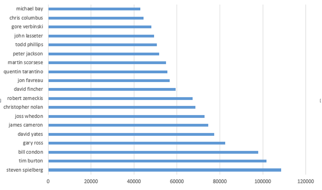
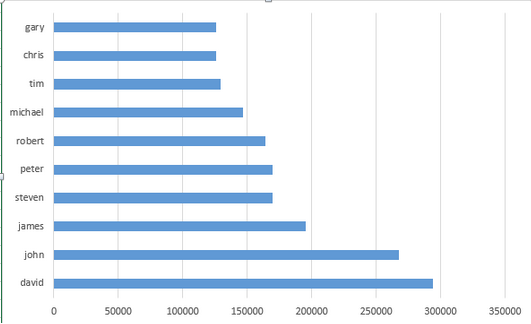

#Konrad Wiśniewski
# Zadanie 2
##Dane

[GetGlue and Timestamped Event Data](http://getglue-data.s3.amazonaws.com/getglue_sample.tar.gz) (ok. `11 GB`, `19 831 300` json-ów, próbka 100 jsonów [getglue101](https://github.com/nosql/aggregations-2/blob/master/data/wbzyl/getglue101.json)). Są to dane z [IMDB](http://www.imdb.com/) z lat 2007–2012, tylko filmy i przedstawienia TV. 

Przykładowy dokument `json`:

```json
{
	"_id" : ObjectId("52b81289d4f850c63820fee5"),
	"comment" : "",
	"hideVisits" : "false",
	"modelName" : "tv_shows",
	"displayName" : "",
	"title" : "Criminal Minds",
	"timestamp" : "2008-08-01T06:58:14Z",
	"image" : "http://cdn-1.nflximg.com/us/boxshots/large/70056671.jpg",
	"userId" : "areilly",
	"private" : "false",
	"source" : "http://www.netflix.com/Movie/Criminal_Minds_Season_1/70056671",
	"version" : "2",
	"link" : "http://www.netflix.com/Movie/Criminal_Minds_Season_1/70056671",
	"lastModified" : "2011-12-16T19:41:19Z",
	"action" : "Liked",
	"lctitle" : "criminal minds",
	"objectKey" : "tv_shows/criminal_minds",
	"visitCount" : "1"
}
```
##Import

Po ściągnięciu pliku rozkapowujemy go komendą:

```sh
tar -xf getglue_sample.tar.gz
```
Mierzymy czas import'u poleceniem `time`. 

```sh
time mongoimport -d imdb -c imdb --type json --file getglue_sample.json
```

###Wynik
```sh
Mon Jan 02 11:59:59.004 		Progress: 11357945834/11454208342	99%
Mon Jan 02 11:59:59.004 			19662600	14873/second
Mon Jan 02 12:00:02.021 		Progress: 11396729995/11454208342	99%
Mon Jan 02 12:00:02.021 			19730200	14890/second
Mon Jan 02 12:00:05.003 		Progress: 11425370624/11454208342	99%
Mon Jan 02 12:00:05.004 			19780200	14894/second
Mon Jan 02 12:00:07.958 check 9 19831300
Mon Jan 02 12:00:08.179 imported 19831300 objects
```

###Czasy
```sh
real	22m10.912s
user	6m43.097s
sys	0m45.335s
```

###Sprawdzenie
```js
MongoDB shell version: 2.4.8
connecting to: test
> show dbs
imdb	17.9453125GB
local	0.078125GB
train	11.9482421875GB
> use imdb
switched to db imdb
> db.imdb.count()
19831300
> 
```

## MongoDB

###Agregacja 1: 20 najczęściej występujących reżyserów

Zapytanie:
```js
db.imdb.aggregate({$group:{_id: "$director", count:{$sum: 1}}},{$sort:{count: -1}},{$limit: 20});
```

Wynik:
```js
{
	"result" : [
		{
			"_id" : null,
			"count" : 12235144
		},
		{
			"_id" : "steven spielberg",
			"count" : 108571
		},
		{
			"_id" : "tim burton",
			"count" : 101741
		},
		{
			"_id" : "bill condon",
			"count" : 97835
		},
		{
			"_id" : "gary ross",
			"count" : 82420
		},
		{
			"_id" : "david yates",
			"count" : 77366
		},
		{
			"_id" : "james cameron",
			"count" : 74645
		},
		{
			"_id" : "joss whedon",
			"count" : 72810
		},
		{
			"_id" : "christopher nolan",
			"count" : 68542
		},
		{
			"_id" : "robert zemeckis",
			"count" : 67181
		},
		{
			"_id" : "david fincher",
			"count" : 59427
		},
		{
			"_id" : "jon favreau",
			"count" : 56669
		},
		{
			"_id" : "quentin tarantino",
			"count" : 55616
		},
		{
			"_id" : "martin scorsese",
			"count" : 54845
		},
		{
			"_id" : "peter jackson",
			"count" : 51708
		},
		{
			"_id" : "todd phillips",
			"count" : 50534
		},
		{
			"_id" : "john lasseter",
			"count" : 49340
		},
		{
			"_id" : "gore verbinski",
			"count" : 47979
		},
		{
			"_id" : "chris columbus",
			"count" : 44403
		},
		{
			"_id" : "michael bay",
			"count" : 42845
		}
	],
	"ok" : 1
}
```

####Wynik graficznie


###Aggregacja 2

***Jakie jest 10 najpopularniejszych filmów i przedstawień TV?***

Aggregacja powinna wybrać filmy i przedstawienia TV a następnie policzyć ile razy każde z nich wystąpiło.

####Kod aggregacji

```js
coll.aggregate(
  { $match: { "modelName": "movies" || "tv_shows"  } },
  { $group: {_id: "$title", count: {$sum: 1} } },
  { $sort: {count: -1} },
  { $limit: 10}
);
```

####Wynik

```sh
MongoDB shell version: 2.4.8
connecting to: imdb
```

```json
{
  "result" : [
    { "_id" : "The Twilight Saga: Breaking Dawn Part 1",       "count" : 87521 },
    { "_id" : "The Hunger Games",                              "count" : 79340 },
    { "_id" : "Marvel's The Avengers",                         "count" : 64356 },
    { "_id" : "Harry Potter and the Deathly Hallows: Part II", "count" : 33680 },
    { "_id" : "The Muppets",                                   "count" : 29002 },
    { "_id" : "Captain America: The First Avenger",            "count" : 28406 },
    { "_id" : "Avatar",                                        "count" : 23238 },
    { "_id" : "Thor",                                          "count" : 23207 },
    { "_id" : "The Hangover",                                  "count" : 22709 },
    { "_id" : "Titanic",                                       "count" : 20791 }
  ],
  "ok" : 1
}
```

####Czasy

```sh
real  4m9.687s
user  0m0.048s
sys   0m0.016s
```

####Wykres


#Elasticsearch

##Import

Próba zaimportowania całego pliku do bazy zakończyła się otrzymaniem komunikatu `out of memory`.

Aby zaimportować plik do bazy podzielimy go na mniejsze części.

```sh
split -l 200000 getglue_sample.bulk
```
A nastepnie importujemy pliki w pętli:

```sh
for i in x*; do curl -s -XPOST localhost:9200/data/_bulk --data-binary @$i > /dev/null; echo $i; done
```
####Wynik

Sprawdzamy ile obiektów zostało zapisanych w bazie.

```sh
curl -XGET 'http://localhost:9200/data/imdb/_count' ; echo
```

```json
{"count":19766542,"_shards":{"total":1,"successful":1,"failed":0}}
```

Zaimportowało się `19 766 542`. `64 758` obiektów zostało odrzuconych z powodu złego formatu daty.


###Agregacja 1

Agregacja wylicza 10 naczęsciej wystepujących imion reżyserów.

####Kod agregacji

```json
{
    "query": {
        "match_all": {}
    },
    "facets": {
        "action": {
            "terms": {
                "field" : "director",
                "size" : "10"
            }
        }
    }
}
```

####Wynik
```json
{
  "facets": {
    "action": {
      "terms": [
        {
          "count": 294079,
          "term": "david"
        },
        {
          "count": 267429,
          "term": "john"
        },
        {
          "count": 195270,
          "term": "james"
        },
        {
          "count": 169772,
          "term": "steven"
        },
        {
          "count": 169529,
          "term": "peter"
        },
        {
          "count": 164195,
          "term": "robert"
        },
        {
          "count": 146425,
          "term": "michael"
        },
        {
          "count": 129172,
          "term": "tim"
        },
        {
          "count": 125787,
          "term": "chris"
        },
        {
          "count": 125463,
          "term": "gary"
        }
      ],
      "other": 13839711,
      "total": 15626832,
      "missing": 12184882,
      "_type": "terms"
    }
  }
```

###Wykres



Aggregacja 2

***Dziesięciu najaktywniejszych użytkowików***

Aggregacja ma policzyć ile akcji wykonał każdy z użytkowników i zwrócić dziesięciu najaktywniejszych.

####Kod aggregacji

```json
{
    "query" : {
        "match_all" : {  }
    },
    "facets" : {
        "userId" : {
            "terms" : {
                "field" : "userId",
                "size" : 10
            }
        }
    }
}
```


####Wynik

```json
{
  "facets": {
    "userId": {
      "terms": [
        { "count": 696750, "term": "lukewilliamss" },
        { "count": 68131,  "term": "demi_konti"    },
        { "count": 59257,  "term": "bangwid"       },
        { "count": 56044,  "term": "zenofmac"      },
        { "count": 55736,  "term": "agentdunham"   },
        { "count": 43153,  "term": "cillax"        },
        { "count": 42299,  "term": "tamtomo"       },
        { "count": 32824,  "term": "hblackwood"    },
        { "count": 32237,  "term": "ellen_turner"  },
        { "count": 32133,  "term": "husainholic"   }
      ],
      "other": 18648036,
      "total": 19766600,
      "missing": 0,
      "_type": "terms"
    }
  },
  "hits": {
    //...
  },
  "_shards": {
    "failed": 0,
    "successful": 1,
    "total": 1
  },
  "timed_out": false,
  "took": 6391
}
```

###Wykres

