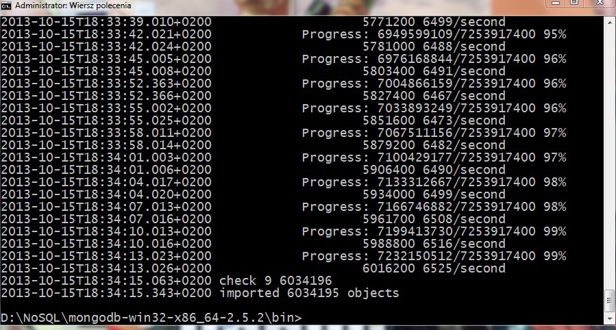

<h1> Łukasz Paczyński </h1>

<h3>Zadanie 1</h3>

<b>a)</b>
<p>Import pliku</p>

  ```bash
  $ mongoimport --type csv -c Train --file ./Train2.csv --headerline
  ```  

<b>b)</b>

  ```bash
  db.Train.count()
  ```
  Liczba obiektów: 6034195 
  


  
<b>c</b>

<b>d<b>
<p>Przerobiłem plik do Jsona za pomocą tego [skryptu](../../scripts/lpaczynski/toJson.sh)</p>

  ```bash
  $ ./toJson.sh text8
  ```
<p>następnie zimportowałem plik do bazy</p>
  ```bash
  $ mongoimport --d text8 -c text8 --file text8.json
  ```
  
<p>Zliczanie wszystkich słów</p>
  ```js
  db.text8.count()
  
  Rezultat: 17005207
  ```
<p>Zliczanie różnych słów<p>
  ```js
  db.text8.distinct("word").length
  
  Rezultat: 253854
  ```
