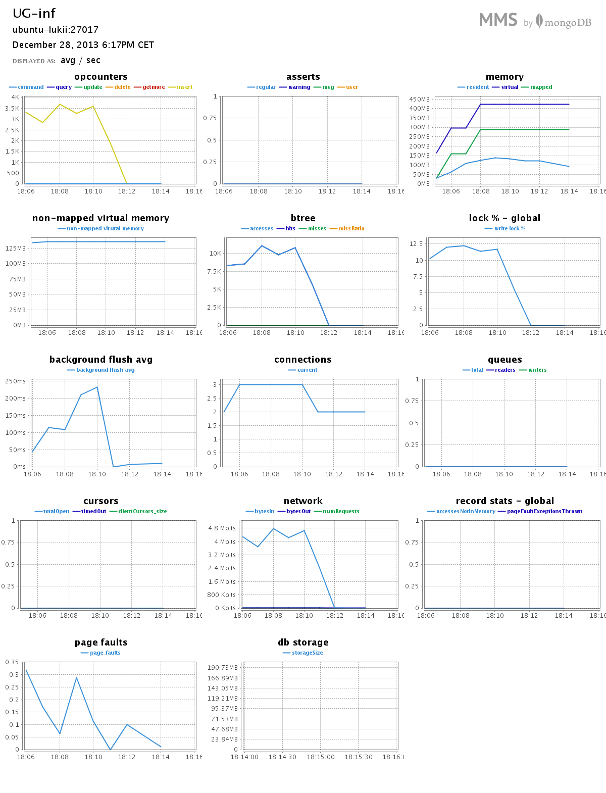
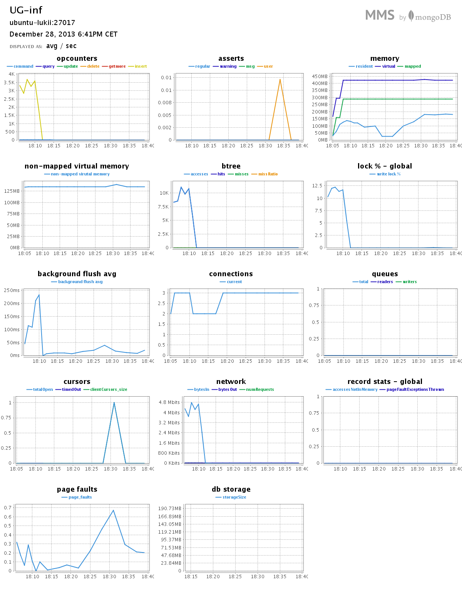
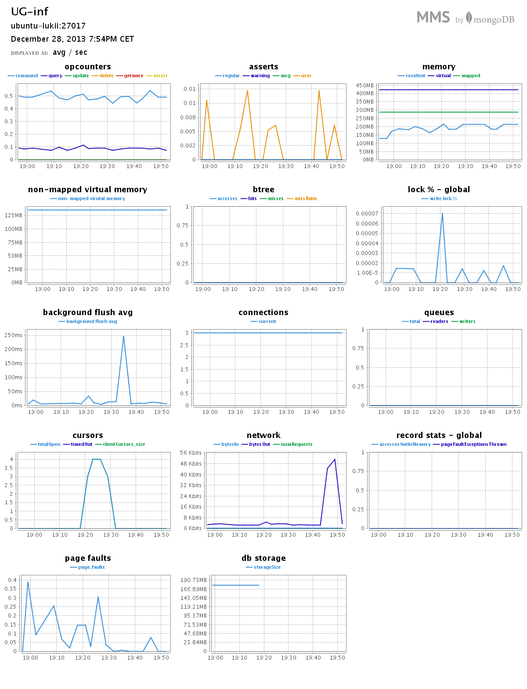

#*Łukasz Paczyński*

##***Zadanie 2***

###Spis treści:

* [Dane](#dane)
* [MongoDB](#mongo)
    * [Import](#mongo-import)
    * [Agregacja 1](#mongo-agregacja-1)
    * [Agregacja 2](#mongo-agregacja-2)
* [Elasticsearch](#elasticsearch)
    * [Import](#elasticsearch-import)
    * [Aggregacja 1](#elasticsearch-agregacja-1)
    * [Aggregacja 2](#elasticsearch-agregacja-2)


#Dane

Dane zwierają listę pracowników w pewnej firmie. Baza danych posiada imię i nazwisko danego pracownika, jego datę zatrudnienia, emaila oraz dział do którego dany pracownik należy.

Przykładowy rekord:

```json
{
	"_id" : ObjectId("52bf04f94afe036f3eaad5cd"),
	"Names" : "Eagan Morrow",
	"Date" : "July 31st, 2012",
	"Email" : "Fusce@auguescelerisque.co.uk",
	"Department" : "Payroll"
}

```
```js
db.people.count()
1000000
```

#Mongo

##Mongo import
Bazę zaimportowałem następująco:
```sh
time mongoimport --type csv --db nosql  -c people --file database.csv –headerline
```
Rezultat:
```sh
2013-12-28T17:53:36.858+0100 imported 1000000 objects

real	4m41.732s
user	0m38.812s
sys	    1m52.008s
```

<h2>MMS importu</h2>



#Mongo: Agregacja 1
<h5>Ile osób należy do danego działu w firmie.</h5>

```sh
db.people.aggregate({
  $group: {
    _id: "$Department",
    osob_w_dziale: {
      $sum: 1
    }
  }
})
```

Rezultat:
```json
{
	"result" : [
		{
			"_id" : "Legal Department",
			"osob_w_dziale" : 64562
		},
		{
			"_id" : "Quality Assurance",
			"osob_w_dziale" : 65803
		},
		{
			"_id" : "Customer Service",
			"osob_w_dziale" : 67752
		},
		{
			"_id" : "Research and Development",
			"osob_w_dziale" : 68359
		},
		{
			"_id" : "Public Relations",
			"osob_w_dziale" : 70737
		},
		{
			"_id" : "Finances",
			"osob_w_dziale" : 65423
		},
		{
			"_id" : "Human Resources",
			"osob_w_dziale" : 66224
		},
		{
			"_id" : "Media Relations",
			"osob_w_dziale" : 66849
		},
		{
			"_id" : "Payroll",
			"osob_w_dziale" : 67680
		},
		{
			"_id" : "Asset Management",
			"osob_w_dziale" : 66343
		},
		{
			"_id" : "Tech Support",
			"osob_w_dziale" : 63289
		},
		{
			"_id" : "Advertising",
			"osob_w_dziale" : 65610
		},
		{
			"_id" : "Customer Relations",
			"osob_w_dziale" : 66716
		},
		{
			"_id" : "Sales and Marketing",
			"osob_w_dziale" : 66839
		},
		{
			"_id" : "Accounting",
			"osob_w_dziale" : 67814
		}
	],
	"ok" : 1
}
```

<h2>MMS do agregacji:</h2>




#Mongo: Agregacja 2
<h5>Ile osób należy do danej domeny „commodo” w firmie. </h5>

```sh
db.people.aggregate([
  {
    $match: {
      "Email": /@commodo/
    }
  },
  {
    $group: {
      _id: "Email",
      osoby_w_domenie: {
        $sum: 1
      }
    }
  }
])
```

Rezultat:
```json
{
	"result" : [
		{
			"_id" : "Email",
			"osoby_w_domenie" : 3236
		}
	],
	"ok" : 1
}

```

<h2>MMS do agregacji:</h2>



***

#Elasticsearch

##Elasticsearch import
Do MongoDB zaimportowałem bazę w *.CSV, którą poźniej wyexportowałem jako *.json:

```sh
mongoexport -d nosql -c people --out "/home/lukii/databaseEL.json"
```

Następnie pobrałem aplikację JQ, dzięki której mogłem wygenerować przeplatanego jsona:

```sh
jq --compact-output '{ "index" : { "_type" : "employers" } }, .' databaseEL.json > database_EL.json
```

Wygenerowana baza z JQ jest za duża aby móc ją wrzucić do Elasticsearcha, więc trzeba było ją podzielić na mniejsze części:

```sh
split -l 100000 database_EL.json
```

Rozpocząłem import do Elasticsearcha w pętli:

```sh
for i in x*; do curl -s -XPOST localhost:9200/employers/_bulk --data-binary @$i; done
```

#Elasticsearch Agregacja 1
<h5>Wymień wszystkich pracowników którzy zostali zatrudnieni pomiędzy 1995 a 1997 rokiem.</h5>

```json
{
  "query": {
    "bool": {
      "must": [
        {
          "range": {
            "employers.Date": {
              "from": "1995",
              "to": "1997"
            }
          }
        }
      ],
      "must_not": [],
      "should": []
    }
  },
  "from": 0,
  "size": 10,
  "sort": [],
  "facets": {
    
  }
}
```

Rezultat:

```js
104422 hits. 0.951 seconds
```

#Elasticsearch Agregacja 2
<h5>Wyświetl wszystkich pracowników którzy mają na nazwisko „Johns” oraz zostali zatrudnieni w roku 2005.</h5>

```json
{
  "query": {
    "bool": {
      "must": [
        {
          "query_string": {
            "default_field": "employers.Names",
            "query": "Johns"
          }
        },
        {
          "query_string": {
            "default_field": "employers.Date",
            "query": "2005"
          }
        }
      ],
      "must_not": [],
      "should": []
    }
  },
  "from": 0,
  "size": 10,
  "sort": [],
  "facets": {
  }
}
```

Rezultat:

```js
38 hits. 0.523 seconds
```
