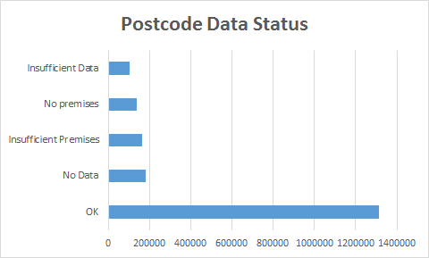
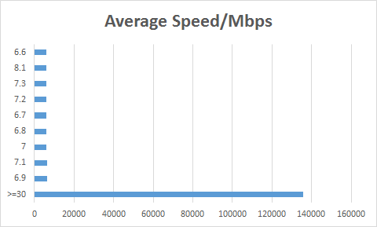
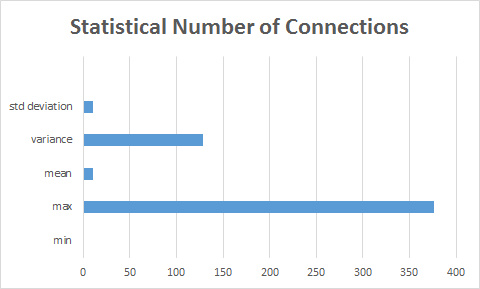
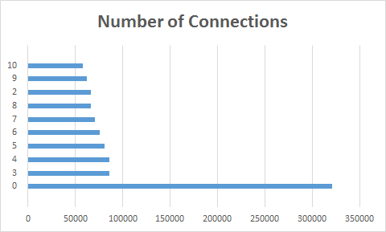

### *Michał Dępczyk*

----

<p>MongoDB shell version: 2.4.7</p>
<p>Elasticsearch version: 0.90.8</p>

# Zadanie 2

Baza: [Broadband coverage](http://data.gov.uk/dataset/broadband-coverage).
Dane przedstawiają dokładne informacje na temat usług szerokopasmowych w zakresie prędkości i dostępności.

##Mongodb

###Import

```
time mongoimport --type csv -c broadband --file Postcode.csv --headerline

Sun Dec 22 21:48:17.078 check 9 1899574
Sun Dec 22 21:48:17.178 imported 1899573 objects

real	1m6.203s
user	0m14.413s
sys	0m1.228s
```
##Agregacja 1
```
db.broadband.aggregate({$group:{_id:"$Postcode Data Status",total:{$sum: 1}}},{$sort:{total:-1}},{$limit:10})
```
###Wynik:
```
{
	"result" : [
		{
			"_id" : "OK",
			"total" : 1311130
		},
		{
			"_id" : "No Data",
			"total" : 183585
		},
		{
			"_id" : "Insufficient Premises",
			"total" : 162613
		},
		{
			"_id" : "No premises",
			"total" : 137197
		},
		{
			"_id" : "Insufficient Data",
			"total" : 105048
		}
	],
	"ok" : 1
}
```
###Wykres:


##Agregacja 2
```
db.broadband.aggregate(
  { $match: { "Postcode Data Status": "OK" } },
  { $group: {_id: "$Average Speed/Mbps", count: {$sum: 1} } },
  { $sort: {count: -1} },
  { $limit: 10}
);
```
###Wynik:
```
{
	"result" : [
		{
			"_id" : ">=30",
			"count" : 135677
		},
		{
			"_id" : 6.9,
			"count" : 6357
		},
		{
			"_id" : 7.1,
			"count" : 6287
		},
		{
			"_id" : 7,
			"count" : 6024
		},
		{
			"_id" : 6.8,
			"count" : 6023
		},
		{
			"_id" : 6.7,
			"count" : 5948
		},
		{
			"_id" : 7.2,
			"count" : 5881
		},
		{
			"_id" : 7.3,
			"count" : 5861
		},
		{
			"_id" : 8.1,
			"count" : 5826
		},
		{
			"_id" : 6.6,
			"count" : 5800
		}
	],
	"ok" : 1
}
```
###Wykres:

----
##Elasticsearch

###Przygotowanie:

Export JSONów z Mongodb.
```
mongoexport -c broadband -o Postcode.json
```
Stworzenie przeplatanych JSONów.
```
jq --compact-output '{ "index" : { "_type" : "broadband" } }, .' Postcode.json > Postcode2.json
```
Podział pliku na mniejsze po 100000 linii.
```
split -l 100000 Postcode2.json
```
###Import plików stworzonych w poprzednim kroku.
```
time for i in x*; do curl -s -XPOST   localhost:9200/data/_bulk --data-binary @$i; done
```
###Wynik:
```
real	13m54.551s
user	0m1.672s
sys	0m8.765s
```
###Liczba zaimportowanych rekordów:
```
curl -XGET 'http://localhost:9200/data/broadband/_count'; echo
```
###Wynik:
```
{"count":1736960,"_shards":{"total":5,"successful":5,"failed":0}}
```
##Agregacja 1
```
curl -X POST "http://localhost:9200/data/_search?pretty=true" -d '{
    "query" : {
        "match_all" : {  }
    },
    "facets" : {
        "Number of Connections" : {
            "statistical" : {
                "field" : "Number of Connections"
            }
        }
    }
}'
```
###Wynik:
```
{
"facets" : {
    "Number of Connections" : {
      "_type" : "statistical",
      "count" : 1736960,
      "total" : 1.9583594E7,
      "min" : 0.0,
      "max" : 376.0,
      "mean" : 11.27463729734709,
      "sum_of_squares" : 4.43119632E8,
      "variance" : 127.99472219941583,
      "std_deviation" : 11.313475248543917
    }
  }
}
```
###Wykres:


##Agregacja 2
```
curl -X POST "http://localhost:9200/data/_search?pretty=true" -d '{
    "query" : {
        "match_all" : {  }
    },
    "facets" : {
        "Number of Connections" : {
            "terms" : {
                "field" : "Number of Connections",
                "size" : 10
            }
        }
    }
}'
```
###Wynik:
```
{
"facets" : {
    "Number of Connections" : {
      "_type" : "terms",
      "missing" : 0,
      "total" : 1736960,
      "other" : 765189,
      "terms" : [ {
        "term" : 0,
        "count" : 320782
      }, {
        "term" : 3,
        "count" : 85979
      }, {
        "term" : 4,
        "count" : 85638
      }, {
        "term" : 5,
        "count" : 80612
      }, {
        "term" : 6,
        "count" : 75694
      }, {
        "term" : 7,
        "count" : 70245
      }, {
        "term" : 8,
        "count" : 66583
      }, {
        "term" : 2,
        "count" : 66294
      }, {
        "term" : 9,
        "count" : 61776
      }, {
        "term" : 10,
        "count" : 58168
      } ]
    }
  }
}
```
###Wykres:

