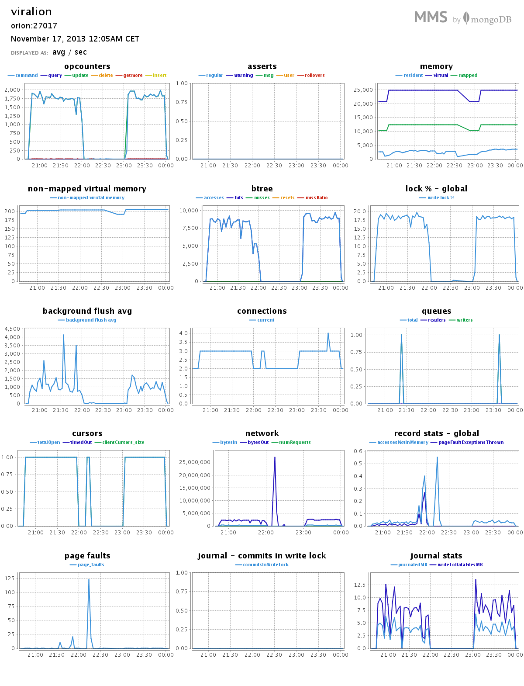

# Marcin Koźmiński #

[TOC]

## Platforma testowa ##

### Procesor ###
```sh
$ cat /proc/cpuinfo | grep 'model name'
model name  : Intel(R) Core(TM) i5-2410M CPU @ 2.30GHz
model name  : Intel(R) Core(TM) i5-2410M CPU @ 2.30GHz
model name  : Intel(R) Core(TM) i5-2410M CPU @ 2.30GHz
model name  : Intel(R) Core(TM) i5-2410M CPU @ 2.30GHz
```

### Pamięć ###
```sh
$ cat /proc/meminfo 
MemTotal:        6020356 kB
MemFree:         2933444 kB
Buffers:          114224 kB
Cached:          1540008 kB
SwapCached:        38116 kB
Active:          1849240 kB
Inactive:         994348 kB
Active(anon):    1148852 kB
Inactive(anon):   162360 kB
Active(file):     700388 kB
Inactive(file):   831988 kB
Unevictable:          32 kB
Mlocked:              32 kB
SwapTotal:       2097148 kB
SwapFree:        1905612 kB
Dirty:                76 kB
Writeback:             0 kB
AnonPages:       1162132 kB
Mapped:           159376 kB
Shmem:            121856 kB
Slab:             138744 kB
SReclaimable:     104232 kB
SUnreclaim:        34512 kB
KernelStack:        3672 kB
PageTables:        25864 kB
NFS_Unstable:          0 kB
Bounce:                0 kB
WritebackTmp:          0 kB
CommitLimit:     5107324 kB
Committed_AS:    4298784 kB
VmallocTotal:   34359738367 kB
VmallocUsed:      354664 kB
VmallocChunk:   34359380956 kB
HardwareCorrupted:     0 kB
AnonHugePages:         0 kB
HugePages_Total:       0
HugePages_Free:        0
HugePages_Rsvd:        0
HugePages_Surp:        0
Hugepagesize:       2048 kB
DirectMap4k:       62980 kB
DirectMap2M:     6137856 kB
```

### System ###
```clean
$ uname -a
Linux orion 3.11.0-13-generic #20-Ubuntu SMP Wed Oct 23 07:38:26 UTC 2013 x86_64 x86_64 x86_64 GNU/Linux
```

### MongoDB ###
```clean
$ mongo --version
MongoDB shell version: 2.4.8
```

### Storage ###
Skrypty były trzymane na systemowej partycji ext4 Linuksa. Natomiast pliki z danymi, ze względu na ich duży rozmiar, na partycji "wymiany danych" z systemem plików NTFS podmontowanej za pomocą ntfs-3g.

## Zadania ##

### Zadanie 1a ###

Zaimportować bazę `Train.csv` to lokalnej bazy Mongo.

#### Przygotowanie pliku CSV ####
Należało poprawić znaki końca linii występujące w pliku w wersji Windowsowej (`\r\n`) na Uniksową (`\n`). Plik `Train.csv` został potraktowany skryptem `2unix.sh`.
```sh
$ time ./scripts/mkozminski/2unix.sh data/mkozminski/Train.csv data/mkozminski/Train_prepared.csv 

real    16m39.549s
user    1m0.647s
sys     1m58.653s
```

#### Import ####
```sh
$ time mongoimport -c train --type csv --headerline --file data/mkozminski/Train_prepared.csv 
connected to: 127.0.0.1
Mon Nov 11 16:18:43.004         Progress: 40216027/7253917400   0%
Mon Nov 11 16:18:43.004             33200   11066/second
Mon Nov 11 16:18:46.005         Progress: 105538871/7253917400  1%
Mon Nov 11 16:18:46.005             87800   14633/second
...
Mon Nov 11 16:26:32.003         Progress: 7180166991/7253917400 98%
Mon Nov 11 16:26:32.004             5972900 12654/second
Mon Nov 11 16:26:35.055         Progress: 7241712381/7253917400 99%
Mon Nov 11 16:26:35.055             6024100 12682/second
Mon Nov 11 16:26:36.086 check 9 6034196
Mon Nov 11 16:26:36.348 imported 6034195 objects

real    7m56.529s
user    1m38.683s
sys     0m9.266s
```
Średnia prędkość ~12663 rekordów na sekundę.

##### Przemiał MongoDB #####


#### Rozmiar bazy danych ####
Rozmiar bazy danych przed importem:
```sh
$ du -hs /var/lib/mongodb/
3,1G    /var/lib/mongodb/
```

Rozmiar po imporcie
```sh
$ du -hs /var/lib/mongodb/
16G     /var/lib/mongodb/
```

### Zadanie 1b ###
Sprawdzić czy zaimportowano właściwą ilość rekordów.
```sh
$ mongo
MongoDB shell version: 2.4.8
connecting to: test
> db.train.count()
6034195
```
### Zadanie 1c ###
Zamienić string zawierający tagi na tablicę napisów z tagami następnie zliczyć wszystkie tagi i wszystkie różne tagi. Napisać program, który to zrobi korzystając z jednego ze sterowników.

#### Zamiana tagów ####
Aktualnie rekord w bazie wygląda następująco:
```json
{
    "_id" : 1,
    "title" : "How to check if an uploaded file is an image without mime type?",
    "body" : "<p>I'd like to check if an uploaded file is an image file (e.g png, jpg, jpeg, gif, bmp) or another file. The problem is that I'm using Uploadify to upload the files, which changes the mime type and gives a 'text/octal' or something as the mime type, no matter which file type you upload.</p>  <p>Is there a way to check if the uploaded file is an image apart from checking the file extension using PHP?</p> ",
    "tags" : "php image-processing file-upload upload mime-types"
}
```

Uruchomienie skryptu do zamiany tagów:
```sh
$ python scripts/mkozminski/train_tags.py 
Transforming...
Done.

real    67m14.157s
user    21m43.841s
sys     0m25.415s
```

Po zamianie tagów wygląda następująco
```json
{
    "_id" : 1,
    "body" : "<p>I'd like to check if an uploaded file is an image file (e.g png, jpg, jpeg, gif, bmp) or another file. The problem is that I'm using Uploadify to upload the files, which changes the mime type and gives a 'text/octal' or something as the mime type, no matter which file type you upload.</p>  <p>Is there a way to check if the uploaded file is an image apart from checking the file extension using PHP?</p> ",
    "tags" : [
        "php",
        "image-processing",
        "file-upload",
        "upload",
        "mime-types"
    ],
    "title" : "How to check if an uploaded file is an image without mime type?"
}
```

#### Przemiał MongoDB ####
Interesujące nas dane znajdują się po drugim restarcie bazy (czerwona linia).
