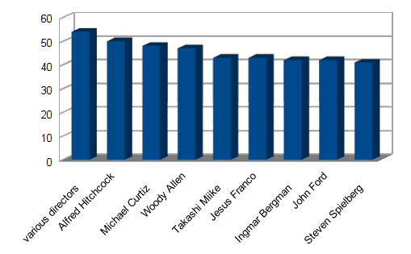
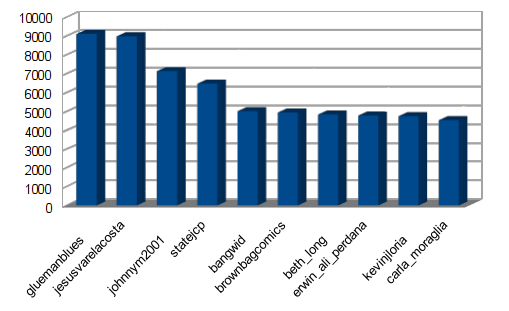
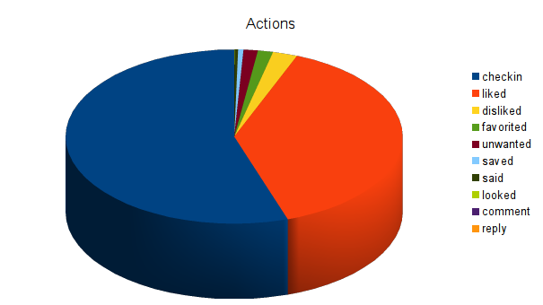
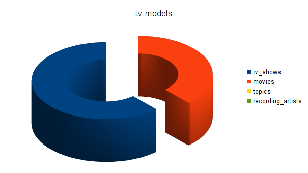

#Zadanie 2

##Dane

[GetGlue and Timestamped Event Data](http://getglue-data.s3.amazonaws.com/getglue_sample.tar.gz) (ok. `11 GB`, `19 831 300` json-ów, próbka 100 jsonów [getglue101](https://github.com/nosql/aggregations-2/blob/master/data/wbzyl/getglue101.json)). Są to dane z [IMDB](http://www.imdb.com/) z lat 2007–2012, tylko filmy i przedstawienia TV. 

Przykładowy dokument `json`:

```json
{
  "_id": ObjectId("5276918832cf3c2b84540440"),
  "comment": "",
  "modelName": "movies",
  "displayName": "",
  "title": "The Dark Knight",
  "timestamp": "2008-10-28T16:47:31Z",
  "image": "http://ia.media-imdb.com/images/...@@._V1._SX94_SY140_.jpg",
  "userId": "sippey",
  "private": "false",
  "director": "Christopher Nolan",
  "source": "http://www.imdb.com/title/tt0468569/",
  "version": "1",
  "link": "http://www.imdb.com/title/tt0468569/",
  "lastModified": "2011-12-16T19:39:33Z",
  "action": "Liked",
  "lctitle": "the dark knight",
  "objectKey": "movies/dark_knight/christopher_nolan"
}
```
#MongoDB

##Import

Po ściągnieciu danych musimy je rozpakować poleceniem:
```sh
tar -xvf getglue_sample.tar.gz
```

Plik ten od razu nadaje się do importu. Polecenie `time` mierzymy ile czasu zajął import.

```sh
time mongoimport -d imdb -c imdb --type json --file getglue_sample.json
```

###Wyniki i Czasy

```sh
Sat Dec 28 12:12:54.327 check 9 19831300
Sat Dec 28 12:12:54.434 imported 19831300 objects

real  10m56.616s
user  4m59.171s
sys 0m13.901s
```

Co daje nam średnio `~30 202` insertów do bazy na sekundę.

##Agregacje

###Agregacja 1

Agragacja ma policzyć i wypisac 10 reżyserów którzy mają najwiekszą liczbę filmów.

####Kod Agregacji

```js
coll.aggregate( 
  { $match: { "modelName": "movies"} },
  { $group: {_id: {"dir": "$director", id: "$title"}, count: {$sum: 1}} },
  { $group: {_id: "$_id.dir" , count: {$sum: 1}} },
  { $sort: {count: -1} },
  { $limit: 10} );
```

####Wynik

```json
{
  "result" : [
    { "_id" : "not available",      "count" : 1474  },
    { "_id" : "various directors",  "count" : 54    },
    { "_id" : "alfred hitchcock",   "count" : 50    },
    { "_id" : "michael curtiz",     "count" : 48    },
    { "_id" : "woody allen",        "count" : 47    },
    { "_id" : "takashi miike",      "count" : 43    },
    { "_id" : "jesus franco",       "count" : 43    },
    { "_id" : "ingmar bergman",     "count" : 42    },
    { "_id" : "john ford",          "count" : 42    },
    { "_id" : "steven spielberg",   "count" : 41    }
  ],
  "ok" : 1
}
```

####Czasy

```sh
real  1m47.725s
user  0m0.044s
sys 0m0.008s
```

####Wykres


###Agregacja 2

Agregacja powinna policzyć ilu użytkowników wykonało akcję `Liked` i podać 10 najbardziej likeujących użytkowników.

####Kod Agragacji

```js
coll.aggregate(
  { $match: { "modelName": "movies" || "tv_shows", "action": "Liked"}},
  { $group: {_id: "$userId", count: {$sum: 1}} },
  { $sort: {count: -1} },
  { $limit: 10}
);
```

####Wynik

```sh
number of users who liked something: 96355
```
####Czasy

```sh
real  1m49.286s
user  0m0.160s
sys   0m0.040s
```

####Wykres


#Elasticsearch

##Przygotowanie danych do importu

Do importu wszystkich danych do ES użyjemy `Bulk Api', które wymaga JSON'ow o określonej strukturze:

```js
{ "index": { "_type": "type name" } } //nazwa typu, do którego chcemy dodać dokument
{ "field": "content" ... } //dokument
```
Do wygenerowania odpowiedniego pliku JSON'owego użyjemy programu `jq`.

```sh
time cat getglue_sample.json | jq --compact-output '{ "index": { "_type": "imdb" } }, .' > getglue_sample.bulk
``` 

####Wynik

Otrzymujemy przeplatane JSON'y:

```json
{
    "index": {
        "_type": "imdb"
    }
}
{
    objectKey: tv_shows/popeye_sailor
    hideVisits: false
    modelName: tv_shows
    displayName: Colin Gillespie
    title: Popeye the Sailor
    timestamp: 2010-11-11T03:06:04Z
    image: http://cdn-0.nflximg.com/us/boxshots/large/70071820.jpg
    userId: Koalanuts
    visitCount: 1
    comment:
    private: false
    source: glue://users/kimberly_huckaby/tv_shows
    version: 2
    link: http://www.netflix.com/Movie/70071820
    lastModified: 2011-12-16T22:45:49Z
    action: Liked
    lctitle: popeye the sailor        
}
```
####Czasy

```sh
real  41m48.066s
user  27m51.592s
sys   4m55.726s
```

##Import

Próba zaimportowania całego pliku do bazy zakończyła się otrzymaniem komunikatu `out of memory`.

Aby zaimportować plik do bazy podzielimy go na mniejsze części.

```sh
split -l 200000 getglue_sample.bulk
```
A nastepnie importujemy pliki w pętli:

```sh
time for i in x*; do curl -s -XPOST localhost:9200/data/_bulk --data-binary @$i > /dev/null; echo $i; done
```
####Wynik

Sprawdzamy ile obiektów zostało zapisanych w bazie.

```sh
curl -XGET 'http://localhost:9200/data/imdb/_count' ; echo
```

```json
{"count":19766542,"_shards":{"total":1,"successful":1,"failed":0}}
```

Zaimportowało się `19 766 542`. `64 758` obiektów zostało odrzuconych z powodu złego formatu daty.

####Czasy

Dzięki przekierowaniu logu do /dev/null czas importu bazy skrócił się o 70 minut. 

```sh
real  60m16.952s
user  0m2.600s
sys 0m13.137s
```

##Agregacje

Do wykonania aggregacji użyjemy `wyszukiwania facetowego`

Do wykonywania zapytań użyjemy programu `curl`:

###Agregacja 1

Agregacja powinna policzyć ile razy wystapiła dana akcja.

####Kod agregacji

```json
{
    "query": {
        "match_all": {}
    },
    "facets": {
        "action": {
            "terms": {
                "field" : "action"
            }
        }
    }
}
```
####Wynik

```json
"facets": {
    "action": {
      "_type": "terms",
      "missing": 40,
      "total": 19766502,
      "other": 1,
      "terms": [
        {
          "term": "checkin",
          "count": 10902500
        },
        {
          "term": "liked",
          "count": 7662632
        },
        {
          "term": "disliked",
          "count": 468969
        },
        {
          "term": "favorited",
          "count": 287643
        },
        {
          "term": "unwanted",
          "count": 270326
        },
        {
          "term": "saved",
          "count": 101917
        },
        {
          "term": "said",
          "count": 67397
        },
        {
          "term": "looked",
          "count": 2971
        },
        {
          "term": "comment",
          "count": 2131
        },
        {
          "term": "reply",
          "count": 15
        }
      ]
    }
  }
```
####Czasy

```sh
real  0m0.501s
user  0m0.000s
sys   0m0.008s
```

####Wykres


##Agregacja 2

Agregacja ma policzyć ile jakiego typu jest przedstawień.

####Kod Agregacji

```json
{
    "query": {
        "match_all": {}
    },
    "facets": {
        "modelName": {
            "terms": {
                "field" : "modelName",
                "size": "10"
            }
        }
    }
}
```

####Wynik

```json
"facets": {
    "modelName": {
      "_type": "terms",
      "missing": 56,
      "total": 19766486,
      "other": 0,
      "terms": [
        {
          "term": "tv_shows",
          "count": 12208046
        },
        {
          "term": "movies",
          "count": 7558406
        },
        {
          "term": "topics",
          "count": 23
        },
        {
          "term": "recording_artists",
          "count": 11
        }
      ]
    }
  }
}
```

####Czasy

```sh
real  0m2.261s
user  0m0.000s
sys   0m0.008s

```

####Wykres

