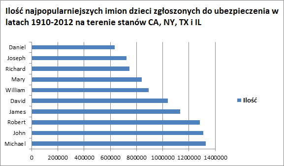
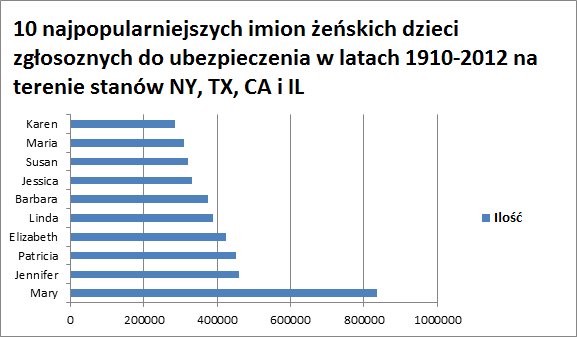
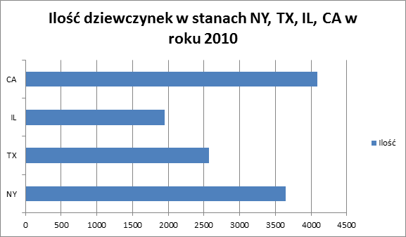
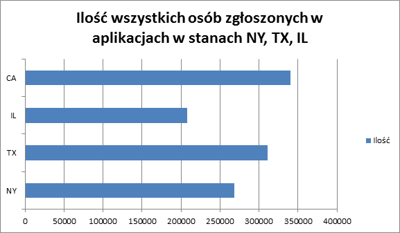
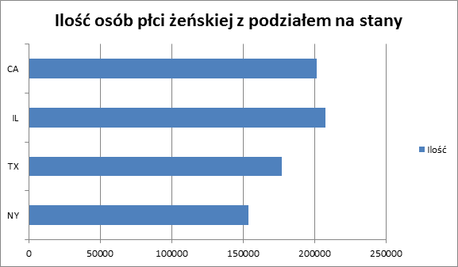

[Zadanie 1] (/docs/tsott.md)

<h1> Zadanie 2 <h1>

Dane zostały pobrane ze strony catalog.data.gov z USA i dotyczą popularności imion żeńskich i męskich osób z aplikacji w systemie ubezpieczeń społecznych w czterech stanach USA (CA, TX, IL, NY) na przestrzeni lat 1910-2012.

<br/>

<h2> MongoDB - import danych </h2>

```sh
echo %time%
18:56:08,99
mongoimport -d babies -c names --type csv --headerline --file names.csv
...
echo %time%
18:58:35,56
```


Sprawdzenie liczby rekordów:

```sh
C:\mongodb\bin>mongo
MongoDB shell version: 2.4.3
connecting to: test
> use babies
switched to db babies
> db.names.count()
1128181
```

Przykładowy rekord:

```sh
> db.names.findOne()
{
        "_id" : ObjectId("52bb1c5d16752993c0c7836e"),
        "state" : "CA",
        "sex" : "F",
        "year_of_birth" : 1910,
        "name" : "Mary",
        "number" : 295
}
```

<h2>MongoDB- agregacje</h2>
10 najpopularniejszych imion w latach 1910-2013

```sh
echo %time%
20:33:41,32
mongo babies aggregation1.js
...
echo %time%
20:33:49,03
```

Kod skryptu aggregation1.js:
```sh
var coll = db.names;

var result = coll.aggregate(
 
 {$group : 
 { _id : { _id : "$name" }, 
 nadan : { $sum : "$number" } } }, 
 { $sort : {nadan : -1 } }, 
 { $limit : 10 } 
 )

print("Names: " + result.result.length);

printjson(result);
```

Wynik:
```sh
C:\mongodb\bin>mongo babies aggregation1.js
MongoDB shell version: 2.4.3
connecting to: babies
Names: 10
{
        "result" : [
                {
                        "_id" : {
                                "_id" : "Michael"
                        },
                        "nadan" : 1327668
                },
                {
                        "_id" : {
                                "_id" : "John"
                        },
                        "nadan" : 1308670
                },
                {
                        "_id" : {
                                "_id" : "Robert"
                        },
                        "nadan" : 1282317
                },
                {
                        "_id" : {
                                "_id" : "James"
                        },
                        "nadan" : 1132978
                },
                {
                        "_id" : {
                                "_id" : "David"
                        },
                        "nadan" : 1037278
                },
                {
                        "_id" : {
                                "_id" : "William"
                        },
                        "nadan" : 892236
                },
                {
                        "_id" : {
                                "_id" : "Mary"
                        },
                        "nadan" : 839123
                },
                {
                        "_id" : {
                                "_id" : "Richard"
                        },
                        "nadan" : 746056
                },
                {
                        "_id" : {
                                "_id" : "Joseph"
                        },
                        "nadan" : 725289
                },
                {
                        "_id" : {
                                "_id" : "Daniel"
                        },
                        "nadan" : 634562
                }
        ],
        "ok" : 1
}
```

Najpopularniejsze imiona w latach 1910-2013: <br/>
1.Michael - 1327668  <br/>
2.John - 1308670  <br/>
3.Robert - 1282317  <br/>
4.James - 1132978  <br/>
5.David - 1037278  <br/>
6.William - 892236  <br/>
7.Mary - 839123  <br/>
8.Richard - 746056  <br/>
9.Joseph - 725289  <br/>
10.Daniel - 634562  <br/>




10 najpopularniejszych imion żeńskich w latach 1910-2013

```sh
echo %time%
23:06:20,55
mongo babies aggregation2.js
...
echo %time%
23:06:28,93
```

Kod skryptu aggregation2.js:
```sh
var coll = db.names;

var result = coll.aggregate(
 {$match: {sex: "F"}},
 {$group : { _id : { _id : "$name" }, nadan : { $sum : "$number" } } }, 
 { $sort : {nadan : -1 } }, 
 { $limit : 10 } 
 )

print("Names: " + result.result.length);

printjson(result);
```

Wynik:
```sh
C:\mongodb\bin>mongo babies aggregation2.js
MongoDB shell version: 2.4.3
connecting to: babies
Names: 10
{
        "result" : [
                {
                        "_id" : {
                                "_id" : "Mary"
                        },
                        "nadan" : 836260
                },
                {
                        "_id" : {
                                "_id" : "Jennifer"
                        },
                        "nadan" : 459556
                },
                {
                        "_id" : {
                                "_id" : "Patricia"
                        },
                        "nadan" : 451085
                },
                {
                        "_id" : {
                                "_id" : "Elizabeth"
                        },
                        "nadan" : 424121
                },
                {
                        "_id" : {
                                "_id" : "Linda"
                        },
                        "nadan" : 389625
                },
                {
                        "_id" : {
                                "_id" : "Barbara"
                        },
                        "nadan" : 374610
                },
                {
                        "_id" : {
                                "_id" : "Jessica"
                        },
                        "nadan" : 331876
                },
                {
                        "_id" : {
                                "_id" : "Susan"
                        },
                        "nadan" : 321484
                },
                {
                        "_id" : {
                                "_id" : "Maria"
                        },
                        "nadan" : 309544
                },
                {
                        "_id" : {
                                "_id" : "Karen"
                        },
                        "nadan" : 285154
                }
        ],
        "ok" : 1
}
```

Najpopularniejsze imiona żeńskie w latach 1910-2013: <br/>
1.Mary - 836260  <br/>
2.Jennifer - 459556  <br/>
3.Patricia - 451085  <br/>
4.Elizabeth - 424121  <br/>
5.Linda - 389625  <br/>
6.Barbara - 374610  <br/>
7.Jessica - 331876  <br/>
8.Susan - 321484  <br/>
9.Maria - 309544  <br/>
10.Karen - 285154  <br/>




Ilość dziewczynek w roku 2010 z podziałem na stany

```sh
echo %time%
19:38:07,81
mongo babies aggregation3.js
...
echo %time%
19:38:22,85
```

Kod skryptu aggregation3.js:
```sh
var coll = db.names;

var result = coll.aggregate( 
{ $match:{sex : "F" } },
 { $match:{ year_of_birth : 2010} },
  { $group: { _id: "$state", number: { $sum: 1 } } }
  
)

print(result.result.length);

printjson(result);
```

Wynik:
```sh
C:\mongodb\bin>mongo babies aggregation3.js
MongoDB shell version: 2.4.3
connecting to: babies
{
        "result" : [
                {
                        "_id" : "TX",
                        "number" : 3645
                },
                {
                        "_id" : "NY",
                        "number" : 2574
                },
                {
                        "_id" : "IL",
                        "number" : 1952
                },
                {
                        "_id" : "CA",
                        "number" : 4092
                }
        ],
        "ok" : 1
}
```
Ilość dziewczynek z roku 2010 z podziałem na stany <br/>
1.TX - 3645  <br/>
2.NY - 2574  <br/>
3.IL - 1952  <br/>
4.CA - 4092  <br/>




<h2> Eksport danych z pliku csv do json </h2>

```sh
C:\mongodb\bin>mongoexport -d babies -c names -o names.json
connected to: 127.0.0.1
exported 1128181 records
```
Stworzenie prawidłowego jsona

```sh
time jq --compact-output '{ "index" : { "_type" : "babies" } }, .' names.json > names_es.json

real	2m46.336s
user	1m54.551s
sys	0m4.456s
```

Przykładowy json:
```sh
{
        "index": {
                "_type":"babies"
        }
}
{
        "number":295,
        "name":"Mary",
        "year_of_birth":1910,
        "sex":"F",
        "state":"CA",
        "_id":{"$oid":"52bb1c5d16752993c0c7836e"
}
}
```

Import do bazy nie działa, plik jest prawdopodobnie zbyt duży, aby zaimportować go za jendym razem. Plik należy podzielić.
```sh
time split -l 200000 names.bulk 
...
real	0m2.141s
user	0m0.057s
sys	0m0.195s
```

Wynik:
```sh
time for i in x*; do curl -s -XPOST   localhost:9200/babies/_bulk --data-binary @$i > /dev/null; echo $i; done
xaa
xab
xac
xad
xae
xaf
xag
xah
xai
xaj
xak
xal

real	1m47.089s
user	0m0.176s
sys	0m0.371s
```

Sprawdzamy co się dodało.
```sh
curl -s -XGET localhost:9200/babies/names/_count; echo
{"count":1128181,"_shards":{"total":1,"successful":1,"failed":0}}
```

<h2>Elasticsearch- agregacje</h2>

Ilość wszystkich osób łącznie z podziałem na stany.

```sh
{
  "query": {
    "match_all": {}
  },
  "facets": {
    "state": {
      "terms": {
        "field": "state"
      }
    }
  }
}
```

Wynik:
```sh
 {
          "count": 340360,
          "term": "ca"
        },
        {
          "count": 311433,
          "term": "tx"
        },
        {
          "count": 268541,
          "term": "ny"
        },
        {
          "count": 207847,
          "term": "il"
        }

real	0m0.533s
user	0m0.008s
sys	0m0.014s
```

Ilość wszystkich osób z podziałem na stany: <br/>
1. California - 340360 <br/>
2. Texas - 311433 <br/>
3. New York - 268541 <br/>
4. Illinois - 207847 <br/>




Ilość dziewczynek w danym stanie.

```sh
{
  "query": {
    "match": {
      "sex": "F"
    }
  },
  "facets": {
    "state": {
      "terms": {
        "field": "state"
      }
    }
  }
```

Wynik:
```sh
 "terms": [
        {
          "count": 201481,
          "term": "ca"
        },
        {
          "count": 177354,
          "term": "tx"
        },
        {
          "count": 153945,
          "term": "ny"
        },
        {
          "count": 119739,
          "term": "il"
        }
      ]
      
real	0m0.533s
user	0m0.008s
sys	0m0.014s
```

Ilość dziewczynek z podziałem na stany: <br/>
1. California - 201481 <br/>
2. Texas - 177354 <br/>
3. New York - 153945 <br/>
4. Illinois - 119739 <br/>


