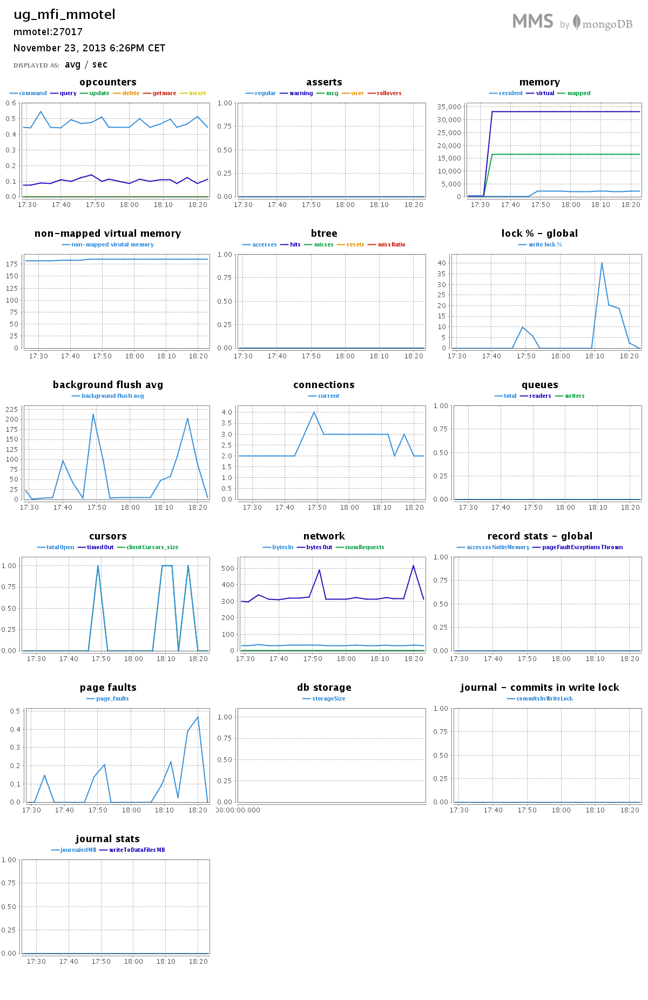

#*Mateusz Motel*

##***Zadanie 2***

###Spis treści:

* [Dane](#dane)
* [MongoDB](#mongodb)
    * [Import](#import)
    * [Aggregacje](#aggregacje)
        * [Aggregacja 1](#aggregacja-1)
        * [Aggregacja 2](#aggregacja-2)
    * [Wyniki z MMS](#wyniki-z-mongodb-management-service)
* Elasticsearch
    * Przygotowanie danych
    * Import
    * Aggregacje
        * Aggregacja 1
        * Aggregacja 2

***

#Dane

[GetGlue and Timestamped Event Data](http://getglue-data.s3.amazonaws.com/getglue_sample.tar.gz) (ok. `11 GB`, `19 831 300` json-ów, próbka 100 jsonów [getglue101](https://github.com/nosql/aggregations-2/blob/master/data/wbzyl/getglue101.json)). Są to dane z [IMDB](http://www.imdb.com/) z lat 2007–2012, tylko filmy i przedstawienia TV. 

Przykładowy dokument `json`:

```json
{
  "_id": ObjectId("5276918832cf3c2b84540440"),
  "comment": "",
  "modelName": "movies",
  "displayName": "",
  "title": "The Dark Knight",
  "timestamp": "2008-10-28T16:47:31Z",
  "image": "http://ia.media-imdb.com/images/...@@._V1._SX94_SY140_.jpg",
  "userId": "sippey",
  "private": "false",
  "director": "Christopher Nolan",
  "source": "http://www.imdb.com/title/tt0468569/",
  "version": "1",
  "link": "http://www.imdb.com/title/tt0468569/",
  "lastModified": "2011-12-16T19:39:33Z",
  "action": "Liked",
  "lctitle": "the dark knight",
  "objectKey": "movies/dark_knight/christopher_nolan"
}
```

***

#MongoDB

##Import

Po ściągnięciu danych rozkapowujemy je:

```sh
tar -xf getglue_sample.tar.gz
```

Rozpakowany plik nadaje się do importu. Używając polecenia `time` mierzymy czas import'u.

```sh
time mongoimport -d imdb -c imdb --type json --file getglue_sample.json
```

###Wynik

```sh
connected to: 127.0.0.1
Sun Nov 17 10:25:55.008     Progress: 20335036/11454208342  0%
Sun Nov 17 10:25:55.008       34100 11366/second
...
Sun Nov 17 10:45:55.167     Progress: 11429777869/11454208342 99%
Sun Nov 17 10:45:55.167       19788300  16449/second
Sun Nov 17 10:45:57.241 check 9 19831300
Sun Nov 17 10:45:57.682 imported 19831300 objects
```

###Czasy

```sh
real  20m5.670s
user  8m56.804s
sys   0m29.428s
```

W ciągu `20m5.670s` do bazy zaimportowało się `19 831 300` obiektów. Co średnio daje `~16 457` insertów do bazy na sekundę.

###Sprawdzenie

```js
mongo
MongoDB shell version: 2.4.8
connecting to: test
> use imdb
switched to db imdb
> db.imdb.count()
19831300
```

***

##Aggregacje

###Aggregacja 1

***Ile jest różnych akcji?***

Aggregacja ma policzyć ile jest różnych akcji oraz ile razy każda z nich wystąpiła.

####Kod aggregacji

```js
coll.aggregate(
  { $group: {_id: "$action", count: {$sum: 1}} },
  { $sort: {count: -1} }
);
```
Kod skryptu: [tutaj](../..//scripts/mmotel/2-mongo/agg-1.js).

####Wynik

```sh
MongoDB shell version: 2.4.8
connecting to: imdb
actions: 12
```

```json
{
  "result" : [
    { "_id" : "Checkin",      "count" : 10958039 },
    { "_id" : "Liked",        "count" : 7664733  },
    { "_id" : "Disliked",     "count" : 469093   },
    { "_id" : "Favorited",    "count" : 288096   },
    { "_id" : "Unwanted",     "count" : 270330   },
    { "_id" : "Saved",        "count" : 101944   },
    { "_id" : "Said",         "count" : 73887    },
    { "_id" : "Looked",       "count" : 2972     },
    { "_id" : "Comment",      "count" : 2150     },
    { "_id" : null,           "count" : 40       },
    { "_id" : "Reply",        "count" : 15       },
    { "_id" : "LikedComment", "count" : 1        }
  ],
  "ok" : 1
}
```

####Czasy

```sh
real  4m21.954s
user  0m0.048s
sys   0m0.012s
```

####Wykres


***

###Aggregacja 2

***Jakie jest 10 najpopularniejszych filmów i przedstawień TV?***

Aggregacja powinna wybrać filmy i przedstawienia TV a następnie policzyć ile razy każde z nich wystąpiło.

####Kod aggregacji

```js
coll.aggregate(
  { $match: { "modelName": "movies" || "tv_shows"  } },
  { $group: {_id: "$title", count: {$sum: 1} } },
  { $sort: {count: -1} },
  { $limit: 10}
);
```

Kod skryptu: [tutaj](../..//scripts/mmotel/2-mongo/agg-2.js).

####Wynik

```sh
MongoDB shell version: 2.4.8
connecting to: imdb
```

```json
{
  "result" : [
    { "_id" : "The Twilight Saga: Breaking Dawn Part 1",       "count" : 87521 },
    { "_id" : "The Hunger Games",                              "count" : 79340 },
    { "_id" : "Marvel's The Avengers",                         "count" : 64356 },
    { "_id" : "Harry Potter and the Deathly Hallows: Part II", "count" : 33680 },
    { "_id" : "The Muppets",                                   "count" : 29002 },
    { "_id" : "Captain America: The First Avenger",            "count" : 28406 },
    { "_id" : "Avatar",                                        "count" : 23238 },
    { "_id" : "Thor",                                          "count" : 23207 },
    { "_id" : "The Hangover",                                  "count" : 22709 },
    { "_id" : "Titanic",                                       "count" : 20791 }
  ],
  "ok" : 1
}
```

####Czasy

```sh
real  4m9.687s
user  0m0.048s
sys   0m0.016s
```

####Wykres


***

##Wyniki z MongoDB Management Service

####Import


####Aggregacja 1



####Aggregacja 2


***
