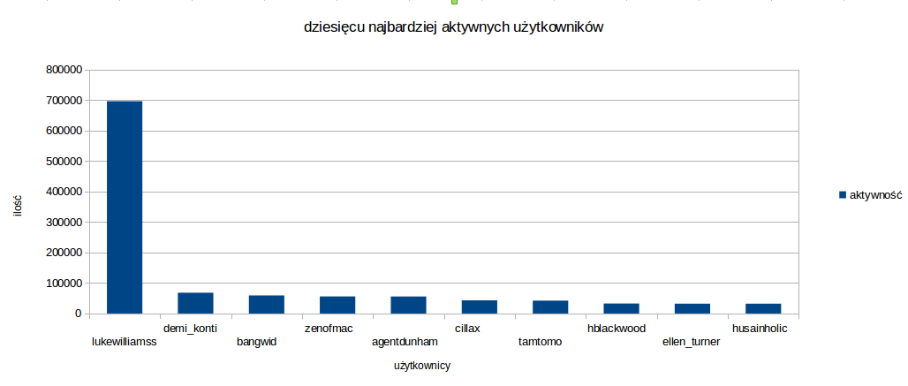
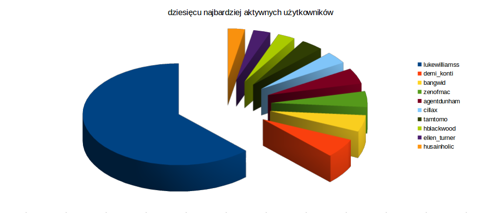
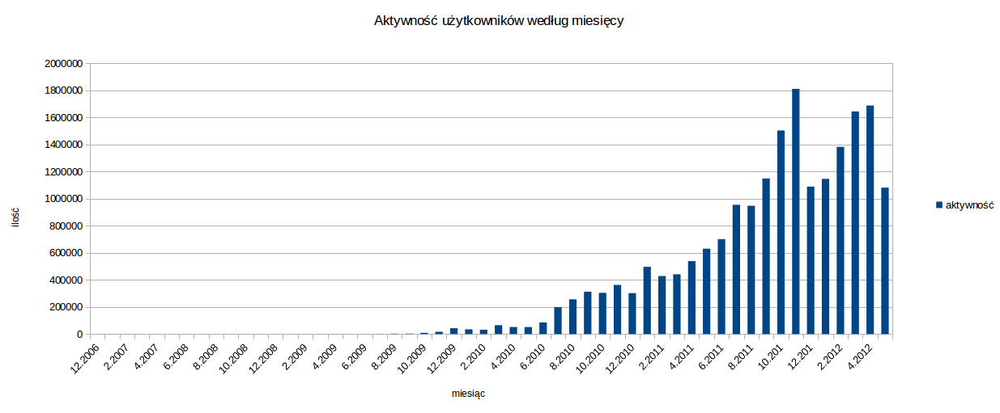
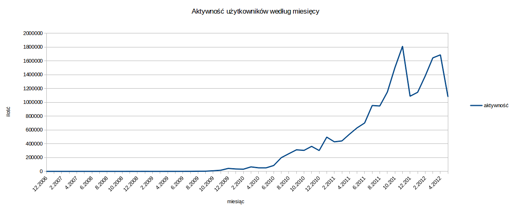

#*Mateusz Motel*

##***Zadanie 2***

###Spis treści:

* [Dane](#dane)
* [MongoDB](#mongodb)
    * [Import](#mongodb-import)
    * [Aggregacje](#mongodb-aggregacje)
        * [Aggregacja 1](#mongodb-aggregacja-1)
        * [Aggregacja 2](#mongodb-aggregacja-2)
    * [Wyniki z MMS](#mongodb-wyniki-z-mongodb-management-service)
* [Elasticsearch](#elasticsearch)
    * [Przygotowanie danych](#es-przygotowanie-danych-do-importu)
    * [Import](#es-import)
    * [Aggregacje](#es-aggregacje)
        * [Aggregacja 1](#es-aggregacja-1)
        * Aggregacja 2

***

#Dane

[GetGlue and Timestamped Event Data](http://getglue-data.s3.amazonaws.com/getglue_sample.tar.gz) (ok. `11 GB`, `19 831 300` json-ów, próbka 100 jsonów [getglue101](https://github.com/nosql/aggregations-2/blob/master/data/wbzyl/getglue101.json)). Są to dane z [IMDB](http://www.imdb.com/) z lat 2007–2012, tylko filmy i przedstawienia TV. 

Przykładowy dokument `json`:

```json
{
  "_id": ObjectId("5276918832cf3c2b84540440"),
  "comment": "",
  "modelName": "movies",
  "displayName": "",
  "title": "The Dark Knight",
  "timestamp": "2008-10-28T16:47:31Z",
  "image": "http://ia.media-imdb.com/images/...@@._V1._SX94_SY140_.jpg",
  "userId": "sippey",
  "private": "false",
  "director": "Christopher Nolan",
  "source": "http://www.imdb.com/title/tt0468569/",
  "version": "1",
  "link": "http://www.imdb.com/title/tt0468569/",
  "lastModified": "2011-12-16T19:39:33Z",
  "action": "Liked",
  "lctitle": "the dark knight",
  "objectKey": "movies/dark_knight/christopher_nolan"
}
```

***

#MongoDB

##MongoDB: Import

Po ściągnięciu danych rozkapowujemy je:

```sh
tar -xf getglue_sample.tar.gz
```

Rozpakowany plik nadaje się do importu. Używając polecenia `time` mierzymy czas import'u.

```sh
time mongoimport -d imdb -c imdb --type json --file getglue_sample.json
```

###Wynik

```sh
connected to: 127.0.0.1
Sun Nov 17 10:25:55.008     Progress: 20335036/11454208342  0%
Sun Nov 17 10:25:55.008       34100 11366/second
...
Sun Nov 17 10:45:55.167     Progress: 11429777869/11454208342 99%
Sun Nov 17 10:45:55.167       19788300  16449/second
Sun Nov 17 10:45:57.241 check 9 19831300
Sun Nov 17 10:45:57.682 imported 19831300 objects
```

###Czasy

```sh
real  20m5.670s
user  8m56.804s
sys   0m29.428s
```

W ciągu `20m5.670s` do bazy zaimportowało się `19 831 300` obiektów. Co średnio daje `~16 457` insertów do bazy na sekundę.

###Sprawdzenie

```js
mongo
MongoDB shell version: 2.4.8
connecting to: test
> use imdb
switched to db imdb
> db.imdb.count()
19831300
```

***

##MongoDB: Aggregacje

###MongoDB: Aggregacja 1

***Ile jest różnych akcji?***

Aggregacja ma policzyć ile jest różnych akcji oraz ile razy każda z nich wystąpiła.

####Kod aggregacji

```js
coll.aggregate(
  { $group: {_id: "$action", count: {$sum: 1}} },
  { $sort: {count: -1} }
);
```
Kod skryptu: [tutaj](../..//scripts/mmotel/2-mongo/agg-1.js).

####Wynik

```sh
MongoDB shell version: 2.4.8
connecting to: imdb
actions: 12
```

```json
{
  "result" : [
    { "_id" : "Checkin",      "count" : 10958039 },
    { "_id" : "Liked",        "count" : 7664733  },
    { "_id" : "Disliked",     "count" : 469093   },
    { "_id" : "Favorited",    "count" : 288096   },
    { "_id" : "Unwanted",     "count" : 270330   },
    { "_id" : "Saved",        "count" : 101944   },
    { "_id" : "Said",         "count" : 73887    },
    { "_id" : "Looked",       "count" : 2972     },
    { "_id" : "Comment",      "count" : 2150     },
    { "_id" : null,           "count" : 40       },
    { "_id" : "Reply",        "count" : 15       },
    { "_id" : "LikedComment", "count" : 1        }
  ],
  "ok" : 1
}
```

####Czasy

```sh
real  4m21.954s
user  0m0.048s
sys   0m0.012s
```

####Wykres


***

###MongoDB: Aggregacja 2

***Jakie jest 10 najpopularniejszych filmów i przedstawień TV?***

Aggregacja powinna wybrać filmy i przedstawienia TV a następnie policzyć ile razy każde z nich wystąpiło.

####Kod aggregacji

```js
coll.aggregate(
  { $match: { "modelName": "movies" || "tv_shows"  } },
  { $group: {_id: "$title", count: {$sum: 1} } },
  { $sort: {count: -1} },
  { $limit: 10}
);
```

Kod skryptu: [tutaj](../..//scripts/mmotel/2-mongo/agg-2.js).

####Wynik

```sh
MongoDB shell version: 2.4.8
connecting to: imdb
```

```json
{
  "result" : [
    { "_id" : "The Twilight Saga: Breaking Dawn Part 1",       "count" : 87521 },
    { "_id" : "The Hunger Games",                              "count" : 79340 },
    { "_id" : "Marvel's The Avengers",                         "count" : 64356 },
    { "_id" : "Harry Potter and the Deathly Hallows: Part II", "count" : 33680 },
    { "_id" : "The Muppets",                                   "count" : 29002 },
    { "_id" : "Captain America: The First Avenger",            "count" : 28406 },
    { "_id" : "Avatar",                                        "count" : 23238 },
    { "_id" : "Thor",                                          "count" : 23207 },
    { "_id" : "The Hangover",                                  "count" : 22709 },
    { "_id" : "Titanic",                                       "count" : 20791 }
  ],
  "ok" : 1
}
```

####Czasy

```sh
real  4m9.687s
user  0m0.048s
sys   0m0.016s
```

####Wykres


***

##MongoDB: Wyniki z MongoDB Management Service

####Import


####Aggregacja 1


####Aggregacja 2


***

#Elasticsearch

##ES: Przygotowanie danych do importu

Do masowego importu danych do Elasticsearch'a użyjemy [`Bulk API`](http://www.elasticsearch.org/guide/en/elasticsearch/reference/current/docs-bulk.html).  

Bulk API wymaga "przeplatanych" JSON'ów o następującej strukturze:

```js
{ "index": { "_type": "type name" } } //nazwa typu, do którego chcemy dodać dokument
{ "field": "content" ... } //dokument
```

Do wygenerowania "przeplatanych" JSON'ów użyjemy programu [`jq`](http://stedolan.github.io/jq/).

```sh
time cat getglue_sample.json | jq --compact-output '{ "index": { "_type": "imdb" } }, .' 
  > getglue_sample.bulk
```

####Wynik

Otrzymujemy "przeplatane" JSON'y:

```json
{
  "index": {
    "_type": "imdb"
  }
}
{
  "objectKey": "tv_shows/criminal_minds",
  "hideVisits": "false",
  "modelName": "tv_shows",
  "displayName": "",
  "title": "Criminal Minds",
  "timestamp": "2008-08-01T06:58:14Z",
  "image": "http://cdn-1.nflximg.com/us/boxshots/large/70056671.jpg",
  "userId": "areilly",
  "visitCount": "1",
  "comment": "",
  "private": "false",
  "source": "http://www.netflix.com/Movie/Criminal_Minds_Season_1/70056671",
  "version": "2",
  "link": "http://www.netflix.com/Movie/Criminal_Minds_Season_1/70056671",
  "lastModified": "2011-12-16T19:41:19Z",
  "action": "Liked",
  "lctitle": "criminal minds"
}
```

Plik `getglue_sample.bulk` zawiera łącznie `39 662 600` dokumentów JSON.

####Czas

```sh
real  30m34.117s
user  26m9.324s
sys   1m24.807s
```

W ciągu `30m34.117s` wygenerowało się `39 662 600` dokumentów JSON. Co średnio daje `~21 626` wygenerowanych dokumentów JSON na sekundę.

***

##ES: Import

Próba wykonania importu całego pliku `getglue_sample.bulk` (`39 662 600` JSON'ów, `11,3 GB`) konczy się niepowodzeniem.

```sh
curl -s -XPOST localhost:9200/data/_bulk --data-binary @getglue_sample.bulk
```

Po pierwsze polecenie `curl` próbuje wczytać cały plik do pamięci. Po drugie baza danych najprawdopodobniej nie jest w stanie przyjąć tak dużej ilości danych na raz, rzuca `TooLongFrameException`.

Aby rozwiązać oba te problemy dzielimy plik na części po `200 000` linii czyli `100 000` dokumnetów do dodoania.

```sh
split -l 200000 getglue_sample.bulk
```

A następnie dokonujemy importu w pętli:

```sh
time for i in x*; do curl -s -XPOST   localhost:9200/data/_bulk --data-binary @$i; done
```

####Wynik

Sprawdzamy ile obiektów zostało zapisanych w bazie.

```sh
curl -XGET 'http://localhost:9200/data/imdb/_count' ; echo
```

```json
{"count":19766542,"_shards":{"total":1,"successful":1,"failed":0}}
```

Zaimportowało się `19 766 542`. Brakuje `64 758` obiektów. Jak wynika z logu importu spowodowane jest to niepoprawnym formatem daty, co skutkowało odrzuceniem obiektu.

####Czas

```sh
real  232m8.668s
user  0m14.270s
sys   1m10.368s
```

W czasie `232m8.668s` (`~3h52m`) zaimportowało `19 766 542` obiektów. Co daje średnio `1 419` insertów na sekundę. ***Czemu tak wolno?***

***

##ES: Aggregacje

Do wykonania aggregacji w Elasticsearch użyjemy [`wyszukiwania fasetowego`](http://en.wikipedia.org/wiki/Faceted_search) - [`facets search w ES`](http://www.elasticsearch.org/guide/en/elasticsearch/reference/current/search-facets.html).

Do wykonywania zapytań użyjemy programu [`curl`](http://pl.wikipedia.org/wiki/CURL):

```sh
curl -X POST "http://localhost:9200/data/_search?pretty=true" -d '{ "query": { } }'
```

###ES: Aggregacja 1

***Dziesięciu najaktywniejszych użytkowików***

Aggregacja ma policzyć ile akcji wykonał każdy z użytkowników i zwrócić dziesięciu najaktywniejszych.

####Kod aggregacji

```json
{
    "query" : {
        "match_all" : {  }
    },
    "facets" : {
        "userId" : {
            "terms" : {
                "field" : "userId",
                "size" : 10
            }
        }
    }
}
```

Skrypt: [tutaj](../../scripts/mmotel/2-es/facets-1.sh).

####Wynik

```json
{
  "facets": {
    "userId": {
      "terms": [
        { "count": 696750, "term": "lukewilliamss" },
        { "count": 68131,  "term": "demi_konti"    },
        { "count": 59257,  "term": "bangwid"       },
        { "count": 56044,  "term": "zenofmac"      },
        { "count": 55736,  "term": "agentdunham"   },
        { "count": 43153,  "term": "cillax"        },
        { "count": 42299,  "term": "tamtomo"       },
        { "count": 32824,  "term": "hblackwood"    },
        { "count": 32237,  "term": "ellen_turner"  },
        { "count": 32133,  "term": "husainholic"   }
      ],
      "other": 18648036,
      "total": 19766600,
      "missing": 0,
      "_type": "terms"
    }
  },
  "hits": {
    //...
  },
  "_shards": {
    "failed": 0,
    "successful": 1,
    "total": 1
  },
  "timed_out": false,
  "took": 6391
}
```

Pełny wynik aggregacji: [tutaj](../../data/mmotel/2-es/facets-result-1.json).

####Czas

```sh
real  0m6.027s
user  0m0.009s
sys   0m0.012s
```

####Wykresy





***

###Aggregacja 2

***Aktywność użytkowników według miesięcy***

Aggregacja ma policzyć ile akcji wykonali użytkownicy w ciągu kolejnych miesięcy.

####Kod aggregacji

```json
{
    "query" : {
        "match_all" : {}
    },
    "facets" : {
        "histo1" : {
            "date_histogram" : {
                "field" : "timestamp",
                "interval" : "month"
            }
        }
    }
}
```

Skrypt: [tutaj](../../scripts/mmotel/2-es/facets-2.sh).

####Wynik

```json
{
  "facets": {
    "histo1": {
      "entries": [
        { "count": 1,       "time": 1164931200000 },
        { "count": 2,       "time": 1167609600000 },
        { "count": 2,       "time": 1.170288e+12  },
        { "count": 1,       "time": 1172707200000 },
        { "count": 1,       "time": 1175385600000 },
        { "count": 1,       "time": 1196467200000 },
        { "count": 1,       "time": 1212278400000 },
        { "count": 2,       "time": 1214870400000 },
        { "count": 19,      "time": 1217548800000 },
        { "count": 28,      "time": 1220227200000 },
        { "count": 128,     "time": 1222819200000 },
        { "count": 294,     "time": 1225497600000 },
        { "count": 115,     "time": 1228089600000 },
        { "count": 282,     "time": 1.230768e+12  },
        { "count": 119,     "time": 1233446400000 },
        { "count": 218,     "time": 1235865600000 },
        { "count": 344,     "time": 1.238544e+12  },
        { "count": 389,     "time": 1.241136e+12  },
        { "count": 586,     "time": 1243814400000 },
        { "count": 808,     "time": 1246406400000 },
        { "count": 2301,    "time": 1249084800000 },
        { "count": 2748,    "time": 1251763200000 },
        { "count": 8904,    "time": 1254355200000 },
        { "count": 16751,   "time": 1257033600000 },
        { "count": 43289,   "time": 1259625600000 },
        { "count": 34958,   "time": 1.262304e+12  },
        { "count": 32006,   "time": 1264982400000 },
        { "count": 65592,   "time": 1267401600000 },
        { "count": 51768,   "time": 1.27008e+12   },
        { "count": 51585,   "time": 1.272672e+12  },
        { "count": 85401,   "time": 1275350400000 },
        { "count": 199294,  "time": 1277942400000 },
        { "count": 256512,  "time": 1280620800000 },
        { "count": 312460,  "time": 1283299200000 },
        { "count": 304326,  "time": 1285891200000 },
        { "count": 362662,  "time": 1288569600000 },
        { "count": 302035,  "time": 1291161600000 },
        { "count": 496329,  "time": 1.29384e+12   },
        { "count": 428525,  "time": 1296518400000 },
        { "count": 441130,  "time": 1298937600000 },
        { "count": 538690,  "time": 1.301616e+12  },
        { "count": 630517,  "time": 1.304208e+12  },
        { "count": 700685,  "time": 1306886400000 },
        { "count": 954233,  "time": 1309478400000 },
        { "count": 947335,  "time": 1312156800000 },
        { "count": 1148994, "time": 1314835200000 },
        { "count": 1503366, "time": 1317427200000 },
        { "count": 1810790, "time": 1320105600000 },
        { "count": 1088950, "time": 1322697600000 },
        { "count": 1145836, "time": 1.325376e+12  },
        { "count": 1382174, "time": 1328054400000 },
        { "count": 1643917, "time": 1.33056e+12   },
        { "count": 1687831, "time": 1333238400000 },
        { "count": 1081307, "time": 1335830400000 }
      ],
      "_type": "date_histogram"
    }
  },
  "hits": {
    //...
  },
  "_shards": {
    "failed": 0,
    "successful": 1,
    "total": 1
  },
  "timed_out": false,
  "took": 5870
}
```

Pełny wynik aggregacji: [tutaj](../../data/mmotel/2-es/facets-result-2.json).


####Czas

```sh
real  0m11.661s
user  0m0.008s
sys   0m0.017s
```

####Konwersja dat

***Czym są liczby w polu `time`?*** Jak można się domyślić to czas. A jak można przeczytać w dokumentacji typu `Date` w `JavaScript` jest to `the number of milliseconds since midnight Jan 1, 1970`. Aby zaprezentować wynik w bardziej czytelnej formie użyjemy skryptu do przeczlienia czasu na konkretne daty.

```js
for(var i = 0; i < entries.length; i++){
  entries[i].time = new Date(entries[i].time);
  entries[i].time = (entries[i].time.getUTCMonth()+1) + "." + entries[i].time.getUTCFullYear();
};
```

Cały skrypt: [tutaj](../../scripts/mmotel/2-es/convert-dates.js).

Wynik aggregacji po konwersji dat:

```js
[ { count: 1,       time: '12.2006' },
  { count: 2,       time: '1.2007'  },
  { count: 2,       time: '2.2007'  },
  { count: 1,       time: '3.2007'  },
  { count: 1,       time: '4.2007'  },
  { count: 1,       time: '12.2007' },
  { count: 1,       time: '6.2008'  },
  { count: 2,       time: '7.2008'  },
  { count: 19,      time: '8.2008'  },
  { count: 28,      time: '9.2008'  },
  { count: 128,     time: '10.2008' },
  { count: 294,     time: '11.2008' },
  { count: 115,     time: '12.2008' },
  { count: 282,     time: '1.2009'  },
  { count: 119,     time: '2.2009'  },
  { count: 218,     time: '3.2009'  },
  { count: 344,     time: '4.2009'  },
  { count: 389,     time: '5.2009'  },
  { count: 586,     time: '6.2009'  },
  { count: 808,     time: '7.2009'  },
  { count: 2301,    time: '8.2009'  },
  { count: 2748,    time: '9.2009'  },
  { count: 8904,    time: '10.2009' },
  { count: 16751,   time: '11.2009' },
  { count: 43289,   time: '12.2009' },
  { count: 34958,   time: '1.2010'  },
  { count: 32006,   time: '2.2010'  },
  { count: 65592,   time: '3.2010'  },
  { count: 51768,   time: '4.2010'  },
  { count: 51585,   time: '5.2010'  },
  { count: 85401,   time: '6.2010'  },
  { count: 199294,  time: '7.2010'  },
  { count: 256512,  time: '8.2010'  },
  { count: 312460,  time: '9.2010'  },
  { count: 304326,  time: '10.2010' },
  { count: 362662,  time: '11.2010' },
  { count: 302035,  time: '12.2010' },
  { count: 496329,  time: '1.2011'  },
  { count: 428525,  time: '2.2011'  },
  { count: 441130,  time: '3.2011'  },
  { count: 538690,  time: '4.2011'  },
  { count: 630517,  time: '5.2011'  },
  { count: 700685,  time: '6.2011'  },
  { count: 954233,  time: '7.2011'  },
  { count: 947335,  time: '8.2011'  },
  { count: 1148994, time: '9.2011'  },
  { count: 1503366, time: '10.2011' },
  { count: 1810790, time: '11.2011' },
  { count: 1088950, time: '12.2011' },
  { count: 1145836, time: '1.2012'  },
  { count: 1382174, time: '2.2012'  },
  { count: 1643917, time: '3.2012'  },
  { count: 1687831, time: '4.2012'  },
  { count: 1081307, time: '5.2012'  } ]
```

####Wykresy




