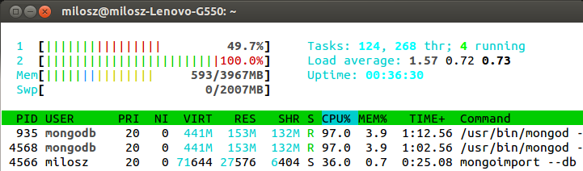

## MongoDB version

```bash
MongoDB version: 2.5.2
```

## Zadanie 1

* 1a 
#### przygotowanie pliku
  użyłem skryptu wykładowcy [z tąd](https://github.com/nosql/aggregations-2/blob/master/scripts/wbzyl/2unix.sh)

  ```bash
  $ time bash 2unix.bash Train.csv Train2.csv
  
  real  20m22.142s
  user  10m32.572s
  sys   8m12.063s
  ```
#### import

  ```bash
  $ time mongoimport --type csv -c Train --file ./Train2.csv --headerline

  2013-10-28T23:59:02.068+0100 check 9 6034196
  2013-10-28T23:59:02.068+0100 imported 6034195 objects
 
  real  134m33.441s
  user  85m2.572s
  sys   49m42.13s
  ```  

* 1b

  ```bash
  db.Train.count()
  ```
  Wynik: 6034195 czyli się zgadza

* 1c
  
  Do zamiany tagów na tablice użyłem skryptu który napisałem w ruby [tutaj](../../scripts/mosinski/stringToarray.rb)
  ```bash
  $ ruby stringToarray.rb nosql Train
  
  Wszystkich tagów: 17409994
  Różnych tagów: 42048
  ```

* 1d 
#### przygotowanie
  przygotowałem plik do jsona za pomocą tego skryptu [z tąd](../../scripts/mosinski/stringTojson.sh)

  ```bash
  $ time bash stringTojson.sh text8.txt text8.json

  real	3m14.336s
  user	0m34.022s
  sys	2m3.248s
  ```
#### import
  ```bash
  $ time mongoimport --db Text --collection text8 --type json --file text8.json
  
  Tue Oct 29 13:40:12.979 check 9 17005207
  Tue Oct 29 13:40:13.823 imported 17005207 objects

  real	  13m17.613s
  user	  2m11.880s
  sys	  2m45.162s
  ```
  Zawsze jeden z dwóch rdzeni przy imporcie działał na 100% ilość wątków wachała się pomiędzy 2-6 wątków.



#### zliczanie słów
  Ogółem:
  ```js
  db.text8.count()
  17005207
  ```
  Różnych:
  ```js
  db.text8.distinct("word").length
  253854
  ```
  Najbardziej popularne słowo:
  ```js
  db.text8.aggregate(
    [
      { $group : { _id : "$word" , number : { $sum : 1 } } },
      { $sort : { number : -1 } },
      { $limit : 1 }
    ]
  )
  
  { "result" : [ { "_id" : "the", "number" : 1061396 } ], "ok" : 1 }

  Słowo "the" - 1061396 wystąpień czyli 6,24% wszystkich wyrazów
  ```
  10 Najbardziej popularnych słów:
  ```js
  db.text8.aggregate(
    [
      { $group : { _id : "$word" , number : { $sum : 1 } } },
      { $sort : { number : -1 } },
      { $limit : 10 },
      { $group : { _id : "10 słów", count: { $sum : "$number" } } }
    ]
  )
  
  {
	"result" : [
		{
			"_id" : "10 słów",
			"count" : 4205965
		}
	],
	"ok" : 1
  }


  10 słów - 4205965 wystąpień czyli 24,73% wszystkich wyrazów
  ```
  wyniki umieściłem [tutaj](../../data/mosinski/10.json)
  
  100 Najbardziej popularnych słów:
  ```js
  db.text8.aggregate(
    [
      { $group : { _id : "$word" , number : { $sum : 1 } } },
      { $sort : { number : -1 } },
      { $limit : 100 },
      { $group : { _id : "100 słów", count : { $sum : "$number" } } }
    ]
  )
  
  {
	"result" : [
		{
			"_id" : "100 słów",
			"count" : 7998978
		}
	],
	"ok" : 1
  }


  100 słów - 7998978 wystąpień czyli 47,04% wszystkich wyrazów
  ```
  wyniki umieściłem [tutaj](../../data/mosinski/100.json)
  
  1000 Najbardziej popularnych słów:
  ```js
  db.text8.aggregate(
    [
      { $group : { _id : "$word" , number : { $sum : 1 } } },
      { $sort : { number : -1 } },
      { $limit : 1000 },
      { $group : { _id : "1000 słów", count : { $sum : "$number" } } }
    ]
  )
  
  {
	"result" : [
		{
			"_id" : "1000 słów",
			"count" : 11433354
		}
	],
	"ok" : 1
  }


  1000 słów - 11433354 wystąpień czyli 67,23% wszystkich wyrazów
  ```
* 1e
   wkrótce.. 
