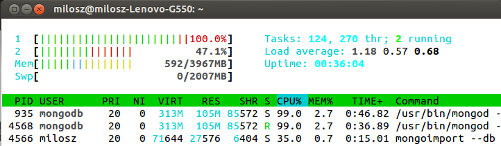

## MongoDB version

```bash
MongoDB version: 2.5.2
```
## Menu
- [Train](#Train)
    - [Przygotowanie pliku](#przygotowanie-pliku)
    - [Import do bazy](#import)
    - [Zliczenie rekordów](#zliczenie)
    - [Zamiana tagów na tablice](#tagi-na-tablice)
- [Text8](#text8)
    - [Przygotowanie pliku](#przygotowanie-pliku)
    - [Import do MongoDB](#import-do-bazy)
    - [Zliczanie słów](#zliczanie-słów)
- [Geo Json](#geo-json)
    - [Import do MongoDB](#import-do-db)
    - [Dodanie index-u](#dodanie-indexu)
    - [Koordynaty kilku miast w Polsce](#koordynaty-kilku-miast-w-polsce)
    - [Zapytania](#zapytania)
        - [Stacje w odległości 10 km od Warszawy](#stacje-w-odległości-100-km-od-warszawy)
        - [Stacje w odległości 10 km od Gdańska](#stacje-w-odległości-100-km-od-gdanska)
        - [Stacje w odległości 10 km od Poznania](#stacje-w-odległości-100-km-od-poznania)
        - [Stacje na Pomorzu](#stacje-na-pomorzu)


# Zadanie 1

* 1a 
# Train
## przygotowanie pliku
  użyłem skryptu wykładowcy [z tąd](https://github.com/nosql/aggregations-2/blob/master/scripts/wbzyl/2unix.sh)

  ```bash
  $ time bash 2unix.bash Train.csv Train2.csv
  
  real  20m22.142s
  user  10m32.572s
  sys   8m12.063s
  ```
## import

  ```bash
  $ time mongoimport --type csv -c Train --file ./Train2.csv --headerline

  2013-10-28T23:59:02.068+0100 check 9 6034196
  2013-10-28T23:59:02.068+0100 imported 6034195 objects
 
  real  134m33.441s
  user  85m2.572s
  sys   49m42.13s
  ```  

* 1b
## zliczenie
  ```js
  db.Train.count()
  6034195
  ```
  Wynik: 6034195 czyli się zgadza

* 1c
##  tagi na tablice
  Do zamiany tagów na tablice użyłem skryptu który napisałem w ruby [tutaj](../../scripts/mosinski/stringToarray.rb)
  ```bash
  $ ruby stringToarray.rb nosql Train
  
  Wszystkich tagów: 17409994
  Różnych tagów: 42048
  ```

* 1d 
# Text8
## przygotowanie pliku
  przygotowałem plik do jsona za pomocą tego skryptu [z tąd](../../scripts/mosinski/stringTojson.sh)

  ```bash
  $ time bash stringTojson.sh text8.txt text8.json

  real	3m14.336s
  user	0m34.022s
  sys	2m3.248s
  ```
## import do bazy
  ```bash
  $ time mongoimport --db Text --collection text8 --type json --file text8.json
  
  Tue Oct 29 13:40:12.979 check 9 17005207
  Tue Oct 29 13:40:13.823 imported 17005207 objects

  real	  13m17.613s
  user	  2m11.880s
  sys	  2m45.162s
  ```
  Zawsze jeden z dwóch rdzeni przy imporcie działał na 100% ilość wątków wachała się pomiędzy 2-6 wątków.
  
  

  <b>Screen z mms-a</b>
  
## zliczanie słów
  Ogółem:
  ```js
  db.text8.count()
  17005207
  ```
  Różnych:
  ```js
  db.text8.distinct("word").length
  253854
  ```
  Najbardziej popularne słowo:   <b>Słowo "the" - 1061396 wystąpień czyli 6,24% wszystkich wyrazów</b>
  ```js
  db.text8.aggregate(
    [
      { $group : { _id : "$word" , number : { $sum : 1 } } },
      { $sort : { number : -1 } },
      { $limit : 1 }
    ]
  )
  
  { "result" : [ { "_id" : "the", "number" : 1061396 } ], "ok" : 1 }

  ```
  10 Najbardziej popularnych słów:   <b>10 słów - 4205965 wystąpień czyli 24,73% wszystkich wyrazów</b>
  ```js
  db.text8.aggregate(
    [
      { $group : { _id : "$word" , number : { $sum : 1 } } },
      { $sort : { number : -1 } },
      { $limit : 10 },
      { $group : { _id : "10 słów", count: { $sum : "$number" } } }
    ]
  )
  
  { "result" : [ { "_id" : "10 słów", "count" : 4205965 } ], "ok" : 1 }

  ```
  wyniki umieściłem [tutaj](../../data/mosinski/10.json)
  
  100 Najbardziej popularnych słów:  <b>100 słów - 7998978 wystąpień czyli 47,04% wszystkich wyrazów</b>
  ```js
  db.text8.aggregate(
    [
      { $group : { _id : "$word" , number : { $sum : 1 } } },
      { $sort : { number : -1 } },
      { $limit : 100 },
      { $group : { _id : "100 słów", count : { $sum : "$number" } } }
    ]
  )
  
  { "result" : [ { "_id" : "100 słów", "count" : 7998978 } ], "ok" : 1 }

  ```
  wyniki umieściłem [tutaj](../../data/mosinski/100.json)
  
  1000 Najbardziej popularnych słów:   <b>1000 słów - 11433354 wystąpień czyli 67,23% wszystkich wyrazów</b>
  ```js
  db.text8.aggregate(
    [
      { $group : { _id : "$word" , number : { $sum : 1 } } },
      { $sort : { number : -1 } },
      { $limit : 1000 },
      { $group : { _id : "1000 słów", count : { $sum : "$number" } } }
    ]
  )
  
  { "result" : [ { "_id" : "1000 słów", "count" : 11433354 } ], "ok" : 1 }

  ```
* 1e
# Geo Json
  Do obróbki użyłem bazy listy <b>Stacji Paliw Orlen</b> [Mapka](../../data/mosinski/Stacje_paliw_Orlen.geojson)
## import do db
   Zaimportowałem baze w formacie [JSON](../../data/mosinski/Stacje_paliw_Orlen.json) poleceniem:
  ```bash
  $ time mongoimport -d GeoOrlen -c stacje  < Stacje_paliw_Orlen.json
  
  connected to: 127.0.0.1
  Mon Nov  4 22:56:14.360 check 9 1245
  Mon Nov  4 22:56:14.360 imported 1245 objects

  real	  0m0.284s
  user	  0m0.024s
  sys	  0m0.056s
  ```
  przykładowy rekord:
  ```js
  db.geoJson.findOne()
  {
	"_id" : ObjectId("527817fe644839d19fd136b5"),
	"loc" : {
		"type" : "Point",
		"coordinates" : [
			20.021194,
			49.453218
		]
	},
	"name" : "Stacje paliw Orlen",
	"city" : "Nowy Targ"
  }
  ```
## Dodanie indexu
  ```js
  db.geoJson.ensureIndex({"loc" : "2dsphere"});
  ```
## Koordynaty kilku miast w Polsce:
  <b>Warszawa 52.259, 21.020</b>
  
  <b>Gdańsk 54.360, 18.639</b>
  
  <b>Poznań 52.399, 16.900</b>
## Zapytania
#### Stacje w odległości do 10km od Warszawy:
  ```js
  db.geoJson.find( { loc : { $near :
                           { $geometry :
                               { type : "Point" ,
                                 coordinates: [ 21.020, 52.259 ] } },
                             $maxDistance : 10000
                } } )
  ```
#### wyniki: [JSON](../../data/mosinski/near_Warszawa.json), [Mapka](../../data/mosinski/near_Warszawa.geojson)
#### Stacje w odległości do 10km od Gdanska:
  ```js
  db.geoJson.find( { loc : { $near :
                           { $geometry :
                               { type : "Point" ,
                                 coordinates: [ 18.639, 54.360 ] } },
                             $maxDistance : 10000
                } } )
  ```
#### wyniki: [JSON](../../data/mosinski/near_Gdansk.json), [Mapka](../../data/mosinski/near_Gdansk.geojson)
#### Stacje w odległości do 10km od Poznania:
  ```js
  db.geoJson.find( { loc : { $near :
                           { $geometry :
                               { type : "Point" ,
                                 coordinates: [ 16.900, 52.399 ] } },
                             $maxDistance : 10000
                } } )
  ```
#### wyniki: [JSON](../../data/mosinski/near_Poznan.json), [Mapka](../../data/mosinski/near_Poznan.geojson)
#### Stacje na Pomorzu
  ```js
  db.geoJson.find( { loc : { $geoWithin :
                           { $geometry :
                               { type : "Polygon" ,
                                 coordinates: [[[16.804190,54.821840], [19.247510,54.821840], [19.247510,53.644500], [16.804190,53.644500], [16.804190,54.821840]]] } }
                } } )
  ```
#### wyniki: [JSON](../../data/mosinski/in_pomorskie.json), [Mapka](../../data/mosinski/in_pomorskie.geojson)
