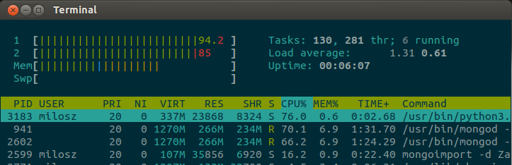
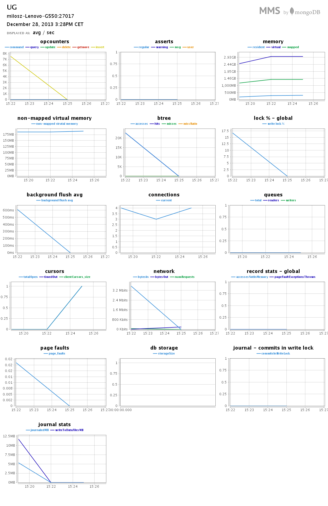
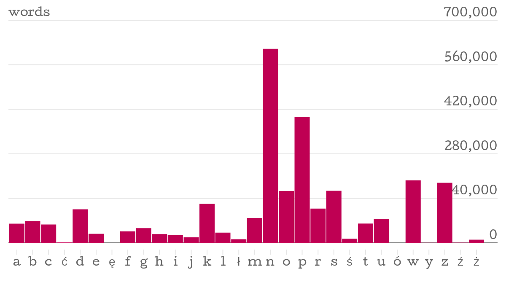
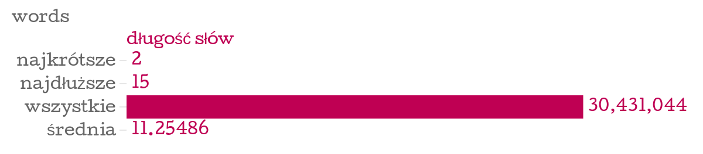
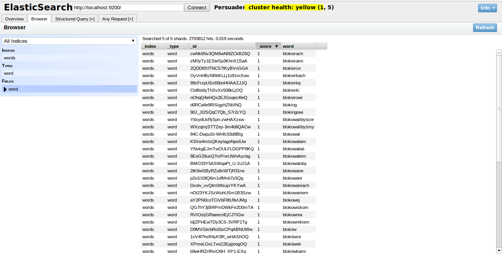
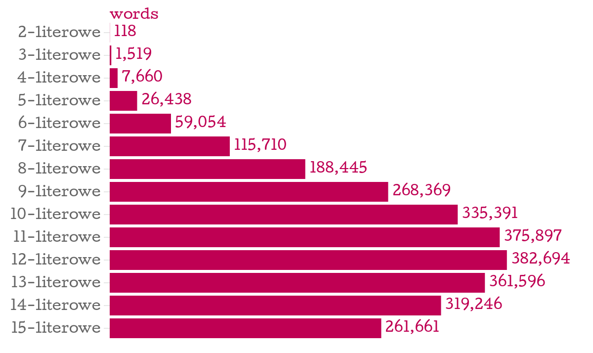

## MongoDB version

```bash
MongoDB version: 2.5.2
```
## Menu
- [Przygotowanie pliku](#przygotowanie-pliku-do-importu)
- [MongoDB](#import-do-mongodb)
  - [Import](#import-do-mongodb)
  - [Zapytania](#zapytania-mongodb)
- [ElasticSearch](#import-do-elasticsearch)
  - [Import](#import-do-elasticsearch)
  - [Zapytania](#zapytania-elasticsearch)

# Zadanie 2
Do zadania użyłem bazy listy [2,7 mln. słów do gier](http://sjp.pl/slownik/growy/) wg zasad dopuszczalności SJP.pl (Słownik Języka Polskiego)<br>
Bazę pobrałem ze strony [sjp.pl](http://sjp.pl/) jest używana w grze scrable na [kurnik.pl](http://www.kurnik.pl/literaki/)<br>
kodowanie pliku: win-1250 DOS-owe

## przygotowanie pliku do importu
zmiana kodowania z <b>cp1250</b> na <b>utf8</b><br>
  ```bash
  $ time iconv -f cp1250 -t utf8 slowa-win.txt slowa-unix.txt

  real    0m0.310s
  user    0m0.206s
  sys     0m0.103s
  ```
przygotowałem plik do jsona za pomocą tego skryptu [z tąd](../../scripts/mosinski/stringTojson2.sh)
  ```bash
  $ time bash stringTojson2.sh slowa-unix.txt slowa.json

  real    0m39.465s
  user    0m9.717s
  sys     0m27.452s
  ```
* mongodb
## import do mongodb
  ```bash
  $ time mongoimport -d Zad2 -c Words  < slowa.json

  Sat Dec 28 15:20:29.613 check 9 2703812
  Sat Dec 28 15:20:30.687 imported 2703812 objects

  real    2m1.637s
  user    0m22.379s
  sys     0m2.206s
  ```
  <b>Screen z htop</b>
  

  <b>Screen z mms-a</b>
  
## zapytania mongodb
#### 1. Ilość słów zaczynających się na daną literę alfabetu:
  ```js
  db.Words.aggregate({
      $group: {
        _id: { $substr: ['$word', 0, 1] },
        count: { $sum: 1 }
      } 
  })
  ```
#### Wyniki: [JSON](../../data/mosinski/first_letter.json), [PNG](../../images/mosinski/chart1.png), [PNG2](../../images/mosinski/chart2.png)
  
#### 2. Najdłuższe słowo, najkrótsze słowo, długość wszystkich słów i średnia długość słowa:
  ```js
  var words = db.Words.find();
  max = 0;
  min = 0;
  dl_all = 0;

  words.forEach(function(word) {
    if(word.word.length > max) {
      if(min == 0) min = word.word.length;
      max = word.word.length;
    }
    dl_all += word.word.length;
  });

  print(tojson("Najkrótsze słowo: "+min));
  print(tojson("Najdłuższe słowo: "+max));
  print(tojson("Długość wszystkich słów: "+dl_all));
  print(tojson("Średnia długość słowa: "+(dl_all/words.count())));
  ```
#### Wyniki: [JSON](../../data/mosinski/info_words.json), [PNG](../../images/mosinski/chart3.png)
  
* elasticsearch
## import do elasticsearch
#### przeplatanie jsona
  ```bash
  $ time jq --compact-output '{ "index" : { "_type" : "word" } }, .' slowa.json > slowa_es.json

  real  0m23.005s
  user  0m21.993s
  sys   0m0.968s
  ```
#### podział na mniejsze kawałki
  ```bash
  $ time split -l 100000 ../slowa_es.json 

  real  0m2.746s
  user  0m0.099s
  sys   0m0.343s
  ```
#### import w pętli wszystkich kawałków
  ```bash
  $ time for i in x*; do curl -s -XPOST   localhost:9200/words/_bulk --data-binary @$i; done

  real  19m54.244s
  user  0m1.219s
  sys   0m4.004s
  ```
#### sprawdzenie ilości
  ```bash
  $ curl -XGET 'http://localhost:9200/words/word/_count'; echo

  {"count":2703812,"_shards":{"total":5,"successful":5,"failed":0}}
  ```
#### screen z przeglądarki
  
## zapytania elasticsearch
#### ilość słów o danej długości
  zapytanie modyfikowałem tak żeby dostawać poszczególne wyniki
  ```js
  {
    "query": {
      "filtered": {
        "filter": {
          "regexp": {
            "word": {
              "value": ".{0,2}"
            }
          }
        }
      }
    }
  }
  ```
#### Wyniki: [JSON](../../data/mosinski/words_length.json), [PNG](../../images/mosinski/chart4.png)
  
