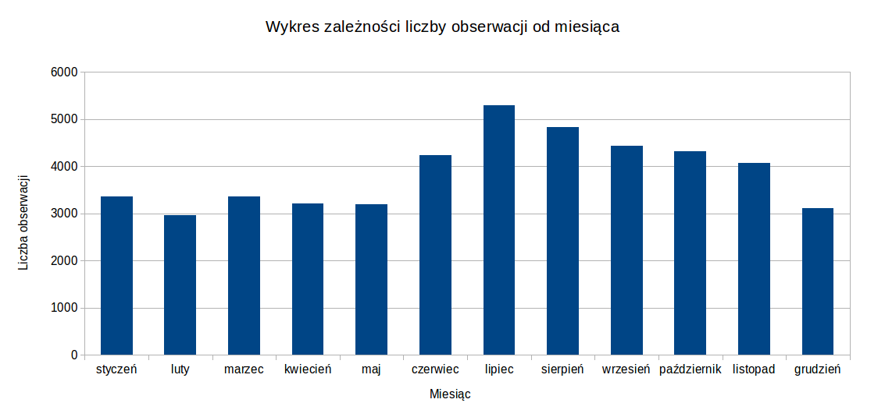
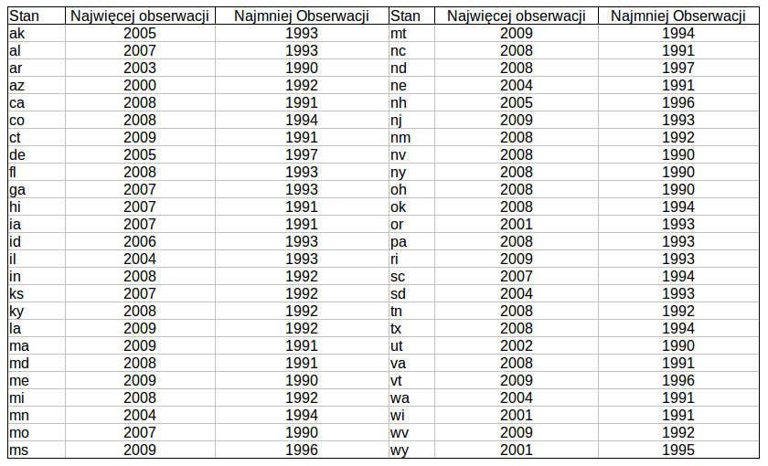
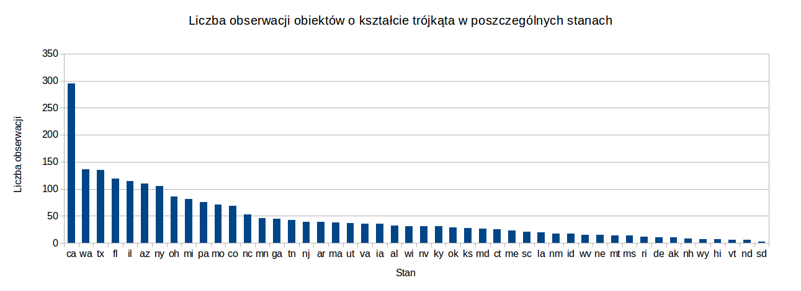
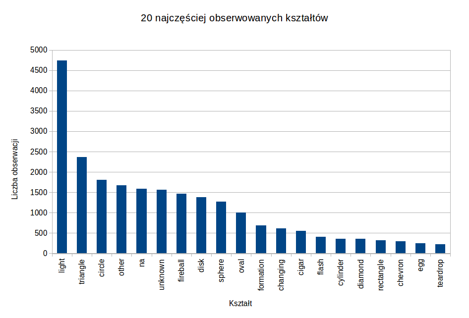

### *Mateusz Pikora*

# Dane

Baza danych użyta do ćwiczenia zawiera obserwacje UFO, została ona zasugerowana przez prowadzącego jako jedna z baz możliwych do wykorzystania. Jest ona zapisana w formacie csv, razem z linią nagłówka.

# Mongodb

Import do bazy MongoDB przeprowadziłem poleceniem

```
mongoimport --type csv -c Ufo --file ./ufo.us.csv --headerline
```

Czas przetwarzania wyniósł 3 sekundy.

## Agregacje

Jak rozkładają się obserwacje w roku (na poszczególne miesiące).

```JSON
db.Ufo.aggregate( 
  { $group: { _id: {$substr: ["$YearMonth", 5,2]}, count: {$sum:1} } },
  { $sort: { count: -1 } }
)
```

Wyniki zapytania przedstawia poniższy wykres:

Zwiększona liczba obserwacji w miesiącach letnich wynika prawdopodobnie z tego, że ludzie więcej czasu spędzają na zewnątrz.

Dla każdego stanu - w którym roku bylo najwięcej i najmniej obserwacji.

```JSON
db.Ufo.aggregate( 
  { $group: { _id: { state: "$USState", year: {$substr: ["$YearMonth", 0,4]} }, count: {$sum:1} } },
  { $sort: { count: -1 } },
  { $group: { _id : "$_id.state", theMost: { $first: "$_id.year" }, theLeast: { $last: "$_id.year" } } }
)
```

Wyniki zapytania przedstawia poniższy wykres:

Wyniki pokazują, że generalnie najmniejszą liczbę obserwacji zanotowano na początku lat 90., a najwyższą w ostatnich latach. Niektórzy antropologowie utożsamiają wzrost obserwacji w połowie lat 90, trwający do dziś zwiększoną obecnością tematyki UFO w serialach telewizyjnych, a zwłaszcza popularności "Z archiwum X" w drugiej połowie lat 90.

# Elasticsearch

Przy imporcie do bazy skorzystałem z wtyczki *river-csv*. Przed zaimportowaniem do bazy musiałem oczyścić plik csv usuwając wszystkie przecinki nie będące separatorami pól. Mimo czyszczenia zdołałem zaimportować jedynie około połowę danych do bazy.

Skrypt w języku Perl użyty do oczyszczenia danych:
```PERL
#!/usr/local/bin/perl
open (MYFILE, '<ufo.us.csv');
open (MYFILE2, '>ufo2.us.csv');

$liczbaznakow;
while (<MYFILE>) {
	#liczba znakow ' =0
	$liczbaznakow=0;
	
	#wedruj znak po znaku i zliczaj znaki '
	$dlugosc=length($_);
	$i;
	for ($i=0; $i<$dlugosc; $i++) {
		$char=substr($_,$i,1);
		if ($char eq '\'') {
			$liczbaznakow++;
		}
		#jesli trafisz na znak , i liczba znakow jest nieparzysta zamien go na .
		if (($char eq ',') && ($liczbaznakow%2 == 1)) {
			substr($_,$i,1,'.');
		}
	}
	print MYFILE2 $_;
}
close (MYFILE); 
close (MYFILE2); 
```

Bazę zaimportowałem poleceniem

```
curl -XPUT localhost:9200/_river/my_csv_data/_meta -d @skrypt.txt
```

plik skrypt.txt

```JSON
{
    "type" : "csv",
    "csv_file" : {
        "folder" : "/home/mateusz/nosql/2",
        "filename_mask" : ".*\\.csv$",
        "poll":"5m",
        "fields" : [
            "id",
            "DateOccurred",
            "DateReported",
            "Location",
            "ShortDescription",
            "Duration",
            "LongDescription",
            "USCity",
            "USState",
            "YearMonth"
        ],
        "field_separator" : ",",
        "escape_character" : ";",
        "quote_character" : "'"
    },
    "index" : {
        "index" : "my_csv_data",
        "type" : "csv_row",
        "bulk_size" : 1000,
        "bulk_threshold" : 50
    }
}
```

## Agregacje

Ile było obserwacji obiektów w kształcie trójkąta w poszczególnych stanach:

```JSON
{"query":{"match":{"ShortDescription": "triangle"}},
"facets": {
    "format": {
      "terms": {
        "field": "USState",
        "size": 100
      }
    }
  }
}
```

Wyniki zapytania przedstawia poniższy wykres:


20 najpopularniejszych zaobserwowanych kształtów

```JSON
{"query":{"match_all":{}},
"facets":{"format":{"terms":{"field":"ShortDescription","size":20}}}}
```

Wyniki zapytania przedstawia poniższy wykres:


Kształty nieznane (na, unknown) oznaczają obserwacje dziwnych zjawisk bez udziału UFO.
