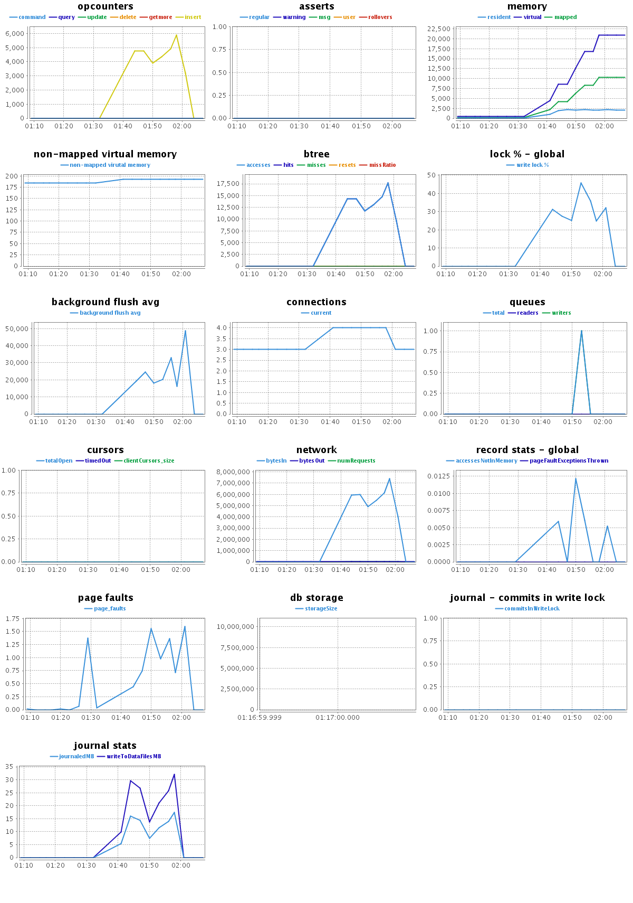

### *Marek Skiba*

----

### Konfiguracja sprzętu i systemu
#### Sprzęt
Komputer wyposażony w 2 procesory: [Intel(R) Xeon(R) CPU 5160 @ 3.00GHz](http://ark.intel.com/products/27219/) i 8GB ramu.

#### System
Zadania wykonałem na Debianie Wheezy, który był zwirtualizowany przy pomocy [Linux-VServers](http://linux-vserver.org/Welcome_to_Linux-VServer.org). 
```sh
$ cat /etc/debian_version 
7.2

$ uname -a
Linux mongodb.maxnet.org.pl 3.2.29-vs2.3.2.15-beng #1 SMP Tue Sep 18 09:52:18 BST 2012 x86_64 GNU/Linux
```

Najnowszą stabilną wersję MongoDB pobrałem z oficjalnego repozytorium mongodb.org:
```sh
$ mongo --version
MongoDB shell version: 2.4.8
```

zwiększyłem też limity na otwarte pliki, wg. zaleceń dokumentacji MongoDB, z wartości 1024 na:
```sh
$ ulimit -n
64000
```

### Zadania
#### Zadanie 1a) Import pliku *Train.csv*

```sh
$ ./aggregations-2/scripts/wbzyl/2unix.sh Train.csv Train_prepared.csv
$ time mongoimport -c Train --type csv --file Train_prepared.csv --headerline
real    21m46.571s
user    1m41.370s
sys     0m24.430s
```
Po zaimportowaniu pliku, folder gdzie MongoDB trzyma bazy (*/var/lib/mongodb*), urusł z 3,3GB do 16GB


