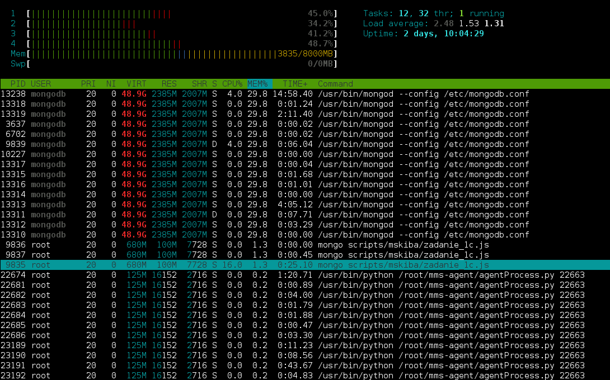

### *Marek Skiba*

----

### Konfiguracja sprzętu i systemu
#### Sprzęt
Komputer wyposażony w 2 procesory: [Intel(R) Xeon(R) CPU 5160 @ 3.00GHz](http://ark.intel.com/products/27219/) i 8GB ramu.

#### System
Zadania wykonałem na Debianie Wheezy, który był zwirtualizowany przy pomocy [Linux-VServers](http://linux-vserver.org/Welcome_to_Linux-VServer.org). 
```sh
$ cat /etc/debian_version 
7.2

$ uname -a
Linux mongodb.maxnet.org.pl 3.2.29-vs2.3.2.15-beng #1 SMP Tue Sep 18 09:52:18 BST 2012 x86_64 GNU/Linux
```

Najnowszą stabilną wersję MongoDB pobrałem z oficjalnego repozytorium mongodb.org:
```sh
$ mongo --version
MongoDB shell version: 2.4.8
```

zwiększyłem też limity na otwarte pliki, wg. zaleceń dokumentacji MongoDB, z wartości 1024 na:
```sh
$ ulimit -n
64000
```

### Zadania
#### Zadanie 1a) Import pliku *Train.csv*

```sh
$ ./aggregations-2/scripts/wbzyl/2unix.sh Train.csv Train_prepared.csv
$ time mongoimport -c Train --type csv --file Train_prepared.csv --headerline
real    21m46.571s
user    1m41.370s
sys 	0m24.430s
```
Po zaimportowaniu pliku, folder gdzie MongoDB trzyma bazy (*/var/lib/mongodb*), urusł z 3,3GB do 16GB


#### Zadanie 1b) Liczba zaimportowanych rekordów
Odpowiedź: 6 034 195
```sh
$ mongo
MongoDB shell version: 2.4.8
connecting to: test
> db.Train.count()
6034195
```

#### Zadanie 1c) Zamiana stringa z tagami na tablice stringów
[Napisałem program w JavaScript](/scripts/mskiba/zadanie_1c.js):
```javascript
trains = db.Train.find();

var tagsUnikalne = {};
var tagsIlosc = 0;

trains.forEach(function(train){
    var tagsArray = [];

    // zamieniamy string zawierający tagi na tablicę napisów z tagami
    if(typeof train.tags === "string") {
        tagsArray = train.tags.split(" ");
        db.Train.update({_id: train._id}, {$set: {tags: tagsArray}});
    } else if(typeof train.tags === "number") {
        // tag jest liczbą
        tagsArray.push(train.tags.toString());
        db.Train.update({_id: train._id}, {$set: {tags: tagsArray}});
    } else {
        // tag jest już tablicą
        tagsArray = train.tags;
    }

    // zliczamy wszystkie tagi
    tagsIlosc += tagsArray.length;

    // zliczamy wszystkie różne tagi
    tagsArray.forEach(function(tag) {
        if(typeof tagsUnikalne[tag] === "undefined")
            tagsUnikalne[tag] = 1;
    });
});

print("Wszystkie tagi: " + tagsIlosc);
print("Unikalne tagi: " + Object.keys(tagsUnikalne).length);
```

wynik skryptu:
```sh
$ time mongo scripts/mskiba/zadanie_1c.js
Wszystkie tagi: 17409994
Unikalne tagi: 42048

real	20m29.142s
user	3m9.740s
sys 	0m15.130s
```


#### Zadanie 1d) Statystyki z pliku text8
Importowanie pliku:

```sh
$ tr --squeeze-repeats '[:blank:]' '\n' < text8 > text8.txt
$ time mongoimport -c Text --type csv --file text8.txt --fields slowo
Tue Nov  5 01:40:45.012 		Progress: 544533/100000000	0%
Tue Nov  5 01:40:45.012 			90500	30166/second
Tue Nov  5 01:40:48.005 		Progress: 1430952/100000000	1%
Tue Nov  5 01:40:48.005 			239800	39966/second

...

Tue Nov  5 01:47:51.563 		Progress: 98874258/100000000	98%
Tue Nov  5 01:47:51.563 			16814000	39193/second
Tue Nov  5 01:47:54.046 		Progress: 99349537/100000000	99%
Tue Nov  5 01:47:54.046 			16895600	39110/second
Tue Nov  5 01:47:56.954 check 9 17005207
Tue Nov  5 01:47:57.098 imported 17005207 objects

real	7m14.866s
user	0m42.320s
sys 	0m9.290s
```

Zliczenie liczby wszystkich słów oraz różnych słów:
```sh
$ mongo
> db.Text.count()
17005207
> db.Text.distinct("slowo").length
253854
```

Żeby zliczyć procentowe występowanie najczęstszych słów, napisałem [skrypt w JavaScript](/scripts/mskiba/zadanie_1d.js):

```javascript
// mongo --eval "var ilosc=10" zadanie_1d.js

var wynik = db.Text.aggregate(
    { $group: {_id: "$slowo", count: {$sum:1}} },
    { $sort: {count: -1} },
    { $limit: ilosc }
)

var wszystkich = db.Text.count();
var suma = 0;
for(var i=0; i<wynik.result.length; i++) {
    suma += wynik.result[i].count;
}

var procent = 100*(suma/wszystkich);

if(ilosc == 1)
    print("Najczęściej występujące słowo stanowi " + procent.toFixed(2) + "% całej kolekcji");
else
    print(ilosc + " najczęściej występujących słów stanowi " + procent.toFixed(2) + "% całej kolekcji");
```

ważne, żeby przy wykonywaniu skryptu podać zmienną *ilosc*:
```sh
mongo --eval "var ilosc=10" zadanie_1d.js
```

pozwala to na wykonanie skryptu w prostej pętli, która daje finalną odpowiedź:

```sh
$ time for ilosc in 1 10 100 1000
> do
>    mongo --eval "var ilosc=${ilosc}" --quiet zadanie_1d.js
> done
Najczęściej występujące słowo stanowi 6.24% całej kolekcji
10 najczęściej występujących słów stanowi 24.73% całej kolekcji
100 najczęściej występujących słów stanowi 47.04% całej kolekcji
1000 najczęściej występujących słów stanowi 67.23% całej kolekcji

real	0m52.800s
user	0m0.130s
sys 	0m0.030s
```
