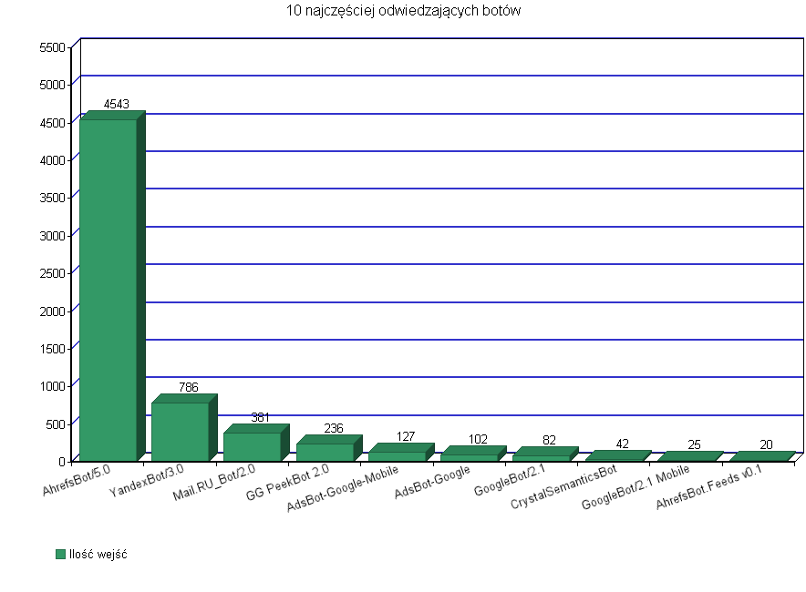
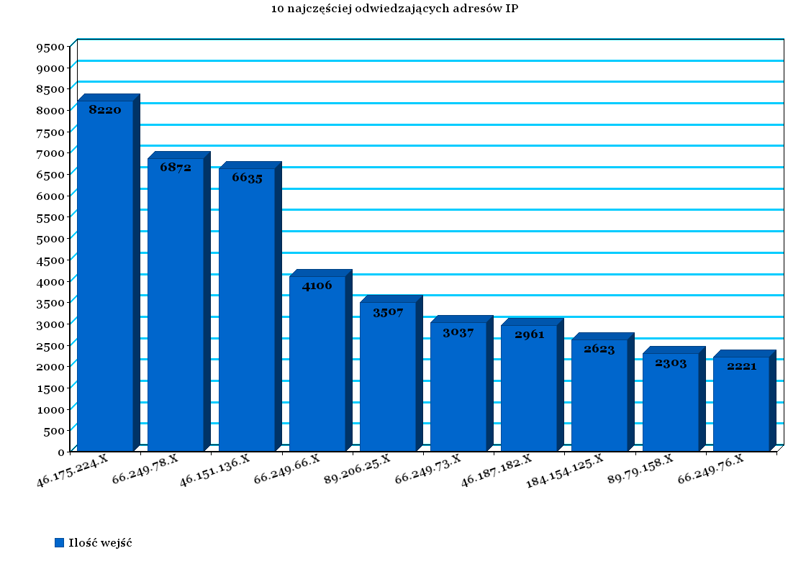

### *Marek Skiba*

----

### Konfiguracja sprzętu i systemu
Obliczenia były wykonywane na takim samym sprzęcie jak [zadanie 1](/docs/mskiba/Zadanie1.md), z tą róźnicą że został zaktualizowany kernel Linuxa na zwirtualizowanym systemie:
```sh
$ uname -a
Linux obelix 3.2.44-vs2.3.2.16-beng #1 SMP Thu May 16 23:24:32 BST 2013 x86_64 GNU/Linux
```

W przerwie między zrobieniem Zadania 1 a 2, nie została wydana nowa wersja MongoDB, więc tu się nic nie zmieniło (2.4.8).
Jeśli chodzi o Elasticsearch to pracowałem na najnowszej stabilnej wersji na dzień 29.XII.2013, czyli: 0.90.9.

### Zadanie 2
#### Wyszukanie danych w sieci
Dane na których operowałem to logi odwiedzin pewnego gdyńskiego serwisu. Logi obejmują okres od 29 grudnia 2013 do 5 stycznia 2014, każdy dzień był w osobnym pliku, po połączeniu plików wyszło 1 055 004 rekordów.

Przykładowa linijka:
```sh
184.154.125.X - - [05/Jan/2014:06:27:47 +0100] "GET /index.php HTTP/1.1" 200 52021 "-" "Mozilla/5.0 (X11; U; Linux i686; rv:1.7.10) Gecko/20050717 Firefox/1.0.6"
```

#### MongoDB
##### Import danych
Aby przekonwertować plik na format CSV wykorzystałem oprogramowanie [accesslog2csv](https://github.com/woonsan/accesslog2csv).
```sh
$ perl accesslog2csv.pl access.log > access.csv 2> invalid_log_lines.txt
```

Po przekonwertowaniu okazało się, że plik *invalid_log_lines.txt* zawiera 10 731 błędnych linijek, każda wyglądała mniej więcej tak:
```sh
Invalid Line at 1035214: 89.67.70.X - - [04/Jan/2014:22:52:43 +0100] "-" 408 0 "-" "-"
```

Poprawnych zostało 1 044 273. Czas na import danych:
```sh
$ time mongoimport -c Logs --type csv --file access.csv --headerline
connected to: 127.0.0.1
Sun Jan  5 19:00:10.012 		Progress: 29031055/246202639	11%
Sun Jan  5 19:00:10.012 			121100	40366/second
...
Sun Jan  5 19:00:41.013 		Progress: 223607243/246202639	90%
Sun Jan  5 19:00:41.013 			948700	27902/second
Sun Jan  5 19:00:43.357 check 9 1044274
Sun Jan  5 19:00:43.427 imported 1044273 objects
real	0m36.389s
user	0m12.330s
sys 	0m0.880s
```

Przykładowy rekord JSON:
```json
{
	"_id" : ObjectId("52c9a8d00385b498d2c27eb0"),
	"Host" : "66.249.64.X",
	"Log Name" : "-",
	"Date Time" : "2014-01-05 06:23:45",
	"Time Zone" : "GMT+0100",
	"Method" : "GET",
	"URL" : "/index.php",
	"Response Code" : 200,
	"Bytes Sent" : 15160,
	"Referer" : "-",
	"User Agent" : "Mozilla/5.0 (compatible; Googlebot/2.1; +http://www.google.com/bot.html)"
}
```

##### Agregacje
###### Agregacja 1

Wypisanie 10 najczęściej odwiedzających botów:

```js
> db.Logs.aggregate(
	{ $match: {"User Agent": /.*Bot.*/} },
	{ $group: {_id: "$User Agent", ilosc_wejsc: {$sum: 1} } },
	{ $sort: {ilosc_wejsc: -1} },
	{ $limit: 10 }
);
```

```json
"result" : [
	{
		"_id" : "Mozilla/5.0 (compatible; AhrefsBot/5.0; +http://ahrefs.com/robot/)",
		"ilosc_wejsc" : 4543
	},
	{
		"_id" : "Mozilla/5.0 (compatible; YandexBot/3.0; +http://yandex.com/bots)",
		"ilosc_wejsc" : 786
	},
	{
		"_id" : "Mozilla/5.0 (compatible; Linux x86_64; Mail.RU_Bot/2.0; +http://go.mail.ru/help/robots)",
		"ilosc_wejsc" : 381
	},
	{
		"_id" : "GG PeekBot 2.0 ( http://gg.pl/ http://info.gadu-gadu.pl/praca )",
		"ilosc_wejsc" : 236
	},
	{
		"_id" : "AdsBot-Google-Mobile (+http://www.google.com/mobile/adsbot.html) Mozilla (iPhone; U; CPU iPhone OS 3 0 like Mac OS X) AppleWebKit (KHTML, like Gecko) Mobile Safari",
		"ilosc_wejsc" : 127
	},
	{
		"_id" : "AdsBot-Google (+http://www.google.com/adsbot.html)",
		"ilosc_wejsc" : 102
	},
	{
		"_id" : "Mozilla/5.0 (X11; Linux x86_64) AppleWebKit/537.36 (KHTML, like Gecko; Google Page Speed Insights) Chrome/27.0.1453 Safari/537.36 GoogleBot/2.1",
		"ilosc_wejsc" : 82
	},
	{
		"_id" : "Mozilla/4.0 (compatible; MSIE 6.0; Windows NT 5.1; SV1; CrystalSemanticsBot http://www.crystalsemantics.com/user-agent/)",
		"ilosc_wejsc" : 42
	},
	{
		"_id" : "Mozilla/5.0 (iPhone; CPU iPhone OS 6_0_1 like Mac OS X) AppleWebKit/537.36 (KHTML, like Gecko; Google Page Speed Insights) Version/6.0 Mobile/10A525 Safari/8536.25 GoogleBot/2.1",
		"ilosc_wejsc" : 25
	},
	{
		"_id" : "AhrefsBot.Feeds v0.1; http://ahrefs.com/",
		"ilosc_wejsc" : 20
	}
]
```


###### Agregacja 2
Wypisanie 10 najczęściej odwiedzających adresów IP (specjalnie zamazałem ostatni oktet), z "Response Code" = 200

```js
> db.Logs.aggregate(
	{ $match: {"Response Code": 200} },
	{ $group: {_id: "$Host", ilosc_wejsc: {$sum: 1} } },
	{ $sort: {ilosc_wejsc: -1} },
	{ $limit: 10 }
);
```

```json
"result" : [
	{	"_id" : "46.175.224.X",   "ilosc_wejsc" : 8220 },
	{	"_id" : "66.249.78.X",    "ilosc_wejsc" : 6872 },
	{	"_id" : "46.151.136.X",   "ilosc_wejsc" : 6635 },
	{	"_id" : "66.249.66.X",    "ilosc_wejsc" : 4106 },
	{	"_id" : "89.206.25.X",    "ilosc_wejsc" : 3507 },
	{	"_id" : "66.249.73.X",    "ilosc_wejsc" : 3037 },
	{	"_id" : "46.187.182.X",   "ilosc_wejsc" : 2961 },
	{	"_id" : "184.154.125.X",  "ilosc_wejsc" : 2623 },
	{	"_id" : "89.79.158.X",    "ilosc_wejsc" : 2303 },
	{	"_id" : "66.249.76.X",    "ilosc_wejsc" : 2221 }
]
```


