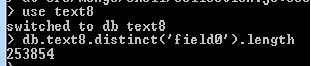

Zadanie 1a Zaimportowanie bazy danych

Po usunięciu znaków końca linii, importowania danych dokonałem:
```sh
mongoimport --db baza --collection train --type csv --file C:\data\db\poprawiony.csv --headerline 
```


Czas trwania 29minut

Zadanie 1b Zliczyć ilość importowanych rekordów

Najpierw poleceniem:
```js
use baza
```
przełączyłem się na baze danych do której importowałem dane a następnie poleceniem: 
```js
db.train.count()
```
policzona została liczba rekordów. 
Wynik 6034195.


Zadanie 1c Zmiana typu danych

Użyłem skryptu dla mongo shell
```js
db.train.find( { "tags" : { $type : 2 } } ).snapshot().forEach(
 function (x) {
  if (!Array.isArray(x.tags)){
   x.tags = x.tags.split('');
   db.train.save(x);
}});
```

Zadanie 1d Dokonać określonych operacji na pliku text8

Po ściągnięciu pliku przygotowałem go według opisu podanego na stronie, następnie poleceniem:
```sh
mongoimport --db text8 --collection text8 --type csv --fields 'slowo' --file C:\data\db\text8.txt
```
importowałem baze danych


Czas trwania 12minut

Ilość wszystkich słów
```js
db.text8.count()
```
Wynik: 17005207

Ilość różnych słów
```js
db.text8.distinct('slowo').length
```
Wynik: 253854


Top najczęstszych 1/10/100/1000 słów:
```js
db.text8.aggregate({ $group: { _id: "$slowo", count: { $sum: 1 } } } , { $sort: { count: -1 } }, { $limit: 1 })

db.text8.aggregate({ $group: { _id: "$slowo", count: { $sum: 1 } } } , { $sort: { count: -1 } }, { $limit: 10 })
```

```json
{"_id" : "the", "count" : 1061396}
{"_id" : "of",  "count" : 593677}
{"_id" : "and", "count" : 416626}
{"_id" : "one", "count" : 411764}
{"_id" : "in",  "count" : 372201}
{"_id" : "a",   "count" : 325876}
```

```js
db.text8.aggregate({ $group: { _id: "$slowo", count: { $sum: 1 } } } , { $sort: { count: -1 } }, { $limit: 1 })

db.text8.aggregate({ $group: { _id: "$slowo", count: { $sum: 1 } } } , { $sort: { count: -1 } }, { $limit: 1000 })
```

