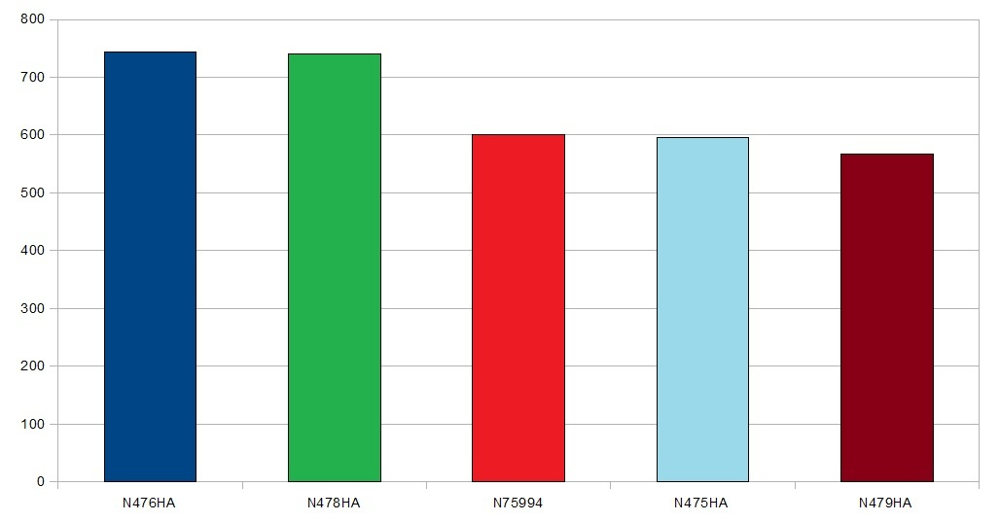

#Zadanie 2 Lista lotów w miesi¹cu styczen 2013

Polecenie mongodb importujce baze danych.

```sh
mongoimport –db loty –collection styczen –file d:\data\loty.json –jsonArray
```


Zakonczenie importu danych do bazy .
```sh
Mon Dec 30 22:34.56.341+0100                               Progress:106283565/111648203 95%
Mon Dec 30 22:34.56.341+0100                                          485100 10780/second
Mon Dec 30 22:34.56.341+0100             check 9 50519
Mon Dec 30 22:34.56.341+0100             imported 509515
```

Przykladowy rekord. 
```sh
> db.styczen.findOne()
```
```json

{
      "Year" : "2013",
      "Quarter" : "1",
      "Month" : "1",
      "DayofMonth" : "18",
      "DayOfWeek" : "5",
      "FlightDate" : "18.01.2013",
      "AirlineID" : "19790",
      "Carrier" : "DL",
      "Nr_samolotu" : "N325US",
      "Nr_lotu" : "1497",
      "OriginAirportID" : "14100",
      "OriginAirportSeqID" : "1410002",
      "OriginCityMarketID" : "34100",
      "Origin" : "PHL",
      "OriginCityName" : "Philadelphia, PA",
      "OriginState" : "PA",
      "OriginStateName" : "Pennsylvania",
      "DestAirportID" : "13487",
      "DestAirportSeqID" : "1348702",
      "DestCityMarketID" : "31650",
      "Dest" : "MSP",
      "DestCityName" : "Minneapolis, MN",
      "DestState" : "MN",
      "DestStateName" : "Minnesota",
      "Czas_Odlotu" : "805",
      "Opoznienie_odlotu" : "0.0",
      "Start" : "822",
      "Ladowanie" : "958",
      "Przylot" : "1002",
      "Opoznienie_przylotu" : "0.0",
      "Odwolany" : "0.00",
      "Czas_lotu" : "156.0",
      "Odleglosc" : "980.0",
      "DistanceGroup" : "4"
    },
```

##Aggregecje mongodb
Pokaz piec numerów samolotów z najwiksza liczb¹ loltów w kolejnosci od najwiekszej do najmniejszej
```js
db.styczen.aggregate(
        { $group: { _id: "Nr_samolotu", totalCount: {$sum: 1}}},
            { $match: {tatalCount: {$gte100} }, 
                { $sort: {totalCount: -1}}},
                   { $limit:5})
```

```json
{"_id":  "N476HA", "totalCount": 372}
{"_id":  "N478HA", "totalCount": 370}
{"_id":  "N475HA", "totalCount": 361}
{"_id":  "N75994", "totalCount": 357}
{"_id":  "N479HA", "totalCount": 346}
```


Pokaz piec numerów samolotów lataj¹cyh na wybranym dystansie.
```js
db.styczen.aggregate( 
        { $match: {DistanceGroup: "4"}
            { $group: { _id: "Nr_samolotu", totalCount: {$sum: 1}}},
                 { $match: {totalCount: {$gte50} }},
                     { $sort: {totalCount: -1}}, { $limit:5})
```

```json
{"_id":  "N219AG", "totalCount": 129}
{"_id":  "N215AG", "totalCount": 126}
{"_id":  "N217AG", "totalCount": 125}
{"_id":  "N218AG", "totalCount": 104}
{"_id":  "N803FR", "totalCount":  98}
```
![2(../../images/mstefanowicz/wykres2.jpg)

## Elasticsearch


Stworzenie przeplatanych JSONów.

```sh
jq --compact-output '{ "index" : { "_type" : "loty" } }, .' loty.json > loty2.json
```

Podzial pliku na mniejsze po 100000 linii.
```sh
split -l 100000 loty2.json
```
Import podzielonej bazy danych.
```sh
time for i in x*; do curl -s -XPOST   localhost:9200/data/_bulk --data-binary @$i; done
```

```js
real    2m6.734s
user    0m0.220s
sys     0m0.960
``
Sprawdzenie liczby zaimportowanych rekordów.
```sh
curl -XGET 'http://localhost:9200/data/loty/_count'; echo
```


### Agergacja 1

```sh
curl -X POST "http://localhost:9200/data/_search?pretty=true" -d '
                    {"query" : 
    	      {"match_all" : {  }}, 
		         "facets" : {
			    "Nr_samolotu" : {
			        "terms" : 
				  { "field" : "Nr_samolotu", 
				       "all_terms" : true, 
				           "size" : 5} } }}'
```

```sh
"facets" : {
    "Nr_samolotu" : {
      "_type" : "terms",
      "missing" : 2750,
      "total" : 1016288,
      "other" : 1010743,
      "terms" : [ {
        "term" : "n476ha",
        "count" : 744
      }, {
        "term" : "n478ha",
        "count" : 740
      }, {
        "term" : "n75994",
        "count" : 601
      }, {
        "term" : "n475ha",
        "count" : 596
      }, {
        "term" : "n479ha",
        "count" : 567
      } ]
    }
  }
```


### Agergacja 2

Z których lotnisk jest najwiecej odlotów.

```js
curl -X POST "http://localhost:9200/data/_search?pretty=true" -d '
                    {"query" : {
                        "match_all" : {  }},
                          "facets" : {
                              "Origin" : {
                                  "terms" : 
                                     {"field" : "Origin","size" : 10} } } }'
```
```json

 "facets" : {
    "Origin" : {
      "_type" : "terms",
      "missing" : 0,
      "total" : 1019038,
      "other" : 654520,
      "terms" : [ {
        "term" : "atl",
        "count" : 64724
      }, {
        "term" : "ord",
        "count" : 47698
      }, {
        "term" : "dfw",
        "count" : 46950
      }, {
        "term" : "den",
        "count" : 35700
      }, {
        "term" : "lax",
        "count" : 35126
      }, {
        "term" : "iah",
        "count" : 30008
      }, {
        "term" : "phx",
        "count" : 29378
      }, {
        "term" : "sfo",
        "count" : 26436
      }, {
        "term" : "dtw",
        "count" : 25632
      }, {
        "term" : "clt",
        "count" : 22866
       } ]
    }
  }

```
