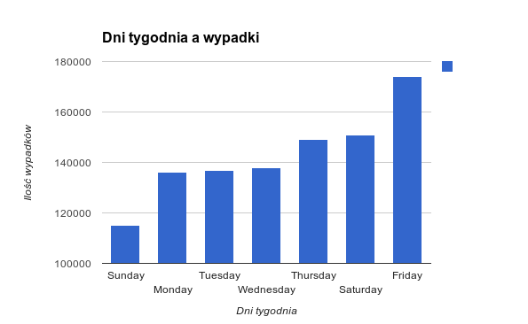
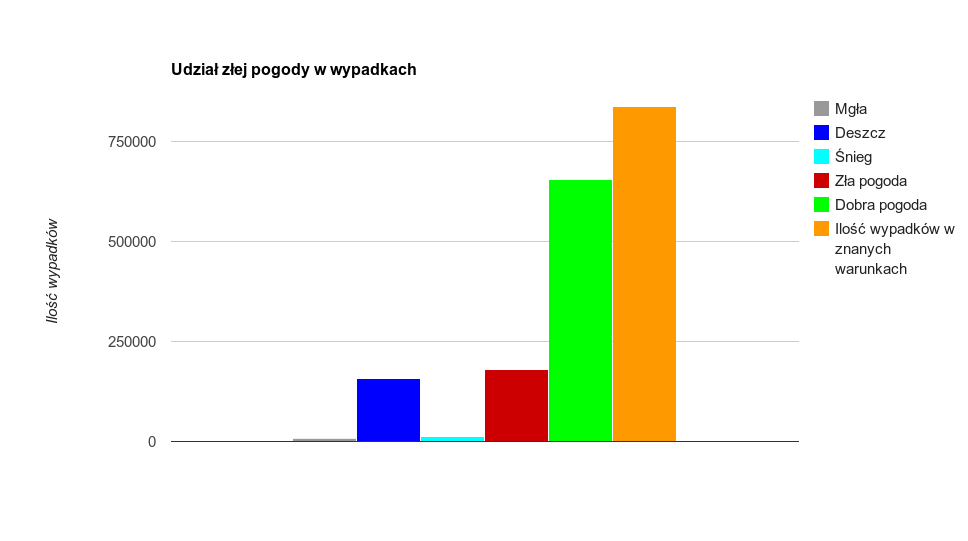

# Wypadki drogowe #

###Mateusz Szygenda###


----------


## Spis treści ##
1. [Dane](#dane)
2. [Transformacje danych](#transformacje-danych)
3. [MongoDB](#mongodb)
 1. [Import](#import-w-mongo)
 1. [Agregacje](#agregacje-w-mongodb)
4. [ElasticSearch](#elastic-search)
 1. [Import](#import-w-elasticsearch)
 1. [Agregacje](#agregacje-w-elasticsearch)


----------


# Dane #

Dane wykorzystane do zadania to informacje o wypadkach drogowych w USA pochodzących ze strony (http://data.gov.uk/dataset/road-accidents-safety-data)

Plik wykorzystany do zadania (Accidents7904) zawiera ~6 milionów rekordów. Ze względu na ograniczenia sprzętowe zaimportowany został tylko pierwszy milion rekordów.

Przykładowy rekord:

```
197901A11AD14,,,,,1,3,2,1,18/01/1979,5,08:00,11,9999,3,4,1,30,1,4,-1,-1,-1,-1,1,8,1,-1,0,-1,-1
```
Wygląda on dość kryptycznie jednak poszczególne liczby kodują informację o:

 - Ilości ofiar
 - Dacie wypadku
 - Porze dnia
 - Warunkach atmosferycznych
 - Dniu tygodnia
 - Obecności policji
 - Oświetleniu drogi
 - Stanie nawierzchni
 - Skrzyżowaniu
 - Lokalizacji
 - Ograniczeniu prędkości
 - Numerach dróg na których miało miejsce zdarzenie


----------


# Transformacje danych #

Dane zostały zaimportowane do openrefine w 2 porcjach po 500 000 rekordów. Dla każdej porcji zostały wykonane następujące kroki:


####Kolumna Weather-Conditions została przetransformowana w następujący sposób####

Dane o warunkach pogodowych były zapisane w postaci liczb których znaczenie podane jest w odpowiednim dokumencie. Dla uproszczenia zostały one przetransformowane do napisów

```
if(value == "8", "Unknown",  
if(value == "-1", "Unknown", 
if(value == "7", "Fog", 
if(value == "6", "Snow,Wind", 
if(value == "5", "Rain,Wind", 
if(value == "4", "Fine,Wind", 
if(value == "3", "Snow", 
if(value == "2", "Rain", 
if(value == "1", "Fine", "Unknown"
)))))))))
```

####Kolumna Weather_Condition została rozdzielona na dwie####

Weather condition zawierała informacje o opadach jak i o obecności wiatru. By móc rozróżnić te dwie rzeczy kolumna została rozdzielona na dwie:

Weather i Wind

####Wind została przekształcona do wartości 0, 1####

Po rozdzieleniu kolumny w nowopowstałej kolumnie Wind wartości były postaci "Wind" lub napis pusty. Napisy zostały zamienione na wartości 0, 1:

0 - Oznacza brak wiatru

1 - Oznacza wiatr podczas wypadku

**Transformacja**

 ```
 if(value == "Wind", 1, 0)
 ```

####Kolumna LightsCondition przekształcona####

Ponownie kolumna zawierała liczbowe identyfikatory odpowiednich sytuacji. Wartości jakie przechowywała odpowiadały kolejno "Podczas wypadku był dzień", "Noc z oświetloną drogą", "Noc bez oświetlenia", "Noc" oraz "Noc bez informacji o oświetleniu"

```
   if(value == "1", "Day", 
   if(value == "4", "Night,1", 
   if(value == "5", "Night", 
   if(value == "6", "Night", 
   if(value == "7", "Night", "Unknown")))))
```

####Następnie LightsCondition została ona rozdzielona####

Jako, że LigthsCondition zawierała w sobie 2 informacje (Porę dnia jak i informację o oświetleniu) została ona rozdzielona na dwie kolumny:

 TimeOfDay i LightsPresent

8. Kolumny zawierające liczby zamienione na taki właśnie typ

####Kolumny Date i Time połączone w jedną####

Wykorzystana została do tego następująca transformacja

```
value + " " + row.cells["Time"].value
```

####Typ nowego pole z datą został zamieniony z napisu na typ "Data"####

####Kolumna Time została usunięta####

####Wartości kolumny DayOfWeek zostały przesunięte o 1 do tyłu####
 
 W danych wejściowych dni tygodnia liczone były zaczynając od niedzieli. W wyniku transformacji poniedziałek stał się pierwszym dniem tygodnia.

**Transformacja**
```
if(value == 1, 7, value - 1)
```

####Pozostałe transformacje####
Poza wymienionymi krokami zostały usunięte mało znaczące kolumny i pozmieniane nazwy. Dokładna lista kroków wyeksportowana z openrefine znajduje się [tutaj](../data/mszygenda/open-refine-steps.json)

####Eksport####
Dane zostały wyeksportowane z powrotem do formatu csv.

####Przykładowe rekordy po transformacjach#####

```
{
	"_id" : ObjectId("52a472d10ef5171b420be52f"),
	"Accident_Index" : "197901A7PGV47",
	"PoliceForce" : 1,
	"AccidentSeverity" : 2,
	"NumberOfVehicles" : 1,
	"NumberOfCasualties" : 1,
	"Date" : "1979-07-01T15:30:00Z",
	"DayOfWeek" : 7,
	"RoadType" : 6,
	"SpeedLimit" : 30,
	"TimeOfDay" : "Day",
	"LightsPresent" : 0,
	"Weather" : "Rain",
	"Wind" : 0,
	"Road_Surface_Conditions" : 2,
	"Special_Conditions_at_Site" : -1,
	"Carriageway_Hazards" : 0,
	"Urban_or_Rural_Area" : -1,
	"Did_Police_Officer_Attend_Scene_of_Accident" : -1,
	"LSOA_of_Accident_Location" : ""
}
{
	"_id" : ObjectId("52a472d10ef5171b420be531"),
	"Accident_Index" : "197901A7PKE99",
	"PoliceForce" : 1,
	"AccidentSeverity" : 3,
	"NumberOfVehicles" : 1,
	"NumberOfCasualties" : 1,
	"Date" : "1979-07-01T15:50:00Z",
	"DayOfWeek" : 7,
	"RoadType" : 9,
	"SpeedLimit" : 30,
	"TimeOfDay" : "Day",
	"LightsPresent" : 0,
	"Weather" : "Rain",
	"Wind" : 0,
	"Road_Surface_Conditions" : 2,
	"Special_Conditions_at_Site" : -1,
	"Carriageway_Hazards" : 0,
	"Urban_or_Rural_Area" : -1,
	"Did_Police_Officer_Attend_Scene_of_Accident" : -1,
	"LSOA_of_Accident_Location" : ""
}
```

----------


# MongoDB #

##Import w Mongo##

Dane zostały zaimportowane do MongoDB następującymi poleceniami

```
time mongoimport --headerline --collection accidents --type csv Accidents7904-csv.csv --drop --db nosql

2013-12-08T14:20:51.035+0100 imported 500000 objects

real  0m24.568s
user  0m10.529s
sys 0m0.764s
```

```
time mongoimport --headerline --collection accidents --type csv Accidents7904-csv-part2.csv --db nosql
```

##Agregacje w MongoDB##

###Dni tygodnia a wypadki###

Ilość wypadków a dni tygodnia. Zliczone zostały informacje o wypadkach występujących w poszczególne dni tygodnia.

**Polecenie agregacji**
```
db.accidents.aggregate({ $match: {} }, { $group: { _id: "$DayOfWeek", total: { $sum: 1 } } })

{
  "result" : [
    {
      "_id" : 7,
      "total" : 115251
    },
    {
      "_id" : 5,
      "total" : 174039
    },
    {
      "_id" : 3,
      "total" : 137797
    },
    {
      "_id" : 6,
      "total" : 150801
    },
    {
      "_id" : 2,
      "total" : 136689
    },
    {
      "_id" : 1,
      "total" : 136203
    },
    {
      "_id" : 4,
      "total" : 149220
    }
  ],
  "ok" : 1
}
```

**Esksport wyników do CSV**

Aby móc wykorzystać dane w innych narzędziach (W celu stworzenia wykresów) zostały one wyeksportowane do formatu csv przygotowanym [skryptem](../scripts/mszygenda/daysOfWeek.js)

```
mongo nosql scripts/daysOfWeek.js --quiet

Sunday,115251
Friday,174039
Wednesday,137797
Saturday,150801
Tuesday,136689
Monday,136203
Thursday,149220
```

**Wykres**



**Wnioski**

Jak widać najwięcej wypadków zdarza się w piątki. Najbezpieczniejszym dniem jest Niedziela.

### Ilość wypadków spowodowanych złą pogodą ###

Ile wypadków zostało spowodowanych złymi warunkami atmosferycznymi.

**Polecenie agregacji**

```
var badWeatherAggregation = db.accidents.aggregate({ 
  $match: { 
    Weather: { $in: badWeather } 
  } 
}, { 
  $group: { 
    _id: "$Weather", 
    count: { 
      $sum: 1 
    } 
  } 
}, {
  $sort: {
    _id: 1
  }
})
```

**Eksport wyników do CSV**

Do przeformatowania wyników również został wykorzystany odpowiedni skrypt ([weather.js](../scripts/mszygenda/weather.js))

```
$ mongo nosql ./scripts/mszygenda/weather.js --quiet

Fog,Rain,Snow,BadWeather,TotalAccidentsWithKnownWeather
8326,158410,13707,180443,836607
```

**Wykres**



**Wnioski**

Większość wypadków odbywa się przy dobrych warunkach atmosferycznych. Drugą najczęstszą sytuacją są opady deszczu.


----------


#Elastic Search#

##Import w ElasticSearch##

Do zaimportowania danych z plików CSV zostało wykorzystane rozszerzenie [elasticsearch-river-csv](https://github.com/xxBedy/elasticsearch-river-csv)

Po zainstalowaniu rozszerzenia dane zostały zaimportowane przy pomocy przygotowanego skryptu który umieszcza dane we właściwym miejscu i zleca ElasticSearch import. [importElastic.sh](../scripts/mszygenda/importElastic.sh)

**Fragment skryptu (Request wysyłany do ElasticSearch)**

```
curl -XPUT localhost:9200/_river/accidents/_meta -d "
{
    type : \"csv\",
    csv_file : {
        folder : \"$DIRECTORY\",
        filename_mask : \"$FILENAME_MASK\",
        poll:\"10s\",
        fields : [
            \"AccidentIndex\",
            \"PoliceForce\",
            \"AccidentSeverity\",
            \"NumberOfVehicles\",
            \"NumberOfCasualties\",
            \"Date\",
            \"DayOfWeek\",
            \"RoadType\",
            \"SpeedLimit\",
            \"TimeOfDay\",
            \"LightsPresent\",
            \"Weather\",
            \"Wind\",
            \"RoadConditions\",
            \"SpecialConditions\",
            \"CarriagewayHazards\",
            \"UrbanOrRuralArea\",
            \"PoliceOfficerAttended\",
            \"LSOAOfLocation\"
        ],
        field_separator : \",\",
        escape_character : \";\"
    },
    index : {
        index : \"accidents\",
        type : \"accidents\",
        bulk_size : 100000,
        bulk_threshold : 50
    }
}"
```

##Agregacje w ElasticSearch##

###Dni tygodnia a wypadki###

Został przygotowany odpowiedni skrypt do wykonania tej agregacji ([daysOfWeekElastic.js](../scripts/mszygenda/daysOfWeekElastic.js))

**Fragment skryptu (Dane wysyłane do serwera)**

```
var daysOfWeekFacet = {
  facets: {
    daysOfWeek: { 
      terms: {
        field: "DayOfWeek"
      } 
    }
  }
}
```


```
$ node daysOfWeekElastic.js 
[{"day":"Friday","count":174039},{"day":"Saturday","count":150801},{"day":"Thursday","count":149220},{"day":"Wednesday","count":137797},{"day":"Tuesday","count":136689},{"day":"Monday","count":136203},{"day":"Sunday","count":115251}]
```

**Wynik**

Otrzymany wynik jest oczywiście identyczny z wynikami uzyskanymi z MongoDB

###Dni tygodnia a warunki pogodowe###

Ponownie został przygotowany skrypt w języku JS  ([weatherElastic.js](../scripts/mszygenda/weatherElastic.js))

**Fragmenty skryptu**

Facet agregacji
```
weatherFacet = {
    facets: {
      weather: { 
        terms: { 
          field: "Weather",
          order: "term"
        } 
      }
    }
}
```
Parametry do akcji _count do policzenia ilości wypadków dla których znane były warunki pogodowe
```
countOfKnownWeather = {
  filtered: {
  filter: {
    not: {
      term: {
        Weather: "unknown"
      }
    }
  }
  }
}
```

```
$ node weatherElastic.js 
[{"term":"fine","count":656164},{"term":"fog","count":8326},{"term":"rain","count":158410},{"term":"snow","count":13707},{"term":"unknown","count":163393},{"term":"KnownWeather","count":836607}]
```

**Wynik**

Otrzymany wynik jest oczywiście identyczny z wynikami uzyskanymi z MongoDB
