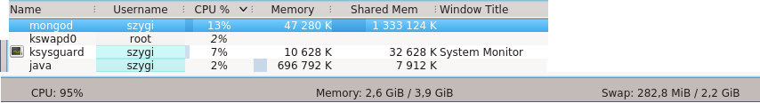

### *Mateusz Szygenda*

----

### Konfiguracja sprzętowa

2 rdzeniowy procesor o taktowaniu 2.4 Ghz

```
vendor_id : GenuineIntel
cpu family  : 6
model   : 15
model name  : Intel(R) Core(TM)2 Duo CPU     E4600  @ 2.40GHz
``` 
4 GB pamięci RAM

Dysk
```
  Model Number:       SAMSUNG HD502HJ                         
  Serial Number:      S20BJ90B741675      
  Firmware Revision:  1AJ100E5
  Transport:          Serial, ATA8-AST, SATA 1.0a, SATA II Extensions, SATA Rev 2.5, SATA Rev 2.6
```

Wersja mongo
```
$ mongo --version
MongoDB shell version: 2.5.2
```

### Zadanie 1a

Plik Train.csv zawiera znaki nowych linii wewnątrz komórek. Jest to zgodne ze standardem CSV jednak mongoimport nie jest w stanie obsłużyć takich plików
(Więcej info https://jira.mongodb.org/browse/SERVER-805)

Aby zaimportować plik postanowiłem usunąć znaki nowych linii występujące wewnątrz komórek. Wykorzystałem do tego wyrażenie regularne

```
perl -p -e 's/([^"\r])\r?\n|^\r?\n$|(["]{2})\n/$1 /g' Train.csv
```

**Polecenie importu**
```
perl -p -e 's/([^"\r])\r?\n|^\r?\n$|(["]{2})\n/$1 /g' Train.csv | mongoimport --type csv --collection trains --db nosql --headerline --drop'
```
**Czas importu**

Ok. 2h (Razem z przetwarzaniem)

**Wykresy**


### Zadanie 1b

Zliczanie ilości zaimportowanych rekordów
```
> use nosql
switched to db nosql
> db.trains.count()
6034195
> 
```

### Zadanie 1c

**Zamiana formatu pola "Tags"** 

Do zamiany formatu przygotowałem aplikację w języku scala.

Driver dla języka scala casbah
(https://github.com/mongodb/casbah)

[Upgrade.scala](../scripts/mszygenda/trainsApp/Upgrade.scala), [TrainsRepository.scala](../scripts/mszygenda/trainsApp/TrainsRepository.scala)

**Wykresy**




**Zliczanie różnych tagów**

Ponownie do zliczenia różnych tagów została wykorzystana aplikacja w języku scala 

[Count.scala](../scripts/mszygenda/trainsApp/Count.scala), [TrainsRepository.scala](../scripts/mszygenda/trainsApp/TrainsRepository.scala)

(Unique Tag Count, Total Count) = (42048,17409994)

**Czas wykonania**

5 minut
 
### Zadanie 1d

**Polecenie importujące bazę danych text8**

```
mongoimport --type csv --db nosql --collection words --fields word text8.txt
```

**Czas wykonania**

~10 minut


**10, 100, 100 najczestszych słów**
 

Top 10 slow:
```
> db.words.aggregate({ $group: { _id: "$word", count: { $sum: 1 } } } , { $sort: { count: -1 } }, { $limit: 10 })
```

Ilosc wszystkich slow
```
> db.words.count()
17005207
```

Ilosc roznych slow
```
> db.words.distinct("word").length
253854
```

**Rozkład procentowy**

Kod dla mongoshell:

```
var totalWordCount = db.words.count()

function sumWordCount(acc, wordGroup) {
  return acc + wordGroup.count
}

function percent(wordCount) {
  return (wordCount / totalWordCount) * 100
}

var top1000 = db.words.aggregate({ $group: { _id: "$word", count: { $sum: 1 } } } , { $sort: { count: -1 } }, { $limit: 1000 }).result
var top100 = top1000.slice(0, 100)
var top10 = top100.slice(0, 10)
var top1 = top10.slice(0, 1)

var top1Percent = percent(top1.reduce(sumWordCount, 0)) 
var top10Percent = percent(top10.reduce(sumWordCount, 0))
var top100Percent = percent(top100.reduce(sumWordCount, 0))
var top1000Percent = percent(top1000.reduce(sumWordCount, 0))
```
Wyniki:

```
> top1Percent
6.241594118789616

> top10Percent
24.733394894869555

> top100Percent
47.03840417820259

> top1000Percent
67.23443001899359
> 
```

### Zadanie 1e

Dane jakie wykorzystałem pochodzą ze strony 

http://earthquake.usgs.gov/earthquakes/search/

Jest to baza zawierająca informacje o bieżących i minionych trzęsieniach ziemi. Serwis umożliwia eksport danych do formatu GeoJSON.

*Ilość rekordów*

```
> db.earthquakes.count()
10231
```

*Przykładowy rekord*

```
{
  "_id" : ObjectId("526bc440a04005b8d34e42b0"),
  "type" : "Feature",
  "properties" : {
    "mag" : 4.2,
    "place" : "11km N of Estebania, Dominican Republic",
    "time" : NumberLong("1382697296310"),
    "updated" : NumberLong("1382724211029"),
    "tz" : -240,
    "url" : "http://comcat.cr.usgs.gov/earthquakes/eventpage/usc000kmxt",
    "detail" : "http://comcat.cr.usgs.gov/fdsnws/event/1/query?eventid=usc000kmxt&format=geojson",
    "felt" : 3,
    "cdi" : 2.1,
    "mmi" : null,
    "alert" : null,
    "status" : "reviewed",
    "tsunami" : null,
    "sig" : 272,
    "net" : "us",
    "code" : "c000kmxt",
    "ids" : ",usc000kmxt,",
    "sources" : ",us,",
    "types" : ",cap,dyfi,geoserve,nearby-cities,origin,phase-data,tectonic-summary,",
    "nst" : null,
    "dmin" : 0.295,
    "rms" : 1.32,
    "gap" : 92,
    "magType" : "mb",
    "type" : "earthquake",
    "title" : "M 4.2 - 11km N of Estebania, Dominican Republic"
  },
  "geometry" : {
    "type" : "Point",
    "coordinates" : [
      -70.6236,
      18.5571
    ]
  },
  "id" : "usc000kmxt"
}
```

**Import danych**
```
mongoimport --db nosql --collection earthquakes --file earthquakes-2012-2013/earthquakes.json --drop
```

**Usunięcie trzeciej współrzędnej (Altitude)**

```
db.earthquakes.update( {}, { $pop: { "geometry.coordinates": 1 } }, {multi: true} );
```

**Utworzenie indeksu**
```
db.earthquakes.ensureIndex({"geometry" : "2dsphere"})
```

**Przygotowanie parametrów do zapytań**

**Wspólrzędne Tokyo**
```
var tokyo = { type: "Point", coordinates: [ 139.697823, 35.685187] }
```

**Polygon otaczający Japonię (mniej więcej)**
```
var japan = { 
  "type": "Polygon",
  "coordinates": [
    [ 
[128.533722, 32.768800],
[129.676300, 32.634749],
[130.544220, 30.173625],
[140.929459, 35.652833],
[145.487618, 44.317953], 
[141.640411, 45.594822], 
[139.652298, 42.360573], 
[128.533722, 32.768800]
    ]
  ]
}
```

**Okrąg otaczający Australię**

```
var australiaCenterPt = { type: "Point", coordinates: [135.42627, -25.403585]  }
var australiaRadius = 1100 / 1.6 / 3959
var australiaCircle = [ australiaCenterPt.coordinates, australiaRadius ]
```

**Prostokąt otaczający Australię**

```
var australiaBox = [ [116.617676, -34.957995], [153.619629,-16.383391] ]
```

**10 najbliższych eventów w okolicy Tokyo***

```
db.earthquakes.find({ geometry: { $near: {$geometry: tokyo} } }).limit(10)
```

**Trzesienia ziemi na terytorium Japonii (polygon)**

```
db.earthquakes.find({ geometry: { $geoWithin: { $geometry: japan } } })
```

**Obiekty które przecinają terytorium Japonii**

W tym przypadku jest to ten sam zbiór danych co powyższy (Mamy tylko punkty)

```
db.earthquakes.find({ geometry: { $geoIntersects: { $geometry: japan } } })
```

**Trzęsienia ziemi na terytorium Australii (circle)**

```
db.earthquakes.find( { geometry: { $geoWithin: { $centerSphere: australiaCircle } } })
```

**Trzęsienia ziemi na terytorium Australii (box)**

```
db.earthquakes.find( { geometry: { $geoWithin: { $box: australiaBox} } })
```
