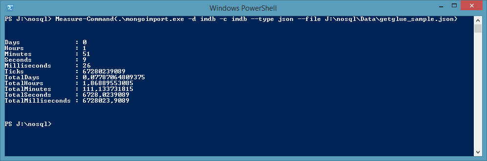
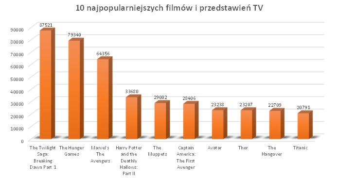
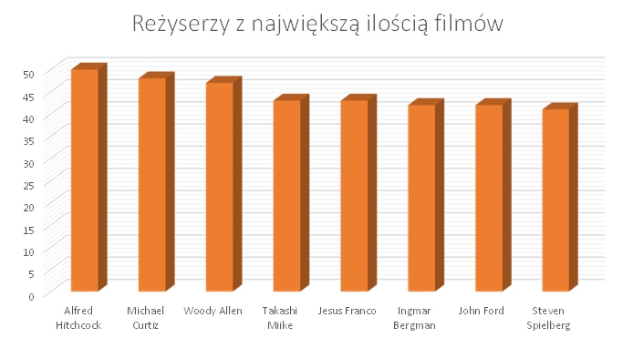
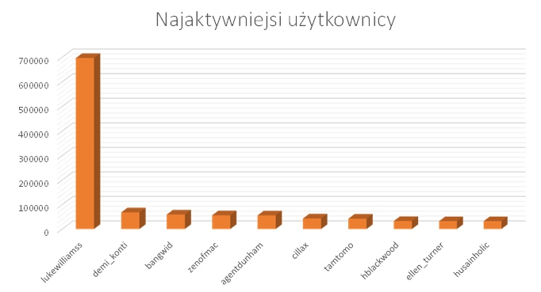
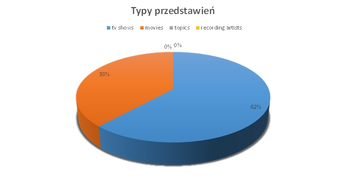

### *Michał Wąsowicz*

----

## Dane

[GetGlue and Timestamped Event Data](http://getglue-data.s3.amazonaws.com/getglue_sample.tar.gz) (ok. `11 GB`, `19 831 300` json-ów, próbka 100 jsonów [getglue101](https://github.com/nosql/aggregations-2/blob/master/data/wbzyl/getglue101.json)). Są to dane z [IMDB](http://www.imdb.com/) z lat 2007–2012, tylko filmy i przedstawienia TV. 

Przykładowy dokument `json`:

```json
{
  "_id": ObjectId("5276918832cf3c2b84540440"),
  "comment": "",
  "modelName": "movies",
  "displayName": "",
  "title": "The Dark Knight",
  "timestamp": "2008-10-28T16:47:31Z",
  "image": "http://ia.media-imdb.com/images/...@@._V1._SX94_SY140_.jpg",
  "userId": "sippey",
  "private": "false",
  "director": "Christopher Nolan",
  "source": "http://www.imdb.com/title/tt0468569/",
  "version": "1",
  "link": "http://www.imdb.com/title/tt0468569/",
  "lastModified": "2011-12-16T19:39:33Z",
  "action": "Liked",
  "lctitle": "the dark knight",
  "objectKey": "movies/dark_knight/christopher_nolan"
}
```

### Import

```sh
mongoimport -d imdb -c imdb --type json --file getglue_sample.json
```



Po imporcie możemy sprawdzić, ile rekordów zostało zaimportowanych do bazy:
    
```sh
db.imdb.count()
19831300
```


## Agregacje
### Agregacja 1

Agregacja odpowiada na pytanie, jakie jest 10 najpopularniejszych filmów i przedstawień TV?

#### Kod agregacji

``` js
db.imdb.aggregate(
    { $match: {"modelName": "movies" || "tv_shows"  } },
    { $group: {_id: "$title", count: {$sum: 1}} },
    { $sort: {count: -1} },
    { $limit : 10}
    );
```

#### Wynik
```json
{
  "result" : [
    { "_id" : "The Twilight Saga: Breaking Dawn Part 1",       "count" : 87521 },
    { "_id" : "The Hunger Games",                              "count" : 79340 },
    { "_id" : "Marvel's The Avengers",                         "count" : 64356 },
    { "_id" : "Harry Potter and the Deathly Hallows: Part II", "count" : 33680 },
    { "_id" : "The Muppets",                                   "count" : 29002 },
    { "_id" : "Captain America: The First Avenger",            "count" : 28406 },
    { "_id" : "Avatar",                                        "count" : 23238 },
    { "_id" : "Thor",                                          "count" : 23207 },
    { "_id" : "The Hangover",                                  "count" : 22709 },
    { "_id" : "Titanic",                                       "count" : 20791 }
  ],
  "ok" : 1
}
```
#### Wykres




### Agregacja 2

Agragacja ma policzyć i zwrócić 10 reżyserów, którzy mają na swoim koncie najwiekszą liczbę filmów.

#### Kod agregacji

``` js
db.imdb.aggregate(
    { $match: {"modelName": "movies" || "tv_shows"  } },
    { $group: {_id: {"dir": "$director", id: "$title"}, count: {$sum: 1}} },
    { $group: {_id: "$_id.dir" , count: {$sum: 1}} },
    { $sort: {count: -1} },
    { $limit : 10}
    );
```

##### Wynik

```json
{
  "result" : [
    { "_id" : "not available",      "count" : 1474  },
    { "_id" : "various directors",  "count" : 54    },
    { "_id" : "alfred hitchcock",   "count" : 50    },
    { "_id" : "michael curtiz",     "count" : 48    },
    { "_id" : "woody allen",        "count" : 47    },
    { "_id" : "takashi miike",      "count" : 43    },
    { "_id" : "jesus franco",       "count" : 43    },
    { "_id" : "ingmar bergman",     "count" : 42    },
    { "_id" : "john ford",          "count" : 42    },
    { "_id" : "steven spielberg",   "count" : 41    }
  ],
  "ok" : 1
}
```

#### Wykres
W wyniku agregacji uwzględnione zostały wartości "not available" oraz "various directors", które z oczywistych względów pominąłem na wykresie.




## Elasticsearch
#### Import

Do masowego importu danych do Elasticsearch'a wykorzystujemy [`Bulk API`](http://www.elasticsearch.org/guide/en/elasticsearch/reference/current/docs-bulk.html), którego API wymaga "przeplatanych" JSON'ów o następującej strukturze:

```js
{ "index": { "_type": "type name" } } //nazwa typu, do którego chcemy dodać dokument
{ "field": "content" ... } //dokument
```

Do wygenerowania takich "przeplatanych" JSON'ów możemy wykorzystać program [`jq`](http://stedolan.github.io/jq/).

```sh
time cat getglue_sample.json | jq --compact-output '{ "index": { "_type": "imdb" } }, .' 
  > getglue_sample.bulk
```

#### Wynik

W wyniku działania programu otrzymujemy "przeplatane" JSON'y:

```json
{
  "index": {
    "_type": "imdb"
  }
}
{
  "objectKey": "tv_shows/criminal_minds",
  "hideVisits": "false",
  "modelName": "tv_shows",
  "displayName": "",
  "title": "Criminal Minds",
  "timestamp": "2008-08-01T06:58:14Z",
  "image": "http://cdn-1.nflximg.com/us/boxshots/large/70056671.jpg",
  "userId": "areilly",
  "visitCount": "1",
  "comment": "",
  "private": "false",
  "source": "http://www.netflix.com/Movie/Criminal_Minds_Season_1/70056671",
  "version": "2",
  "link": "http://www.netflix.com/Movie/Criminal_Minds_Season_1/70056671",
  "lastModified": "2011-12-16T19:41:19Z",
  "action": "Liked",
  "lctitle": "criminal minds"
}
```

W pliku `getglue_sample.bulk` znajduje się `39 662 600` JSON'ów (`11,3 GB`).
Próba wykonania importu całego pliku `getglue_sample.bulk` konczy się niepowodzeniem.

```sh
curl -s -XPOST localhost:9200/data/_bulk --data-binary @getglue_sample.bulk
```

Polecenie `curl` próbuje wczytać cały plik do pamięci, a baza danych najprawdopodobniej nie jest w stanie przyjąć tak dużej ilości danych na raz. Pojawia się wyjątek `TooLongFrameException`.

Rozwiązaniem jest podział pliku na kilka mniejszych części (np. po `100 000` linii - 50 000 dokumentów do dodania):

```sh
split -l 100000 getglue_sample.bulk
```

Oraz import utworzonych plików w pętli:

```sh
time for i in x*; do curl -s -XPOST localhost:9200/data/_bulk --data-binary @$i; done
```

### Wynik

Sprawdzamy, ile obiektów zostało zapisanych w bazie

```sh
curl -XGET 'http://localhost:9200/data/imdb/_count' ; echo
```

```json
{"count":19766542,"_shards":{"total":1,"successful":1,"failed":0}}
```

Zaimportowało się `19 766 542`. Brakuje zatem `64 758` obiektów. Z logu importu wynika, iż spowodowane jest to niepoprawnym formatem daty, co skutkowało odrzuceniem obiektów. W w dalszej części niezaimportowane wpisy pomijamy.


## Agregacje

Do wykonania aggregacji w Elasticsearch wykorzystamy [`wyszukiwania fasetowego`](http://en.wikipedia.org/wiki/Faceted_search) - [`facets search w ES`](http://www.elasticsearch.org/guide/en/elasticsearch/reference/current/search-facets.html).

Do wykonywania zapytań użyjemy biblioteki [`CURL`](http://pl.wikipedia.org/wiki/CURL):

```sh
curl -X POST "http://localhost:9200/data/_search?pretty=true" -d '{ "query": { } }'
```

### Agregacja 3

Agregacja ma policzyć, ile akcji wykonał każdy z użytkowników i zwrócić dziesięciu najaktywniejszych.

#### Kod agregacji

```json
{
    "query": {
        "match_all": {}
    },
    "facets": {
        "action": {
            "terms": {
                "field" : "director",
                "size" : "10"
            }
        }
    }
}
```

#### Wynik

```json
{
  "facets": {
    "userId": {
      "terms": [
        { "count": 696750, "term": "lukewilliamss" },
        { "count": 68131,  "term": "demi_konti"    },
        { "count": 59257,  "term": "bangwid"       },
        { "count": 56044,  "term": "zenofmac"      },
        { "count": 55736,  "term": "agentdunham"   },
        { "count": 43153,  "term": "cillax"        },
        { "count": 42299,  "term": "tamtomo"       },
        { "count": 32824,  "term": "hblackwood"    },
        { "count": 32237,  "term": "ellen_turner"  },
        { "count": 32133,  "term": "husainholic"   }
      ],
      "other": 18648036,
      "total": 19766600,
      "missing": 0,
      "_type": "terms"
    }
  },
  "hits": {
    //...
  },
  "_shards": {
    "failed": 0,
    "successful": 1,
    "total": 1
  },
  "timed_out": false,
  "took": 6391
}
```

#### Wykres




### Agregacja 4

Agregacja ma policzyć, ile jest poszczególnych typów przedstawień

#### Kod agregacji

```json
{
    "query": {
        "match_all": {}
    },
    "facets": {
        "modelName": {
            "terms": {
                "field" : "modelName",
                "size": "10"
            }
        }
    }
}
```

##### Wynik

```json
"facets": {
    "modelName": {
      "_type": "terms",
      "missing": 56,
      "total": 19766486,
      "other": 0,
      "terms": [
        {
          "term": "tv_shows",
          "count": 12208046
        },
        {
          "term": "movies",
          "count": 7558406
        },
        {
          "term": "topics",
          "count": 23
        },
        {
          "term": "recording_artists",
          "count": 11
        }
      ]
    }
  }
}
```

#### Wykres

