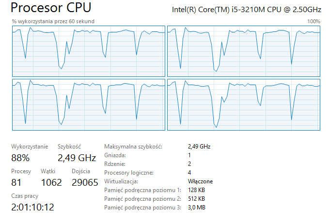
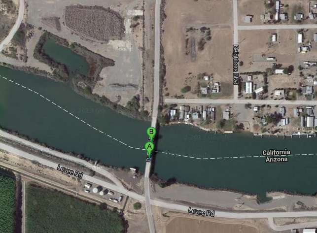
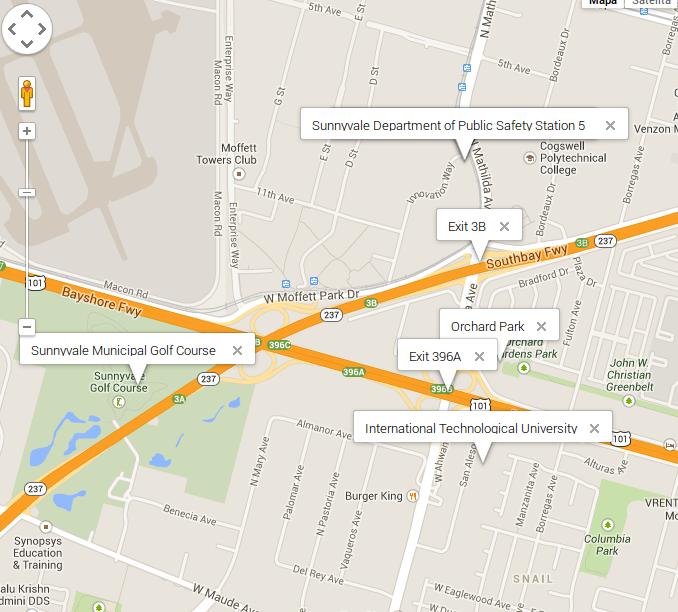

### Mateusz Żarkowski

*Wersja mongo Production Release (2.4.8)*

Zadania 1a-d zostały wykonane na systemie Windows 8 pod konsolą PowerShell.
Zadanie 1e zostało wykonane na Ubuntu 13.04

Sprzęt:
Procesor Intel Core i5-3210M @ 2.50 GHZ
Dysk HDD, zwyky.
Pamięć RAM 8GB

###Rozwiązania:

* [Zadanie 1a](###zadanie-1a)
* [Zadanie 1b](###zadanie-1c)
* [Zadanie 1c](###zadanie-1c)
* [Zadanie 1d](###zadanie-1d)
* [Zadanie 1e](###zadanie-1e)

###Zadanie 1a
Zadanie 1a polega na zaimportowaniu, do bazy MongoDB uruchomionej na swoim komputerze, danych z pliku Train.csv bazy

Plik Train.csv nie spenia warunkw do użycia mongoimport (json musi si znajdować w jednej linijce). Naprawiamy to poleceniem:

```
cat Train.csv |tr -d '\n'|sed 's/\r/\r\n/g' > TTrain.csv
```
Pozostał już tylko import:

```
PowerShell$ Measure-Command {mongoimport --type csv -c Train --file C:\zadanie\Train.csv --headerline}
```


##### Wnioski

Pamięć na początku - 2.5 GB
Pamięć na końcu - 8 GB
Pamięć była zużywana skokowo, po ~300MB, podczas "allocating new datafile"


Użycie dysku wahało się między 0-100%.

100% użycia podczas "allocating new datafile", screen poniżej.


Skoki do 100% podczas "inserting data", screen poniżej.


Zużycie procesora było stałe, na poziomie 30%.


###Zadanie 1b
Zadanie polega na zliczeniu zaimportowanych rekordów. Odpowiedź powinna być 6_034_195.

```js
db.train.count()
6034195
```
Czyli się zgadza.


###Zadanie 1c
Zamienić string zawierający tagi na tablicę napisów z tagami następnie zliczyć wszystkie tagi i wszystkie różne tagi. Napisać program, który to zrobi korzystając z jednego ze sterowników.


Do rozwiązania zadania napisałem program w Scali i użyłem sterownika ReactiveMongo ("fully non-blocking and asynchronous") działającego wielowątkowo.

```scala
package com.mycode
import reactivemongo.bson._
import play.api.libs.iteratee.Iteratee
import akka.actor.Actor
import akka.event.Logging
import akka.actor.ActorSystem
import scala.concurrent.ExecutionContext
import java.util.concurrent.Executors

object App {
  
    private val GLOBAL_THREAD_LIMIT = {
  val ret = Runtime.getRuntime.availableProcessors() / 2
  if (ret > 5) {
    5
  } else {
    ret
  }
}
  
  import reactivemongo.api._
  import scala.concurrent.ExecutionContext.Implicits.global

  val driver = new MongoDriver
  val connection = driver.connection(List("localhost"))
  val db = connection("test")
  val collection = db("Train")
  

  case class Train(id: Option[BSONObjectID], Tags : String)
  
  implicit object TrainReader extends BSONDocumentReader[Train] {
    def read(doc: BSONDocument): Train =
      Train(
        doc.getAs[BSONObjectID]("_id"),
        doc.getAs[String]("Tags").get)
  }
  
  def convertToArray = {
      val query = BSONDocument()
      val filter = BSONDocument(
    		  "Tags" -> 1,
    		  "_id" -> 1)
    
	  val cursor = collection.find(query, filter).options(QueryOpts().batchSize(1000000)).cursor[Train]
	  cursor.toList(1000000).map{ doc =>
	    val modifier = BSONDocument(
          "$set" -> BSONDocument(
                "Tags" -> doc.Tags.split(" ")))
      collection.update(BSONDocument("_id" -> doc.id.get), modifier).map{_ => println("Document updated")}
	   }
  }
  
  
  def main(args : Array[String]) {
    println( "Converting to array..." )
    //Update dziala asynchronicznie w stosunku do iterowania po kolekcji
    convertToArray.map{_ => println("Ok.")}
  }
  
}
```

Import trwał niecałe 20 minut. 

Ilość różnych tagów:
```
db.train.distinct("Tags").length
42048
```

Ilość wszystkich tagów:
```
db.train.aggregate(
  {
    $project:{"Tags":1}},
    {$unwind: "$Tags"},
    {$group:{"_id":"result",count:{$sum:1}}
  }
```
#### ReactiveMongo vs. Casbah
Zauważyłem, że Mateusz Szygenda w swoim rozwiązaniu użył sterownika Casbah dla Scali (działającego synchronicznie i "blokująco" ale za to jest to sterownik oficjalnie polecany przez zespół MongoDB). Import w Casbah na moim komputerze trwał 50 minut. Czyli 2.5 razy dłużej.

Obrazki poniżej wyjaśniają dlaczego. Poniżej zużycie zasobów podczas skryptu z ReactiveMongo. Zużycie procesora na poziomie 40%, skokowo do 88%, dysku 100% (wąskie gardło) i pamięć 100% (JVM musiała "odśmiecać").


Skokowe zużycie procesora:



Natomiast podczas skryptu Casbah średnie zużycie dysku było na poziomie 30%, tylko skokowo 100%. Procesora też 30% i dlatego Casbah okazał się tutaj wolniejszy od ReactiveMongo. Pamięć RAM zużyta do końca, ale skokowo, tak samo jak w ReactiveMongo.


###Zadanie 1d
Ściągnąć plik text8.zip, zapisać wszystkie słowa w bazie MongoDB. Następnie zliczyć liczbę słów oraz liczbę różnych słów w tym pliku. Ile procent całego pliku stanowi:

* najczęściej występujące słowo w tym pliku
* 10, 100, 1000 najczęściej występujących słów w tym pliku

Do oczyszczenia pliku wykorzystałem wskazówki w opisie zadanie:
```
tr --delete '[:alnum:][:blank:]' < text8 > deleted.txt
tr --squeeze-repeats '[:blank:]' '\n' < text8 > text8.txt
```
Import:
Measure-Command {./mongoimport --type csv -f word -d text8 -c text8 --file C:\zadanie\text8.txt}


#### Wszystkie słowa
```
> db.text.aggregate({$group:{_id: "$word", count:{$sum:1}}},{$group:{_id:"sumaAll",count:{$sum:1}}})
{
    "result" : [
        {
            "_id" : "sumaAll",
            "count" : 253854
        }
    ],
    "ok" : 1
}
```

#### Procentowy udział najczęstszego słowa

```
db.text.aggregate({$group:{_id: "$word", count:{$sum:1}}},{$sort:{count:-1}},{$limit:1}, {$group:{_id:"sumAll",count:{$sum:"$count"}}}, {$project:{_id:"$_id",percent:{$multiply:[{$divide:["$count",17005207]},100]}}})
```


#### Procentowy udział 10 najczęściej występujących słów
```
db.text.aggregate({$group:{_id: "$word", count:{$sum:1}}},{$sort:{count:-1}},{$limit:10}, {$group:{_id:"sumAll",count:{$sum:"$count"}}}, {$project:{_id:"$_id",percent:{$multiply:[{$divide:["$count",17005207]},100]}}})
```


#### Procentowy udział 100 najczęściej występujących słów
```
db.text.aggregate({$group:{_id: "$word", count:{$sum:1}}},{$sort:{count:-1}},{$limit:100}, {$group:{_id:"sumAll",count:{$sum:"$count"}}}, {$project:{_id:"$_id",percent:{$multiply:[{$divide:["$count",17005207]},100]}}})
```


#### Procentowy udział 1000 najczęściej występujących słów
```
db.text.aggregate({$group:{_id: "$word", count:{$sum:1}}},{$sort:{count:-1}},{$limit:1000}, {$group:{_id:"sumAll",count:{$sum:"$count"}}}, {$project:{_id:"$_id",percent:{$multiply:[{$divide:["$count",17005207]},100]}}})
```


###Zadanie 1e
Zadanie 1e polega na znalezieniu w sieci danych, zawierających obiekty GeoJSON. Należy zapisać te dane w bazie MongoDB. Dla zapisanych danych przygotować 6–9 różnych Geospatial Queries (co najmniej po jednym dla obiektów Point, LineString i Polygon). W przykładach należy użyć każdego z operatorów: $geoWithin, $geoIntersect, $near.

Do rozwiązania zadania użyłem danych ze strony [United States Board on Geographic Names](http://geonames.usgs.gov/domestic/download_data.htm) dla stanu California.

[Dane](http://geonames.usgs.gov/docs/stategaz/CA_Features_20131208.zip)

Przykładowy rekord:
```
{
	"_id" : ObjectId("52d1add069206b6edc76aacb"),
	"id" : 2928,
	"name" : "Cibola Bridge",
	"loc" : {
		"type" : "Point",
		"coordinates" : [
			-114.6577346,
			33.4128076
		]
	}
}
```


#### $near
W pobliżu 100m od Cibola Bridge
```
db.geoca.find({ loc: {$near: {$geometry: { 
    "type" : "Point", 
    "coordinates" : [ -114.6577346,  33.4128076 ] 
}}, $maxDistance: 100} }).toArray()
```

W tym przypadku baza zawierała jeszcze jeden rekord Cibola Bridge:



### $geoWithin
Zdefiniujmy sobie obszar w którym znajduje się Cibola Bridge:


```
var obszar = { 
    "type" : "Polygon", 
    "coordinates" : 
    [ [ 
        [ -114.666052 , 33.423705 ],
        [ -114.637728 , 33.425424 ], 
        [ -114.658155 , 33.393326 ],
	    [ -114.666052 , 33.423705 ]
    ] ]
};
```

i poszukajmy:

```
db.geoca.find({ loc : { $geoWithin : { $geometry : obszar } } }).toArray();
```

Wynik zgodny z oczekiwaniami.


#### $geoIntersects
33.426714,-114.657362

```
var linia = { 
    "type" : "LineString", 
    "coordinates" : 
    [ 
        [ -114.6577346 , 33.4228076 ],
        [ -114.6577346 , 33.4028076 ]
    ] 
};
```


Zapytanie

```
db.geony.find({ loc : { $geoIntersects : { $geometry : linia } } }).toArray();
```

wynik zgodny z oczekiwaniami:

```
[
	{
		"_id" : ObjectId("52d1add069206b6edc76aacb"),
		"id" : 2928,
		"name" : "Cibola Bridge",
		"loc" : {
			"type" : "Point",
			"coordinates" : [
				-114.6577346,
				33.4128076
			]
		}
	},
	{
		"_id" : ObjectId("52d1add569206b6edc782a25"),
		"id" : 1868150,
		"name" : "Cibola Bridge",
		"loc" : {
			"type" : "Point",
			"coordinates" : [
				-114.6577346,
				33.4130854
			]
		}
	}
]
```
Oczywiście punkty dobrałem tak, aby znalazł się tam Cibola Bridge, spóbujmy z losowymi punktami przechodzącymi przez stan California. 

```
var linia = { 
    "type" : "LineString", 
    "coordinates" : 
    [ 
        [ -124.46045 , 37.160317 ],
        [ -74.58252 , 36.668419 ]
    ] 
};
```


Zapytanie

```
db.geony.find({ loc : { $geoIntersects : { $geometry : linia } } }).toArray();
```

Tym razem wynik jest pusty.


Na koniec poszukajmy obiektów w promieniu 1km od geograficznego środka Doliny Krzemowej.

```
db.geony.find({ loc: {$near: {$geometry: { 
    "type" : "Point", 
    "coordinates" : [ -122.03516,  37.401801 ] 
}}, $maxDistance: 1000} }).toArray()
```



[Link do mapy](http://savedbythegoog.appspot.com/?id=47b19d70d6cb17209785864d0d75a38edb5be072)
