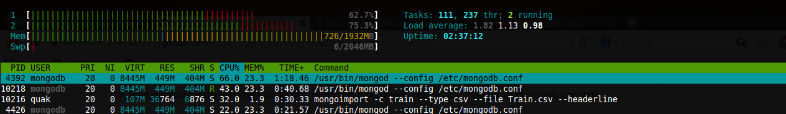
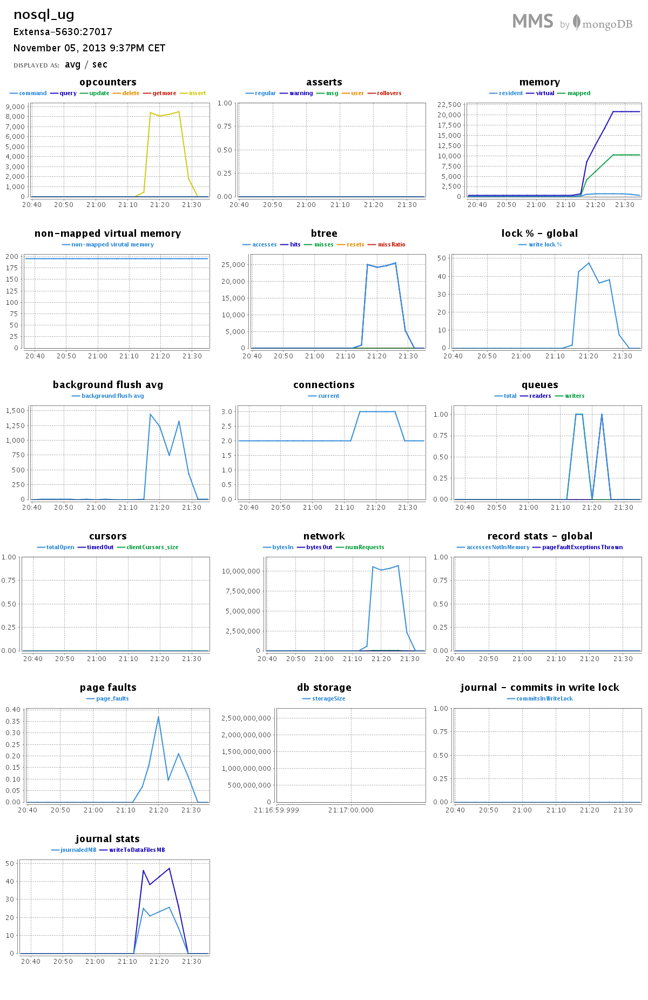
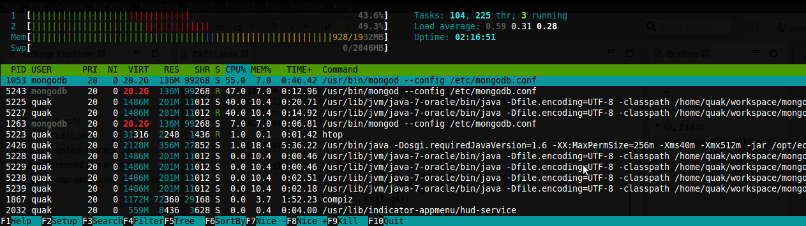

### *Piotr Kłeczek*

----

### Zadanie 1
#### Konfiguracja
Laptop Acer Extensa 5630EZ z procesorem [Intel® Pentium® Processor T4200(1M Cache, 2.00 GHz, 800 MHz FSB)](http://ark.intel.com/pl/products/37251/Intel-Pentium-Processor-T4200-1M-Cache-2_00-GHz-800-MHz-FSB) oraz 2GB ramu.

System Ubuntu 12.04 LTS 64-bitowy

##### MongoDB
```sh
$ mongo --version
MongoDB shell version: 2.4.8
```


#### 1a) Import *Train.csv*

##### Przygotowanie danych
```sh
$ time ./prepareData.sh Train1.csv Train.csv
real    15m14.076s
user    0m42.700s
sys 	1m57.932s
```
##### Import
```sh
$ time mongoimport -db train -c train -type csv -file Train.csv --headerline
Tue Nov  5 21:26:51.082 imported 6034195 objects

real    12m4.822s
user    2m38.012s
sys     0m25.052s
```
##### Obciążenie podczas importu


##### Rozmiar bazy
```sh
$ mongo
MongoDB shell version: 2.4.8
connecting to: test
> show dbs
local   0.078125GB
train   11.9482421875GB
```

##### Wykresy MMS



#### 1b) Liczba zaimportowanych rekordów
```sh
$ mongo
MongoDB shell version: 2.4.8
connecting to: test
> use train
switched to db train
> db.train.count()
6034195
```

#### 1c) Zamiana formatu oraz zliczanie tagów
Napisałem program w Javie, użyłem mongo-java-driver-2.11.3.jar
##### Zad1c.java
```java
package mongo1c;

import java.net.UnknownHostException;
import java.util.HashMap;
import java.util.Map;

import com.mongodb.BasicDBObject;
import com.mongodb.DB;
import com.mongodb.DBCollection;
import com.mongodb.DBCursor;
import com.mongodb.MongoClient;

public class Zad1c {

	public static void main(String[] args) throws UnknownHostException {
		
		int allTags = 0;
		String objTags[];
		Map<String, Boolean> uniqueTags = new HashMap<String, Boolean>();
		long time1,time2;
		
		time1 = System.currentTimeMillis()/1000;
		MongoClient mongoClient = new MongoClient("localhost", 27017);
		DB db = mongoClient.getDB("train");		
		DBCollection coll = db.getCollection("train");
		
		DBCursor cursor = coll.find();
		try {
			while(cursor.hasNext()) {
				BasicDBObject obj = (BasicDBObject)cursor.next();
				objTags = obj.getString("tags").split(" ");
				obj.put("tags", objTags);
				coll.save(obj);
				
				allTags += objTags.length;
				for(int i=0;i<objTags.length;i++) {
					if(uniqueTags.get(objTags[i]) == null)
						uniqueTags.put(objTags[i], true);
				}
			}
		} finally {
			time2 = System.currentTimeMillis()/1000;
			System.out.println("Wszystkie tagi: "+allTags);
			System.out.println("Unikalne tagi: "+uniqueTags.size());
			System.out.println("Przetwarzanie zajęło "+(time2-time1)/60+"m "+(time2-time1)%60+"s");
			cursor.close();
		}
		
		mongoClient.close();
	}

}
```
##### Obciążenie podczas działania



##### Wynik
```sh
Wszystkie tagi: 29370102
Unikalne tagi: 100779
Przetwarzanie zajęło 64m 35s
```