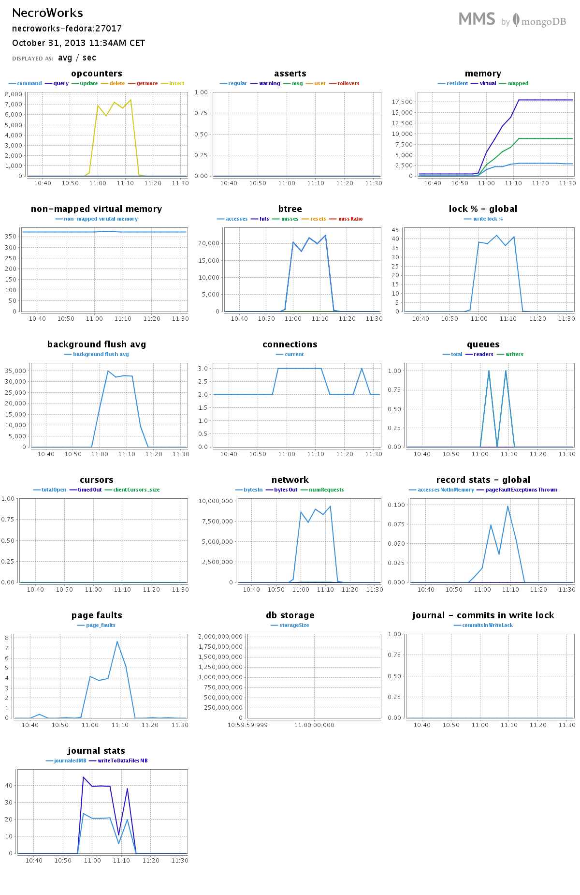

# *Przemysław Królik*

----

## Zadanie 1a/b

Plik Train.scv został wstępnie przetworzony przy pomocy skryptu dostępnego na [gicie](../scripts/wbzyl/2unix.sh).
Poprzez uruchomienie komendy 
```sh
time ./2unix.sh Train.csv TrainOutput.csv
``` na systemie fedora 19 zainstalowanym na zewnętrznym dysku HDD czas osiągnął wynik:
```sh
real	41m2.182s
user	3m13.246s
sys	3m49.076s

```

Polecenie użyte do zimportowania danych:
```sh
mongoimport -c train --type csv --file TrainOutput.csv --headerline
```

czas działania wyniósł:
```sh
real	14m44.353s
user	2m25.567s
sys	0m15.774s
```

ilość zimportowanych obiektów: 
```sh
Thu Oct 31 11:12:20.747 imported 6034195 objects
```
oraz sprawdzenie w bazie:
```js
> use trainz
switched to db trainz
> db.train.count()
6034195
```
###Wynik z MMS


###Zadanie 1c
Wynik czasowy i ilość elementów dla zmiany z stringów na tagi przy pomocy [skryptu](../scripts/pkrolik/mongoscript.js) napisanego w shell'u MongoDB:
```sh
Suma tagów: 17408733
Unikalnych tagów: 42048

real	21m4.373s
user	3m37.546s
sys	0m33.099s
```
###Wynik z MMS


###Zadanie 1d
Po sprawdzeniu i przygotowaniu pliku zgodnie z podpowiedzią po imporcie otrzymałem następujący wynik czasowy:
```sh
Fri Nov  1 14:51:57.381 check 9 17005207
Fri Nov  1 14:51:57.769 imported 17005207 objects

real	5m24.259s
user	0m32.765s
sys	0m8.688s
```
###Wynik z MMS

####Ilość wszystkich słów
```js
> db.text.aggregate({$group:{_id: "$word", count:{$sum:1}}},{$group:{_id:"sumaAll",count:{$sum:1}}})
{
	"result" : [
		{
			"_id" : "sumaAll",
			"count" : 253854
		}
	],
	"ok" : 1
}
```
####1 słowo
```js
> db.text.aggregate({$group:{_id: "$word", count:{$sum:1}}},{$sort:{count:-1}},{$limit:1})
{ "result" : [ { "_id" : "the", "count" : 1061396 } ], "ok" : 1 }
```
Udział procentowy słowa `the`:
```js
> db.text.aggregate({$group:{_id: "$word", count:{$sum:1}}},{$sort:{count:-1}},{$limit:1}, {$group:{_id:"sumAll",count:{$sum:"$count"}}}, {$project:{_id:"$_id",percent:{$multiply:[{$divide:["$count",17005207]},100]}}})
{
	"result" : [
		{
			"_id" : "sumAll",
			"percent" : 6.241594118789616
		}
	],
	"ok" : 1
}

```
####10 słów
```js
> db.text.aggregate({$group:{_id: "$word", count:{$sum:1}}},{$sort:{count:-1}},{$limit:10})
{
	"result" : [
		{
			"_id" : "the",
			"count" : 1061396
		},
		{
			"_id" : "of",
			"count" : 593677
		},
		{
			"_id" : "and",
			"count" : 416629
		},
		{
			"_id" : "one",
			"count" : 411764
		},
		{
			"_id" : "in",
			"count" : 372201
		},
		{
			"_id" : "a",
			"count" : 325873
		},
		{
			"_id" : "to",
			"count" : 316376
		},
		{
			"_id" : "zero",
			"count" : 264975
		},
		{
			"_id" : "nine",
			"count" : 250430
		},
		{
			"_id" : "two",
			"count" : 192644
		}
	],
	"ok" : 1
}
```
Procentowy wynik udziału tych słów w całkowitej ilości wynosi:
```js
> db.text.aggregate({$group:{_id: "$word", count:{$sum:1}}},{$sort:{count:-1}},{$limit:10}, {$group:{_id:"sumAll",count:{$sum:"$count"}}}, {$project:{_id:"$_id",percent:{$multiply:[{$divide:["$count",17005207]},100]}}})
{
	"result" : [
		{
			"_id" : "sumAll",
			"percent" : 24.733394894869555
		}
	],
	"ok" : 1
}

```
####100 słów
```js
> db.text.aggregate({$group:{_id: "$word", count:{$sum:1}}},{$sort:{count:-1}},{$limit:100})
{
	"result" : [
		{
			"_id" : "the",
			"count" : 1061396
		},
		{
			"_id" : "of",
			"count" : 593677
		},
		//...
		{
			"_id" : "while",
			"count" : 12363
		},
		{
			"_id" : "where",
			"count" : 12347
		}
	],
	"ok" : 1
}
```
Pełen wynik wszystkich słów dostępny [tu](/pkrolik/zad1d-100.txt).

Procentowy wynik udziału tych słów w całkowitej ilości wynosi:
```js
> db.text.aggregate({$group:{_id: "$word", count:{$sum:1}}},{$sort:{count:-1}},{$limit:100}, {$group:{_id:"sumAll",count:{$sum:"$count"}}}, {$project:{_id:"$_id",percent:{$multiply:[{$divide:["$count",17005207]},100]}}})
{
	"result" : [
		{
			"_id" : "sumAll",
			"percent" : 47.03840417820259
		}
	],
	"ok" : 1
}
```
####1000 słów
```js
> db.text.aggregate({$group:{_id: "$word", count:{$sum:1}}},{$sort:{count:-1}},{$limit:1000})
{
	"result" : [
		{
			"_id" : "the",
			"count" : 1061396
		},
		{
			"_id" : "of",
			"count" : 593677
		},
		//...
		{
			"_id" : "takes",
			"count" : 1783
		},
		{
			"_id" : "fall",
			"count" : 1783
		}
	],
	"ok" : 1
}
```
Pełen wynik wszystkich słów dostępny [tu](/pkrolik/zad1d-1k.txt).

Procentowy wynik udziału tych słów w całkowitej ilości wynosi:
```js
> db.text.aggregate({$group:{_id: "$word", count:{$sum:1}}},{$sort:{count:-1}},{$limit:1000}, {$group:{_id:"sumAll",count:{$sum:"$count"}}}, {$project:{_id:"$_id",percent:{$multiply:[{$divide:["$count",17005207]},100]}}})
{
	"result" : [
		{
			"_id" : "sumAll",
			"percent" : 67.23443001899359
		}
	],
	"ok" : 1
}
```
###Zadanie 1e
Dane które znalazłem są udostępnione dzięki Poczcie Polskiej pod [tym](http://eprzesylka.poczta-polska.pl/) adresem i zawierają lokalizacje placówek które umożliwiają odbiór E-PRZESYŁEK.

Na początku trzeba zmienić kodowanie pliku:
```sh
iconv -f Windows-1250 -t UTF-8 E-Przesylka-PlacowkiPP-csv.csv | tr ';' ',' > listaPlacowek.csv
```

oraz usunąć zbędne znaki:
```sh
sed 's/#,,/,/g' listaPlacowek.csv > lp.csv
```

Następnie importujemy cały zestaw danych do mongo:
```sh
time mongoimport -d geo --authenticationDatabase admin -u necromos -p necromos -c placowki --type csv --file lp.csv --headerline
connected to: 127.0.0.1
Fri Nov  1 16:48:10.933 check 9 3146
Fri Nov  1 16:48:10.954 imported 3145 objects

real	0m0.137s
user	0m0.058s
sys	0m0.027s

```

Efekt po wyżej wymienionych operacjach jest taki:
```js
> db.placowki.count()
3145
> db.placowki.findOne()
{
	"_id" : ObjectId("5273cd3a7e6a31973c55bbf7"),
	"PNI" : 232385,
	"y" : 50.681888,
	"x" : 16.608666,
	"województwo" : "DOLNOŚLĄSKIE",
	"powiat" : "dzierżoniowski",
	"gmina" : "Bielawa",
	"nazwa placówki" : "UP Bielawa 1",
	"kod pocztowy" : "58-260",
	"miejscowość" : "Bielawa",
	"ulica" : "ul. Piastowska 16",
	"telefon" : "74-833-44-46",
	"godziny pracy - opis" : "dni robocze: 08:00-18:00#soboty: 08:00-14:00#niedziele i święta: placówka nieczynna#Placówka dostosowana do potrzeb osób niepełnosprawnych.",
	"stan placówki" : ""
}

```
Poddałem te dane jednak obróbce i dzięki [skryptowi](../scripts/pkrolik/placowki.js)
```js 
mongo placowki.js
```
otrzymałem następujący wynik:
```js
> use geo
switched to db geo
> db.placowki.count()
3145
> db.placowki.findOne()
{
	"_id" : ObjectId("5274b541d5f86ac785eec241"),
	"PNI" : 232385,
	"woj" : "DOLNOŚLĄSKIE",
	"powiat" : "dzierżoniowski",
	"gmina" : "Bielawa",
	"nazwa" : "UP Bielawa 1",
	"miasto" : "Bielawa",
	"loc" : {
		"type" : "Point",
		"coordinates" : [
			16.608666,
			50.681888
		]
	}
}
```

Korzystając z danych zebranych przez Jacka Dermonta skonstruowałem zapytania odnoszące się do lokalizacji miast:

####1.
Wyszukaj wszystkie placówki poczty wydające E-PRZESYŁKI w maksymalnej odległości 1km od punktu miasta Gdańsk:
```js
> var gdansk = {type: "Point", coordinates: [18.638,54.360]}
> db.placowki.find({loc:{$near: {$geometry: gdans},$maxDistance: 1000}})
{ "_id" : ObjectId("5274c0ef4e90569cf90189f5"), "PNI" : 239029, "woj" : "POMORSKIE", "powiat" : "Gdańsk", "gmina" : "Gdańsk", "nazwa" : "UP Gdańsk 2", "miasto" : "Gdańsk", "loc" : { "type" : "Point", "coordinates" : [  18.644727,  54.355584 ] } }
```

####2.
Wyszukaj wszystkie placówki poczty w okolicy 5km od sopotu które należą do gminy Gdańsk i podaj ich ilość:
```js
> var sopot = {type: "Point", coordinates: [18.559,54.439]}
> db.placowki.find({loc:{$near: {$geometry: sopot},$maxDistance: 5000},gmina:"Gdańsk"}).count()
7
```

####3.
Wyszukaj placówki pomiędzy Gdynią a Warszawą i podaj ilość wystąpień placówek w danej gminie:
```js
> db.placowki.aggregate({$match: {loc: {$geoWithin: {$geometry: { type: "Polygon", coordinates: [[[18.530,52.259], [21.020,52.259], [21.020,54.520], [18.530,54.520], [18.530,52.259]]]}}}}},{$group:{_id:"$gmina",suma:{$sum: 1}}},{$sort: {suma:-1}})
{
	"result" : [
		{
			"_id" : "Gdańsk",
			"suma" : 31
		},
		{
			"_id" : "Olsztyn",
			"suma" : 19
		},
		{
			"_id" : "Warszawa",
			"suma" : 17
		},
		{
			"_id" : "Toruń",
			"suma" : 15
		},
		// ...
		{
			"_id" : "Gostynin",
			"suma" : 1
		},
		{
			"_id" : "Bieżuń",
			"suma" : 1
		}
	],
	"ok" : 1
}

```
Pełna lista wyników dostępna [tutaj](/pkrolik/zad1e3.txt).

####4.
Wyszukaj placówki pomiędzy Gdynią a Warszawą które leżą w województwie Pomorskim i podaj ilość wystąpień placówek w danej gminie:
```js
> db.placowki.aggregate({$match: {loc: {$geoWithin: {$geometry: { type: "Polygon", coordinates: [[[18.530,52.259], [21.020,52.259], [21.020,54.520], [18.530,54.520], [18.530,52.259]]]}}}, woj: "POMORSKIE"}},{$group:{_id:"$gmina",suma:{$sum: 1}}},{$sort: {suma:-1}})
{
	"result" : [
		{
			"_id" : "Gdańsk",
			"suma" : 31
		},
		{
			"_id" : "Gdynia",
			"suma" : 6
		},
		//...
		{
			"_id" : "Stegna",
			"suma" : 1
		},
		{
			"_id" : "Sztum",
			"suma" : 1
		}
	],
	"ok" : 1
}
```
Pełna lista wyników dostępna [tutaj](/pkrolik/zad1e4.txt).
####5.
Sprawdzić ile mieści się placówek między Gdynią a Warszawą w województwie Pomorskim (należy zwrócić uwagę że dla $geoIntersects oraz $geoWithin będą wychodzić jednakowe wyniki gdyż punkty są zawarte całkowicie w danym rejonie):
```js
> db.placowki.find( {loc:  {$geoIntersects:  {$geometry: { type: "Polygon", coordinates:  [[ [18.530,52.259], [21.020,52.259], [21.020,54.520], [18.530,54.520], [18.530,52.259] ]] } } }, woj: "POMORSKIE" }).count()
64
> db.placowki.find( {loc:  {$geoWithin:  {$geometry: { type: "Polygon", coordinates:  [[ [18.530,52.259], [21.020,52.259], [21.020,54.520], [18.530,54.520], [18.530,52.259] ]] } } }, woj: "POMORSKIE" }).count()
64
```
####6.
Sprawdzić czy na linii Gdynia->Sopot->Gdańsk->Malbork w odległości 1km znajdują się placówki:
```js
> db.placowki.find( {loc:  {$geoIntersects:  {$geometry: { type: "LineString", coordinates:  [[18.530,54.520], [18.559,54.439], [18.639,54.360], [19.040,54.040]]}}}}).count()
0
```
Jak widać, nie ma żadnej placówki na tej linii.
