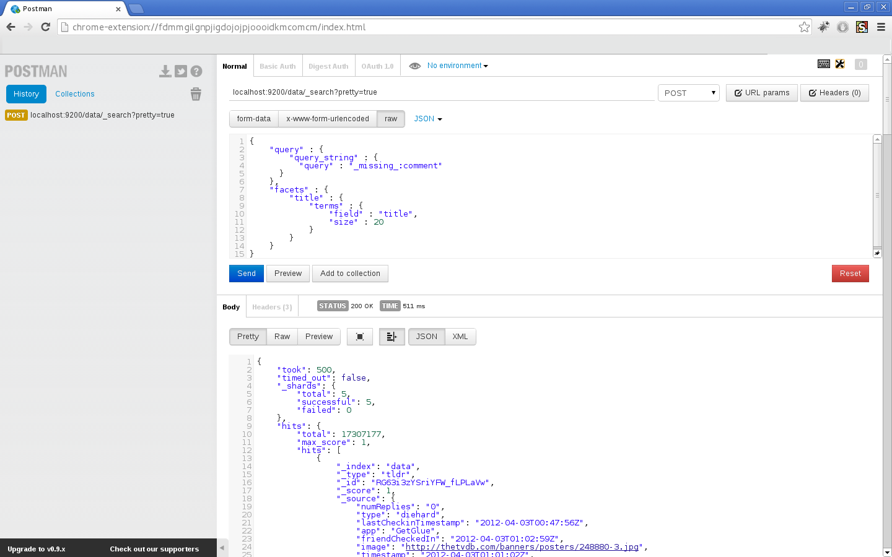

# *Przemysław Królik*

----

## Zadanie 2

Wykorzystałem bazę danych udostępnioną przez [GetGlue](http://getglue-data.s3.amazonaws.com/getglue_sample.tar.gz) umieszczoną na stronie [dr Włodzimierza Bzyla](http://wbzyl.inf.ug.edu.pl/nosql/).
Procesy importu danych pomijam jednakże warto zauważyć, że mongo importuje poprawnie ilość danych 
```js 
imported 19831300 objects
```
jednakże ElasticSearch ma problem z importem niektórych rekordów 
```js
{
    "count": 19766542,
    "_shards": {
        "total": 5,
        "successful": 5,
        "failed": 0
    }
}
```

## MongoDB

####Agregacja 1: 20 najczęściej występujących reżyserów

Zapytanie:
```js
db.imdb.aggregate({$group:{_id: "$director", count:{$sum: 1}}},{$sort:{count: -1}},{$limit: 20});
```

Wynik:
```js
{
	"result" : [
		{
			"_id" : null,
			"count" : 12235144
		},
		{
			"_id" : "steven spielberg",
			"count" : 108571
		},
		{
			"_id" : "tim burton",
			"count" : 101741
		},
		{
			"_id" : "bill condon",
			"count" : 97835
		},
		{
			"_id" : "gary ross",
			"count" : 82420
		},
		{
			"_id" : "david yates",
			"count" : 77366
		},
		{
			"_id" : "james cameron",
			"count" : 74645
		},
		{
			"_id" : "joss whedon",
			"count" : 72810
		},
		{
			"_id" : "christopher nolan",
			"count" : 68542
		},
		{
			"_id" : "robert zemeckis",
			"count" : 67181
		},
		{
			"_id" : "david fincher",
			"count" : 59427
		},
		{
			"_id" : "jon favreau",
			"count" : 56669
		},
		{
			"_id" : "quentin tarantino",
			"count" : 55616
		},
		{
			"_id" : "martin scorsese",
			"count" : 54845
		},
		{
			"_id" : "peter jackson",
			"count" : 51708
		},
		{
			"_id" : "todd phillips",
			"count" : 50534
		},
		{
			"_id" : "john lasseter",
			"count" : 49340
		},
		{
			"_id" : "gore verbinski",
			"count" : 47979
		},
		{
			"_id" : "chris columbus",
			"count" : 44403
		},
		{
			"_id" : "michael bay",
			"count" : 42845
		}
	],
	"ok" : 1
}
```

Oczywiście pan "null" nie był reżyserem jednakże oznacza to, że tyle wpisów nie miało jakkolwiek podanego reżysera (w prezentacji graficznej jest on pominięty).

####Wynik graficznie


####Agregacja 2: 10 najbardziej aktywnych użytkowników

Zapytanie:
```js
db.imdb.aggregate({$group:{_id: "$userId", count:{$sum: 1}}},{$sort:{count: -1}},{$limit: 10});
```

Wynik:
```js
{
	"result" : [
		{
			"_id" : "LukeWilliamss",
			"count" : 696782
		},
		{
			"_id" : "demi_konti",
			"count" : 68137
		},
		{
			"_id" : "bangwid",
			"count" : 59261
		},
		{
			"_id" : "zenofmac",
			"count" : 56233
		},
		{
			"_id" : "agentdunham",
			"count" : 55740
		},
		{
			"_id" : "cillax",
			"count" : 43161
		},
		{
			"_id" : "tamtomo",
			"count" : 42378
		},
		{
			"_id" : "hblackwood",
			"count" : 32832
		},
		{
			"_id" : "ellen_turner",
			"count" : 32239
		},
		{
			"_id" : "husainholic",
			"count" : 32135
		}
	],
	"ok" : 1
}
```
####Wynik graficznie


####Agregacja 3: 10 największych hater'ów

Zapytanie fasetowe w ES:
```js
{
    "query" : {
        "query_string" : {
          "query" : "action:Disliked"
      }
    },
    "facets" : {
        "userId" : {
            "terms" : {
                "field" : "userId",
                "size" : 10
            }
        }
    }
}
```

Wynik:
```js
{
    "took": 131,
    "timed_out": false,
    "_shards": {
        "total": 5,
        "successful": 5,
        "failed": 0
    },
    "hits": {
        "total": 468969,
        "max_score": 4.7487235,
        "hits": [
            //...
        ]
    },
    "facets": {
        "userId": {
            "_type": "terms",
            "missing": 0,
            "total": 468975,
            "other": 447555,
            "terms": [
                {
                    "term": "xendeus",
                    "count": 3678
                },
                {
                    "term": "brownbagcomics",
                    "count": 3281
                },
                {
                    "term": "ang",
                    "count": 2278
                },
                {
                    "term": "kevinjloria",
                    "count": 2180
                },
                {
                    "term": "carlson1931",
                    "count": 2144
                },
                {
                    "term": "amanda_hauser",
                    "count": 1987
                },
                {
                    "term": "zeus1661ou",
                    "count": 1688
                },
                {
                    "term": "vunderhill1",
                    "count": 1555
                },
                {
                    "term": "s34rchnd3str0y",
                    "count": 1462
                },
                {
                    "term": "furchterregend",
                    "count": 1167
                }
            ]
        }
    }
}
```

Pełen wynik dostępny [tutaj](/docs/pkrolik/zad23.json)

####Wynik graficznie

####Zrzut z programu Postman


####Agregacja 4: 20 najmniej komentowanych tytułów

Zapytanie fasetowe w ES:
```js
{
    "query" : {
        "query_string" : {
          "query" : "_missing_:comment"
      }
    },
    "facets" : {
        "title" : {
            "terms" : {
                "field" : "title",
                "size" : 20
            }
        }
    }
}
```

Wynik:
```js
{
    "took": 4980,
    "timed_out": false,
    "_shards": {
        "total": 5,
        "successful": 5,
        "failed": 0
    },
    "hits": {
        "total": 17307177,
        "max_score": 1,
        "hits": [
            //...
        ]
    },
    "facets": {
        "title": {
            "_type": "terms",
            "missing": 856,
            "total": 38040119,
            "other": 34264760,
            "terms": [
                {
                    "term": "big",
                    "count": 308486
                },
                {
                    "term": "show",
                    "count": 307796
                },
                {
                    "term": "american",
                    "count": 257620
                },
                {
                    "term": "bang",
                    "count": 226009
                },
                {
                    "term": "theory",
                    "count": 222012
                },
                {
                    "term": "man",
                    "count": 197926
                },
                {
                    "term": "men",
                    "count": 191821
                },
                {
                    "term": "2",
                    "count": 177058
                },
                {
                    "term": "who",
                    "count": 174620
                },
                {
                    "term": "family",
                    "count": 169645
                },
                {
                    "term": "dead",
                    "count": 169421
                },
                {
                    "term": "night",
                    "count": 167793
                },
                {
                    "term": "part",
                    "count": 166494
                },
                {
                    "term": "i",
                    "count": 162720
                },
                {
                    "term": "girl",
                    "count": 160303
                },
                {
                    "term": "nikita",
                    "count": 147502
                },
                {
                    "term": "doctor",
                    "count": 146100
                },
                {
                    "term": "game",
                    "count": 144407
                },
                {
                    "term": "time",
                    "count": 140757
                },
                {
                    "term": "fringe",
                    "count": 136869
                }
            ]
        }
    }
}
```

Pełen wynik dostępny [tutaj](/docs/pkrolik/zad24.json)

####Wynik graficznie

####Zrzut z programu Postman
