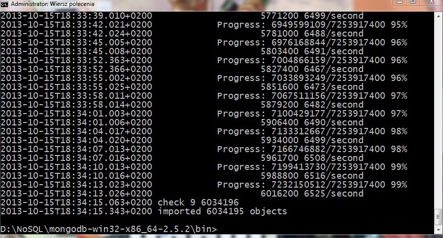
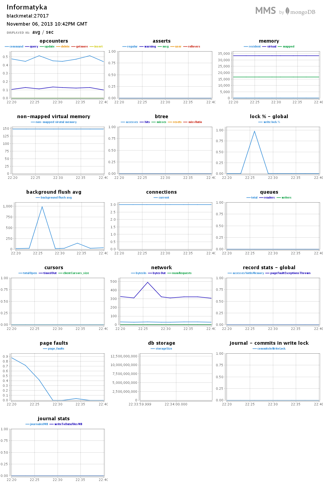

<h1>Paweł Puchalski</h1>
---
* [Dane Techniczne](#dane-techniczne)
* [zadanie a)](#a)
* [zadanie b)](#b)
* [zadanie c)](#c)
* [zadanie d)](#d)
* [zadanie e)](#e)

---

## Dane Techniczne
 ```
 Procesor: Pentium D 3.0 GHz
 RAM: 2 GB PC 800MHz DDR2
 Dysk: Seagate Barracuda 320 GB
 OS: Windows 7 Professional x64 && Ubuntu 12.04 LTS
 ```

<h2>Zadanie 1</h2>

<h3><b>a)</b></h3>
<p>Import pliku</p>

  ```bash
  $ mongoimport --type csv -c Train --file Train2.csv --headerline
  ```  

<h3><b>b)</b></h3>

  ```bash
  db.Train.count()
  ```
  Liczba obiektów: 6034195 
  


  
<h3><b>c)</b></h3>

<p>Skrypt konwertujący tagi na tablicę:</p>
 ```js
db.train.find( { "tags" : { $type : 2 } } ).snapshot().forEach(
 function (x) {
  if (!Array.isArray(x.tags)){
    x.tags = x.tags.split(' ');
    db.train.save(x);
}});
 ```
Plik zliczający wszystkie słowa: [count](/scripts/ppuchalski/count)
<h3><b>d)</b></h3>
Przerobiłem plik do Jsona za pomocą tego [skryptu](/scripts/ppuchalski/toJson.sh)
  ```bash
  $ ./toJson.sh text8
  ```
<p>następnie zimportowałem plik do bazy</p>
  ```bash
  $ mongoimport --d text8 -c text8 --file text8.json
  ```
  
<p>Zliczanie wszystkich słów</p>
  ```js
  db.text8.count()
  
  Rezultat: 17005207
  ```
<p>Zliczanie różnych słów</p>
  ```js
  db.text8.distinct("word").length
  
  Rezultat: 253854
  ```
<p>1 najczęściej występujące słowo </p>
 ```js
 var start = new Date().getTime();

db.text8.aggregate(
	{$group:{ _id:"$word", count:{$sum:1}}}, 
	{$sort: {count: -1}}, 
	{$limit:1})

  var end = new Date().getTime();
  var time = end - start;
  print(time);
 ```
 ```js
 Rezultat: 1061396
 Stanowi: 6,24%
 Czas: 23 sekundy
 ```
<p>10 najczęściej występujących słów</p>
 ```js
 var start = new Date().getTime();

 db.text8.aggregate(
	 {$group:{ _id:"$word", count:{$sum:1}}}, 
	 {$sort: {count: -1}}, 
	 {$limit:10})

 var end = new Date().getTime();
 var time = end - start;
 print(time);
 ```
 ```js
 Rezultat: 4205965
 Stanowi: 24,73%
 Czas: 22 sekundy
 ```
<p> 100 najczęściej występujących słów</p>
 ```js
 var start = new Date().getTime();

 db.text8.aggregate(
	 {$group:{ _id:"$word", count:{$sum:1}}}, 
	 {$sort: {count: -1}}, 
	 {$limit:100})

 var end = new Date().getTime();
 var time = end - start;
 print(time);
 ```
 ```js
 Rezultat: 7998978
 Stanowi: 47,03%
 Czas: 22 sekundy
 ```
<p> 1000 najczęściej występujących słów</p>
 ```js
 var start = new Date().getTime();

 db.text8.aggregate(
	 {$group:{ _id:"$word", count:{$sum:1}}}, 
	 {$sort: {count: -1}}, 
	 {$limit:1000})

 var end = new Date().getTime();
 var time = end - start;
 print(time);
 ```
 ```js
 Rezultat: 11433354
 Stanowi: 67,23%
 Czas: 25 sekundy
 ```
 
<h3><b>e)</b></h3>
<p>Do rozwiązania zadania użyłem danych znajdujących się pod tym linkiem(http://www.poipoint.pl).</p>
[Baza](/data/ppuchalski/Szkolywyzsze.csv) zawiera dane dotyczące szkół wyższych w Polsce.

<p>Import do mongo</p>
 ```bash
 mongoimport -d geo -c schools < Szkolywyzsze.json
 ```
 
## Koordynaty miast:
  <b>Gdańsk 54.360, 18.639</b>
  
  <b>Łódź 51.783, 19.466</b>
  
  <b>Warszawa 52.259, 21.020</b>
  
## Zapytania

#### Szkoły wyższe w odległości do 10km od Gdańska:
 ```js
 db.schools.find( { loc : { $near :
                         { $geometry :
                             { type : "Point" ,
                               coordinates: [ 18.639, 54.360 ] } },
                           $maxDistance : 10000
              } }, { _id: 0 } )
 ```
#### Rezultat: [JSON](../../data/ppuchalski/zapytanie_Gdansk.json), [GeoJson](../../data/ppuchalski/zapytanie_Gdansk.geojson)
#### Szkoły wyższe w odległości do 10km od Łodzi:
 ```js
 db.schools.find( { loc : { $near :
                         { $geometry :
                             { type : "Point" ,
                               coordinates: [ 19.466, 51.783 ] } },
                           $maxDistance : 10000
              } }, { _id: 0 } )
 ```
#### Rezultat: [JSON](../../data/ppuchalski/zapytanie_Lodz.json), [GeoJson](../../data/ppuchalski/zapytanie_Lodz.geojson)
#### Szkoły wyższe w odległości do 10km od Warszawy:
 ```js
 db.schools.find( { loc : { $near :
                         { $geometry :
                             { type : "Point" ,
                               coordinates: [ 21.020, 52.259 ] } },
                           $maxDistance : 10000
              } }, { _id: 0 } )
 ```
#### Rezultat: [JSON](../../data/ppuchalski/zapytanie_Warszawa.json), [GeoJson](../../data/ppuchalski/zapytanie_Warszawa.geojson)
