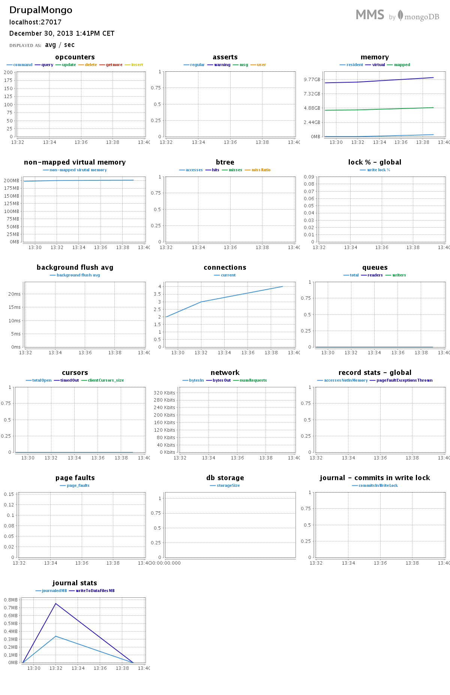
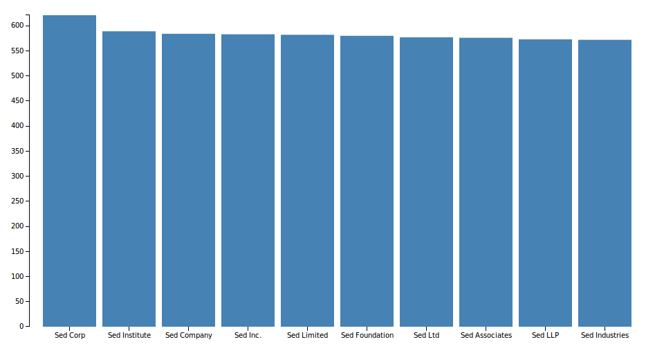
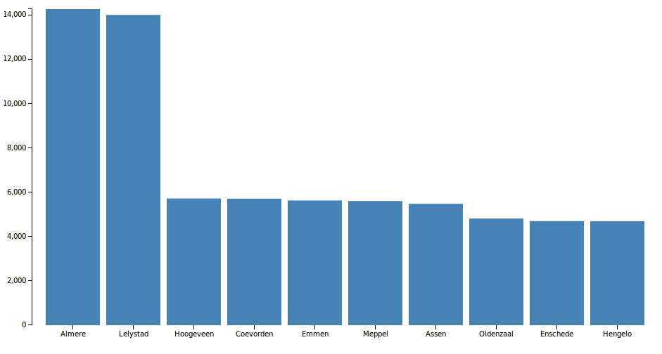
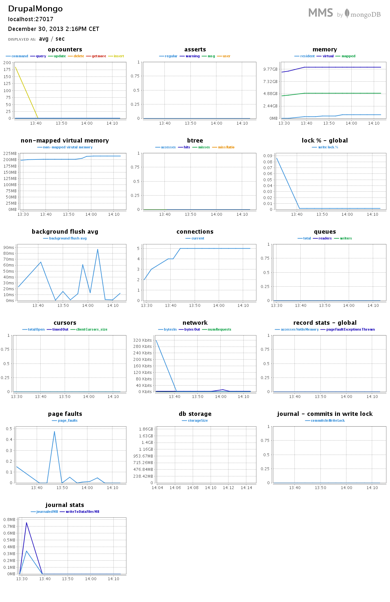
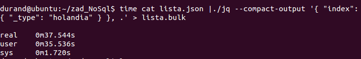
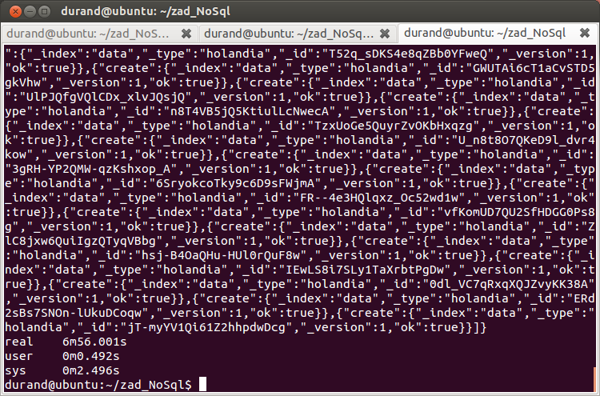
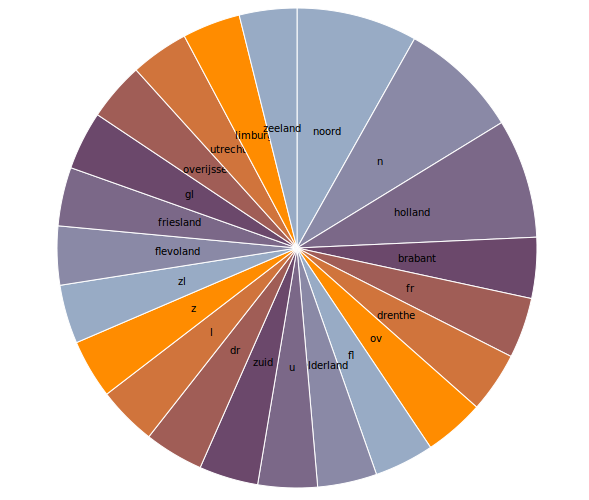
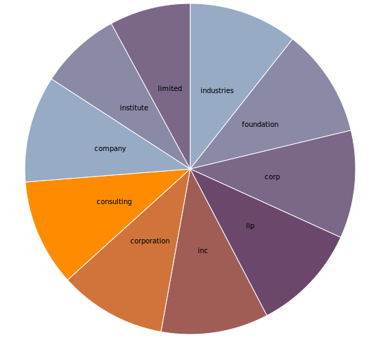
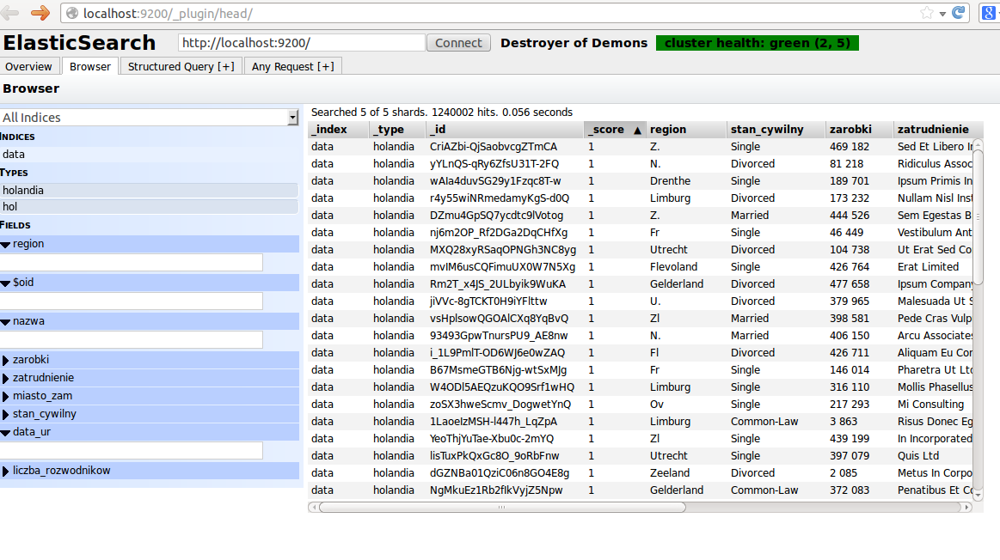
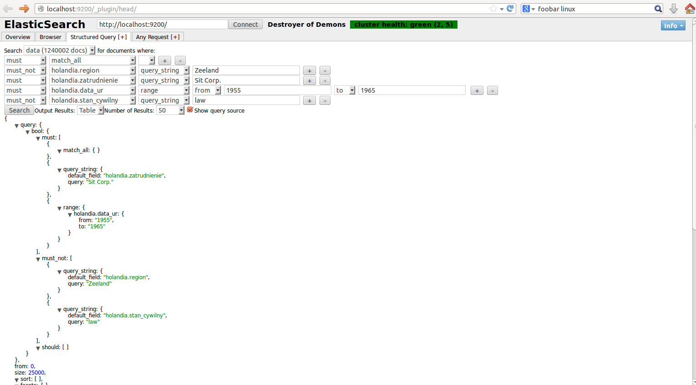

## Zadanie 2

Do wykonania tego zadania posłużyłem się skryptem do generowania testowych baz danych [generatedata-3.1.0](https://codeload.github.com/benkeen/generatedata/zip/3.1.0). Więcej na temat tego programu lub użycia on-line [tutaj](http://www.generatedata.com).

## MongoDB

Do zaimportowania bazy danych użyłem polecenia
```sh
mongoimport -d noSql -c lista --type csv --file "/home/durand/zad_NoSql/data_personal_ned.csv" --headerline
```

Przykładowy rekord z bazy danych
```json
{
	"_id" : ObjectId("52beeb30521d74f5229ef603"),
	"nazwa" : "Dane Garner",
	"miasto_zam" : "Assen",
	"data_ur" : "01/29/1983",
	"zatrudnienie" : "Semper Dui Lectus Consulting",
	"zarobki" : "178 857",
	"stan_cywilny" : "Common-Law",
	"region" : "Dr"
}
```
#### Tak wyglądało w MMS importowanie bazy danych.



### Przygotowane agregacje

* 10 firm z największym zatrudnieniem posortowane malejąco.

```sh
db.lista.aggregate(
  { $group : { _id : '$zatrudnienie', zatrudnionych: { $sum : 1 }}},
  { $sort : { zatrudnionych : -1 }},
  { $limit : 10 }
)
```

wynik

```json
{ "_id" : "Sed Corp.", "zatrudnionych" : 621 }
{ "_id" : "Sed Institute", "zatrudnionych" : 589 }
{ "_id" : "Sed Company", "zatrudnionych" : 584 }
{ "_id" : "Sed Inc.", "zatrudnionych" : 583 }
{ "_id" : "Sed Limited", "zatrudnionych" : 582 }
{ "_id" : "Sed Foundation", "zatrudnionych" : 580 }
{ "_id" : "Sed Ltd", "zatrudnionych" : 577 }
{ "_id" : "Sed Associates", "zatrudnionych" : 576 }
{ "_id" : "Sed LLP", "zatrudnionych" : 573 }
{ "_id" : "Sed Industries", "zatrudnionych" : 572 }
```



*10 miast z największą liczbą osób rozwiedzionych posortowana malejąco.

```sh
db.lista.aggregate(
  { $match : { stan_cywilny : 'Divorced' }},
  { $group : { _id : '$miasto_zam', liczba_rozwodnikow : { $sum : 1 }}},
  { $sort : { liczba_rozwodnikow : -1 }},
  { $limit : 10 }
)
```

wynik

```json
{ "_id" : "Almere", "liczba_rozwodnikow" : 14257 }
{ "_id" : "Lelystad", "liczba_rozwodnikow" : 13996 }
{ "_id" : "Hoogeveen", "liczba_rozwodnikow" : 5715 }
{ "_id" : "Coevorden", "liczba_rozwodnikow" : 5706 }
{ "_id" : "Emmen", "liczba_rozwodnikow" : 5627 }
{ "_id" : "Meppel", "liczba_rozwodnikow" : 5602 }
{ "_id" : "Assen", "liczba_rozwodnikow" : 5477 }
{ "_id" : "Oldenzaal", "liczba_rozwodnikow" : 4811 }
{ "_id" : "Enschede", "liczba_rozwodnikow" : 4696 }
{ "_id" : "Hengelo", "liczba_rozwodnikow" : 4691 }
```



#### Stan MMS po wykonanych działaniach



## ElasticSearch

Ponieważ nasza baza danych była w formacie csv przeprowadziłem konwersję do formatu json w celu zaimportowania jej do ElasticSearch.

```sh
mongoexport -d noSql -c lista --out "/home/durand/zad_NoSql/lista.json"
```
Następnym krokiem była konwersja uzyskanego pliku na tzw. "json przeplatany".

```sh
time cat lista.json |./jq --compact-output '{ "index": { "_type": "holandia" } }, .' > lista.bulk
```



Ponieważ import całego pliku się nie powiódł podzieliłem go na mniejsze części.

```sh
split -l 200000 lista.bulk
```

A następnie już bez problemów dokonałem importu.
```sh
time for i in x*; do curl -s -XPOST   localhost:9200/data/_bulk --data-binary @$i; done
```


* Wyświetla regiony z największą ilością osób urodzonych pomiędzy rokiem 1955 a 1965

```sh
curl -X POST "http://localhost:9200/data/holandia/_search?pretty=true" -d '{"query":{"range":{"holandia.data_ur":{"from":"1955","to":"1965"}}}, "facets":{"tags":{"terms":{"field":"region", "size": 30}}}}'
```

wynik
```json
"facets" : {
    "tags" : {
      "_type" : "terms",
      "missing" : 0,
      "total" : 150934,
      "other" : 0,
      "terms" : [ {
        "term" : "noord",
        "count" : 12296
      }, {
        "term" : "n",
        "count" : 12231
      }, {
        "term" : "holland",
        "count" : 12121
      }, {
        "term" : "brabant",
        "count" : 6189
      }, {
        "term" : "fr",
        "count" : 6162
      }, {
        "term" : "drenthe",
        "count" : 6147
      }, {
        "term" : "ov",
        "count" : 6143
      }, {
        "term" : "fl",
        "count" : 6067
      }, {
        "term" : "gelderland",
        "count" : 6039
      }, {
        "term" : "u",
        "count" : 6037
      }, {
        "term" : "zuid",
        "count" : 6014
      }, {
        "term" : "dr",
        "count" : 6014
      }, {
        "term" : "l",
        "count" : 6007
      }, {
        "term" : "z",
        "count" : 6000
      }, {
        "term" : "zl",
        "count" : 5982
      }, {
        "term" : "flevoland",
        "count" : 5979
      }, {
        "term" : "friesland",
        "count" : 5968
      }, {
        "term" : "gl",
        "count" : 5953
      }, {
        "term" : "overijssel",
        "count" : 5932
      }, {
        "term" : "utrecht",
        "count" : 5914
      }, {
        "term" : "limburg",
        "count" : 5894
      }, {
        "term" : "zeeland",
        "count" : 5845
      }
```



* Wyświetlenie 10 firm z najwiekszą ilością zatrudnionych osób o stanie cywilnym tzw. "singiel".

```sh
curl -X POST "http://localhost:9200/data/holandia/_search?pretty=true" -d '{"query":{"query_string":{"default_field":"stan_cywilny","query":"single"}}, "facets":{"tags":{"terms":{"field":"zatrudnienie", "size": 10}}}}'
```
wynik

```json
"facets" : {
    "tags" : {
      "_type" : "terms",
      "missing" : 0,
      "total" : 904848,
      "other" : 746611,
      "terms" : [ {
        "term" : "industries",
        "count" : 16819
      }, {
        "term" : "foundation",
        "count" : 16804
      }, {
        "term" : "corp",
        "count" : 16677
      }, {
        "term" : "llp",
        "count" : 16675
      }, {
        "term" : "inc",
        "count" : 16615
      }, {
        "term" : "corporation",
        "count" : 16568
      }, {
        "term" : "consulting",
        "count" : 16523
      }, {
        "term" : "company",
        "count" : 16484
      }, {
        "term" : "institute",
        "count" : 12540
      }, {
        "term" : "limited",
        "count" : 12532
      }
```



Przykładowe screeny z pracy z ElasticSearch w przeglądarce przy użyciu wtyczki ElasticSearch-Head. 




