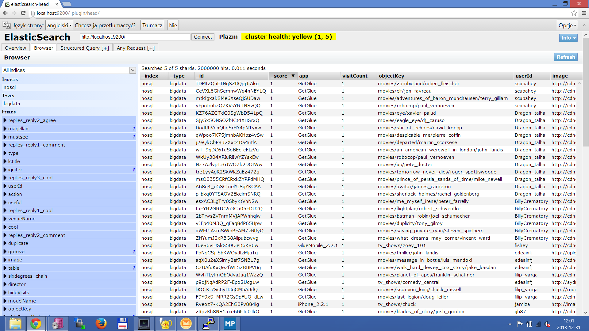

# Zadanie 2 #

### MongoDB ###

Najpierw z pliku

> getglue_sample.json

wybrałem 2 000 000 pierwszych linii i zapisałem je do pliku 

> getglue_sample\_cut.json

użyłem do tego polecania: 

    head -n 2000000 getglue_sample.json > getglue_sample_cut.json

Dane zaimportowałem do bazy MongoDB poleceniem:
    
    time ./bin/mongoimport.exe -d nosql -c bigdata --file ../../getglue_sample_cut.json

Czas trwania importu:

    real 3m53.282s
    user 0m0.015s
    sys  0m0.016s

### MongoDB - agregacje: ###

Wyświetlenie wszystkich rodzajów  nazw modeli wraz z ich ilością wystąpień:

	db.bigdata.aggregate([
		{ $group: { _id: "$modelName", ilosc: {$sum: 1}} },
		{ $sort: {ilosc: -1 } },
		{ $project: { modelName: "$_id", ilosc: "$ilosc", _id: 0} }
	])
	
Wynik:

	{
		"result" : [
			{
					"ilosc" : 1090418,
					"modelName" : "movies"
			},
			{
					"ilosc" : 909572,
					"modelName" : "tv_shows"
			},
			{
					"ilosc" : 5,
					"modelName" : "recording_artists"
			},
			{
					"ilosc" : 5,
					"modelName" : "topics"
			}
		],
		"ok" : 1
	}

Zliczenie wszystkich użytkowników, którzy mają ponad 7600 rekordów:
	
	db.bigdata.aggregate([
		{ $group: { _id: "$userId", ilosc: {$sum: 1}} },
		{ $sort: {ilosc: -1 } },
		{ $match: { ilosc: {$gte : 7600 } } },
		{ $project: { userId: "$_id", ilosc: "$ilosc", _id: 0 }}
	])
	
Wynik:

	{
        "result" : [
                {
                        "ilosc" : 13585,
                        "userId" : "jesusvarelaacosta"
                },
                {
                        "ilosc" : 13141,
                        "userId" : "LilMissCakeCups"
                },
                {
                        "ilosc" : 12946,
                        "userId" : "johnnym2001"
                },
                {
                        "ilosc" : 11764,
                        "userId" : "erwin_ali_perdana"
                },
                {
                        "ilosc" : 11513,
                        "userId" : "endika"
                },
                {
                        "ilosc" : 11352,
                        "userId" : "cathy_blessing_hughes"
                },
                {
                        "ilosc" : 9737,
                        "userId" : "khairulazmas"
                },
                {
                        "ilosc" : 8778,
                        "userId" : "maria_santana1"
                },
                {
                        "ilosc" : 8683,
                        "userId" : "samnaeev"
                },
                {
                        "ilosc" : 7668,
                        "userId" : "wididip"
                }
        ],
        "ok" : 1
	}

### ElasticSearch ###

Aby załadować te same dane do Elasticseatch przygotowałem plik 

> getglue_sample\_cut.bulk

przy pomocy narzędzia jq:

    time < getglue_sample_cut.json ./jq.exe --compact-output '{ "index": { "_type": "bigdata" } }, .' > nosql.bulk

Czas wykonywania:

    real 2m17.623s
    user 0m0.000s
    sys  0m0.000s

Przy pomocy polecenia:

    curl -s -XPOST localhost:9200/nosql/_bulk --data-binary @nosql.bulk ; echo

wykonałem import danych.

#### Problemy podczas importu do ES: ####

Na samym początku miałem problem z importem do Elasticsearch. Było to spowodowany tym, że plik których chciałem zaimportować był za duży - miął ponad 1 gb. A by móc ładować takie pliki musiałem w pliku konfiguracyjnym

> elasticsearch.yml

od komentować i ustawić na 2000mb

    # Set a custom allowed content length:
    #
    http.max_content_length: 2000mb

również musiałem zmodyfikować skrypt uruchamiający Elasticsearch

> elasticsearch.bat

zmieniłem w nim:

    set ES_MAX_MEM=4g

Po tych zmianach udało mi się dokonać importu.

Niestety nie zaimportowały się wszystkie rekordy zamiast 2 000 000 jest 1 999 897. Jest to spowodowane jakimś błędnym formatem daty. Przykładowy log:

    [2013-12-29 22:43:33,121][DEBUG][action.bulk  ] [Daisy Johnson] [nosql][4] failed to execute bulk item (index) index {[nosql][bigdata][JX5QwaIITsC5N1hCMTYL_g], source[{"link":"http://en.wikipedia.org/wiki/Cake_Boss","action":"Liked","lctitle":"cake boss","version":"2","source":"http://getglue.com/quickstart","image":"http://thetvdb.com/banners/posters/107671-1.jpg","title":"Cake Boss","replies_reply3_userId":"","modelName":"tv_shows","replies_reply2_timestamp":"","replies_reply3_timestamp":"","comment":"","hideVisits":"false","replies_reply1_displayName":"Dominic Lee","app":"GetGlue","userId":"amy_fikes","private":"false","replies_reply3_comment":"","replies_reply1_userId":"dominic_lee","replies_reply1_timestamp":"2012-01-15T06:53:12Z","numReplies":"1","replies_reply2_userId":"","timestamp":"2011-06-23T16:28:51Z","replies_reply1_agree":"","objectKey":"tv_shows/cake_boss","visitCount":"1","replyKey":"dominic_lee/2012-01-15T06:53:12Z","replies_reply2_comment":"","replies_reply1_funny":"","replies_reply3_displayName":"","displayName":"Amy Fikes","replies_reply1_cool":"","lastModified":"2012-01-15T06:53:15Z","replies_reply1_comment":"Stickers","replies_reply2_displayName":""}
    ]}
    org.elasticsearch.index.mapper.MapperParsingException: failed to parse [replies_reply2_timestamp]
    	at org.elasticsearch.index.mapper.core.AbstractFieldMapper.parse(AbstractFieldMapper.java:401)
    	at org.elasticsearch.index.mapper.object.ObjectMapper.serializeValue(ObjectMapper.java:613)
    	at org.elasticsearch.index.mapper.object.ObjectMapper.parse(ObjectMapper.java:466)
    	at org.elasticsearch.index.mapper.DocumentMapper.parse(DocumentMapper.java:516)
    	at org.elasticsearch.index.mapper.DocumentMapper.parse(DocumentMapper.java:460)
    	at org.elasticsearch.index.shard.service.InternalIndexShard.prepareCreate(InternalIndexShard.java:353)
    	at org.elasticsearch.action.bulk.TransportShardBulkAction.shardIndexOperation(TransportShardBulkAction.java:402)
    	at org.elasticsearch.action.bulk.TransportShardBulkAction.shardOperationOnPrimary(TransportShardBulkAction.java:156)
    	at org.elasticsearch.action.support.replication.TransportShardReplicationOperationAction$AsyncShardOperationAction.performOnPrimary(TransportShardReplicationOperationAction.java:556)
    	at org.elasticsearch.action.support.replication.TransportShardReplicationOperationAction$AsyncShardOperationAction$1.run(TransportShardReplicationOperationAction.java:426)
    	at java.util.concurrent.ThreadPoolExecutor.runWorker(ThreadPoolExecutor.java:1145)
    	at java.util.concurrent.ThreadPoolExecutor$Worker.run(ThreadPoolExecutor.java:615)
    	at java.lang.Thread.run(Thread.java:744)
    Caused by: org.elasticsearch.index.mapper.MapperParsingException: failed to parse date field [], tried both date format [dateOptionalTime], and timestamp number with locale []
    	at org.elasticsearch.index.mapper.core.DateFieldMapper.parseStringValue(DateFieldMapper.java:487)
    	at org.elasticsearch.index.mapper.core.DateFieldMapper.innerParseCreateField(DateFieldMapper.java:424)
    	at org.elasticsearch.index.mapper.core.NumberFieldMapper.parseCreateField(NumberFieldMapper.java:194)
    	at org.elasticsearch.index.mapper.core.AbstractFieldMapper.parse(AbstractFieldMapper.java:390)
    	... 12 more
    Caused by: java.lang.IllegalArgumentException: Invalid format: ""
    	at org.elasticsearch.common.joda.time.format.DateTimeFormatter.parseMillis(DateTimeFormatter.java:754)
    	at org.elasticsearch.index.mapper.core.DateFieldMapper.parseStringValue(DateFieldMapper.java:481)
    	... 15 more

Aby wgrać błędne rekordy najpierw utworzyłem plik z logami z kodowanie dla systemów unix'owych poleceniem

    cat elasticsearch.log | tr "\n" " " | tr "\r" "\n" > elasticsearch_unix.log

następnie przy pomocy polecenia

    sed -n '/source\[/,/^]}/p' elasticsearch_unix.log | awk -F", source" '{print $2}' | sed 's/^.//'| sed '/^$/d' > bledne_rekordy.json

wyciągnąłem rekordy które się nie dodały i na koniec przygotowałem plik do importu do bazy ES który nie zawiera pustych pól **"replies_reply2_timestamp":""/** i **"replies_reply3_timestamp":""/**:

    sed -e 's/,"replies_reply3_timestamp":""//g;s/,"replies_reply2_timestamp":""//g' bledne_rekordy.json > bledne_rekordy_poprawione.json
    
    sed 's/^./{"index":{"_type":"bigdata"}}\n&/g' bledne_rekordy_poprawione.json > nosql_2.bulk

Następnie dokonałem import z poprawionymi rekordami

    curl -s -XPOST localhost:9200/nosql/_bulk --data-binary @nosql_2.bulk ; echo

Zrzut z ElasticSearch (plugin):

