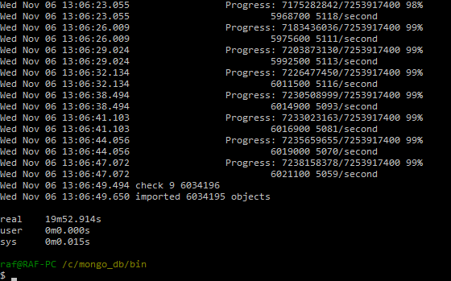
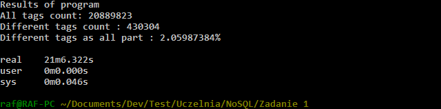
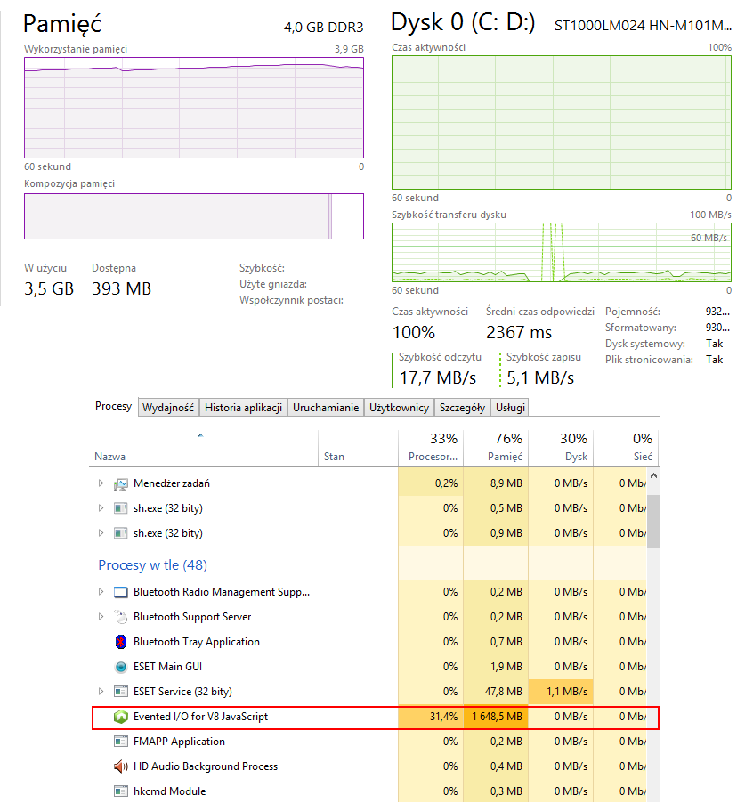
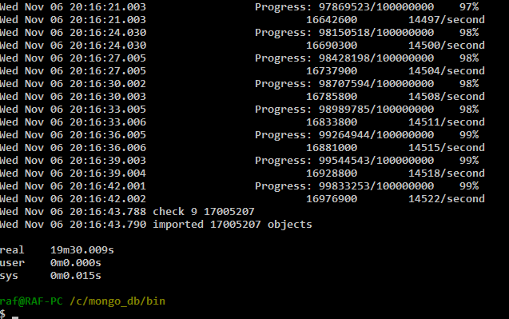
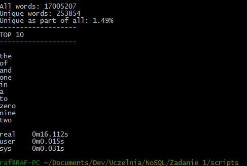
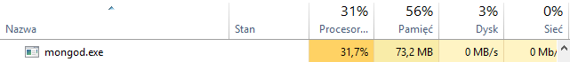
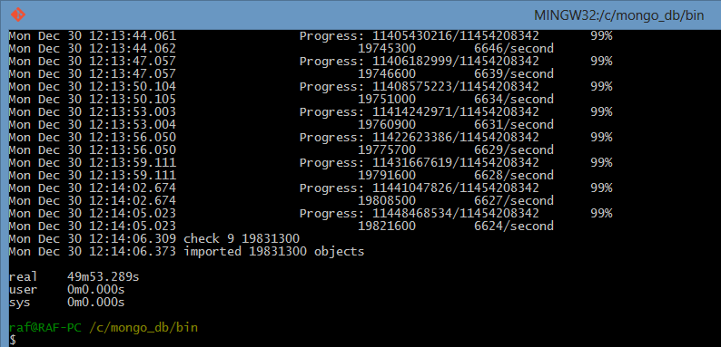

#Rafał Łuczun

##Rozwiązania:

* [Zadanie 1a](#zadanie-1a)
* [Zadanie 1b](#zadanie-1b)
* [Zadanie 1c](#zadanie-1c)
* [Zadanie 1d](#zadanie-1d)
* [Zadanie 1e](#zadanie-1e)
* [Zadanie 2 Mongo](#zadanie-2a)
* [Zadanie 2 Elasticsearch](#zadanie-2b)

#Zadanie 1a

##Poprawianie csv
Problemem w tym pliku są znaki nowej lini występujące bezpośrednio w komórkach, na pliku wystarczy wykonać prosty skrypt

```sh
cat Train.csv | tr "\n" " " | tr "\r" "\n" | head -n 6034196 > Train1.csv
```

***

#Zadanie 1b

##Importowanie
Po wcześniejszym przygotowaniu pliku zabieramy się za import, podczas którego mierzymy czas za pomocą polecenia time

```sh
time mongoimport -d test -c train --type csv --headerline --file Train1.csv
```

##Czas i wyniki



***

#Zadanie 1c
W zadaniu musimy zamienić listy tagów, na tablicę tagów, a następnie zliczyć wszystkie tagi i unikatowe tagi
Program napisałem przy wykorzystaniu JavaScript, a uruchomiłem przy użyciu Node.js
Do działania potrzebny jest tylko jeden dodatkowy moduł do obsługi mongodb

##Uruchomienie
Plik package.json potrzebny do uruchomienia można znaleść tutaj [package.json](../../scripts/rluczun/package.json)
Plik źródłowy ze skryptem znajdziemy tutaj [mongotrainer.js](../../scripts/rluczun/mongotrainer.js) 

Umieszczamy je oba w jednym katalogu i wpisujemy w konsoli
`npm install`
`npm start`

Program naprawia tagi, szukając odpowiedniego separatora do podziału, po naprawie tagi umieszczane są w tablicy którą zostanie nadpisana poprzednia lista tagów.
Zanim tagi zostaną uaktualnione, program zlicza je, a także zapisuje częstotliwość występowania tagu.
Jeśli aktualnie wszystkie tagi w bazie są już tablicami, program tylko liczy i wypisuje rezultat.

##Wynik


Unikatowe tagi liczę szukając tagów z pojedyńczym wystąpieniem w obiekcie z częstotliwością tagów

##Obciążenie
Obciążenie komputera podczas działania programu jest dość spore, użycie zasobów interpretera JavaScript również na wysokim poziomie:


***

#Zadanie 1d
Zadanie to polegało na zaimportowaniu słow z pliku, zliczeniu ich, zliczeniu unikatów i podaniu częstotliwości ich występowania.
Plik z którego miał nastąpić import, najpierw musiałbyć sprawdzony skryptem który był wskazówką do zadania, u mnie wszystko przebiegło sprawnie.

##Import
```sh
time mongoimport -d test -c words -f word --type csv --file text8.txt
```

##Czas


Zadanie przygotowałem w JavaScript przy wykorzystaniu Node.js, aby uruchomić skrypt należy przenieść plik [word_counter.js](../../scripts/rluczun/word_counter.js) do folderu roboczego z poprzedniego zadania
i wpisać `npm word_counter.js`

##Wyniki

---
Obciążenie serwera mongo podczas agregacji


#Zadanie 1e

---

#Zadanie 2 Mongo
Zadanie wykonywane było na bazie GetGlue and Timestamped Event Data ważącej `11GB` i mającej `19831300` rekordów. Plik dostępny był w formacie json. Baza zawiera dane z IMDB z lat 2007-2012.

Na początku dane trzeba było rozpakować.
```sh
tar -xf getglue_sample.tar.gz
```

Tak przygotowany plik json gotowy jest do importu
```sh
time mongoimport -d imdb -c imdb --type json --file getglue_sample.json
```

##Wynik i czasy


---

##Agregacje

#Agregacja 1
Agregacja ta ma za zadanie policzyć ilość komentarzy przypadającej każdej z osób.

Kod skryptu: [mongoaggr1.js](../../scripts/rluczun/mongo_aggr1.js)

##Wynik i czasy


##Wykres

---

#Agregacja 2
Agregacja ta ma za zadanie policzyć ilość filmów wyreżyserowanych przez każdego reżysera.

Kod skryptu: [mongoaggr1.js](../../scripts/rluczun/mongo_aggr2.js)

##Wynik i czasy


##Wykres

---

#Zadanie 2 Elasticsearch