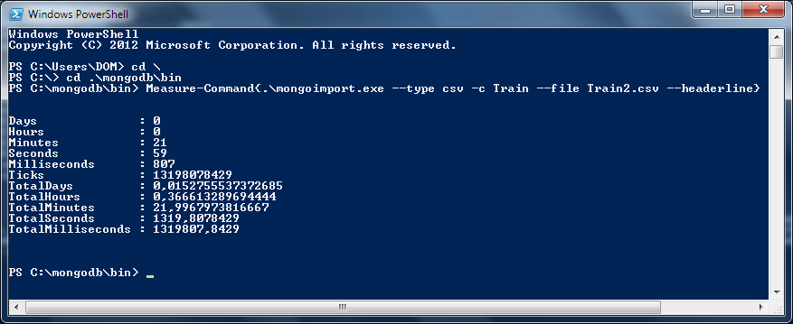
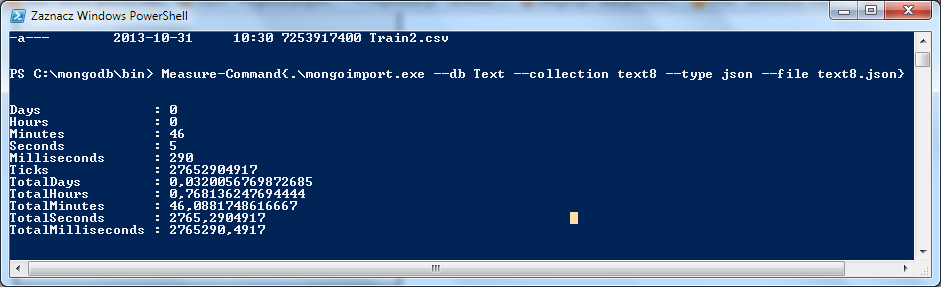

## MongoDB version

```bash
MongoDB version: 2.5.3
```

## Zadanie 1

* a 
  * ####Przygotowanie danych do importu
  
    ```bash
    $ time bash 2unix.sh Train.csv Train2.csv
  
    real    14m51.329s
    user    0m42.671s
    sys	1m28.238s
    ```

  * ####Import danych do bazy
  
    ```bash
    $ mongoimport --type csv -c Train --file Train2.csv --headerline
    ```
    
  
* b
    #### Obliczanie ilosci rekordow
    
    ```bash
    > db.Train.count()
    6034195
    ```
  
* c
    #### Zmiana ciagu tagow w tablice tagow za pomocą [tego](https://github.com/roberttomczak/aggregations-2/blob/master/scripts/rtomczak/tagi.py "Program") skryptu

* d
    * #####Przygotowanie danych do importu za pomoca [tego](https://github.com/roberttomczak/aggregations-2/blob/master/scripts/rtomczak/StringToJSON.sh "Program") skryptu

    ```bash
    $ time bash StringToJSON.sh text8 text8.json

    real    1m34.271s
    user    0m20.201s
    sys     0m58.584s
    ```
    
    * #####Import danych do bazy
        