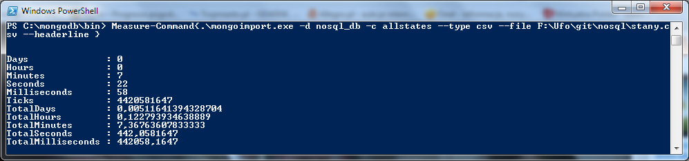
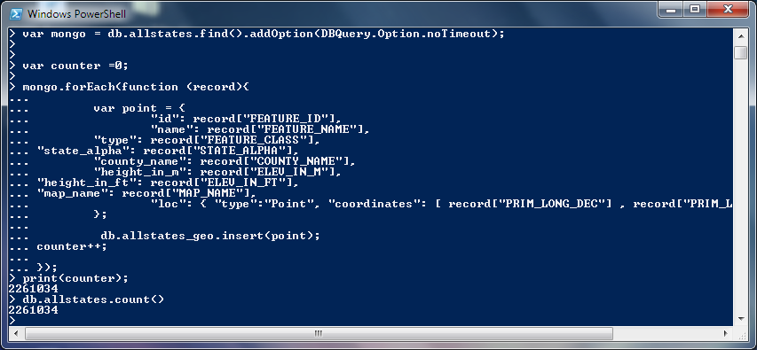
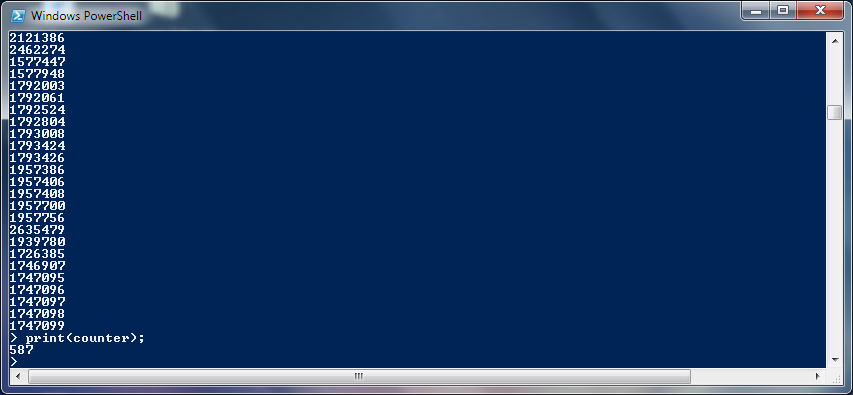

## MongoDB version

```bash
MongoDB version: 2.5.3
```
## Menu

- [Train](#train)
    - [Przygotowanie pliku](#przygotowanie-danych-do-importu)
    - [Import do bazy](#import-danych-do-bazy)
    - [Obliczanie ilosci rekordow](#obliczanie-ilosci-rekordow)
    - [Zmiana ciagu tagow w tablice tagow za pomocą tego skryptu](#zmiana-ciagu-tagow-w-tablice-tagow-za-pomocą-tego-skryptu)
- [Text8](#text8)
    - [Przygotowanie danych do importu za pomoca skryptu](#przygotowanie-danych-do-importu-za-pomoca-tego-skryptu)
    - [Import danych do bazy](#import-danych-do-bazy-1)
    - [Zliczanie słów](#zliczanie-slow)
    - [Zliczanie roznych słów](#zliczanie-roznych-slow)
    - [Udział procentowy (kod)](#udział-procentowy-kod)
    - [Wyniki](#wyniki)
- [Geo Json](#geojson)
    - [Modyfikacja plikow](#modyfikacja-kodu-zmiana-plikow-txt-na-jeden-csv)
    - [Import do bazy danych](#import-do-bazy-danych)


# Zadanie 1

* a 
# Train

    ## Przygotowanie danych do importu
    
    ```bash
    $ time bash 2unix.sh Train.csv Train2.csv
    
    real    14m51.329s
    user    0m42.671s
    sys     1m28.238s    
    ```
## Import danych do bazy
  
    ```bash
    $ mongoimport --type csv -c Train --file Train2.csv --headerline
    ```
    
    
  
* b 
## Obliczanie ilosci rekordow
    ```bash
    > db.Train.count()
    6034195
    ```
* c
## Zmiana ciagu tagow w tablice tagow za pomocą [tego](https://github.com/roberttomczak/aggregations-2/blob/master/scripts/rtomczak/tagi.py "Program") skryptu

* d
# Text8
    ## Przygotowanie danych do importu za pomoca [tego](https://github.com/roberttomczak/aggregations-2/blob/master/scripts/rtomczak/StringToJSON.sh "Program") skryptu

    ```bash
    $ time bash StringToJSON.sh text8 text8.json

    real    1m34.271s
    user    0m20.201s
    sys     0m58.584s
    ```
    
    ## Import danych do bazy
    
    
        
    ## Zliczanie slow
    ```bash
    >db.text8.count()
    17005207
    ```
    
    ## Zliczanie roznych slow
    ```bash
    >db.text8.distinct("word").length
    253854
    ```
    
    ## Udział procentowy (kod)
    
    ```javascript
        var totalWordCount = db.words.count()

        function sumWordCount(acc, wordGroup) {
          return acc + wordGroup.count
        }
        
        function percent(wordCount) {
          return (wordCount / totalWordCount) * 100
        }
        
        var top1000 = db.words.aggregate({ $group: { _id: "$word", count: { $sum: 1 } } } , { $sort: { count: -1 } }, { $limit: 1000 }).result
        var top100 = top1000.slice(0, 100)
        var top10 = top100.slice(0, 10)
        var top1 = top10.slice(0, 1)
        
        var top1Percent = percent(top1.reduce(sumWordCount, 0)) 
        var top10Percent = percent(top10.reduce(sumWordCount, 0))
        var top100Percent = percent(top100.reduce(sumWordCount, 0))
        var top1000Percent = percent(top1000.reduce(sumWordCount, 0))
    ```
## Wyniki
    ```
    > top1Percent
    6.241594118789616
    
    > top10Percent
    24.733394894869555
    
    > top100Percent
    47.03840417820259
    
    > top1000Percent
    67.23443001899359 
    ```
    
* e
# GeoJSON
    
    Obiekty do bazy z użyciem GeoJSON'ow pobrałem ze strony [usgs](http://geonames.usgs.gov/domestic/download_data.htm)

    ## Modyfikacja kodu (zmiana plikow txt na jeden csv)

    ```bash
    $ time bash switchtocsv.sh AllStates_20131020/ stany.csv

    real	0m28.781s
    user	0m3.512s
    sys     0m2.168s
    
    ```
    ## Import do bazy danych
    
    
    ## Zmiana csv to geo-json
    Przy użyciu [tego](../../scripts/rtomczak/make_geo_points.js "make_geo_points") skryptu zmieniłem dane dotyczące lokalizacji obiektow na bardziej dostępne dla geojson queries.
    
    Następnie przy użyciu innego [skryptu](../../scripts/rtomczak/remove_bad_geo.js "remove_bad_geo") usunąłem rekordy ktore miały złe koordynaty lub ich nie miały.
    
    
    ## Dodanie indexu
    
    Dodanie indexu "2dsphere" do pola "loc" aby moc wykonywań zapytania na lokalizacjach obiektow
    
    ```bash
    > db.allstates_geo.ensureIndex({'loc' : '2dsphere'})
     ```
     
    ## Zapytania
    
    #### near
    Znalezienie punktu bliskiego zdefiniowanemu punktowi
    ```bash
    
    > db.allstates_geo.findOne({
        loc : { 
            $near : { 
                $geometry :	{	
				    type : "Point",
				    coordinates : [-118.40192,34.06990]
                }
            }
	    }
	  })
    ```
    Mapka z wynikiem znajduje sie [tutaj](../../data/rtomczak/geo_near.geojson)
    
    #### geo_within
    Znalezienie parkow i monumentow znajdujacych sie wewnatrz zdefiniowanego wielokata
        
    ```bash
    > db.allstates_geo.find({ 
      loc : { 
        $geoWithin : { 
            $geometry : {
				type : 'Polygon',
				coordinates : [[
					[-77.05014, 38.90251],
					[-77.02705, 38.90251],
					[-77.02700, 38.88757],
					[-77.05016, 38.88713],
					[-77.05014, 38.90251]
				]]
            }
		}
	  },
      'type' : "Park"	 
	  },
	  {
        _id: 0,
		loc: 1,
		name:1,
		type : 1
      }	
      ).pretty()
    ```
    Mapka z wynikiem znajduje sie [tutaj](../../data/rtomczak/geo_within_polygon.geojson)
    
    #### geo_within circle
    Znalezienie budynkow w ustalonym obrebie ze srodkiem w zadanym punkcie
    ```bash
    > db.allstates_geo.find({
      loc :
        { $geoWithin :
            { $center :
                [[-73.96531, 40.78271], 0.1]
            }
        },
        'type' : "Building"
    },
    {
        loc: 1,
        name:1
    }).limit(5).pretty()
    ```
    Mapka z wynikiem znajduje sie [tutaj](../../data/rtomczak/geo_within_circle.geojson)
    #### geoIntersects
    Znalezienie budynkow ktore przecinają zadane pole
    ```bash
    > db.allstates_geo.find(
        {loc : 
            { $geoIntersects :
                { $geometry :
                    {
                        type : 'Polygon',
                        coordinates : [[
                            [-83.05806, 42.36855],
                            [-83.09915, 42.35017],
                            [-83.07857, 42.31772],
                            [-83.03557, 42.33208],
                            [-83.05806, 42.36855]]]
                    }
                }
            },
            'type' : "Building"
        },
        {
            loc: 1,
            name:1
        }).pretty()
    ```
    Mapka z wynikiem znajduje sie [tutaj](../../data/rtomczak/geo_intersects.geojson)
    
    Pliki z geojson'ami zostały zrobione przy pomocy [skryptu w pythonie](../../scripts/rtomczak/zapytania.py) (Skrypt trochę rozległy, możliwe poprawki)