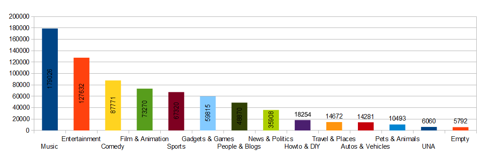
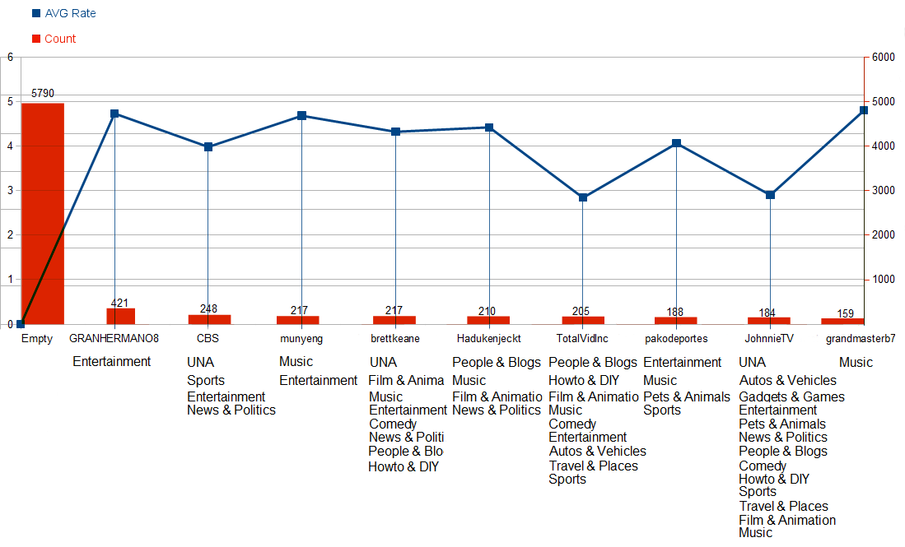
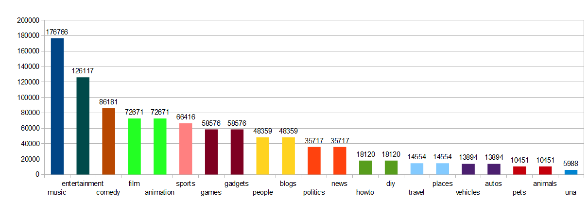
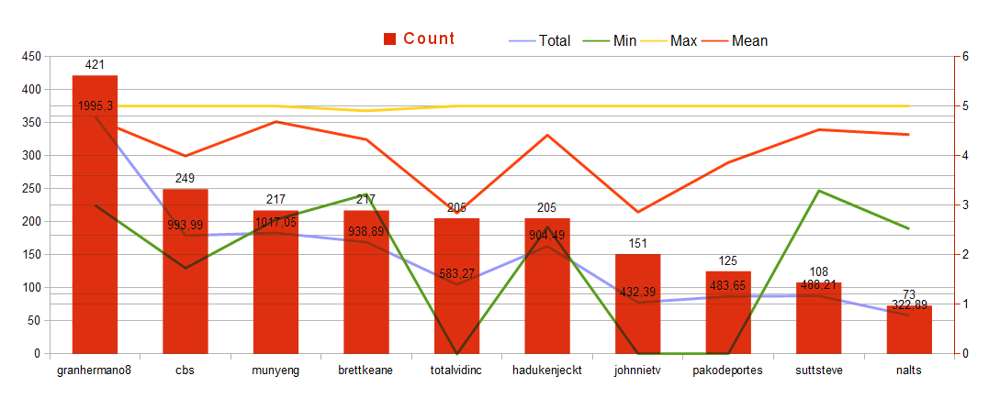

### *Szymon Domurat*
### 
----

## Zadanie 2
* [Zadanie 2](#zadanie-2)
    * [Opis bazy](#opis-bazy)
    * [MongoDB](#mongodb)
    	* [Import bazy do mongo](#import-bazy-do-mongo)
    	* [Liczba i przykład](#liczba-i-przykład)
    	* [Pierwsza aggregacja](#pierwsza-aggregacja)
    	* [Druga aggregacja](#druga-aggregacja)
    * [Elasticsearch](#elasticsearch)
    	* [Import elasticsearch](#import-elasticsearch)
    	* [Pierwsza aggregacja elasticsearch](#pierwsza-aggregacja-elasticsearch)
    	* [Druga aggregacja elasticsearch](#druga-aggregacja-elasticsearch)

	

## Opis bazy

Baza danych była w formacie txt, więc uzyłem narzędzia google refine do zapisania bazy w formacie csv oraz oczyszczenia.
Baza danych zawiera informacje o filmikach z roku 2007.
Baze danych pobralem z http://netsg.cs.sfu.ca/youtubedata/0222.zip

## MongoDB

```bash
MongoDB shell version: 2.4.7
```

## Import bazy do mongo

```bash
mongoimport --type csv --db youtube --collection video --file video.csv --headerline
```
## Liczba i przykład
```bash
> db.video.count();
	 wynik=749166

> db.video.findOne();
{
        "_id" : ObjectId("529f17352dcf23adffbf5c2f"),
        "video ID" : "NxTDlnOuybo",
        "uploader" : "timtwo12",
        "age" : 687,
        "category" : "Comedy",
        "length" : 175,
        "views" : 5639,
        "rate" : 4.37,
        "ratings" : 132,
        "comments" : 193
}
```
## Pierwsza aggregacja:
Wyświetlenie ile filmików zostało wrzuconych do poszczegółnych kategorii.

```bash
> db.video.aggregate({ $group: { _id: "$category", quantity: {$sum: 1}}}, {$sort: {quantity: -1}} )
{
        "result" : [
                {
                        "_id" : "Music",
                        "quantity" : 179026
                },
                {
                        "_id" : "Entertainment",
                        "quantity" : 127632
                },
                {
                        "_id" : "Comedy",
                        "quantity" : 87771
                },
                {
                        "_id" : "Film & Animation",
                        "quantity" : 73270
                },
                {
                        "_id" : "Sports",
                        "quantity" : 67320
                },
                {
                        "_id" : "Gadgets & Games",
                        "quantity" : 59815
                },
                {
                        "_id" : "People & Blogs",
                        "quantity" : 48870
                },
                {
                        "_id" : "News & Politics",
                        "quantity" : 35908
                },
                {
                        "_id" : "Howto & DIY",
                        "quantity" : 18256
                },
                {
                        "_id" : "Travel & Places",
                        "quantity" : 14672
                },
                {
                        "_id" : "Autos & Vehicles",
                        "quantity" : 14281
                },
                {
                        "_id" : "Pets & Animals",
                        "quantity" : 10493
                },
                {
                        "_id" : "UNA",
                        "quantity" : 6060
                },
                {
                        "_id" : "",
                        "quantity" : 5792
                }
        ],
        "ok" : 1
}
```
Wykres:


## Druga aggregacja:
Top 10 wrzucajacych użytkowników + kategorie do których wrzucają filmiki + średnia ranga wrzucanych filmików.
	
```bash
db.video.aggregate([ {$group : {_id: "$uploader", count: {$sum: 1}, category: { $addToSet: "$category" }, avg: {$avg: "$rate"}}},
            {$sort : {count: -1}},
                {$project : {_id: 0,  uploader: "$_id", count: 1, category: "$category", avg: 1}},
                {$limit : 10}
				
    ],function (err, results) {
        console.log(results);
})	
```
```bash
        "result" : [
                {
                        "count" : 5792,
                        "category" : [
                                ""
                        ],
                        "avg" : 0,
                        "uploader" : ""
                },
                {
                        "count" : 421,
                        "category" : [
                                "Entertainment"
                        ],
                        "avg" : 4.739453681710213,
                        "uploader" : "GRANHERMANO8"
                },
                {
                        "count" : 248,
                        "category" : [
                                "UNA",
                                "Sports",
                                "Entertainment",
                                "News & Politics"
                        ],
                        "avg" : 3.9883467741935505,
                        "uploader" : "CBS"
                },
                {
                        "count" : 217,
                        "category" : [
                                "Music",
                                "Entertainment"
                        ],
                        "avg" : 4.686866359447004,
                        "uploader" : "munyeng"
                },
                {
                        "count" : 217,
                        "category" : [
                                "UNA",
                                "Film & Animation",
                                "Music",
                                "Entertainment",
                                "Comedy",
                                "News & Politics",
                                "People & Blogs",
                                "Howto & DIY"
                        ],
                        "avg" : 4.32668202764977,
                        "uploader" : "brettkeane"
                },
                {
                        "count" : 210,
                        "category" : [
                                "People & Blogs",
                                "Music",
                                "Film & Animation",
                                "News & Politics"
                        ],
                        "avg" : 4.424285714285711,
                        "uploader" : "Hadukenjeckt"
                },
                {
                        "count" : 205,
                        "category" : [
                                "People & Blogs",
                                "Howto & DIY",
                                "Film & Animation",
                                "Music",
                                "Comedy",
                                "Entertainment",
                                "Autos & Vehicles",
                                "Travel & Places",
                                "Sports"
                        ],
                        "avg" : 2.8452195121951225,
                        "uploader" : "TotalVidInc"
                },
                {
                        "count" : 188,
                        "category" : [
                                "Entertainment",
                                "Music",
                                "Pets & Animals",
                                "Sports"
                        ],
                        "avg" : 4.062287234042554,
                        "uploader" : "pakodeportes"
                },
                {
                        "count" : 184,
                        "category" : [
                                "UNA",
                                "Autos & Vehicles",
                                "Gadgets & Games",
                                "Entertainment",
                                "Pets & Animals",
                                "News & Politics",
                                "People & Blogs",
                                "Comedy",
                                "Howto & DIY",
                                "Sports",
                                "Travel & Places",
                                "Film & Animation",
                                "Music"
                        ],
                        "avg" : 2.9084239130434795,
                        "uploader" : "JohnnieTV"
                },
                {
                        "count" : 159,
                        "category" : [
                                "Music"
                        ],
                        "avg" : 4.806226415094338,
                        "uploader" : "grandmasterb76"
                }
        ],
        "ok" : 1
}
```
Wykres:


## Elasticsearch

Przygotowałem mapping dla bazy przed wrzuceniem:
```bash
curl -s -XPUT localhost:9200/youtube/lec/_mapping -d '
{
  "lec": {
    "properties": {
      "age": {
        "type": "integer"
      },
      "category": {
        "type": "string"
      },
      "coments": {
        "type": "integer"
      },
      "comments": {
        "type": "integer"
      },
      "lenght": {
        "type": "integer"
      },
      "length": {
        "type": "integer"
      },
      "rate": {
        "type": "float"
      },
      "ratings": {
        "type": "integer"
      },
      "uploader": {
        "type": "string"
      },
      "video ID": {
        "type": "string"
      },
      "views": {
        "type": "integer"
      }
    }
  }
}
'
```
### Import elasticsearch
Wrzuciłem bazę w częściach, ze względu na duży rozmiar traciłem kontakt serwerem, użyłem polecenia:

```bash
cat part1.json | \jq --compact-output '{ "index": { "_type": "lec" } }, .' > part1.bulk
```
  
```bash
curl localhost:9200/youtube/_bulk --data-binary @par1.bulk
```
## Pierwsza aggregacja elasticsearch:

Wyświetlenie ile filmików zostało wrzuconych do poszczegółnych kategorii:

```bash	
curl -XGET 'http://localhost:9200/youtube/_search?pretty=true' -d '
{
  "query": {
    "match_all": {}
  },
  "facets": {
    "tag": {
      "terms": {
        "field": "category", "size": "100"
      }
    }
  }
}
'
{
  "took" : 237,
  "timed_out" : false,
  "_shards" : {
    "total" : 5,
    "successful" : 5,
    "failed" : 0
  },
  "hits" : {
    "total" : 739536,
    "max_score" : 1.0,
    "hits" : [ {
      "_index" : "youtube",
      "_type" : "lec",
      "_id" : "psyzENIeRcyhf4KpNP6UJA",
      "_score" : 1.0, "_source" : {"video ID":"1BE_9us_SQc","uploader":"Suechan19","age":"693","category":"Music","length":"298","views":"297","rate":"4.1","ratings":"10","comments":"5"}
    }, {
      "_index" : "youtube",
      "_type" : "lec",
      "_id" : "MQGRkxwrT4abdgTHS-lZ0Q",
      "_score" : 1.0, "_source" : {"video ID":"SKQfq8hysug","uploader":"coldheartedprince","age":"495","category":"Film & Animation","length":"300","views":"2516","rate":"5","ratings":"17","comments":"12"}
    }, {
      "_index" : "youtube",
      "_type" : "lec",
      "_id" : "4mif0sKaRP2MUvw-MgWwhQ",
      "_score" : 1.0, "_source" : {"video ID":"8k-IyHuyEng","uploader":"TidusofFinalFantasy","age":"732","category":"Gadgets & Games","length":"331","views":"326","rate":"5","ratings":"24","comments":"29"}
    }, {
      "_index" : "youtube",
      "_type" : "lec",
      "_id" : "3tiJ_24qSgiH10wGjd6fkg",
      "_score" : 1.0, "_source" : {"video ID":"v61RP9MxobY","uploader":"crazyotakugirl","age":"623","category":"Film & Animation","length":"88","views":"499","rate":"4.86","ratings":"7","comments":"4"}
    }, {
      "_index" : "youtube",
      "_type" : "lec",
      "_id" : "5Qu9EdTMTym9Z9_UtCYKWw",
      "_score" : 1.0, "_source" : {"video ID":"gvWN9_iyMYM","uploader":"yuichan","age":"326","category":"Entertainment","length":"110","views":"5670","rate":"4.55","ratings":"76","comments":"24"}
    }, {
      "_index" : "youtube",
      "_type" : "lec",
      "_id" : "v5G3HTPwRwG4jhd57fvGjg",
      "_score" : 1.0, "_source" : {"video ID":"0Xq7NsG-eac","uploader":"DefiantShadowWolf","age":"614","category":"Film & Animation","length":"222","views":"195","rate":"4.5","ratings":"2","comments":"1"}
    }, {
      "_index" : "youtube",
      "_type" : "lec",
      "_id" : "WlUwjpoDRgSDkv0H6hpkPw",
      "_score" : 1.0, "_source" : {"video ID":"4SR0_1bhTp0","uploader":"RadicalYue","age":"264","category":"Entertainment","length":"227","views":"2655","rate":"4.89","ratings":"35","comments":"11"}
    }, {
      "_index" : "youtube",
      "_type" : "lec",
      "_id" : "_v3e09bTRa6neaSfbir8Uw",
      "_score" : 1.0, "_source" : {"video ID":"0A4GH6Ebks4","uploader":"riotgirlxx92","age":"572","category":"People & Blogs","length":"196","views":"577","rate":"3.67","ratings":"51","comments":"6"}
    }, {
      "_index" : "youtube",
      "_type" : "lec",
      "_id" : "NNSPfpcZQsOopfMzPvDudg",
      "_score" : 1.0, "_source" : {"video ID":"xW2IkWHiRm0","uploader":"uoumodafocka","age":"521","category":"Music","length":"190","views":"4056","rate":"4.87","ratings":"15","comments":"2"}
    }, {
      "_index" : "youtube",
      "_type" : "lec",
      "_id" : "K13peSXbQ_iM8TLuAdgdqw",
      "_score" : 1.0, "_source" : {"video ID":"wlE7c6Teup0","uploader":"xVervex","age":"636","category":"Music","length":"242","views":"1347","rate":"4.75","ratings":"4","comments":"3"}
    } ]
  },
  "facets" : {
    "tag" : {
      "_type" : "terms",
      "missing" : 5726,
      "total" : 1006152,
      "other" : 0,
      "terms" : [ {
        "term" : "music",
        "count" : 176766
      }, {
        "term" : "entertainment",
        "count" : 126117
      }, {
        "term" : "comedy",
        "count" : 86181
      }, {
        "term" : "film",
        "count" : 72671
      }, {
        "term" : "animation",
        "count" : 72671
      }, {
        "term" : "sports",
        "count" : 66416
      }, {
        "term" : "games",
        "count" : 58576
      }, {
        "term" : "gadgets",
        "count" : 58576
      }, {
        "term" : "people",
        "count" : 48359
      }, {
        "term" : "blogs",
        "count" : 48359
      }, {
        "term" : "politics",
        "count" : 35717
      }, {
        "term" : "news",
        "count" : 35717
      }, {
        "term" : "howto",
        "count" : 18120
      }, {
        "term" : "diy",
        "count" : 18120
      }, {
        "term" : "travel",
        "count" : 14554
      }, {
        "term" : "places",
        "count" : 14554
      }, {
        "term" : "vehicles",
        "count" : 13894
      }, {
        "term" : "autos",
        "count" : 13894
      }, {
        "term" : "pets",
        "count" : 10451
      }, {
        "term" : "animals",
        "count" : 10451
      }, {
        "term" : "una",
        "count" : 5988
      } ]
    }
  }
}
```
Wykres:


## Druga aggregacja elasticsearch:

Top 10 danych statystycznych użytkownikow dla ocen filmoków wrzuconych przez nich:

```bash
curl -XGET 'localhost:9200/youtube/_search?preety=true' -d'
{"query":
	{
		"match_all":{}},
		"facets":
		{
			"tag_price_stats":
			{
				"terms_stats":
				{
					"key_field":"uploader","value_field":"rate","size": "10"}
			}
		}
}
' | jq .

  % Total    % Received % Xferd  Average Speed   Time    Time     Time  Current
                                 Dload  Upload   Total   Spent    Left  Speed
100  4157  100  4038  100   119    848     25  0:00:04  0:00:04 --:--:--   849
{
  "took": 4649,
  "timed_out": false,
  "_shards": {
    "total": 5,
    "successful": 5,
    "failed": 0
  },
  "hits": {
    "total": 739536,
    "max_score": 1,
    "hits": [
      {
        "_index": "youtube",
        "_type": "lec",
        "_id": "1N831hnPTECcSdlSURIhdQ",
        "_score": 1,
        "_source": {
          "video ID": "r2vaz1x0wGM",
          "uploader": "daddytapatio",
          "age": "675",
          "category": "People & Blogs",
          "length": "13",
          "views": "851",
          "rate": "4.43",
          "ratings": "7",
          "comments": "1"
        }
      },
      {
        "_index": "youtube",
        "_type": "lec",
        "_id": "0FptGvyhS96YsdS_Y1bhfg",
        "_score": 1,
        "_source": {
          "video ID": "-pYb1RQEbhI",
          "uploader": "daddytapatio",
          "age": "721",
          "category": "Music",
          "length": "87",
          "views": "2962",
          "rate": "4.2",
          "ratings": "10",
          "comments": "13"
        }
      },
      {
        "_index": "youtube",
        "_type": "lec",
        "_id": "gmWFvx9XSbirKWW95DMv2w",
        "_score": 1,
        "_source": {
          "video ID": "t9Bn2NYA0q8",
          "uploader": "gonzaleas",
          "age": "703",
          "category": "People & Blogs",
          "length": "28",
          "views": "6",
          "rate": "0",
          "ratings": "0",
          "comments": "0"
        }
      },
      {
        "_index": "youtube",
        "_type": "lec",
        "_id": "8dlhzEwDTn-L9niDzyUc1g",
        "_score": 1,
        "_source": {
          "video ID": "JQMBFV3r8zQ",
          "uploader": "InDefenseofAnimals",
          "age": "521",
          "category": "Pets & Animals",
          "length": "394",
          "views": "281",
          "rate": "2.85",
          "ratings": "13",
          "comments": "1"
        }
      },
      {
        "_index": "youtube",
        "_type": "lec",
        "_id": "YcaMmWvXTGCFkz4caub0UA",
        "_score": 1,
        "_source": {
          "video ID": "j76iPJhkQL0",
          "uploader": "remark2",
          "age": "694",
          "category": "Pets & Animals",
          "length": "501",
          "views": "439",
          "rate": "5",
          "ratings": "6",
          "comments": "0"
        }
      },
      {
        "_index": "youtube",
        "_type": "lec",
        "_id": "CR8urERiR8CyWioUzk_C1A",
        "_score": 1,
        "_source": {
          "video ID": "DM02O6NZ8XM",
          "uploader": "evilplaceboduck",
          "age": "648",
          "category": "Comedy",
          "length": "118",
          "views": "1869",
          "rate": "4.79",
          "ratings": "14",
          "comments": "4"
        }
      },
      {
        "_index": "youtube",
        "_type": "lec",
        "_id": "WXKNqQPJRsmiDs5js8h2lw",
        "_score": 1,
        "_source": {
          "video ID": "TFQf_OKWv1M",
          "uploader": "blrag",
          "age": "414",
          "category": "People & Blogs",
          "length": "175",
          "views": "33",
          "rate": "0",
          "ratings": "0",
          "comments": "0"
        }
      },
      {
        "_index": "youtube",
        "_type": "lec",
        "_id": "GkzH_Q6WS1GwpVTWS6uSKg",
        "_score": 1,
        "_source": {
          "video ID": "05z8gvH3G7Y",
          "uploader": "ronburn",
          "age": "668",
          "category": "Entertainment",
          "length": "85",
          "views": "9232",
          "rate": "4.83",
          "ratings": "6",
          "comments": "2"
        }
      },
      {
        "_index": "youtube",
        "_type": "lec",
        "_id": "YVgAsTg3QUW4tZGpC3oKCg",
        "_score": 1,
        "_source": {
          "video ID": "Yu-7oJpNYKM",
          "uploader": "bassnsx",
          "age": "690",
          "category": "Music",
          "length": "240",
          "views": "96",
          "rate": "0",
          "ratings": "0",
          "comments": "1"
        }
      },
      {
        "_index": "youtube",
        "_type": "lec",
        "_id": "gGv2W4lIQ1-OQnP1bwtyJQ",
        "_score": 1,
        "_source": {
          "video ID": "yH8g4-UIOSY",
          "uploader": "neoconcommandcenter",
          "age": "674",
          "category": "Comedy",
          "length": "85",
          "views": "139",
          "rate": "0",
          "ratings": "0",
          "comments": "0"
        }
      }
    ]
  },
  "facets": {
    "tag_price_stats": {
      "_type": "terms_stats",
      "missing": 0,
      "terms": [
        {
          "term": "granhermano8",
          "count": 421,
          "total_count": 421,
          "min": 3,
          "max": 5,
          "total": 1995.3099999427795,
          "mean": 4.7394536815742985
        },
        {
          "term": "cbs",
          "count": 249,
          "total_count": 249,
          "min": 1.7300000190734863,
          "max": 5,
          "total": 993.9999979734421,
          "mean": 3.991967863347157
        },
        {
          "term": "munyeng",
          "count": 217,
          "total_count": 217,
          "min": 2.7100000381469727,
          "max": 5,
          "total": 1017.0500047206879,
          "mean": 4.686866381201327
        },
        {
          "term": "brettkeane",
          "count": 217,
          "total_count": 217,
          "min": 3.2200000286102295,
          "max": 4.909999847412109,
          "total": 938.8900020122528,
          "mean": 4.326682036922824
        },
        {
          "term": "totalvidinc",
          "count": 205,
          "total_count": 205,
          "min": 0,
          "max": 5,
          "total": 583.2700003385544,
          "mean": 2.8452195138466068
        },
        {
          "term": "hadukenjeckt",
          "count": 205,
          "total_count": 205,
          "min": 2.5999999046325684,
          "max": 5,
          "total": 904.4999980926514,
          "mean": 4.41219511264708
        },
        {
          "term": "johnnietv",
          "count": 151,
          "total_count": 151,
          "min": 0,
          "max": 5,
          "total": 432.39999854564667,
          "mean": 2.8635761493089182
        },
        {
          "term": "pakodeportes",
          "count": 125,
          "total_count": 125,
          "min": 0,
          "max": 5,
          "total": 483.6500005722046,
          "mean": 3.8692000045776367
        },
        {
          "term": "suttsteve",
          "count": 108,
          "total_count": 108,
          "min": 3.299999952316284,
          "max": 5,
          "total": 488.2100019454956,
          "mean": 4.520462980976811
        },
        {
          "term": "nalts",
          "count": 73,
          "total_count": 73,
          "min": 2.5299999713897705,
          "max": 5,
          "total": 322.8999993801117,
          "mean": 4.423287662741256
        }
      ]
    }
  }
}
```
Wykres:
