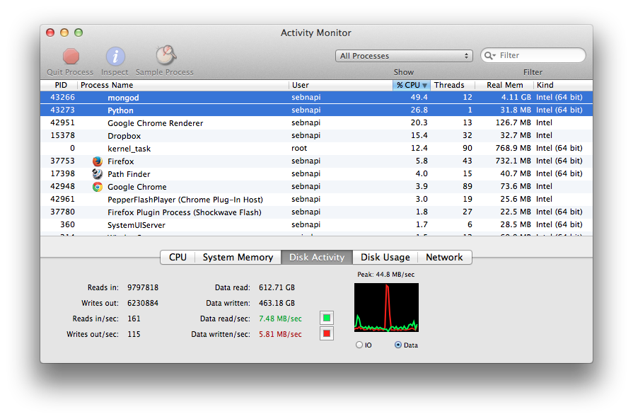
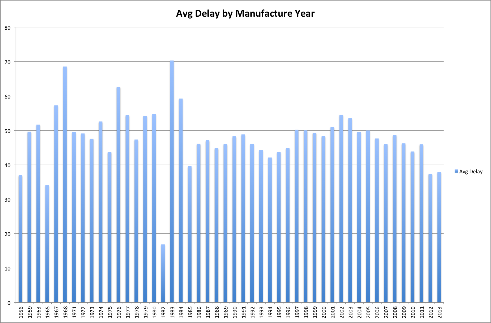
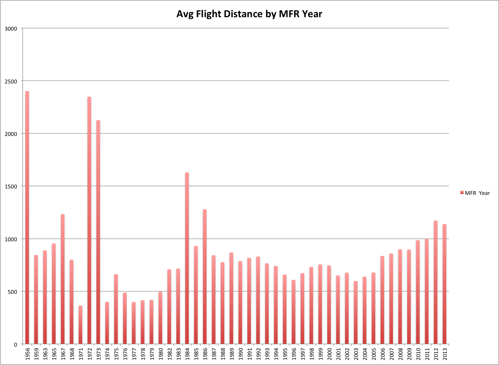
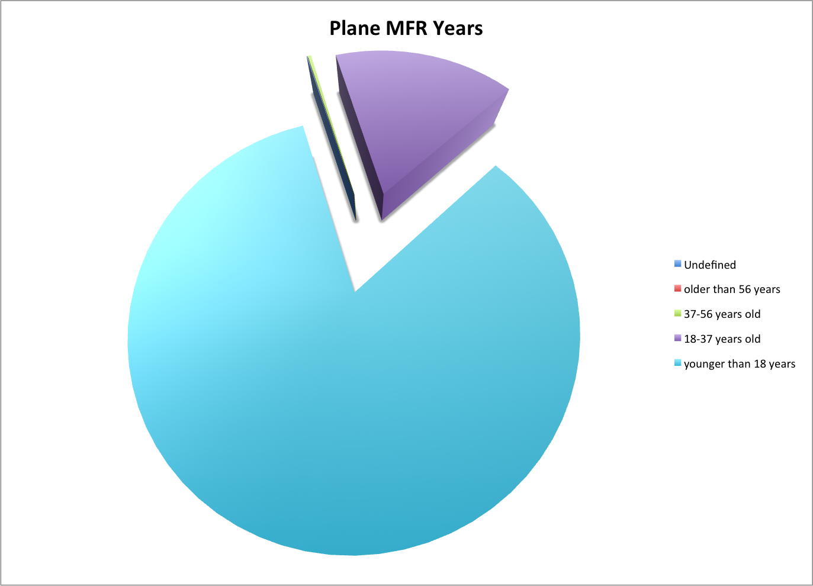
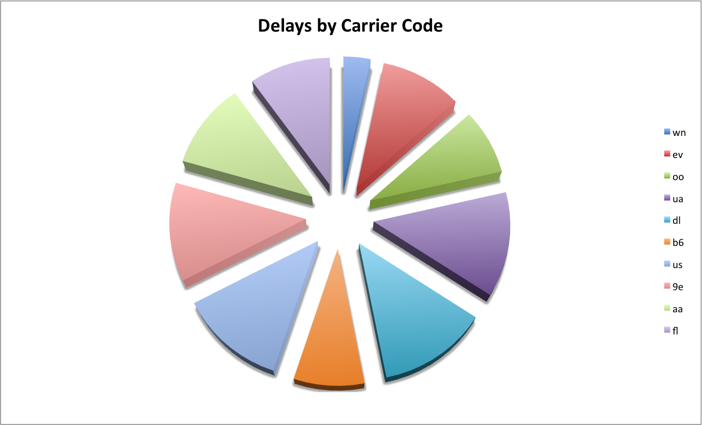

*This github repo was used to pass an [assignment](http://wbzyl.inf.ug.edu.pl/nosql/zadania) on my erasmus year.* 


**Table of Contents**  *generated with [DocToc](http://doctoc.herokuapp.com/)*

- [Train](#train)
	- [Preparing Raw Data](#preparing-raw-data)
	- [First mongoimport](#first-mongoimport)
	- [Second import by python script](#second-import-by-python-script)
	- [Changing Tags-String to a Tag-List](#changing-tags-string-to-a-tag-list)
				- [Processor, memory, IO while changing](#processor-memory-io-while-changing)
- [Words](#words)
	- [Count Tags](#count-tags)
- [Geo-Stuff](#geo-stuff)
	- [Importing and Transforming to GeoJSON](#importing-and-transforming-to-geojson)
	- [Geo Example Queries](#geo-example-queries)
		- [1. Query Falls 1km around the Niagara Falls](#1-query-falls-1km-around-the-niagara-falls)
		- [2. Lakes in North Carolina](#2-lakes-in-north-carolina)
		- [3. Streams under the Sea Level in North Carolina](#3-streams-under-the-sea-level-in-north-carolina)
		- [4. Police Stations in North Carolina](#4-police-stations-in-north-carolina)
		- [5. Points of Interest on one Line](#5-points-of-interest-on-one-line)
		- [6. How many military places are there in North Carolina](#6-how-many-military-places-are-there-in-north-carolina)
		- [7. Dams around Las Vegas in 50km radius](#7-dams-around-las-vegas-in-50km-radius)
- [Aggregations 2](#aggregations-2)
	- [Flights and Plane Data](#flights-and-plane-data)
	- [Exploring the dataset](#exploring-the-dataset)
		- [How many flight records do we have:](#how-many-flight-records-do-we-have)
		- [How many delayed flights are there:](#how-many-delayed-flights-are-there)
		- [How many +10min delayed flights are there:](#how-many-10min-delayed-flights-are-there)
		- [On which flight was the oldest plane used on flights in 2013 (Jan-Mar)](#on-which-flight-was-the-oldest-plane-used-on-flights-in-2013-jan-mar)
	- [Are older planes more involved in +10min departure delayed flights?](#are-older-planes-more-involved-in-10min-departure-delayed-flights)
	- [Are older planes used for short distances and newer for long distances?](#are-older-planes-used-for-short-distances-and-newer-for-long-distances)
	- [Flight Data import into Elasticsearch](#flight-data-import-into-elasticsearch)
		- [How are the Manufacture Years distributed?](#how-are-the-manufacture-years-distributed)
		- [Delays by Carrier](#delays-by-carrier)
# Train

## Preparing Raw Data

```bash
cat Train.csv | tr -d "\n" | tr "\r" "\n" > train_tr.csv
```

## First mongoimport

```bash
time mongoimport -d bzyl_nosql3 -c train  --type csv --file train_tr.csv --headerline
```

Result: Imported 6034195 objects in 48min
```
Fri Nov  1 23:42:39.952 check 9 6034196
Fri Nov  1 23:42:39.975 imported 6034195 objects
Fri Nov  1 23:42:39.995 [conn3] end connection 127.0.0.1:53967 (0 connections now open)

real	48m10.531s
user	4m1.650s
sys	27m56.483s
```

```js
> db.stats()
{
	"db" : "bzyl_nosql3",
	"collections" : 3,
	"objects" : 6034199,
	"avgObjSize" : 1272.4801101190067,
	"dataSize" : 7678398208,
	"storageSize" : 8054607872,
	"numExtents" : 25,
	"indexes" : 1,
	"indexSize" : 195807024,
	"fileSize" : 12812550144,
	"nsSizeMB" : 16,
	"dataFileVersion" : {
		"major" : 4,
		"minor" : 5
	},
	"ok" : 1
}
```

```fileSize``` : Sum of the sizes of all files allocated for this database (e.g. test.0 + test.1 etc.), in GB
```js
> db.stats().fileSize/1024/1024/1024
11.9326171875
```

```storageSize``` : dataSize plus all preallocated collection space, in GB
```js
> db.stats().storageSize/1024/1024/1024
7.501438140869141
```

```dataSize``` : Sum of all actual data (BSON objects) used by the database, in GB
```js
> db.stats().dataSize/1024/1024/1024
7.1510655879974365
```
```indexSize``` : Sum of all indexes used by the database, in GB
```js
> db.stats().indexSize/1024/1024/1024
0.1823595017194748
```

But the problem was, that mongoimport imports a csv string field with digits
in it as a Number. To be sure we don't lose tags like "007" which would be
imported as "7" (this behaviour corresponds to the ticket https://jira.mongodb.org/browse/SERVER-3731). 
I wrote a [python script that imports the data](../../data/sebnapi/import_train_tr.py) and measures the time and throughput.

## Second import by [python script](../../data/sebnapi/import_train_tr.py)

```
1.65722188295e-05 % - throughput: 0.0140412580318 MB/s
1.00000082861 % - throughput: 5.25802469152 MB/s
2.00000165722 % - throughput: 2.71941212749 MB/s
3.00000248583 % - throughput: 10.6116136875 MB/s
4.00000331444 % - throughput: 10.1143606229 MB/s
5.00000414305 % - throughput: 7.14382782585 MB/s
6.00000497167 % - throughput: 4.8111769198 MB/s
7.00000580028 % - throughput: 3.13171306501 MB/s
8.00000662889 % - throughput: 5.80626249425 MB/s
9.0000074575 % - throughput: 8.34565334741 MB/s
10.0000082861 % - throughput: 0.931093580469 MB/s
11.0000091147 % - throughput: 5.64815524172 MB/s
12.0000099433 % - throughput: 7.04468240877 MB/s
13.0000107719 % - throughput: 6.63579857504 MB/s
14.0000116006 % - throughput: 7.64134115917 MB/s
15.0000124292 % - throughput: 7.32840113389 MB/s
16.0000132578 % - throughput: 7.42404518651 MB/s
17.0000140864 % - throughput: 7.97282962918 MB/s
18.000014915 % - throughput: 0.79632861443 MB/s
19.0000157436 % - throughput: 7.28647803497 MB/s
20.0000165722 % - throughput: 7.45277560963 MB/s
21.0000008286 % - throughput: 7.17781350879 MB/s
22.0000016572 % - throughput: 6.94428878722 MB/s
23.0000024858 % - throughput: 6.64617061039 MB/s
24.0000033144 % - throughput: 3.51084969099 MB/s
25.0000041431 % - throughput: 7.84621561376 MB/s
26.0000049717 % - throughput: 7.65073013821 MB/s
27.0000058003 % - throughput: 7.34671913473 MB/s
28.0000066289 % - throughput: 7.74779376832 MB/s
29.0000074575 % - throughput: 3.54751559956 MB/s
30.0000082861 % - throughput: 6.77924245834 MB/s
31.0000091147 % - throughput: 6.7105117168 MB/s
32.0000099433 % - throughput: 6.49832239213 MB/s
33.0000107719 % - throughput: 6.63448828388 MB/s
34.0000116006 % - throughput: 6.26591722526 MB/s
35.0000124292 % - throughput: 3.35007708374 MB/s
36.0000132578 % - throughput: 6.15556982641 MB/s
37.0000140864 % - throughput: 6.54536708632 MB/s
38.000014915 % - throughput: 5.80273383474 MB/s
39.0000157436 % - throughput: 3.01043232166 MB/s
40.0000165722 % - throughput: 6.28145854159 MB/s
41.0000008286 % - throughput: 6.6167948282 MB/s
42.0000016572 % - throughput: 6.04869796925 MB/s
43.0000024858 % - throughput: 0.967319721387 MB/s
44.0000033144 % - throughput: 5.16617274381 MB/s
45.0000041431 % - throughput: 5.39692661892 MB/s
46.0000049717 % - throughput: 5.2335831751 MB/s
47.0000058003 % - throughput: 5.01547707797 MB/s
48.0000066289 % - throughput: 3.20379969069 MB/s
49.0000074575 % - throughput: 5.58177122707 MB/s
50.0000082861 % - throughput: 6.04407038586 MB/s
51.0000091147 % - throughput: 6.47464499584 MB/s
52.0000099433 % - throughput: 6.23609678329 MB/s
53.0000107719 % - throughput: 2.69457303999 MB/s
54.0000116006 % - throughput: 6.2908287763 MB/s
55.0000124292 % - throughput: 6.13340482847 MB/s
56.0000132578 % - throughput: 5.92165874439 MB/s
57.0000140864 % - throughput: 2.76167213985 MB/s
58.000014915 % - throughput: 1.48903948197 MB/s
59.0000157436 % - throughput: 1.99770046911 MB/s
60.0000165722 % - throughput: 6.62723345994 MB/s
61.0000008286 % - throughput: 6.10928299771 MB/s
62.0000016572 % - throughput: 3.79046666593 MB/s
63.0000024858 % - throughput: 5.82809639808 MB/s
64.0000033144 % - throughput: 5.45244157058 MB/s
65.0000041431 % - throughput: 5.67463957025 MB/s
66.0000049717 % - throughput: 5.5749041001 MB/s
67.0000058003 % - throughput: 3.3850203869 MB/s
68.0000066289 % - throughput: 6.1428537328 MB/s
69.0000074575 % - throughput: 6.11581094711 MB/s
70.0000082861 % - throughput: 6.47305159065 MB/s
71.0000091147 % - throughput: 6.3053326972 MB/s
72.0000099433 % - throughput: 3.85402200275 MB/s
73.0000107719 % - throughput: 6.63466200809 MB/s
74.0000116006 % - throughput: 6.45951155577 MB/s
75.0000124292 % - throughput: 6.12059143707 MB/s
76.0000132578 % - throughput: 6.63419626185 MB/s
77.0000140864 % - throughput: 3.50026194533 MB/s
78.000014915 % - throughput: 0.845772529778 MB/s
79.0000157436 % - throughput: 3.32930592197 MB/s
80.0000165722 % - throughput: 4.82556046182 MB/s
81.0000008286 % - throughput: 5.74842728449 MB/s
82.0000016572 % - throughput: 5.81474690106 MB/s
83.0000024858 % - throughput: 6.08845936449 MB/s
84.0000033144 % - throughput: 5.66714385014 MB/s
85.0000041431 % - throughput: 3.18050873317 MB/s
86.0000049717 % - throughput: 5.68335763655 MB/s
87.0000058003 % - throughput: 5.41886659811 MB/s
88.0000066289 % - throughput: 5.25521047122 MB/s
89.0000074575 % - throughput: 2.71896744607 MB/s
90.0000082861 % - throughput: 5.85361648907 MB/s
91.0000091147 % - throughput: 5.24453669456 MB/s
92.0000099433 % - throughput: 4.79591472172 MB/s
93.0000107719 % - throughput: 3.00343712399 MB/s
94.0000116006 % - throughput: 4.91919107979 MB/s
95.0000124292 % - throughput: 4.75036163548 MB/s
96.0000132578 % - throughput: 4.64650603242 MB/s
97.0000140864 % - throughput: 3.00460726595 MB/s
98.000014915 % - throughput: 4.80855542934 MB/s
99.0000157436 % - throughput: 4.5747822397 MB/s
Lines processed: 6034195.0 in 26.630832084 min
```


Total count of imported objects
```
> db.train.count()
6034195
```

## Changing Tags-String to a Tag-List

For this work I used also a [python script](../../data/sebnapi/zad1c.py).
It took 45min and shows there are 42048 distinct tags and 17409994 overall.

```
time python2.7 zad1c.py 
1.65722188295e-05 %
1.00000082861 %
2.00000165722 %
3.00000248583 %
4.00000331444 %
5.00000414305 %
...
95.0000124292 %
96.0000132578 %
97.0000140864 %
98.000014915 %
99.0000157436 %

 # Different tags: 42048
 # Overall tags: 17409994

real	45m27.829s
user	11m53.620s
sys	2m23.062s
```

##### Processor, memory, IO while changing



# Words 

I chose a Bucket-Data-Model to have fast query times, for our use-cases.
Every tag is saved as an index with a quantity attribute. The import was done
by this [python script](../../data/sebnapi/mattmahoney.py). This script reads the file chunk by chunk while
upserting the tags to the database and measueres the time and throughput.

```
1 % - throughput: 0.0206674060009 MB/s
2 % - throughput: 0.0230247523935 MB/s
3 % - throughput: 0.0247429020939 MB/s
4 % - throughput: 0.0246798366141 MB/s
5 % - throughput: 0.0245590211571 MB/s
6 % - throughput: 0.0245469322808 MB/s
7 % - throughput: 0.0245161261071 MB/s
8 % - throughput: 0.024856064295 MB/s
9 % - throughput: 0.024453741671 MB/s
10 % - throughput: 0.0257641718203 MB/s
11 % - throughput: 0.0254332184478 MB/s
12 % - throughput: 0.0258134940693 MB/s
13 % - throughput: 0.0259120498096 MB/s
14 % - throughput: 0.0269278548797 MB/s
15 % - throughput: 0.0250427264638 MB/s
16 % - throughput: 0.0236384082491 MB/s
17 % - throughput: 0.0234032561812 MB/s
18 % - throughput: 0.0250001507397 MB/s
19 % - throughput: 0.0233517054956 MB/s
20 % - throughput: 0.0228940204692 MB/s
21 % - throughput: 0.0205128728592 MB/s
22 % - throughput: 0.0234031843203 MB/s
...
88 % - throughput: 0.0252948535454 MB/s
89 % - throughput: 0.0257324755923 MB/s
90 % - throughput: 0.0255857540084 MB/s
91 % - throughput: 0.0255081608941 MB/s
92 % - throughput: 0.0255111513977 MB/s
93 % - throughput: 0.0251735405451 MB/s
94 % - throughput: 0.0250267518143 MB/s
95 % - throughput: 0.0254085392476 MB/s
Bytes processed: 99615000 in 65.836825633 min
```

## Count Tags

The script to calculate the 1, 10, 100, 1000 percentage is short and very fast:

```python
from pymongo import MongoClient

client = MongoClient()
db = client.mattmahoney
coll = db.words

words_overall = coll.aggregate([
  {'$group' : {'_id' : 'sum',
      "total" : { '$sum' : '$quantity' },
      "count" : { '$sum' : 1 }
    }
  }
])["result"][0]


q1 = sum([i.get("quantity") for i in coll.find().sort([("quantity", -1)]).limit(1)])
q2 = sum([i.get("quantity") for i in coll.find().sort([("quantity", -1)]).limit(10)])
q3 = sum([i.get("quantity") for i in coll.find().sort([("quantity", -1)]).limit(100)])
q4 = sum([i.get("quantity") for i in coll.find().sort([("quantity", -1)]).limit(1000)])

print "---\t count\t\t %"
print "1 \t %s \t %.02f%%" % (q1, float(q1)*100/words_overall.get("total"))
print "10 \t %s \t %.02f%%" % (q2, float(q2)*100/words_overall.get("total"))
print "100 \t %s \t %.02f%%" % (q3, float(q3)*100/words_overall.get("total"))
print "1000 \t %s \t %.02f%%" % (q4, float(q4)*100/words_overall.get("total"))
print "all \t %s" % (words_overall.get("total"))
```

Output:
```
---	 count		 %
1 	 1061396 	 6.24%
10 	 4205965 	 24.73%
100 	 7998977 	 47.04%
1000 	 11433353 	 67.23%
all 	 17005206

real	0m2.922s
user	0m0.170s
sys	0m0.153s
```


# Geo-Stuff

I found a csv-file from the [Geographic Names Information System](https://geonames.usgs.gov/domestic/download_data.htm) with Geo-Coordinates in it, after failing to find a bigger pure geojson file.

## Importing and Transforming to GeoJSON
After importing it as usual I will create a new collection with the attributes:
```
["FEATURE_ID", "FEATURE_NAME", "FEATURE_CLASS", "STATE_ALPHA", "COUNTY_NAME", "ELEV_IN_M"]
```
and the coordinates of this point of interest with this [script](../../data/sebnapi/geo_usa_trans.py).

After transforming the entries and filtering the interesting fields we have 2179100 Geo-Entries to work with.

```
> db.geo_usa2.count()
2179100
```

One entry looks like this:

```javascript
> db.geo_usa2.findOne()
{
	"_id" : ObjectId("52772fc800d0b0afd0f5b4f6"),
	"ELEV_IN_M" : 1645,
	"loc" : {
		"type" : "Point",
		"coordinates" : [
			-109.4784394,
			36.4611122
		]
	},
	"FEATURE_CLASS" : "Stream",
	"FEATURE_ID" : 399,
	"FEATURE_NAME" : "Agua Sal Creek",
	"COUNTY_NAME" : "Apache",
	"STATE_ALPHA" : "AZ"
}
```

## Geo Example Queries
After creating the index for the locations:
```js
> db.geo_usa2.ensureIndex({"loc" : "2dsphere"})
```
here I tried out some geo-queries.

### 1. Query Falls 1km around the Niagara Falls

```js
> db.geo_usa2.find({
    "FEATURE_CLASS": "Falls",
    loc: {
        $near: {
            $geometry: {
                type: "Point",
                coordinates: [ - 79.075649, 43.077822]
            }
        },
        $maxDistance: 1000
    }
})
```

```js
{
    "_id": ObjectId("5277311000d0b0afd002c051"),
    "ELEV_IN_M": 81,
    "loc": {
        "type": "Point",
        "coordinates": [ - 79.074767, 43.0772778]
    },
    "FEATURE_CLASS": "Falls",
    "FEATURE_ID": 953237,
    "FEATURE_NAME": "Horseshoe Falls",
    "COUNTY_NAME": "Niagara",
    "STATE_ALPHA": "NY"
}
 {
    "_id": ObjectId("5277311200d0b0afd002d4fd"),
    "ELEV_IN_M": 153,
    "loc": {
        "type": "Point",
        "coordinates": [ - 79.0706003, 43.0833889]
    },
    "FEATURE_CLASS": "Falls",
    "FEATURE_ID": 958544,
    "FEATURE_NAME": "Niagara Falls",
    "COUNTY_NAME": "Niagara",
    "STATE_ALPHA": "NY"
}
 {
    "_id": ObjectId("5277310d00d0b0afd0029f14"),
    "ELEV_IN_M": 154,
    "loc": {
        "type": "Point",
        "coordinates": [ - 79.0703226, 43.0836667]
    },
    "FEATURE_CLASS": "Falls",
    "FEATURE_ID": 944721,
    "FEATURE_NAME": "Bridal Veil Falls",
    "COUNTY_NAME": "Niagara",
    "STATE_ALPHA": "NY"
}
 {
    "_id": ObjectId("5277310d00d0b0afd002961f"),
    "ELEV_IN_M": 154,
    "loc": {
        "type": "Point",
        "coordinates": [ - 79.0689337, 43.0853334]
    },
    "FEATURE_CLASS": "Falls",
    "FEATURE_ID": 942427,
    "FEATURE_NAME": "American Falls",
    "COUNTY_NAME": "Niagara",
    "STATE_ALPHA": "NY"
}
```

I found a geojson object which describes north carolina, which I uploaded [here](../../data/sebnapi/north_caro.js).
After reading in the file, ```north_caro``` is the variable which holds the polygon.


###2. Lakes in North Carolina

```js
db.geo_usa2.find({ loc :{ $geoWithin :{ $geometry : north_caro}}, "FEATURE_CLASS": "Lake"})
```

```js
{ "_id" : ObjectId("5277312700d0b0afd0039eeb"), "ELEV_IN_M" : 348, "loc" : { "type" : "Point", "coordinates" : [  -81.7655698,  35.8034397 ] }, "FEATURE_CLASS" : "Lake", "FEATURE_ID" : 1011562, "FEATURE_NAME" : "Goodmans Lake", "COUNTY_NAME" : "Burke", "STATE_ALPHA" : "NC" }
{ "_id" : ObjectId("5277312700d0b0afd0039a86"), "ELEV_IN_M" : 600, "loc" : { "type" : "Point", "coordinates" : [  -81.6114319,  36.0755068 ] }, "FEATURE_CLASS" : "Lake", "FEATURE_ID" : 1010434, "FEATURE_NAME" : "Cones Lake", "COUNTY_NAME" : "Caldwell", "STATE_ALPHA" : "NC" }
{ "_id" : ObjectId("5277312800d0b0afd003ae74"), "ELEV_IN_M" : 1043, "loc" : { "type" : "Point", "coordinates" : [  -81.7188496,  36.1425257 ] }, "FEATURE_CLASS" : "Lake", "FEATURE_ID" : 1015550, "FEATURE_NAME" : "Sims Pond", "COUNTY_NAME" : "Watauga", "STATE_ALPHA" : "NC" }
{ "_id" : ObjectId("5277312100d0b0afd0035efc"), "ELEV_IN_M" : 253, "loc" : { "type" : "Point", "coordinates" : [  -81.2372005,  35.6238447 ] }, "FEATURE_CLASS" : "Lake", "FEATURE_ID" : 994761, "FEATURE_NAME" : "Shooks Lake", "COUNTY_NAME" : "Catawba", "STATE_ALPHA" : "NC" }
{ "_id" : ObjectId("5277311f00d0b0afd0034725"), "ELEV_IN_M" : 824, "loc" : { "type" : "Point", "coordinates" : [  -81.0315317,  36.4419552 ] }, "FEATURE_CLASS" : "Lake", "FEATURE_ID" : 988652, "FEATURE_NAME" : "Little Glade Millpond", "COUNTY_NAME" : "Alleghany", "STATE_ALPHA" : "NC" }
{ "_id" : ObjectId("5277312200d0b0afd003650d"), "ELEV_IN_M" : 662, "loc" : { "type" : "Point", "coordinates" : [  -81.1866158,  36.3661587 ] }, "FEATURE_CLASS" : "Lake", "FEATURE_ID" : 996318, "FEATURE_NAME" : "Turkey Cove Pond", "COUNTY_NAME" : "Wilkes", "STATE_ALPHA" : "NC" }
{ "_id" : ObjectId("5277311c00d0b0afd00326a6"), "ELEV_IN_M" : 879, "loc" : { "type" : "Point", "coordinates" : [  -81.4481792,  36.3470146 ] }, "FEATURE_CLASS" : "Lake", "FEATURE_ID" : 980320, "FEATURE_NAME" : "Lake Ashe", "COUNTY_NAME" : "Ashe", "STATE_ALPHA" : "NC" }
{ "_id" : ObjectId("5277311d00d0b0afd00331df"), "ELEV_IN_M" : 333, "loc" : { "type" : "Point", "coordinates" : [  -80.6270094,  36.5212446 ] }, "FEATURE_CLASS" : "Lake", "FEATURE_ID" : 983200, "FEATURE_NAME" : "City Lake", "COUNTY_NAME" : "Surry", "STATE_ALPHA" : "NC" }
{ "_id" : ObjectId("5277311d00d0b0afd003366a"), "ELEV_IN_M" : 347, "loc" : { "type" : "Point", "coordinates" : [  -80.6322311,  36.5263491 ] }, "FEATURE_CLASS" : "Lake", "FEATURE_ID" : 984366, "FEATURE_NAME" : "Dry Lake", "COUNTY_NAME" : "Surry", "STATE_ALPHA" : "NC" }
{ "_id" : ObjectId("5277312000d0b0afd0034d50"), "ELEV_IN_M" : 239, "loc" : { "type" : "Point", "coordinates" : [  -80.1674917,  36.2349431 ] }, "FEATURE_CLASS" : "Lake", "FEATURE_ID" : 990234, "FEATURE_NAME" : "Morgan Pond", "COUNTY_NAME" : "Forsyth", "STATE_ALPHA" : "NC" }
{ "_id" : ObjectId("5277312200d0b0afd003666a"), "ELEV_IN_M" : 227, "loc" : { "type" : "Point", "coordinates" : [  -80.1606518,  36.2101118 ] }, "FEATURE_CLASS" : "Lake", "FEATURE_ID" : 996669, "FEATURE_NAME" : "Waggoner Lake", "COUNTY_NAME" : "Forsyth", "STATE_ALPHA" : "NC" }
{ "_id" : ObjectId("5277312200d0b0afd0036661"), "ELEV_IN_M" : 163, "loc" : { "type" : "Point", "coordinates" : [  -79.5806546,  36.3644042 ] }, "FEATURE_CLASS" : "Lake", "FEATURE_ID" : 996660, "FEATURE_NAME" : "Lake Wade", "COUNTY_NAME" : "Rockingham", "STATE_ALPHA" : "NC" }
{ "_id" : ObjectId("5277311e00d0b0afd0033f6a"), "ELEV_IN_M" : 222, "loc" : { "type" : "Point", "coordinates" : [  -79.740598,  36.329414 ] }, "FEATURE_CLASS" : "Lake", "FEATURE_ID" : 986671, "FEATURE_NAME" : "Hester Lake", "COUNTY_NAME" : "Rockingham", "STATE_ALPHA" : "NC" }
{ "_id" : ObjectId("5277312300d0b0afd0037692"), "ELEV_IN_M" : 245, "loc" : { "type" : "Point", "coordinates" : [  -79.9960479,  36.0182734 ] }, "FEATURE_CLASS" : "Lake", "FEATURE_ID" : 1000994, "FEATURE_NAME" : "Oak Hollow Lake", "COUNTY_NAME" : "Guilford", "STATE_ALPHA" : "NC" }
{ "_id" : ObjectId("5277311e00d0b0afd00342a1"), "ELEV_IN_M" : 228, "loc" : { "type" : "Point", "coordinates" : [  -79.948771,  35.9347581 ] }, "FEATURE_CLASS" : "Lake", "FEATURE_ID" : 987495, "FEATURE_NAME" : "Jackson Lake", "COUNTY_NAME" : "Guilford", "STATE_ALPHA" : "NC" }
{ "_id" : ObjectId("5277312200d0b0afd003686b"), "ELEV_IN_M" : 221, "loc" : { "type" : "Point", "coordinates" : [  -79.7707178,  36.1102272 ] }, "FEATURE_CLASS" : "Lake", "FEATURE_ID" : 997182, "FEATURE_NAME" : "White Oak Lake", "COUNTY_NAME" : "Guilford", "STATE_ALPHA" : "NC" }
{ "_id" : ObjectId("5277311d00d0b0afd003303c"), "ELEV_IN_M" : 212, "loc" : { "type" : "Point", "coordinates" : [  -79.7283615,  36.0345797 ] }, "FEATURE_CLASS" : "Lake", "FEATURE_ID" : 982781, "FEATURE_NAME" : "Causey Lake", "COUNTY_NAME" : "Guilford", "STATE_ALPHA" : "NC" }
{ "_id" : ObjectId("5277311f00d0b0afd003447b"), "ELEV_IN_M" : 172, "loc" : { "type" : "Point", "coordinates" : [  -79.545429,  35.9451017 ] }, "FEATURE_CLASS" : "Lake", "FEATURE_ID" : 987970, "FEATURE_NAME" : "Kimesville Lake", "COUNTY_NAME" : "Guilford", "STATE_ALPHA" : "NC" }
{ "_id" : ObjectId("5277312200d0b0afd003643e"), "ELEV_IN_M" : 200, "loc" : { "type" : "Point", "coordinates" : [  -79.515594,  35.9080867 ] }, "FEATURE_CLASS" : "Lake", "FEATURE_ID" : 996110, "FEATURE_NAME" : "Timber Ridge Lake", "COUNTY_NAME" : "Alamance", "STATE_ALPHA" : "NC" }
{ "_id" : ObjectId("5277311d00d0b0afd00333e7"), "ELEV_IN_M" : 236, "loc" : { "type" : "Point", "coordinates" : [  -80.3413042,  35.8325561 ] }, "FEATURE_CLASS" : "Lake", "FEATURE_ID" : 983721, "FEATURE_NAME" : "Craver Lake", "COUNTY_NAME" : "Davidson", "STATE_ALPHA" : "NC" }
...
```


###3. Streams under the Sea Level in North Carolina

```js
db.geo_usa2.find({ loc :{ $geoWithin :{ $geometry : north_caro}}, "FEATURE_CLASS": "Stream", "ELEV_IN_M": {$lt:0}})
```

```js
{ "_id" : ObjectId("5277312800d0b0afd003af2c"), "ELEV_IN_M" : -2, "loc" : { "type" : "Point", "coordinates" : [  -76.8027139,  34.725439 ] }, "FEATURE_CLASS" : "Stream", "FEATURE_ID" : 1015735, "FEATURE_NAME" : "Spooner Creek", "COUNTY_NAME" : "Carteret", "STATE_ALPHA" : "NC" }
{ "_id" : ObjectId("5277312700d0b0afd003a1bb"), "ELEV_IN_M" : -1, "loc" : { "type" : "Point", "coordinates" : [  -77.1655077,  34.784883 ] }, "FEATURE_CLASS" : "Stream", "FEATURE_ID" : 1012286, "FEATURE_NAME" : "Hunters Creek", "COUNTY_NAME" : "Jones", "STATE_ALPHA" : "NC" }
{ "_id" : ObjectId("5277311f00d0b0afd00343e0"), "ELEV_IN_M" : -2, "loc" : { "type" : "Point", "coordinates" : [  -77.3138467,  34.6329415 ] }, "FEATURE_CLASS" : "Stream", "FEATURE_ID" : 987815, "FEATURE_NAME" : "Jumping Run", "COUNTY_NAME" : "Onslow", "STATE_ALPHA" : "NC" }
{ "_id" : ObjectId("5277311c00d0b0afd0032cda"), "ELEV_IN_M" : -6, "loc" : { "type" : "Point", "coordinates" : [  -77.440242,  34.7346083 ] }, "FEATURE_CLASS" : "Stream", "FEATURE_ID" : 981914, "FEATURE_NAME" : "Brinson Creek", "COUNTY_NAME" : "Onslow", "STATE_ALPHA" : "NC" }
{ "_id" : ObjectId("5277311e00d0b0afd0034292"), "ELEV_IN_M" : -1, "loc" : { "type" : "Point", "coordinates" : [  -77.0438403,  35.5368296 ] }, "FEATURE_CLASS" : "Stream", "FEATURE_ID" : 987480, "FEATURE_NAME" : "Jacks Creek", "COUNTY_NAME" : "Pitt", "STATE_ALPHA" : "NC" }
{ "_id" : ObjectId("5277312100d0b0afd0035b42"), "ELEV_IN_M" : -1, "loc" : { "type" : "Point", "coordinates" : [  -77.0393956,  35.5357186 ] }, "FEATURE_CLASS" : "Stream", "FEATURE_ID" : 993806, "FEATURE_NAME" : "Runyon Creek", "COUNTY_NAME" : "Pitt", "STATE_ALPHA" : "NC" }
```


###4. Police Stations in North Carolina

```js
db.geo_usa2.find({ loc :{ $geoWithin :{ $geometry : north_caro}}, "FEATURE_NAME": /.*Police.*/})
```

```js
{ "_id" : ObjectId("527732a900d0b0afd01214f8"), "ELEV_IN_M" : 292, "loc" : { "type" : "Point", "coordinates" : [  -80.833583,  36.227712 ] }, "FEATURE_CLASS" : "Building", "FEATURE_ID" : 2086147, "FEATURE_NAME" : "Jonesville Police Department", "COUNTY_NAME" : "Lee", "STATE_ALPHA" : "VA" }
{ "_id" : ObjectId("5277312200d0b0afd0036b32"), "ELEV_IN_M" : 202, "loc" : { "type" : "Point", "coordinates" : [  -80.9295176,  35.2054199 ] }, "FEATURE_CLASS" : "Airport", "FEATURE_ID" : 997894, "FEATURE_NAME" : "Charlotte Police Dept Airport", "COUNTY_NAME" : "Mecklenburg", "STATE_ALPHA" : "NC" }
{ "_id" : ObjectId("5277312500d0b0afd0038eab"), "ELEV_IN_M" : 205, "loc" : { "type" : "Point", "coordinates" : [  -80.9209067,  35.16431 ] }, "FEATURE_CLASS" : "School", "FEATURE_ID" : 1007316, "FEATURE_NAME" : "Charlotte Police and Fire Academy", "COUNTY_NAME" : "Mecklenburg", "STATE_ALPHA" : "NC" }
{ "_id" : ObjectId("527732f200d0b0afd014ed73"), "ELEV_IN_M" : 204, "loc" : { "type" : "Point", "coordinates" : [  -80.9186111,  35.1652778 ] }, "FEATURE_CLASS" : "Building", "FEATURE_ID" : 2574180, "FEATURE_NAME" : "Charlotte-Mecklenburg Police Department Steele Creek Division", "COUNTY_NAME" : "Mecklenburg", "STATE_ALPHA" : "NC" }
{ "_id" : ObjectId("5277328500d0b0afd010e2a8"), "ELEV_IN_M" : 201, "loc" : { "type" : "Point", "coordinates" : [  -80.91924,  35.1640323 ] }, "FEATURE_CLASS" : "Building", "FEATURE_ID" : 1986183, "FEATURE_NAME" : "Charlotte Mecklenburg Police Training Academy", "COUNTY_NAME" : "Mecklenburg", "STATE_ALPHA" : "NC" }
{ "_id" : ObjectId("527732b700d0b0afd012952d"), "ELEV_IN_M" : 13, "loc" : { "type" : "Point", "coordinates" : [  -78.4969309,  33.8938757 ] }, "FEATURE_CLASS" : "Building", "FEATURE_ID" : 2130835, "FEATURE_NAME" : "Sunset Beach Police Department", "COUNTY_NAME" : "Brunswick", "STATE_ALPHA" : "NC" }
{ "_id" : ObjectId("527732b700d0b0afd01295aa"), "ELEV_IN_M" : 4, "loc" : { "type" : "Point", "coordinates" : [  -78.43717,  33.8887731 ] }, "FEATURE_CLASS" : "Building", "FEATURE_ID" : 2130960, "FEATURE_NAME" : "Ocean Isle Beach Police Department", "COUNTY_NAME" : "Brunswick", "STATE_ALPHA" : "NC" }
{ "_id" : ObjectId("527732b700d0b0afd01295ab"), "ELEV_IN_M" : 3, "loc" : { "type" : "Point", "coordinates" : [  -78.2709241,  33.9140309 ] }, "FEATURE_CLASS" : "Building", "FEATURE_ID" : 2130961, "FEATURE_NAME" : "Holden Beach Police Department", "COUNTY_NAME" : "Brunswick", "STATE_ALPHA" : "NC" }
{ "_id" : ObjectId("527732b700d0b0afd0129609"), "ELEV_IN_M" : 4, "loc" : { "type" : "Point", "coordinates" : [  -78.1076713,  33.9124788 ] }, "FEATURE_CLASS" : "Building", "FEATURE_ID" : 2131055, "FEATURE_NAME" : "Oak Island Police Department", "COUNTY_NAME" : "Brunswick", "STATE_ALPHA" : "NC" }
{ "_id" : ObjectId("527732b700d0b0afd01295bf"), "ELEV_IN_M" : 4, "loc" : { "type" : "Point", "coordinates" : [  -78.0743768,  33.9088153 ] }, "FEATURE_CLASS" : "Building", "FEATURE_ID" : 2130981, "FEATURE_NAME" : "Yaupon Police Department", "COUNTY_NAME" : "Brunswick", "STATE_ALPHA" : "NC" }
{ "_id" : ObjectId("527732b700d0b0afd012957b"), "ELEV_IN_M" : 4, "loc" : { "type" : "Point", "coordinates" : [  -78.0724709,  33.9034357 ] }, "FEATURE_CLASS" : "Building", "FEATURE_ID" : 2130913, "FEATURE_NAME" : "Caswell Beach Police Department", "COUNTY_NAME" : "Brunswick", "STATE_ALPHA" : "NC" }
{ "_id" : ObjectId("527732b700d0b0afd0129532"), "ELEV_IN_M" : 6, "loc" : { "type" : "Point", "coordinates" : [  -78.01946,  33.91944 ] }, "FEATURE_CLASS" : "Building", "FEATURE_ID" : 2130840, "FEATURE_NAME" : "Southport Police Department", "COUNTY_NAME" : "Brunswick", "STATE_ALPHA" : "NC" }
{ "_id" : ObjectId("527732b700d0b0afd0129608"), "ELEV_IN_M" : 6, "loc" : { "type" : "Point", "coordinates" : [  -78.0172849,  33.9189217 ] }, "FEATURE_CLASS" : "Building", "FEATURE_ID" : 2131054, "FEATURE_NAME" : "Southport Police Department", "COUNTY_NAME" : "Brunswick", "STATE_ALPHA" : "NC" }
{ "_id" : ObjectId("527732b700d0b0afd0129560"), "ELEV_IN_M" : 3, "loc" : { "type" : "Point", "coordinates" : [  -77.9859128,  33.8585571 ] }, "FEATURE_CLASS" : "Building", "FEATURE_ID" : 2130886, "FEATURE_NAME" : "Bald Head Island Police Department", "COUNTY_NAME" : "Brunswick", "STATE_ALPHA" : "NC" }
{ "_id" : ObjectId("527732b700d0b0afd01295c6"), "ELEV_IN_M" : 1, "loc" : { "type" : "Point", "coordinates" : [  -75.7028477,  36.0644969 ] }, "FEATURE_CLASS" : "Building", "FEATURE_ID" : 2130988, "FEATURE_NAME" : "Kitty Hawk Police Administration", "COUNTY_NAME" : "Dare", "STATE_ALPHA" : "NC" }
{ "_id" : ObjectId("527732b700d0b0afd01295ac"), "ELEV_IN_M" : 3, "loc" : { "type" : "Point", "coordinates" : [  -75.6661915,  36.0106533 ] }, "FEATURE_CLASS" : "Building", "FEATURE_ID" : 2130962, "FEATURE_NAME" : "Kill Devil Hills Police Department", "COUNTY_NAME" : "Dare", "STATE_ALPHA" : "NC" }
{ "_id" : ObjectId("527732b700d0b0afd0129589"), "ELEV_IN_M" : 3, "loc" : { "type" : "Point", "coordinates" : [  -75.6125837,  35.9337136 ] }, "FEATURE_CLASS" : "Building", "FEATURE_ID" : 2130927, "FEATURE_NAME" : "Nags Head Police Department", "COUNTY_NAME" : "Dare", "STATE_ALPHA" : "NC" }
{ "_id" : ObjectId("527732b700d0b0afd0129585"), "ELEV_IN_M" : 2, "loc" : { "type" : "Point", "coordinates" : [  -75.6742355,  35.9090037 ] }, "FEATURE_CLASS" : "Building", "FEATURE_ID" : 2130923, "FEATURE_NAME" : "Manteo Police Department", "COUNTY_NAME" : "Dare", "STATE_ALPHA" : "NC" }
{ "_id" : ObjectId("527732b700d0b0afd01295e2"), "ELEV_IN_M" : 5, "loc" : { "type" : "Point", "coordinates" : [  -75.7142377,  36.1001207 ] }, "FEATURE_CLASS" : "Building", "FEATURE_ID" : 2131016, "FEATURE_NAME" : "Southern Shores Police Department", "COUNTY_NAME" : "Dare", "STATE_ALPHA" : "NC" }
{ "_id" : ObjectId("527732b700d0b0afd01295e7"), "ELEV_IN_M" : 4, "loc" : { "type" : "Point", "coordinates" : [  -75.7560375,  36.1796063 ] }, "FEATURE_CLASS" : "Building", "FEATURE_ID" : 2131021, "FEATURE_NAME" : "Duck Police Department", "COUNTY_NAME" : "Dare", "STATE_ALPHA" : "NC" }
...
```

###5. Points of Interest on one Line
```js
db.geo_usa2.find( {loc:{$geoIntersects: { $geometry: {type: "LineString", coordinates: [ [-75.7560375,  36.1796063], [  -78.0743768,  33.9088153 ] ]}}}} )
```

```js
{ "_id" : ObjectId("527732b700d0b0afd01295bf"), "ELEV_IN_M" : 4, "loc" : { "type" : "Point", "coordinates" : [  -78.0743768,  33.9088153 ] }, "FEATURE_CLASS" : "Building", "FEATURE_ID" : 2130981, "FEATURE_NAME" : "Yaupon Police Department", "COUNTY_NAME" : "Brunswick", "STATE_ALPHA" : "NC" }
{ "_id" : ObjectId("527732b700d0b0afd01295e7"), "ELEV_IN_M" : 4, "loc" : { "type" : "Point", "coordinates" : [  -75.7560375,  36.1796063 ] }, "FEATURE_CLASS" : "Building", "FEATURE_ID" : 2131021, "FEATURE_NAME" : "Duck Police Department", "COUNTY_NAME" : "Dare", "STATE_ALPHA" : "NC" }
```

###6. How many military places are there in North Carolina

```js
db.geo_usa2.find({ loc :{ $geoWithin :{ $geometry : north_caro}}, "FEATURE_CLASS": "Military"}).count()
31
```

###7. Dams around Las Vegas in 50km radius 

```js
db.geo_usa2.find({
    "FEATURE_CLASS": "Dam",
    loc: {
        $near: {
            $geometry: {
                type: "Point",
                coordinates: [-115.172816, 36.114646]
            }
        },
        $maxDistance: 50000
    }
})
```

```js
{ "_id" : ObjectId("527730f100d0b0afd0017cb2"), "ELEV_IN_M" : 506, "loc" : { "type" : "Point", "coordinates" : [  -114.9841601,  36.0666426 ] }, "FEATURE_CLASS" : "Dam", "FEATURE_ID" : 863569, "FEATURE_NAME" : "Spent Leaching Liquor Pond Number 4 Dam", "COUNTY_NAME" : "Clark", "STATE_ALPHA" : "NV" }
{ "_id" : ObjectId("527730f100d0b0afd0017cb4"), "ELEV_IN_M" : 506, "loc" : { "type" : "Point", "coordinates" : [  -114.9841601,  36.0666426 ] }, "FEATURE_CLASS" : "Dam", "FEATURE_ID" : 863571, "FEATURE_NAME" : "Miscellaneous Waste Pond Number 4 Dam", "COUNTY_NAME" : "Clark", "STATE_ALPHA" : "NV" }
{ "_id" : ObjectId("527730f100d0b0afd0017cb6"), "ELEV_IN_M" : 506, "loc" : { "type" : "Point", "coordinates" : [  -114.9841601,  36.0666426 ] }, "FEATURE_CLASS" : "Dam", "FEATURE_ID" : 863573, "FEATURE_NAME" : "Miscellaneous Waste Pond Number 2 Dam", "COUNTY_NAME" : "Clark", "STATE_ALPHA" : "NV" }
{ "_id" : ObjectId("527730f100d0b0afd0017cb3"), "ELEV_IN_M" : 506, "loc" : { "type" : "Point", "coordinates" : [  -114.9841601,  36.0666426 ] }, "FEATURE_CLASS" : "Dam", "FEATURE_ID" : 863570, "FEATURE_NAME" : "Spent Leaching Liquor Pond Number 3 Dam", "COUNTY_NAME" : "Clark", "STATE_ALPHA" : "NV" }
{ "_id" : ObjectId("527730f100d0b0afd0017cb5"), "ELEV_IN_M" : 506, "loc" : { "type" : "Point", "coordinates" : [  -114.9841601,  36.0666426 ] }, "FEATURE_CLASS" : "Dam", "FEATURE_ID" : 863572, "FEATURE_NAME" : "Spent Caustic Liquor Pond Dam", "COUNTY_NAME" : "Clark", "STATE_ALPHA" : "NV" }
{ "_id" : ObjectId("52772fc900d0b0afd0f5ca72"), "ELEV_IN_M" : 350, "loc" : { "type" : "Point", "coordinates" : [  -114.7375177,  36.0159558 ] }, "FEATURE_CLASS" : "Dam", "FEATURE_ID" : 5928, "FEATURE_NAME" : "Hoover Dam", "COUNTY_NAME" : "Mohave", "STATE_ALPHA" : "AZ" }
```


# Aggregations 2

##Flights and Plane Data

I downloaded 3 months (Jan-Mar) of flightdata for 2013 from the [Research and Innovative Technology Administration (RITA)](http://www.transtats.bts.gov/DL_SelectFields.asp?Table_ID=236) and plane data from the [Federal Aviation Administration](http://www.faa.gov/licenses_certificates/aircraft_certification/aircraft_registry/). By combining the `TAIL_NUM` with the `N-Number` from the aircraft registry, we get detailed informations about the plane used on the flight. I imported both datasets by this [script](../../data/sebnapi/import_rita.py) to mongodb resulting in Datasets like this:

```js
{
	"_id" : ObjectId("52bb4e7700d0b007a5977fc4"),
	"ORIGIN_CITY_NAME" : "Dallas/Fort Worth, TX",
	"FL_NUM" : "3324",
	"NAS_DELAY" : 0,
	"CANCELLED" : true,
	"ARR_DELAY" : -14,
	"DIVERTED" : true,
	"CRS_ELAPSED_TIME" : 200,
	"ORIGIN_CITY_MARKET_ID" : "30194",
	"WHEELS_ON" : "14:43",
	"AIR_TIME" : 175,
	"WHEELS_OFF" : "10:48",
	"PLANE" : {
		"N-NUMBER" : "923XJ",
		"UNIQUE ID" : "01007732",
		"ENG MFR MDL" : "30050",
		"ZIP CODE" : "303543743",
		"CERT ISSUE DATE" : "20091231",
		"STREET" : "1775 M H JACKSON SERVICE RD",
		"REGION" : "7",
		"OTHER NAMES(2)" : "",
		" KIT MODEL" : "",
		"FRACT OWNER" : "",
		"STATUS CODE" : "V",
		"MODE S CODE HEX" : "ACCB65",
		"SERIAL NUMBER" : "15177",
		"AIR WORTH DATE" : "20080514",
		"COUNTRY" : "US",
		"EXPIRATION DATE" : "20160531",
		"TYPE AIRCRAFT" : "5",
		"MODE S CODE" : "53145545",
		"STREET2" : "DEPT 595",
		"LAST ACTION DATE" : "20130501",
		"COUNTY" : "121",
		"STATE" : "GA",
		"TYPE ENGINE" : "5",
		"OTHER NAMES(4)" : "",
		"OTHER NAMES(3)" : "",
		"CITY" : "ATLANTA",
		"NAME" : "DELTA AIR LINES INC",
		"OTHER NAMES(5)" : "",
		"CERTIFICATION" : "1T",
		"OTHER NAMES(1)" : "",
		"TYPE REGISTRANT" : "3",
		"MFR MDL CODE" : "1390016",
		"KIT MFR" : "",
		"YEAR MFR" : 2008
	},
	"CARRIER_DELAY" : 0,
	"DEST_CITY_MARKET_ID" : "31703",
	"DEST_CITY_NAME" : "New York, NY",
	"ORIGIN" : "DFW",
	"DEP_TIME" : "10:38",
	"ACTUAL_ELAPSED_TIME" : 193,
	"ORIGIN_AIRPORT_SEQ_ID" : "1129803",
	"DEST" : "JFK",
	"ARR_DELAY_NEW" : 0,
	"FLIGHTS" : 1,
	"DEST_AIRPORT_SEQ_ID" : "1247802",
	"YEAR" : "2013",
	"AIRLINE_ID" : "20363",
	"DEP_DELAY_NEW" : 0,
	"FL_DATE" : "2013-01-17",
	"DISTANCE" : 1391,
	"DEST_AIRPORT_ID" : "12478",
	"DEP_DELAY" : -7,
	"WEATHER_DELAY" : 0,
	"CANCELLATION_CODE" : "",
	"ARR_TIME" : "14:51",
	"SECURITY_DELAY" : 0,
	"UNIQUE_CARRIER" : "9E",
	"CARRIER" : "9E",
	"ORIGIN_AIRPORT_ID" : "11298",
	"LATE_AIRCRAFT_DELAY" : 0,
	"TAIL_NUM" : "N923XJ"
}
```

##Exploring the dataset

### How many flight records do we have:
```js
> db.flights.find().size()
1288818
```

### How many delayed flights are there:
```js
/* Departue Delay */
db.flights.find({"DEP_DELAY": {"$gt": 0}}).size()
480607

/* Arrival Delay */
> db.flights.find({"ARR_DELAY": {"$gt": 0}}).size()
479971
```

### How many +10min delayed flights are there:
```js
/* Departue Delay */
> db.flights.find({"DEP_DELAY": {"$gt": 10}}).size()
264786

/* Arrival Delay */
> db.flights.find({"ARR_DELAY": {"$gt": 10}}).size()
279203
```

### On which flight was the oldest plane used on flights in 2013 (Jan-Mar)

```js
{
    "_id": ObjectId("52bb4e7f00d0b007a597d285"),
    "ORIGIN_CITY_NAME": "New York, NY",
    "CARRIER_DELAY": 0,
    "YEAR": "2013",
    "AIRLINE_ID": "19805",
    "ARR_DELAY": -26,
    "DIVERTED": true,
    "CRS_ELAPSED_TIME": 400,
    "ORIGIN_CITY_MARKET_ID": "31703",
    "WHEELS_ON": "10:54",
    "AIR_TIME": 350,
    "WHEELS_OFF": "08:04",
    "FL_NUM": "59",
    "DEST_CITY_MARKET_ID": "32457",
    "DEST_CITY_NAME": "San Francisco, CA",
    "ORIGIN": "JFK",
    "DEP_TIME": "07:41",
    "ACTUAL_ELAPSED_TIME": 378,
    "ARR_DELAY_NEW": 0,
    "ORIGIN_AIRPORT_SEQ_ID": "1247802",
    "DEST": "SFO",
    "ORIGIN_AIRPORT_ID": "12478",
    "FLIGHTS": 1,
    "DEST_AIRPORT_SEQ_ID": "1477101",
    "NAS_DELAY": 0,
    "CANCELLED": true,
    "DEP_DELAY_NEW": 0,
    "FL_DATE": "2013-01-30",
    "DISTANCE": 2586,
    "DEST_AIRPORT_ID": "14771",
    "DEP_DELAY": -4,
    "WEATHER_DELAY": 0,
    "CANCELLATION_CODE": "",
    "CARRIER": "AA",
    "ARR_TIME": "10:59",
    "SECURITY_DELAY": 0,
    "UNIQUE_CARRIER": "AA",
    "PLANE": {
        "N-NUMBER": "381AA",
        "UNIQUE ID": "00633771",
        "ENG MFR MDL": "67037",
        "ZIP CODE": "33166",
        "CERT ISSUE DATE": "19981221",
        "STREET": "6111 NW 72 AVE",
        "OTHER NAMES(2)": "",
        " KIT MODEL": "",
        "FRACT OWNER": "",
        "STATUS CODE": "24",
        "MODE S CODE HEX": "A45F02",
        "SERIAL NUMBER": "44921",
        "MODE S CODE": "51057402",
        "COUNTRY": "US",
        "EXPIRATION DATE": "20130630",
        "TYPE AIRCRAFT": "5",
        "AIR WORTH DATE": "19650604",
        "STREET2": "",
        "LAST ACTION DATE": "20071218",
        "COUNTY": "025",
        "STATE": "FL",
        "TYPE ENGINE": "1 ",
        "OTHER NAMES(4)": "",
        "OTHER NAMES(3)": "",
        "CITY": "MIAMI",
        "NAME": "TURKS AIR INC",
        "OTHER NAMES(5)": "",
        "CERTIFICATION": "1T",
        "OTHER NAMES(1)": "",
        "TYPE REGISTRANT": "3",
        "YEAR MFR": 1956,
        "MFR MDL CODE": "3021805",
        "KIT MFR": "",
        "REGION": "7"
    },
    "LATE_AIRCRAFT_DELAY": 0,
    "TAIL_NUM": "N381AA"
}
```

## Are older planes more involved in +10min departure delayed flights?

```python
for flight in coll.find({"PLANE.YEAR MFR": {"$gt": 0}, "DEP_DELAY": {"$gt": 10}}):
    try:
        flights_delayed[flight["PLANE"]["YEAR MFR"]] += 1 
        flights_delayed_time[flight["PLANE"]["YEAR MFR"]] += flight["DEP_DELAY"]
    except KeyError:
        flights_delayed[flight["PLANE"]["YEAR MFR"]] = 1
        flights_delayed_time[flight["PLANE"]["YEAR MFR"]] = flight["DEP_DELAY"]
...
for k in flights_delayed.keys():
    flights_avg_delay[k] = float(flights_delayed_time[k])/flights_delayed[k]
```

[Full script](../../data/sebnapi/delayed_flights.py)



There is no correlation between the manufacture date and timdelayed flights.

## Are older planes used for short distances and newer for long distances?
As we have seen flights on older planes do not suffer from additional delay, maybe older planes are used for short distances and newer planes for long distances? [Used script.](../../data/sebnapi/distance_flights.py)



The chart interestingly suggests that vintage planes (especially 1956, 1972, 1973, 1984, 1986) do average longer flights than "young" planes. What made me curious. The article focused on the US-Airline Delta Air Lines ["Delta Flies New Route to Profits: Older Jets"](http://online.wsj.com/news/articles/SB10001424052970203406404578072960852910072) in The Wall Street Journal is proving the same:

> For its customers, meanwhile, "older" hasn't meant "later" in terms of flight performance: the carrier ran 86.3% of its domestic flights on time through the first three quarters of this year, ...

> Though some safety experts once fretted about them, most now say that, with careful maintenance, older jets can fly safely. According to data compiled by Boeing, only 12 of 36 commercial jetliner accidents in 2011 that destroyed planes or caused substantial damage involved aircraft 20 years or older. 

## Flight Data import into Elasticsearch

I imported the same data as desribed above into elasticsearch using an to elasticsearch adapted [python script](../../data/sebnapi/import_rita_es.py)

### How are the Manufacture Years distributed?

```
GET _search
{   "facets" : {
        "histo1" : {
            "histogram" : {
                "field" : "PLANE.YEAR MFR",
                "interval" : 19
            }
        }
    }
}
```

Results are:

```js
"facets": {
      "histo1": {
         "_type": "histogram",
         "entries": [
            {
               "key": 0,
               "count": 756
            },
            {
               "key": 1938,
               "count": 53
            },
            {
               "key": 1957,
               "count": 3988
            },
            {
               "key": 1976,
               "count": 221176
            },
            {
               "key": 1995,
               "count": 1066508
            }
         ]
      }
```




### Delays by Carrier

```
GET _search
{
    "query" :{"range": {
       "DEP_DELAY": {
          "from": 10,
          "to": 999999
       }
    }},
    "facets": {
       "CARRIER_DELAY": {
          "terms": {
             "field": "UNIQUE_CARRIER"
          }
       }
    }
}    
```

```
"facets": {
      "CARRIER_DELAY": {
         "_type": "terms",
         "missing": 3996,
         "total": 267916,
         "other": 13526,
         "terms": [
            {
               "term": "wn",
               "count": 65532
            },
            {
               "term": "ev",
               "count": 48372
            },
            {
               "term": "oo",
               "count": 28893
            },
            {
               "term": "ua",
               "count": 27347
            },
            {
               "term": "dl",
               "count": 25654
            },
            {
               "term": "b6",
               "count": 15338
            },
            {
               "term": "us",
               "count": 13950
            },
            {
               "term": "9e",
               "count": 12436
            },
            {
               "term": "aa",
               "count": 9735
            },
            {
               "term": "fl",
               "count": 7133
            }
         ]
      }
```




